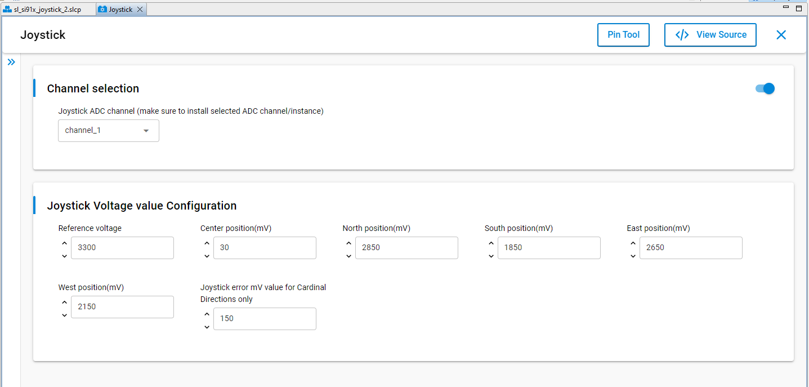
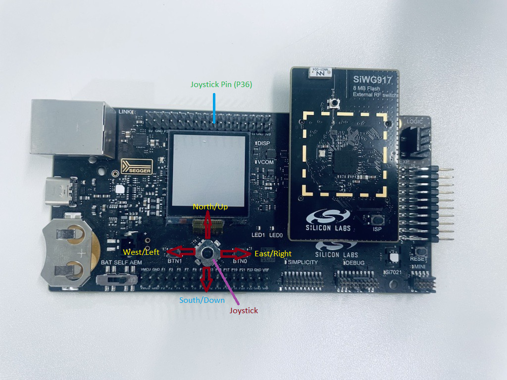
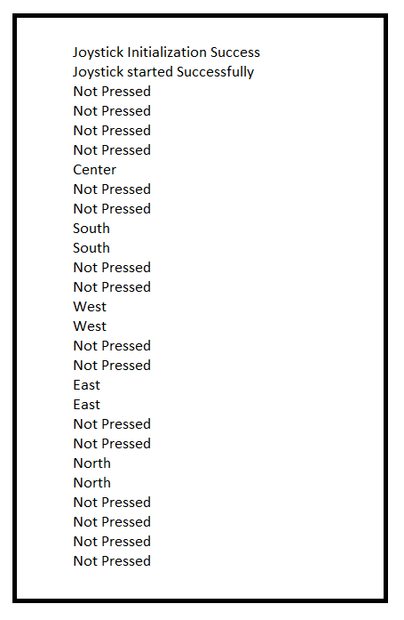

# SL JOYSTICK

## Table of Contents

- [SL JOYSTICK](#sl-joystick)
  - [Purpose/Scope](#purposescope)
  - [Prerequisites/Setup Requirements](#prerequisitessetup-requirements)
    - [Hardware Requirements](#hardware-requirements)
    - [Software Requirements](#software-requirements)
    - [Setup Diagram](#setup-diagram)
  - [Getting Started](#getting-started)
  - [Application Build Environment](#application-build-environment)
    - [Application Configuration Parameters](#application-configuration-parameters)
    - [Pin Configuration](#pin-configuration)
    - [Joystick on BRD4002A](#joystick-on-brd4002a)
  - [Test the Application](#test-the-application)

## Purpose/Scope

This sample app demonstrates the use of the Joystick Driver. It prints the joystick position after every finite interval over the serial console.

## Prerequisites/Setup Requirements

### Hardware Requirements

- Windows PC
- Silicon Labs Si917 Evaluation Kit [[BRD4002](https://www.silabs.com/development-tools/wireless/wireless-pro-kit-mainboard?tab=overview) + [BRD4338A](https://www.silabs.com/development-tools/wireless/wi-fi/siwx917-rb4338a-wifi-6-bluetooth-le-soc-radio-board?tab=overview) / [BRD4342A](https://www.silabs.com/development-tools/wireless/wi-fi/siwx91x-rb4342a-wifi-6-bluetooth-le-soc-radio-board?tab=overview) / [BRD4343A](https://www.silabs.com/development-tools/wireless/wi-fi/siw917y-rb4343a-wi-fi-6-bluetooth-le-8mb-flash-radio-board-for-module?tab=overview)]

### Software Requirements

- Simplicity Studio 
- Serial console Setup
  - For Serial Console setup instructions, refer to [Console Input and Output](https://docs.silabs.com/wiseconnect/latest/wiseconnect-developers-guide-developing-for-silabs-hosts/using-the-simplicity-studio-ide#console-input-and-output).

### Setup Diagram

> 

## Getting Started

Refer to the instructions [here](https://docs.silabs.com/wiseconnect/latest/wiseconnect-getting-started/) to:

- [Install Simplicity Studio](https://docs.silabs.com/wiseconnect/latest/wiseconnect-developers-guide-developing-for-silabs-hosts/using-the-simplicity-studio-ide#install-simplicity-studio)
- [Install WiSeConnect extension](https://docs.silabs.com/wiseconnect/latest/wiseconnect-developers-guide-developing-for-silabs-hosts/using-the-simplicity-studio-ide#install-the-wiseconnect-3-extension)
- [Connect your device to the computer](https://docs.silabs.com/wiseconnect/latest/wiseconnect-developers-guide-developing-for-silabs-hosts/using-the-simplicity-studio-ide#connect-siwx91x-to-computer)
- [Upgrade your connectivity firmware](https://docs.silabs.com/wiseconnect/latest/wiseconnect-developers-guide-developing-for-silabs-hosts/using-the-simplicity-studio-ide#update-siwx91x-connectivity-firmware)
- [Create a Studio project](https://docs.silabs.com/wiseconnect/latest/wiseconnect-developers-guide-developing-for-silabs-hosts/using-the-simplicity-studio-ide#create-a-project)

For details on the project folder structure, see the [WiSeConnect Examples](https://docs.silabs.com/wiseconnect/latest/wiseconnect-examples/#example-folder-structure) page.

## Application Build Environment

### Application Configuration Parameters
- Open the **sl_si91x_joystick.slcp** project file, select the **software component** tab, and search for **joystick** in the search bar.
  - Configure the UC as described below.

- Use the configuration wizard to configure different parameters, such as:
  - **Channel selection**
     - Joystick ADC channel: Use this setting to select the ADC channel instance for the joystick. Supported values range from channel 1 to channel_16.
  > **Note:**
  > - You can install up to 16 instances of the channel, which will execute in sequential order. To configure the device, follow these steps:
  >
  >   1. Open the **SOFTWARE COMPONENTS** tab in your project.
  >   2. Search for **joystick** and select the component.
  >   3. Install the channel instances.
  >   4. Update the Number of Channel(s) in the ADC Peripheral Common Configuration section to match the number of instances added in UC in the previous step.

  ## Instance Order Requirements

  This requirement specifies that when configuring multiple instances of a component or driver in your project, they must be numbered sequentially without gaps.

  **What this means:**
  - Instance numbering must start at 1
  - Each subsequent instance must increment by exactly 1
  - No numbers can be skipped in the sequence

  **Valid examples:**
  - ✅ Instance 1, Instance 2, Instance 3
  - ✅ Single Instance 1

  **Invalid examples:**
  - ❌ Instance 1, Instance 4, Instance 6 (skips 2, 3, 5)
  - ❌ Instance 1, Instance 5, Instance 2 (out of order)
  - ❌ Instance 0, Instance 1, Instance 2 (must start at 1)
 > **Note:** 
 > - This is a configuration requirement, not an installation order requirement. You can add instances in any order through the component installer. However, when naming or configuring them, ensure their instance numbers are sequential (e.g., 1, 2, 3). The system typically enforces this numbering automatically when instances are created.
 > 
 > - Explanation: The important rule is sequential numbering, not the order in which you click "Install". For example, if you need 3 channels, you must have instances numbered 1, 2, and 3. You cannot skip numbers (like 1, 3, 4) or have duplicates. Whether you install instance 2 before instance 1 does not matter, as long as the final numbering is consecutive starting from 1.

 **Joystick Voltage Value Configuration**
  - REFERENCE VOLTAGE: Vref magnitude expressed in millivolts. As per Joystick Hardware on Wireless Pro Kit, Vref = AVDD = 3300 mV.
  - CENTER POSITION: Center position value(mV).
  - NORTH POSITION: North/Up position value(mV).
  - SOUTH POSITION: South/Down position value(mV).
  - EAST POSITION: East/Right position value(mV).
  - WEST POSITION: West/Left position value(mV).
  - JOYSTICK_MV_ERR_CARDINAL_ONLY : Joystick error mV value for Cardinal Directions only.
### Pin Configuration

#### Pin Configuration of the WPK[BRD4002A] Base Board, and with radio board

The following table lists the ADC channel pin mappings for the Si917 radio board. These pin configurations are essential for connecting the joystick input to the correct ADC channel based on your selected channel instance. If you want to use a different radio board, refer to the board-specific user guide.

  | CHANNEL | PIN TO ADCP | 
  | --- | --- | 
  | 1 | ULP_GPIO_1 [P16] | 
  | 2 | GPIO_27 [P29] | 
  | 3 | ULP_GPIO_8 [P15] | 
  | 4 | GPIO_25 [P25] | 
  | 5 | ULP_GPIO_8 [P15] | 
  | 6 | ULP_GPIO_10 [P17] | 
  | 7 | GPIO_25 [P25] | 
  | 8 | GPIO_27 [P29] | 
  | 9 | GPIO_29 [P33] | 
  | 10 | GPIO_29 [P33] | 
  | 11 | ULP_GPIO_1 [P16] | 
  | 12 | ULP_GPIO_1 [P16] | 
  | 13 | ULP_GPIO_7 [EXP_HEADER-15] | 
  | 14 | GPIO_26 [P27] | 
  | 15 | GPIO_28 [P31] | 
  | 16 | GPIO_30 [P35] | 

### Joystick on BRD4002A

Image shows Joystick located on BRD4002A, position/direction to press the Joystick and pin for Joystick.

## Test the Application

Refer to the instructions [here](https://docs.silabs.com/wiseconnect/latest/wiseconnect-getting-started/) to:

1. Compile and run the application.
2. Connect GPIO_26 [P36] (Joystick pin) to ULP_GPIO_1 [P16] for ADC channel input voltage.
3. If the channel instance has changed, the ADC channel input pin will also change. Verify the pin that is configured on the channel configuration.
4. Press the Joystick on WPK at any direction (Center, North/Up, South/Down, East/Right, West/Left).
5. The application should print the pressed position/direction of joystick in console.
6. After successful program execution the prints in serial console looks as shown below.

    

> **Note:**
>
> - Interrupt handlers are implemented in the driver layer, and user callbacks are provided for custom code. If you want to write your own interrupt handler instead of using the default one, make the driver interrupt handler a weak handler. Then copy the necessary code from the driver handler to your custom interrupt handler.
