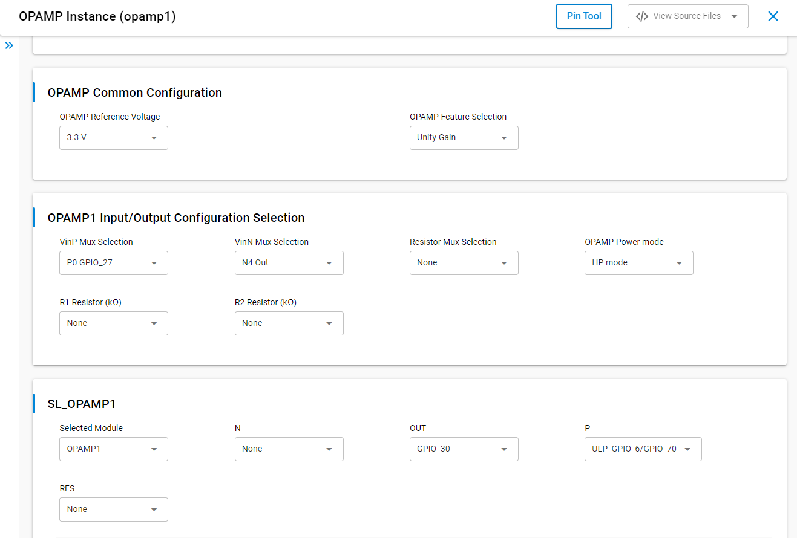

# SL OPAMP [Operational Amplifier]

## Table of Contents

- [Purpose/Scope](#purposescope)
- [Overview](#overview)
- [About Example Code](#about-example-code)
- [Prerequisites/Setup Requirements](#prerequisitessetup-requirements)
  - [Hardware Requirements](#hardware-requirements)
  - [Software Requirements](#software-requirements)
  - [Setup Diagram](#setup-diagram)
- [Getting Started](#getting-started)
- [Application Build Environment](#application-build-environment)
  - [Application Configuration Parameters](#application-configuration-parameters)
- [Test The Application](#test-the-application)

## Purpose/Scope

- The opamp example demonstrates the initialization, configuration, and operation of the OPAMP peripheral by giving input on non-inverting terminal and inverting terminal of the opamp and checking output. It configure OPAMP instances for various use cases, including integration with DAC for external voltage comparison. 
- In this application we can configure the 3 instances- OPAMP1, OPAMP2 and OPAMP3.
- Every opamp will have Vinp mux to select "inp", Vinn mux to select "inn," and Resistor mux for feedback.

The following configurations are used in this example:
  
- Unity Gain / Unity Gain with DAC
- Inverting Programmable Gain Amplifier
- Non-Inverting Programmable Gain Amplifier
- Inverting Programmable hysteresis comparator
- Non-Inverting Programmable hysteresis comparator


## Overview

- The OPAMP peripheral is a versatile analog component that can be configured for various applications such as signal amplification, buffering, and voltage comparison. 
- This example provides a step-by-step guide to initialize and configure the OPAMP peripheral based on the selected instance.
- The OPAMP has two input terminals: one for the inverting input and another for the non-inverting input, along with a single output.

## About Example Code

- \ref opamp_example.c - This example file initialization the opamp peripheral and configure the opamp instances by giving input on non-inverting terminal and inverting terminal of the opamp and checking output.
- In this example, the first opamp is initialized by enabling clocks and bod through \ref sl_si91x_opamp_init API.
- Sets opamp instance and opamp feature configuration \ref sl_si91x_opamp_set_configuration API (inputs are configured as per the usecase macros enabled).
- Optional integration with DAC for external voltage comparison.
- To use this application following Hardware, Software and the Project Setup is required.


## Prerequisites/Setup Requirements

### Hardware Requirements

- Windows PC
- Silicon Labs Si917 Evaluation Kit [WPK(BRD4002) + BRD4338A / BRD4342A / BRD4343A ]

### Software Requirements

- Simplicity Studio
- Serial console setup
  - For serial console setup instructions, refer [here](https://docs.silabs.com/wiseconnect/latest/wiseconnect-developers-guide-developing-for-silabs-hosts/#console-input-and-output).

### Setup Diagram

> 

## Getting Started

Refer to the instructions [here](https://docs.silabs.com/wiseconnect/latest/wiseconnect-getting-started/) to:

- [Install Simplicity Studio](https://docs.silabs.com/wiseconnect/latest/wiseconnect-developers-guide-developing-for-silabs-hosts/#install-simplicity-studio)
- [Install WiSeConnect 3 extension](https://docs.silabs.com/wiseconnect/latest/wiseconnect-developers-guide-developing-for-silabs-hosts/#install-the-wi-se-connect-3-extension)
- [Connect your device to the computer](https://docs.silabs.com/wiseconnect/latest/wiseconnect-developers-guide-developing-for-silabs-hosts/#connect-si-wx91x-to-computer)
- [Upgrade your connectivity firmware](https://docs.silabs.com/wiseconnect/latest/wiseconnect-developers-guide-developing-for-silabs-hosts/#update-si-wx91x-connectivity-firmware)
- [Create a Studio project](https://docs.silabs.com/wiseconnect/latest/wiseconnect-developers-guide-developing-for-silabs-hosts/#create-a-project)

For details on the project folder structure, see the [WiSeConnect Examples](https://docs.silabs.com/wiseconnect/latest/wiseconnect-examples/#example-folder-structure) page.

## Application Build Environment
1. Open the **sl_si91x_opamp.slcp** project file, select the **Software Component** tab, and search for **opamp** in the search bar.
2. Click on **opamp1** and configure its parameters from the wizard.
3. For creating opamp2 or opamp3 instances, write 'opamp2' or 'opamp3' and then click on **Done**.
4. After creation of instances, separate configuration files are generated in the **config folder**.
5. Select Opamp reference voltage **2.5V or 3.3V** and Opamp configuration **Unity Gain** ,**Inverting PGA**, **Non-Inverting PGA**, **Inverting with Hysteresis** and  **Non-Inverting with Hysteresis** from UC.
6. If the Opamp reference voltage is set to **2.5V**, the output voltage will be limited to **2.5V**, and if set to **3.3V**, the output voltage will be limited to **3.3V**.
7. If the project is built without selecting configurations, it will take default values from UC.

    > 

### Application Configuration Parameters

- Configure the following macros in `opamp_example.c` file and update/modify following macros if required.
1. OPAMP Instance Selection:   
    - INSTANCE_ONE: Selects OPAMP1.
    - INSTANCE_TWO: Selects OPAMP2.
    - INSTANCE_THREE: Selects OPAMP3. 
    ```C
    //Select OPAMP instance
    #define SL_APP_OPAMP_INSTANCE_USED INSTANCE_ONE
    ```
2. Select OPAMP features: 
    - SL_OPAMP_UNITY_GAIN_FEATURES: Unity Gain
    - SL_OPAMP_INVERTING_PROGRAMMABLE_GAIN_AMPLIFIER: Inverting PGA
    - SL_OPAMP_NON_INVERTING_PROGRAMMABLE_GAIN_AMPLIFIER: Non-Inverting PGA
    - SL_OPAMP_INVERTING_PROGRAMMABLE_HYST_COMP: Inverting Hystresis Comparator
    - SL_OPAMP_NON_INVERTING_PROGRAMMABLE_HYST_COMP: Non-Inverting Hystresis Comparator
    ```C
    // OPAMP Reference Voltage 
    #define OPAMP_REF_VOLT 2500
    // OPAMP features
    #define SL_OPAMP_CONFIGURATION_SELECTION SL_OPAMP_UNITY_GAIN_FEATURES
    ```
3. If DAC integration is required, enable the INPUT_DAC_NEG_INPUT_EXTERNAL macro:
    ```C
    #define INPUT_DAC_NEG_INPUT_EXTERNAL ENABLE
    #define DAC_SAMPLING_RATE          5000000
    #define NUMBER_OF_INPUT_SAMPLE     1
    #define MAX_DAC_INPUT_SAMPLE_VALUE 1023
    #define DAC_INPUT_SAMPLE_VALUE     1023
    ```
    - DAC operation mode: static mode
    - Sample rate: Sample rate can be configurable to DAC, sample rate unit is samples/second.
    - Apply the different voltages (1.8V to 3.6v) as reference voltage and input samples,The output data should match the input sample that was supplied.
    - After running the application, see the output on logic analyzer at DAC output GPIO pins.

## Pin Configuration

#### Pin Configuration of the WPK[BRD4002A] Base Board, and with radio board

The following table lists the mentioned pin numbers for the radio board. If you want to use a different radio board- BRD4338A and BRD4343A, see the board user guide.

#### Positive - Non-Inverting Input terminal GPIO Selection
| OPAMP Instance | GPIO Selection (P0)| GPIO Selection (P1) | GPIO Selection (P2) | GPIO Selection (P3) | GPIO Selection (P4) |  GPIO Selection (P5) | 
| --- | --- | --- | --- | --- | --- | --- |
| OPAMP1 | GPIO_27 [P29] | ULP_GPIO_7 [EXP_HEADER-15]| ULP_GPIO_0 [F10]| ULP_GPIO_2 [F10] | ULP_GPIO_6 [EXP_HEADER-16] | ULP_GPIO_8 [P15]|
| OPAMP2 | ULP_GPIO_11 [F6] | ULP_GPIO_5 [P18]| - | - | - |
| OPAMP3 | ULP_GPIO_10 [P17] | GPIO_29 [P33] | - | - | - | -|

#### Negative Inverting Input terminal GPIO Selection
| OPAMP Instance | GPIO Selection (N0) | GPIO Selection (N1) | GPIO Selection (N2) | GPIO Selection (N3) | GPIO Selection (N4) |  GPIO Selection (N5) | 
| --- | --- | --- | --- | --- | --- | --- |
| OPAMP1 | GPIO_27 [P29] | ULP_GPIO_7 [EXP_HEADER-15]| ULP_GPIO_0 [F10]| ULP_GPIO_2 [F10] | ULP_GPIO_6 [EXP_HEADER-16] | ULP_GPIO_8 [P15]|
| OPAMP2 | ULP_GPIO_11 [F6] | ULP_GPIO_5 [P18]| - | - | - |
| OPAMP3 | ULP_GPIO_10 [P17] | GPIO_29 [P33] | - | - | - | -|

#### Output terminal GPIO Selection
  | OUTPUT SELECTION | OPAMP1 OUT | OPAMP2 OUT | OPAMP3 OUT |
  | --- | --- | --- | --- |
  | OPAMP_OUT0            |      GPIO_30  [P35]   | ULP_GPIO_9 [F7] | GPIO_27  [P29] |
  | OPAMP_OUT1            |     ULP_GPIO_4 [P17] |- | - |

 **Limitations:** 
  -  GPIO 27 (Top GPIO), ULP_GPIO_2, ULP_GPIO_4, ULP_GPIO_9, ULP_GPIO_10 and ULP_GPIO_11 are not supported.
  - The pin tool is not supported for all OPAMP instances.

#### DAC
  | DAC | DAC Output |
  | --- | --- |
  | DAC0 | ULP_GPIO_4 [P17] |
  | DAC1 | GPIO_30 [P35] |

## Test the Application
1. Compile and run the application. 
2. Apply input voltage on Non-Inverting and Inverting terminal pin from constant D.C supply source.
 - Console outputs.
   - OPAMP :
    
      

    - DAC :
     
       


### Unity Gain
 - Apply input voltage on non-inverting input terminal from constant D.C supply source and the output is connected to inverting input terminal internally.
 Check the output voltage on board on OPAMP_OUT.
 - Output voltage should be equal to input voltage. Use a Logic analyzer / Oscilloscope  to check output voltage.
  - Calculate the offset voltage[offset=Vout-Vin].

### Inverting Programmable Gain Amplifier
 - Apply input voltage on non-inverting input terminal an inverting input terminal from constant D.C supply source.
 Check the output voltage on board on OPAMP_OUT.
 - Use a Logic analyzer / Oscilloscope  to check output voltage.
 - Inverting amp configuration gain is –R2/R1
Calculate the output voltage [Vout=-(Vin-Vref)*(R2/R1)+Vref].

   **Note:** The GPIO used for the Positive (Non-Inverting Input Terminal) and the Negative (Inverting Input Terminal) must be different.

### Non-Inverting Programmable Gain Amplifier
 - Apply input voltage on non-inverting input terminal an inverting input terminal from constant D.C supply source.
 Check the output voltage on board on OPAMP_OUT.
 - Use a Logic analyzer / Oscilloscope  to check output voltage.
 - non inverting amp configuration gain is 1+R2/R1
 Calculate the output voltage [Vout=Vin+(Vin-Vref)*(R2/R1)].

   **Note:** The GPIO used for the Positive (Non-Inverting Input Terminal) and the Negative (Inverting Input Terminal) must be different.

### Inverting Comparator with Programmable Hysteresis
 - Apply input voltage on non-inverting input terminal an inverting input terminal from constant D.C supply source..
 Check the output voltage on board on OPAMP_OUT.
 - Use a Logic analyzer / Oscilloscope  to check output voltage.
 - Calculate the Hysteresis   
  [VT1=(Vref*R2+Vcc*R1)/(R1+R2)]  
  [VT2=Vref*R2/(R1+R2)]   
  [Hystresis=Vcc*R1/(R1+R2)]

   **Note:** The GPIO used for the Positive (Non-Inverting Input Terminal) and the Negative (Inverting Input Terminal) must be different.

### Non-Inverting Comparator with Programmable Hysteresis
 - Apply input voltage on non-inverting input terminal an inverting input terminal from constant D.C supply source.
 Check the output voltage on board on OPAMP_OUT.
 - Use a Logic analyzer / Oscilloscope  to check output voltage.
 - Calculate the Hysteresis  
  [VT1=(Vref*(R1+R2)/R2]   
  [VT2=(Vref*(R1+R2)-Vcc*R1)/R2]  
  [Hysteresis=Vcc*R1/R2)]

   **Note:** The GPIO used for the Positive (Non-Inverting Input Terminal) and the Negative (Inverting Input Terminal) must be different.

### Unity Gain with DAC
 - The DAC output serves as the input for OPAMP1.
 - Verify the output voltage on the board at DAC_OUT.
 - Use a logic analyzer or oscilloscope to observe the DAC output, which should match the calculated value.
 - DAC_output = ((input sample / 1024 (2^10)) * Vref Voltage)
  
   **Note:** If input sample value is '0x3FF' and voltage reference is 3.3v, [DAC_output=((0x3FF/1024)*3.3)]
