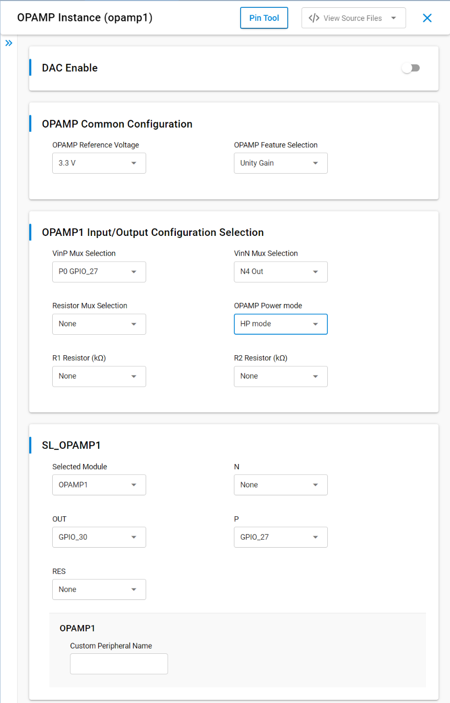
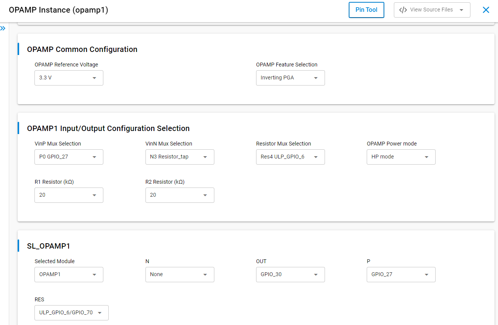
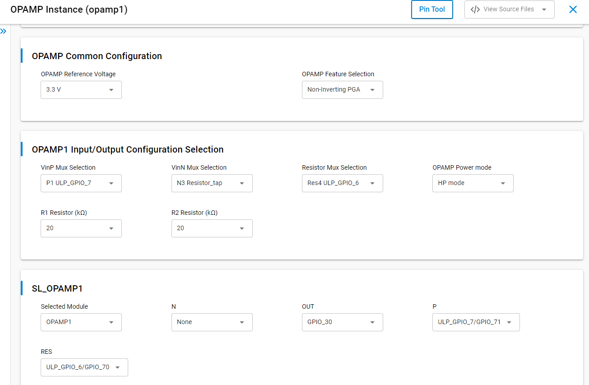
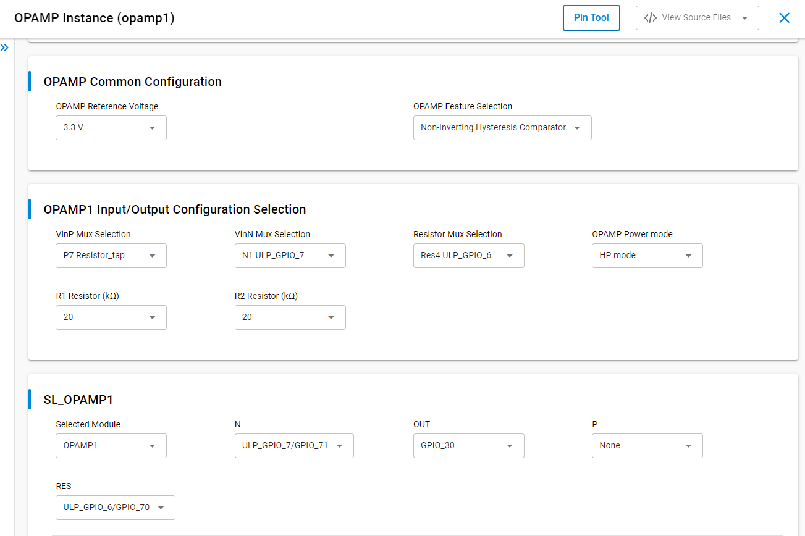

# SL OPAMP [Operational Amplifier]

## Table of Contents

- [Purpose/Scope](#purposescope)
- [Overview](#overview)
- [About Example Code](#about-example-code)
- [Prerequisites/Setup Requirements](#prerequisitessetup-requirements)
  - [Hardware Requirements](#hardware-requirements)
  - [Software Requirements](#software-requirements)
  - [Setup Diagram](#setup-diagram)
- [Getting Started](#getting-started)
- [Application Build Environment](#application-build-environment)
  - [Application Configuration Parameters](#application-configuration-parameters)
- [Test The Application](#test-the-application)

## Purpose/Scope

- The OPAMP example demonstrates the initialization, configuration, and operation of the OPAMP peripheral by giving input on non-inverting terminal and inverting terminal of the OPAMP and checking output. It configure OPAMP instances for various use cases, including integration with DAC for external voltage comparison. 
- In this application we can configure the 3 instances- OPAMP1, OPAMP2 and OPAMP3.
- Each OPAMP features a VinP positive input mux for selecting "inp-input positive terminal," a VinN negative input mux for selecting "inn-input negative terminal," and a resistor mux for feedback configuration.

The following configurations are used in this example:
 - Unity Gain Buffer
 - Inverting Programmable Gain Amplifier
 - Non-Inverting Programmable Gain Amplifier
 - Inverting Programmable hysteresis comparator
 - Non-Inverting Programmable hysteresis comparator


## Overview

- The OPAMP peripheral is a versatile analog component that can be configured for various applications such as signal amplification, buffering, and voltage comparison. 
- This example provides a step-by-step guide to initialize and configure the OPAMP peripheral based on the selected instance.
- The OPAMP has two input terminals: one for the inverting input and another for the non-inverting input, along with a single output.

## About Example Code

- \ref opamp_example.c - This example file initializes the OPAMP peripheral and configure the OPAMP instances by giving input on non-inverting terminal and inverting terminal of the OPAMP and checking output.
- In this example, first the OPAMP is initialized by enabling clocks and BOD through \ref sl_si91x_opamp_init API.
- Sets OPAMP instance and OPAMP feature configuration \ref sl_si91x_opamp_set_configuration API (inputs are configured as per the usecase macros enabled).
- Optional integration with DAC for external voltage comparison.


## Prerequisites/Setup Requirements

 ### Hardware Requirements

 - Windows PC
 - Silicon Labs Si917 Evaluation Kit [WPK(BRD4002) + BRD4338A / BRD4342A / BRD4343A ]

 ### Software Requirements

 - Simplicity Studio
 - Serial console setup
  - For serial console setup instructions, refer [here](https://docs.silabs.com/wiseconnect/latest/wiseconnect-developers-guide-developing-for-silabs-hosts/#console-input-and-output).

 ### Setup Diagram

 > 


## Getting Started

Refer to the instructions [here](https://docs.silabs.com/wiseconnect/latest/wiseconnect-getting-started/) to:

- [Install Simplicity Studio](https://docs.silabs.com/wiseconnect/latest/wiseconnect-developers-guide-developing-for-silabs-hosts/#install-simplicity-studio)
- [Install WiSeConnect 3 extension](https://docs.silabs.com/wiseconnect/latest/wiseconnect-developers-guide-developing-for-silabs-hosts/#install-the-wi-se-connect-3-extension)
- [Connect your device to the computer](https://docs.silabs.com/wiseconnect/latest/wiseconnect-developers-guide-developing-for-silabs-hosts/#connect-si-wx91x-to-computer)
- [Upgrade your connectivity firmware](https://docs.silabs.com/wiseconnect/latest/wiseconnect-developers-guide-developing-for-silabs-hosts/#update-si-wx91x-connectivity-firmware)
- [Create a Studio project](https://docs.silabs.com/wiseconnect/latest/wiseconnect-developers-guide-developing-for-silabs-hosts/#create-a-project)

For details on the project folder structure, see the [WiSeConnect Examples](https://docs.silabs.com/wiseconnect/latest/wiseconnect-examples/#example-folder-structure) page.

## Application Build Environment
1. Open the **sl_si91x_opamp.slcp** project file, select the **Software Component** tab, and search for **OPAMP** in the search bar.
2. Click on **OPAMP1** and configure its parameters from the wizard.
3. For creating OPAMP2 or OPAMP3 instances, write 'OPAMP2' or 'OPAMP3' and then click on **Done**.
4. After creation of instances, separate configuration files are generated in the **config folder**.
5. Select OPAMP reference voltage **2.5V or 3.3V** and OPAMP configuration **Unity Gain** ,**Inverting PGA**, **Non-Inverting PGA**, **Inverting with Hysteresis** or  **Non-Inverting with Hysteresis** from UC.
6. If the OPAMP reference voltage is set to **2.5V**, the output voltage will be limited to **2.5V**, and if set to **3.3V**, the output voltage will be limited to **3.3V**.
7. If DAC integration (the DAC output to serve as the input for the OPAMP) is required , enable DAC from UC.
8. If the project is built without selecting configurations, it will take default values from UC.

    > 

### Application Configuration Parameters

- Configure the following macros in `opamp_example.c` file and update/modify following macros if required.
1. Select OPAMP Reference Voltage   
    - 2500: 2.5 V
    - 3300: 3.3 V
    
    ```C
    // OPAMP Reference Voltage 
    #define OPAMP_REF_VOLT 2500
    ```
2. Select OPAMP feature: 
    - SL_OPAMP_UNITY_GAIN: Unity Gain
    - SL_OPAMP_INVERTING_PROGRAMMABLE_GAIN_AMPLIFIER: Inverting PGA
    - SL_OPAMP_NON_INVERTING_PROGRAMMABLE_GAIN_AMPLIFIER: Non-Inverting PGA
    - SL_OPAMP_INVERTING_PROGRAMMABLE_HYST_COMP: Inverting Hystresis Comparator
    - SL_OPAMP_NON_INVERTING_PROGRAMMABLE_HYST_COMP: Non-Inverting Hystresis Comparator
    ```C
    // OPAMP feature
    #define SL_OPAMP_CONFIGURATION_SELECTION SL_OPAMP_UNITY_GAIN
    ```
3. If DAC integration is required, enable it from UC to enable INPUT_DAC_NEG_INPUT_EXTERNAL macro:
    ```C
    // DAC
    #define DAC_SAMPLING_RATE          5000000
    #define NUMBER_OF_INPUT_SAMPLE     1
    #define MAX_DAC_INPUT_SAMPLE_VALUE 1023
    #define DAC_INPUT_SAMPLE_VALUE     1023
    ```
    - DAC operation mode: static mode
    - Sample rate: Sample rate can be configurable to DAC, sample rate unit is samples/second.
    - Apply the different voltages (2.5 V to 3.3 v) as reference voltage and input samples. The output data should match the input sample that was supplied.

## Pin Configuration

### Pin Configuration of the WPK[BRD4002A] Base Board, and with Radio Board

The following table lists the mentioned pin numbers for the radio board. If you want to use a different radio board other than BRD4338A and BRD4343A, see the board user guide.

  | GPIO        | BRD4338A | BRD4343A  |
  | ----------  | -------- | --------  |
  | GPIO_27     |   P29    |    P29    |
  | GPIO_29     |   P33    |    P33    |
  | GPIO_30     |   P35    |    P35    |
  | ULP_GPIO_0  |   ---    |    F10    |
  | ULP_GPIO_2  |   F10    |    P37    |
  | ULP_GPIO_4  |   ---    |    P17    |
  | ULP_GPIO_5  |   ---    |    P18    |
  | ULP_GPIO_6  |  EXP-16  |  EXP-16   |
  | ULP_GPIO_7  |  EXP-15  |  EXP-15   |
  | ULP_GPIO_8  |   P15    |    P15    |
  | ULP_GPIO_9  |   F7     |    F7     |
  | ULP_GPIO_10 |   P17    |    ---    |
  | ULP_GPIO_11 |   F6     |    F6     |

## OPAMP Mux Selection
### OPAMP input and ouput pin mux selection 
The following table shows the available input (VinP, VinN, or Resistor) and output (Vout) mux options for each OPAMP instance that can be selected from UC.
#### VinP Mux Selection
| OPAMP Instance | 0| 1 | 2 | 3 | 4 |  5 | 6 | 7 |
| --- | --- | --- | --- | --- | --- | --- | --- | --- |
| OPAMP1 | OPAMP1P0 (GPIO_27)| OPAMP1P1 (ULP_GPIO_7)| OPAMP1P2 (ULP_GPIO_0)| OPAMP1P3 (ULP_GPIO_2) | OPAMP1P4 (ULP_GPIO_6)| OPAMP1P5 (ULP_GPIO_8)| AUX_DAC_OUT | Resistor_tap |
| OPAMP2 | OPAMP2P0 (ULP_GPIO_11) | OPAMP2P1 (ULP_GPIO_5)| --- | AUX_DAC_OUT | Resistor_tap | --- | OPAMP1_OUT | --- |
| OPAMP3 | OPAMP3P0 (ULP_GPIO_10) | OPAMP3P1 (GPIO_29) | AUX_DAC_OUT | Resistor_tap | --- | OPAMP2_OUT | OPAMP2_Resistor_tap | --- |

#### VinN Mux Selection
| OPAMP Instance | 0| 1 | 2 | 3 | 4 |
| --- | --- | --- | --- | --- | --- |
| OPAMP1 | OPAMP1N0 (GPIO_27)| OPAMP1N1 (ULP_GPIO_7)| AUX_DAC_OUT | Resistor_tap | Out |
| OPAMP2 | OPAMP2N0 (ULP_GPIO_11) | AUX_DAC_OUT | Resistor_tap | Out | --- |
| OPAMP3 | OPAMP3N0 (ULP_GPIO_10) | AUX_DAC_OUT | Resistor_tap | Out | --- |

#### Resistor Mux Selection
| OPAMP Instance | 0| 1 | 2 | 3 | 4 |  5 | 6 |
| --- | --- | --- | --- | --- | --- | --- | --- |
| OPAMP1 | OPAMP1Res0 (GPIO_27)| OPAMP1Res1 (ULP_GPIO_7)| OPAMP1Res2 (ULP_GPIO_0)| OPAMP1Res3 (ULP_GPIO_2) | OPAMP1Res4 (ULP_GPIO_6)| OPAMP1Res5 (ULP_GPIO_8)| AUX_DAC_OUT | --- |
| OPAMP2 | OPAMP2Res0 (ULP_GPIO_11) | OPAMP2Res1 (ULP_GPIO_5)| --- | AUX_DAC_OUT | --- | OPAMP1_OUT | --- |
| OPAMP3 | OPAMP3Res0 (ULP_GPIO_10) | OPAMP3Res0 (GPIO_29) | AUX_DAC_OUT | --- | OPAMP2_OUT | --- | --- |

#### Output terminal GPIO Selection
  | OUTPUT SELECTION | OPAMP1 OUT | OPAMP2 OUT | OPAMP3 OUT |
  | --- | --- | --- | --- |
  | OPAMP_OUT0     |     GPIO_30   | ULP_GPIO_9 | GPIO_27 |
  | OPAMP_OUT1     |     ULP_GPIO_4 |--- | --- |

## DAC
DAC enable, output pin configuration:

  | DAC | DAC Output |
  | --- | --- |
  | DAC0 | ULP_GPIO_4 |
  | DAC1 | GPIO_30 |
   

 ## **Limitations:** 
  - GPIO 27 (Top GPIO) and ULP_GPIO_2 are not supported.
  - The pin tool does not support selection of GPIOs for each OPAMP instance.

## Test the Application
1. Compile and run the application. 
2. Apply input voltage on Non-Inverting and Inverting terminal pin from constant D.C supply source.
 - Console outputs.
   - If OPAMP is enabled:
    
      

    - If DAC is enabled:
     
       

### OPAMP Configuration:
#### Unity Gain
 - Apply input voltage on non-inverting input terminal from constant D.C supply source and the output is connected to inverting input terminal internally.
     >
 - Choose any GPIO from the VinP mux selection for input,from the "Out selection" for output and set VinN mux to "Out". Ensure the resistor mux is set to "None" in the UC.
    > 
 
 - Check the output voltage on board on OPAMP_OUT.
 - Output voltage should be equal to input voltage. Use a Logic analyzer / Oscilloscope  to check output voltage.
 - Calculate the offset voltage[offset=Vout-Vin].

#### Inverting Programmable Gain Amplifier
 - Apply input voltage on non-inverting input terminal and inverting input terminal from constant D.C supply source.
   >
  
 - Choose any GPIO from the VinP mux selection for input,from the "Out selection" for output, set VinN mux to "Resistor tap" and select any GPIO from Resistor mux. Select resistors from "R1 Resistor" and "R2 Ressitor"in the UC.
    > 

 - Check the output voltage on board on OPAMP_OUT.
 - Use a Logic analyzer / Oscilloscope  to check output voltage.
 - Inverting amp configuration gain is –R2/R1. VinP as Vref and VinN as Vin.
Calculate the output voltage [Vout=-(Vin-Vref)*(R2/R1)+Vref].

   **Note:** The GPIO used for the Positive (Non-Inverting Input Terminal) and the Negative (Inverting Input Terminal) must be different.


#### Non-Inverting Programmable Gain Amplifier
 - Apply input voltage on non-inverting input terminal and inverting input terminal from constant D.C supply source.
   >

 - Choose any GPIO from the VinP mux selection for input,from the "Out selection" for output, set VinN mux to "Resistor tap" and select any GPIO from Resistor mux. Select resistors from "R1 Resistor" and "R2 Ressitor"in the UC.   
    > 

 - Check the output voltage on board on OPAMP_OUT.
 - Use a Logic analyzer / Oscilloscope  to check output voltage.
 - Non inverting amp configuration gain is 1+R2/R1. VinP as Vin and VinN as Vref.
 Calculate the output voltage [Vout=Vin+(Vin-Vref)*(R2/R1)].

   **Note:** The GPIO used for the Positive (Non-Inverting Input Terminal) and the Negative (Inverting Input Terminal) must be different.


#### Inverting Comparator with Programmable Hysteresis
 - Apply input voltage on non-inverting input terminal and inverting input terminal from constant D.C supply source.
   >

- Choose any GPIO from the VinN mux selection for input,from the "Out selection" for output, set VinP mux to "Resistor tap" and select any GPIO from Resistor mux. Select resistors from "R1 Resistor" and "R2 Ressitor"in the UC.
    > 

 - Check the output voltage on board on OPAMP_OUT.
 - Use a Logic analyzer / Oscilloscope  to check output voltage.
 - Calculate the Hysteresis (VinN as Vin and VinP as Vref)
  [VT1=(Vref*R2+Vcc*R1)/(R1+R2)]  
  [VT2=Vref*R2/(R1+R2)]   
  [Hystresis=Vcc*R1/(R1+R2)]

   **Note:** The GPIO used for the Positive (Non-Inverting Input Terminal) and the Negative (Inverting Input Terminal) must be different.


#### Non-Inverting Comparator with Programmable Hysteresis
 - Apply input voltage on non-inverting input terminal and inverting input terminal from constant D.C supply source.
   >
- Choose any GPIO from the VinN mux selection for input,from the "Out selection" for output, set VinP mux to "Resistor tap" and select any GPIO from Resistor mux. Select resistors from "R1 Resistor" and "R2 Ressitor"in the UC.   
  > 
 - Check the output voltage on board on OPAMP_OUT.
 - Use a Logic analyzer / Oscilloscope  to check output voltage.
 - Calculate the Hysteresis  (VinN as Vref and VinP as Vin)
  [VT1=(Vref*(R1+R2)/R2]   
  [VT2=(Vref*(R1+R2)-Vcc*R1)/R2]  
  [Hysteresis=Vcc*R1/R2)]

   **Note:** The GPIO used for the Positive (Non-Inverting Input Terminal) and the Negative (Inverting Input Terminal) must be different.


#### Unity Gain with DAC
 - The DAC output serves as the input for OPAMP1.
 - Verify the output voltage on the board at DAC_OUT.
 - Use a logic analyzer or oscilloscope to monitor the DAC output GPIO pins and verify that the observed values correspond to the expected calculated value.
 - DAC_output = ((input sample / 1024 (2^10)) * Vref Voltage)
  
   **Note:** If input sample value is '0x3FF' and voltage reference is 3.3v, [DAC_output=((0x3FF/1024)*3.3)]
   > 
