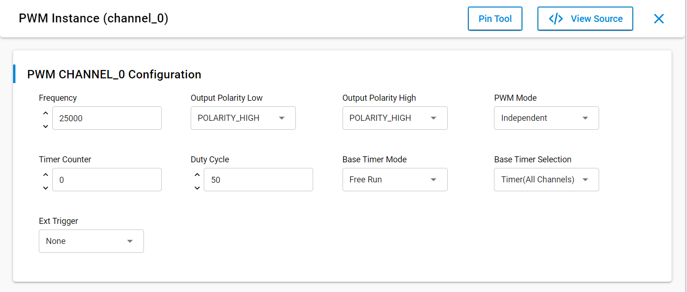
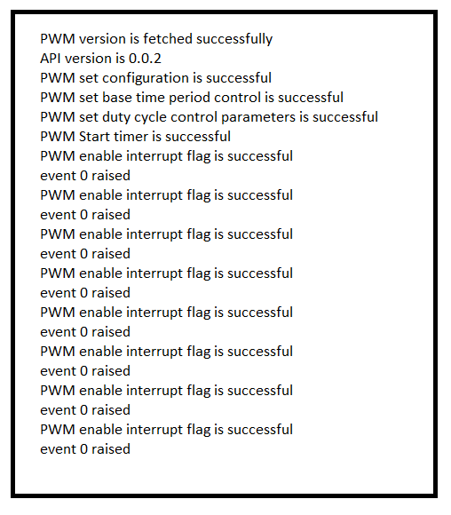
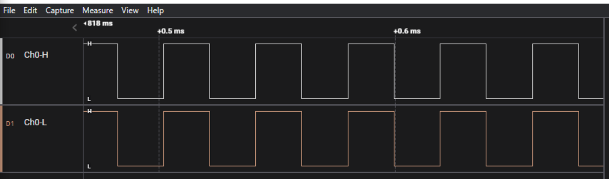

# SL PWM

## Table of Contents

- [Purpose/Scope](#purposescope)
- [Overview](#overview)
- [About Example Code](#about-example-code)
- [Prerequisites/Setup Requirements](#prerequisitessetup-requirements)
  - [Hardware Requirements](#hardware-requirements)
  - [Software Requirements](#software-requirements)
  - [Setup Diagram](#setup-diagram)
- [Getting Started](#getting-started)
- [Application Build Environment](#application-build-environment)
  - [Application Configuration Parameters](#application-configuration-parameters)
  - [PWM Pin Configuration](#pwm-pin-configuration)
- [Test the Application](#test-the-application)

## Purpose/Scope

This application demonstrates the PWM (Pulse Width Modulation) to generate a periodic pulse waveform, which is useful in motor control and power control applications.

## Overview

- Supports up to eight PWM outputs with four duty cycle generators. The output pins are grouped in pairs to facilitate driving the low side and high side of a power half bridge. For more details on PWM outputs, see the block diagram in HRM.
- Complementary and Independent output modes are supported.
- Dead time insertion in Complementary mode.
- Manual override option for PWM output pins. Output pin polarity is programmable.
- Supports generation of interrupts for different events.
- Supports two hardware fault input pins.

## About Example Code

- This example demonstrates the generation of periodic pulse waveform with 50% duty cycle and frequency of 25Khz.
- Four macros are present (that is, DEAD_TIME, OVERRIDE, FAULT).
- If **DEAD_TIME** is enabled:
  - DEAD_TIME: To perform correct status change of the power switches in the inverter leg, a PWM generator should insert a small amount of time between required switching edges for top and bottom switch. This time is called dead-time.
  - Dead time mode is applied only in complementary mode.
    - Complementary mode: In Complementary PWM mode, PWM waveform output incorporates dead time (anti-short periods) to prevent overlap between the positive and anti phases.
    - Independent Mode: In Independent PWM Output mode, the PWM outputs (PWMxH and PWMxL) are phase shifted relative to each other.
  - Initialize the PWM using \ref sl_si91x_pwm_init.
  - Set the configuration using \ref sl_si91x_pwm_set_configuration() API.
  - Set the duty cycle using \ref sl_si91x_pwm_set_duty_cycle() API.
  - Set the base timer mode using \ref sl_si91x_pwm_set_base_timer_mode() API.
  - Set the base time period control using \ref sl_si91x_pwm_control_period() API.
  - Register callbacks using \ref sl_si91x_pwm_register_callback() API.
  - Start PWM using \ref sl_si91x_pwm_start() API.
- If **OVERRIDE** is enabled:
  - OVERRIDE: While overriding PWM outputs, the channel counters continue to run, only the PWM outputs are forced to user-defined values.
  - Initialize the PWM using \ref sl_si91x_pwm_init() API.
  - Set the configuration using \ref sl_si91x_pwm_set_configuration() API.
  - Set the base timer mode using \ref sl_si91x_pwm_set_base_timer_mode() API.
  - Set the duty cycle using \ref sl_si91x_pwm_set_duty_cycle() API.
  - Set the base time period control using \ref sl_si91x_pwm_control_period() API.
  - Register callbacks using \ref sl_si91x_pwm_register_callback() API.
  - Start PWM using \ref sl_si91x_pwm_start() API.
- If **FAULT** is enabled:
  - FAULT: There are two fault pins, FAULTxA and FAULTxB, associated with the MCPWM (Motor Control Pulse Width Modulation) module. When asserted, these pins can optionally drive each of the PWM I/O pins to a defined state.
  - Initialize the PWM using \ref sl_si91x_pwm_init() API, \ref sl_Si91x_pwm_fault_init() API.
  - Set the configuration using \ref sl_si91x_pwm_set_configuration() API.
  - Set the base timer mode using \ref sl_si91x_pwm_set_base_timer_mode() API.
  - Set the duty cycle using \ref sl_si91x_pwm_set_duty_cycle() API.
  - Set the base time period control using \ref sl_si91x_pwm_control_period() API.
  - Register callbacks using \ref sl_si91x_pwm_register_callback() API.
  - Change the event generated to fault A/B flags.
  - Start PWM using \ref sl_si91x_pwm_start() API.
- If the user wants to work without UC configuration, they can use their own macros and structure configuration and pass it directly in the application.
- If **SVT** is enabled:
  - Initialize the PWM using \ref sl_si91x_pwm_init() API. Initialize Special Event Trigger based GPIO pin.
  - Set the configuration using \ref sl_si91x_pwm_set_configuration() API.
  - Enable the special event trigger using \ref sl_si91x_pwm_control_special_event_trigger() API.
  - Set the configuration for special event trigger using \ref sl_si91x_pwm_trigger_special_event() API.
  - Start PWM using \ref sl_si91x_pwm_start() API.
  
>**Note:**
>
>1. PWM has four channels. The user can handle these channels using instances. Each channel has 2 PWM outputs (PWM_L (PWM output low) and PWM_H(PWM output high)).The usage of L,H depends on how the application uses them. For example, when driving something in PUSH-PULL configuration, PWM_H can drive the high-side switch, whereas PWM_L drives the low-side switch. This is only a reference of how L,H can be used. There might be other scenarios, which are dependent on settings done and how to achieve it.
>2. channel_0, channel_1, channel_2 and channel_3 are the names pre-defined for the PWM channels.
>3. For user-defined instances, you may have to define hardware-specific definitions in the `sl_si91x_pwm_init_channel_0_config.h` file (path: /$project/config/sl_si91x_pwm_init_channel_0_config.h).
>4. The user can directly use APIs in the application by passing appropriate structure members if they do not want to configure from UC.

## Prerequisites/Setup Requirements

### Hardware Requirements

- Windows PC
- Silicon Labs Si917 Evaluation Kit [WPK(BRD4002) + BRD4338A / BRD4342A / BRD4343A ]
- SiWx917 AC1 Module Explorer Kit (BRD2708A)

### Software Requirements

- Simplicity Studio
- Serial console setup
  - For serial console setup instructions, see the [Console Input and Output](https://docs.silabs.com/wiseconnect/latest/wiseconnect-developers-guide-developing-for-silabs-hosts/#console-input-and-output) section in the *WiSeConnect Developer's Guide*.

### Setup Diagram

> 

## Getting Started

Refer to the instructions [here](https://docs.silabs.com/wiseconnect/latest/wiseconnect-getting-started/) to:

- [Install Simplicity Studio](https://docs.silabs.com/wiseconnect/latest/wiseconnect-developers-guide-developing-for-silabs-hosts/#install-simplicity-studio)
- [Install WiSeConnect 3 extension](https://docs.silabs.com/wiseconnect/latest/wiseconnect-developers-guide-developing-for-silabs-hosts/#install-the-wi-se-connect-3-extension)
- [Connect your device to the computer](https://docs.silabs.com/wiseconnect/latest/wiseconnect-developers-guide-developing-for-silabs-hosts/#connect-si-wx91x-to-computer)
- [Upgrade your connectivity firmware](https://docs.silabs.com/wiseconnect/latest/wiseconnect-developers-guide-developing-for-silabs-hosts/#update-si-wx91x-connectivity-firmware)
- [Create a Studio project](https://docs.silabs.com/wiseconnect/latest/wiseconnect-developers-guide-developing-for-silabs-hosts/#create-a-project)

For details on the project folder structure, see the [WiSeConnect Examples](https://docs.silabs.com/wiseconnect/latest/wiseconnect-examples/#example-folder-structure) page.

## Application Build Environment

### Application Configuration Parameters

- Configure the following macros in the `pwm_example.c` file and update/modify following macros, if required.

  - Global Parameters

    ```C
      #define EVENT_COUNT       10    // Count of events that can generate interrupt. 
      #define PRESCALE_A        0x100 // PWM Prescale_A value
      #define DEADTIME_A        0x08  // PWM deadtime_A
      #define DT_COUNTER_A      0x00  // Dead time counter A enable
      #define DUTY_CYCLE_UPDATE 0x01  // Enable duty cycle updating bit in register
    ```
  
  - Channel-specific Parameters

    ```C
    #define INTR_EVENT       0x01  /* Set channel-specific interrupts for time match and fault events.
                                      Use bitwise OR to combine flags for multiple channels. */
    ```

    ```C
    #define FAULT_A_ENABLE   0x11  /* Configure fault mode and output polarity per channel.
                                      Combine options with bitwise OR for desired channel settings. */
    ```

    ```C
    #define DT_ENABLE        0x01  /* Enable dead time per channel
                                      Use OR logic to set for multiple channels. */
    ```

- Configure UC from the slcp component.
- Open the **sl_si91x_pwm.slcp** project file, select the **Software Component** tab, and search for **PWM** in the search bar.
- By default, PWM has a channel 0 instance. If the base timer selection is selected as **Timer (All Channels)**, to select any other PWM channel, one should have PWM channel-0 as reference. If separate PWM channels are to be considered, change the base timer selection to **Timer (Each Channel)**.
- You can use the configuration wizard to configure different parameters:

  - **Common Configuration for all PWM Channels**
    - **Base Timer Selection**: The application provides two base timer options: one for each channel individually and one shared across all channels.
      - If you are using only Channel 0, select the **Timer (All Channels)** option and ensure PWM Channel 0 is installed.
      - If you are using any channel other than Channel 0, select the **Timer (Each Channel)** option to configure individual timers per channel.

  - **General Configuration for individual PWM Channel**
    - **Frequency**: Frequency changes from 500Hz to 200Khz. By default 25Khz is considered.
    - **Output Polarity Low**: There are 2 polarities: polarity low and polarity high. The difference can be observed in waveforms when polarity is changed. By default, it is set to polarity high.
    - **Output Polarity High**: There are 2 polarities: polarity low and polarity high. The difference can be observed in waveforms when polarity is changed. By default, it is set to polarity high.
    - **PWM Mode**: There are 2 modes: independent mode and complementary mode. The definitions for these modes are covered in the *About example code*. The difference can be seen in waveform when modes are changed.
    - **Timer Counter**: This is initial base time counter value to set. By default, it is set to 0.
    - **Duty Cycle**: By default, 50% duty cycle is taken. One can vary duty cycle from 0% to 100%.
    - **Base Timer Mode**: There are 6 different modes. By default, free run mode is selected.
    - **Ext Trigger**: In order to enable fault A, fault B, and other external triggers present, an ext trigger parameter is used.

  - **Pin Configuration for individual PWM Channel**
    - The pin configuration for PWM channel can be configured under SL_PWM_CHANNEL0 section.

      

### PWM Pin Configuration

- PWM channel-0 pin configuration.

  | Description  | GPIO    | 917 Breakout pin | 915 Breakout pin | Explorer kit Breakout pin |
  | ------------ | ------- | ---------------- | ---------------  | ------------------------- |
  | PWM_H        | GPIO_7  |     P20          |    EXP_15        |            [SCL]          |
  | PWM_L        | GPIO_6  |     P19          |    EXP_16        |            [SDA]          |

- PWM channel-1 pin configuration.

  | Description   | GPIO    | 917 Breakout pin | 915 Breakout pin |
  | ------------- | ------- | ---------------- | ---------------- |
  | PWM_H         | GPIO_9  |     F9           |     F9           |
  | PWM_L         | GPIO_8  |     F8           |     F8           |

- PWM channel-2 pin configuration.

  | Description   | GPIO    | 917 Breakout pin | 915 Breakout pin |
  | ------------- | ------- | ---------------- | ---------------  |
  | PWM_H         | GPIO_11 |     F13          | EXP_5            |
  | PWM_L         | GPIO_10 |     F11          | F10              |

- PWM channel-3 pin configuration.

  | Description   | GPIO        | 917 Breakout pin | 915 Breakout pin | Explorer kit Breakout pin|
  | ------------- | -------     | ---------------- | ---------------- | ------------------------ |
  | PWM_H         | ULP_GPIO_7  |       P12        |      F6          |          [TX]            |
  | PWM_L         | ULP_GPIO_6  |       P13        |      F7          |          [RX]            |

>**Note:** Make sure pin configuration are set in the `RTE_Device_xxx.h` file:
>
> - SiWx917: RTE_Device_917.h (path: /$project/config/RTE_Device_917.h)
> - SiWx915: RTE_Device_915.h (path: /$project/config/RTE_Device_915.h)

## Test the Application

Refer to the instructions [here](https://docs.silabs.com/wiseconnect/latest/wiseconnect-getting-started/) to:

1. Compile and run the application.
2. When the application runs, it generates periodic pulse waveform with 50% duty cycle.
3. Connect oscilloscope to GPIO_6(P19) & GPIO_7(P20) and observe the PWM waveform.
4. After successful program execution, the prints in serial console looks as shown below.

   

   

> **Note:**
>
> - Interrupt handlers are implemented in the driver layer, and user callbacks are provided for custom code. If you want to write your own interrupt handler instead of using the default one, make the driver interrupt handler a weak handler. Then, copy the necessary code from the driver handler to your custom interrupt handler.
