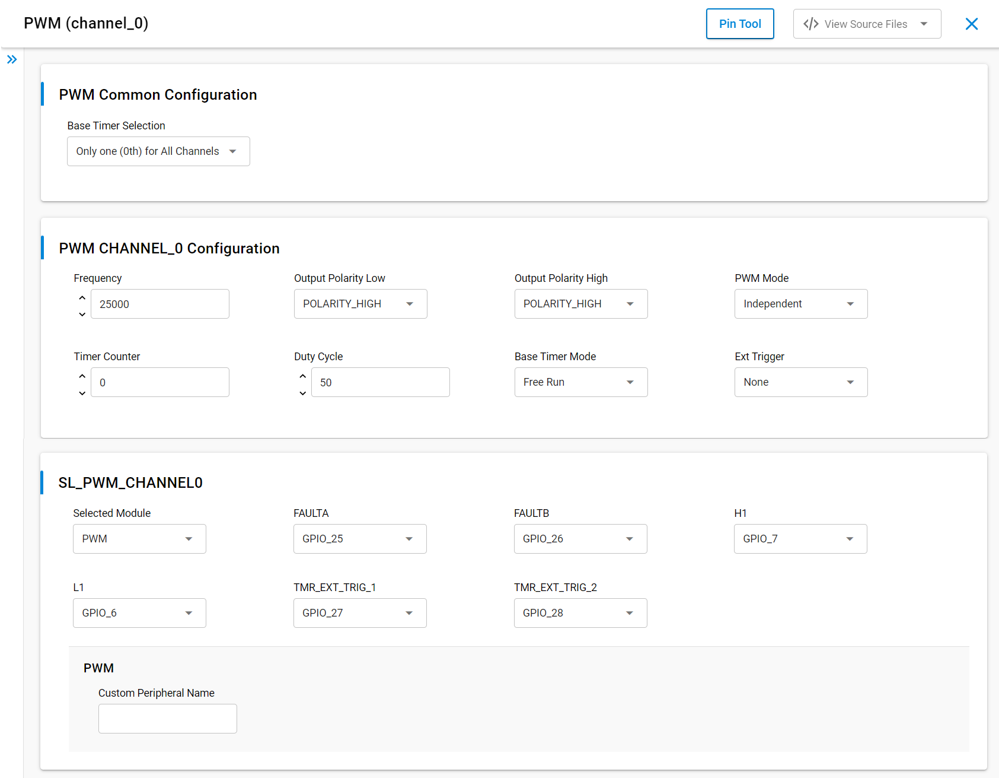

# SL PWM

## Table of Contents

- [Purpose/Scope](#purposescope)
- [Overview](#overview)
- [About Example Code](#about-example-code)
- [Prerequisites/Setup Requirements](#prerequisitessetup-requirements)
  - [Hardware Requirements](#hardware-requirements)
  - [Software Requirements](#software-requirements)
  - [Setup Diagram](#setup-diagram)
- [Getting Started](#getting-started)
- [Application Build Environment](#application-build-environment)
  - [Application Configuration Parameters](#application-configuration-parameters)
  - [PWM Pin Configuration](#pwm-pin-configuration)
- [Test the Application](#test-the-application)

## Purpose/Scope

- This application demonstrate the PWM (Pulse Width Modulation) to generate a periodic pulse waveform, which is useful in motor control and power control applications.

## Overview

- Supports up to eight PWM outputs with four duty cycle generators
- Complementary and Independent output modes are supported
- Dead time insertion in Complementary mode
- Manual override option for PWM output pins. Output pin polarity is programmable
- Supports generation of interrupt for different events
- Supports two hardware fault input pins

## About Example Code

- This example demonstrates the generation of periodic pulse waveform with 50% duty cycle and frequency of 25Khz.
- Four macros are present i.e., DEAD_TIME, OVERRIDE, FAULT.
- If **DEAD_TIME** is enabled:
  - DEAD_TIME: To perform correct status change of the power switches in the inverter leg, a PWM generator should insert small amount of time between required switching edges for top and bottom switch. This time is called dead-time.
  - Dead time mode is applied only in complementary mode.
    - Complementary mode: In complementary PWM mode, PWM waveform output incorporates dead time (anti-short periods) to prevent overlap between the positive and anti phases.
    - Independent Mode: In Independent PWM Output mode, the PWM outputs (PWMxH and PWMxL) are phase shifted relative to each other.
  - Initialize the PWM using \ref sl_si91x_pwm_init.
  - Set configuration using \ref sl_si91x_pwm_set_configuration.
  - Set duty cycle using \ref sl_si91x_pwm_set_duty_cycle.
  - Set base timer mode using \ref sl_si91x_pwm_set_base_timer_mode.
  - Set base time period control using \ref sl_si91x_pwm_control_period.
  - Register callbacks using \ref sl_si91x_pwm_register_callback.
  - Start PWM using \ref sl_si91x_pwm_start.
- If **OVERRIDE** is enabled:
  - OVERRIDE: While overriding PWM outputs, the channel counters continue to run, only the PWM outputs are forced to user defined values.
  - Initialize the PWM using \ref sl_si91x_pwm_init.
  - Set configuration using \ref sl_si91x_pwm_set_configuration.
  - Set base timer mode using \ref sl_si91x_pwm_set_base_timer_mode.
    - Set duty cycle using \ref sl_si91x_pwm_set_duty_cycle.
  - Set base time period control using \ref sl_si91x_pwm_control_period.
  - Register callbacks using \ref sl_si91x_pwm_register_callback.
  - Start PWM using \ref sl_si91x_pwm_start.
- If **FAULT** is enabled:
  - FAULT: There are two fault pins, FAULTxA and FAULTxB, associated with the MCPWM module. When asserted, these pins can optionally drive each of the PWM I/O pins to a defined state.
  - Initialize the PWM using \ref sl_si91x_pwm_init, \ref sl_Si91x_pwm_fault_init.
  - Set configuration using \ref sl_si91x_pwm_set_configuration.
  - Set base timer mode using \ref sl_si91x_pwm_set_base_timer_mode.
    - Set duty cycle using \ref sl_si91x_pwm_set_duty_cycle.
  - Set base time period control using \ref sl_si91x_pwm_control_period.
  - Register callbacks using \ref sl_si91x_pwm_register_callback.
    Change the event generated to fault A/B flags.
  - Start PWM using \ref sl_si91x_pwm_start.
- If user wants to work without UC configuration, one can use their own macros and structure configuration and pass it directly in application.
  
>**Note:**
>
>1. PWM has four channels. User can handle these channels using instances.
>2. channel_0, channel_1, channel_2 and channel_3 are the names pre-defined for the PWM channels.
>3. For user defined instances, one may have to define his hardware specific definitions in config.h file.
>4. User can directly use APIs in application by passing appropriate structure members, if user doesn't want to configure from UC.

## Prerequisites/Setup Requirements

### Hardware Requirements

- Windows PC
- Silicon Labs Si917 Evaluation Kit [WPK(BRD4002) + BRD4338A]

### Software Requirements

- Simplicity Studio
- Serial console Setup
  - The Serial Console setup instructions are provided below:
Refer [here](https://docs.silabs.com/wiseconnect/latest/wiseconnect-getting-started/getting-started-with-soc-mode#perform-console-output-and-input-for-brd4338-a).

### Setup Diagram

> 

## Getting Started

Refer to the instructions [here](https://docs.silabs.com/wiseconnect/latest/wiseconnect-getting-started/) to:

- Install Studio and WiSeConnect 3 extension
- Connect your device to the computer
- Upgrade your connectivity firmware
- Create a Studio project

## Application Build Environment

### Application Configuration Parameters

- Configure the following macros in pwm_example.c file and update/modify following macros if required.

  ```C
    #define EVENT_COUNT       10    // Count of events that can generate
    #define PRESCALE_A        0x100 // PWM Prescale_A value
    #define DEADTIME_A        0x08  // PWM deadtime_A
    #define FAULT_A_ENABLE    0x11  // Fault A enable for channel 0
    #define DT_COUNTER_A      0x00  // Dead time counter A enable
    #define DT_ENABLE         0x01  // Dead time enable for channel 0
    #define INTR_EVENT        0x01  // Rise PWM time period match channel 0 event
    #define DUTY_CYCLE_UPDATE 0x01  // Enable duty cycle updating bit in register
  ```

- Configure UC from the slcp component.
- Open **sl_si91x_pwm.slcp** project file select **software component** tab and search for **PWM** in search bar.
- By default, PWM has channel 0 instance.
- Using configuration wizard, one can configure different parameters:

  - **General Configuration for PWM**

    - Frequency: Frequency changes from 500Hz to 200Khz. By default 25Khz is considered.
    - Output polarity low: There are 2 polarities- polarity low, polarity high. The difference can be observed in waveforms, when polarity is changed. By default it is set to polarity high.
    - Output polarity high: There are 2 polarities- polarity low, polarity high. The difference can be observed in waveforms, when polarity is changed. By default it is set to polarity high.
    - PWM mode: There are 2 modes, independent mode and complementary mode. The definitions for these modes are covered in about example code. The difference can be seen in waveform, when modes are changed.
    - Timer counter: This is initial base time counter value to set. By default it is set to 0.
    - Duty cycle: By default 50% duty cycle is take. One can vary duty from 0% to 100%.
    - Base timer mode: There are 6 different modes. By default free run mode is selected.
    - Base timer selection: Timer for each channel and Timer for all channels are 2 base timers we have.
    - Ext trigger: In order to enable fault A, fault B and other external triggers present, ext trigger parameter is used.

      

### PWM Pin Configuration

Tested on WPK Base board - 4002A and Radio board - BRD4338A.

- PWM channel-0 pin configuration.

  | Description   | GPIO    | Connector    |
  | ------------- | ------- | ------------ |
  | PWM_H         | GPIO_7  | P20          |
  | PWM_L         | GPIO_6  | P19          |

- PWM channel-1 pin configuration.

  | Description   | GPIO    | Connector    |
  | ------------- | ------- | ------------ |
  | PWM_H         | GPIO_9  | F9           |
  | PWM_L         | GPIO_8  | F8           |

- PWM channel-2 pin configuration.

  | Description   | GPIO    | Connector    |
  | ------------- | ------- | ------------ |
  | PWM_H         | GPIO_11 | F13          |
  | PWM_L         | GPIO_10 | F11          |

- PWM channel-3 pin configuration.

  | Description   | GPIO    | Connector    |
  | ------------- | ------- | ------------ |
  | PWM_H         | ULP_GPIO_7  | P12         |
  | PWM_L         | ULP_GPIO_6  | P13         |

> **Note:** Make sure pin configuration in RTE_Device_917.h file.(path: /$project/config/RTE_Device_917.h)

## Test the Application

Refer to the instructions [here](https://docs.silabs.com/wiseconnect/latest/wiseconnect-getting-started/) to:

1. Compile and run the application.
2. When the application runs, it generates periodic pulse waveform with 50% duty cycle.
3. Connect oscilloscope to GPIO_6(P19) & GPIO_7(P20) and observe the PWM waveform.
4. After successful program execution the prints in serial console looks as shown below.

   

   
