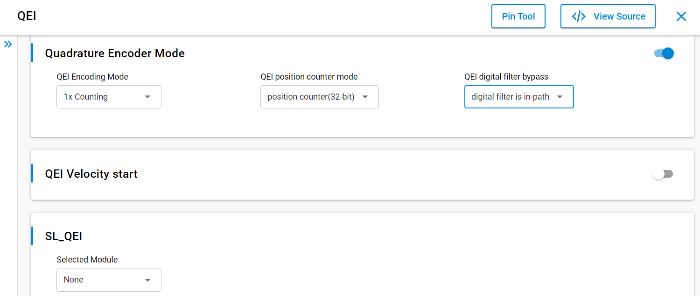
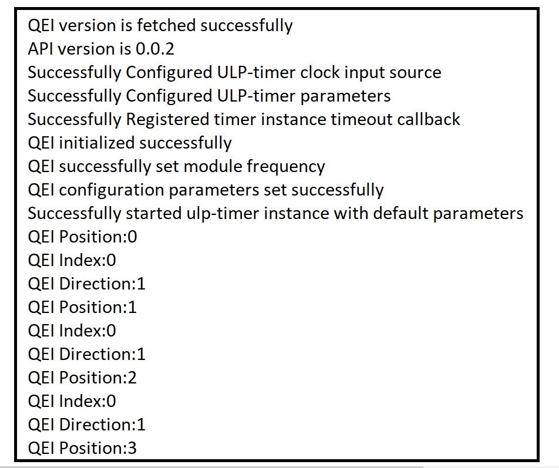

# SiWx91x Platform QEI

## Table of Contents

- [SiWx91x Platform QEI](#siwx91x-platform-qei)
  - [Table of Contents](#table-of-contents)
  - [Purpose/Scope](#purposescope)
  - [Overview](#overview)
  - [About Example Code](#about-example-code)
  - [Prerequisites/Setup Requirements](#prerequisitessetup-requirements)
    - [Hardware Requirements](#hardware-requirements)
    - [Software Requirements](#software-requirements)
    - [Setup Diagram](#setup-diagram)
  - [Getting Started](#getting-started)
  - [Application Build Environment](#application-build-environment)
    - [Application Configuration Parameters](#application-configuration-parameters)
    - [Pin Configuration](#pin-configuration)
  - [Test the Application](#test-the-application)
  - [Troubleshooting](#troubleshooting)
  - [Resources](#resources)
  - [Report Bugs/Support](#report-bugssupport)

## Purpose/Scope

- This application demonstrates the velocity, position count, index count, and direction measurement using the QEI module.

## Overview

- The QEI module provides the ability to measure the position and speed of a rotating encoder, which is essential for applications requiring precise motion control.
- It utilizes two input signals, Phase A and Phase B, to determine the direction of rotation, and an Index signal to mark specific positions.
- This example showcases how to configure the QEI module for real-time data acquisition, allowing for effective monitoring and control of motion systems.
- The QEI can process both incremental and absolute encoders, making it versatile for various applications in robotics, industrial automation, and consumer electronics.
- By leveraging the QEI’s high-resolution counting capabilities, users can achieve accurate position tracking and velocity measurement, enabling enhanced performance in dynamic environments.

## About Example Code

- This example demonstrates the use of the Quadrature Encoder Interface (QEI) to measure velocity, position, direction, and index counts from a quadrature encoder.
- Various parameters like phase A and phase B signals, index signal, and configuration settings can be managed using [`sl_qei_config_t`](https://docs.silabs.com/wiseconnect/latest/wiseconnect-api-reference-guide-si91x-peripherals/sl-qei-config-t).
- The example code emulates the behavior of a quadrature encoder by toggling GPIO pins for phase and index signals, simulating real-world encoder outputs.
- Dummy pulses are generated on GPIOs and fed to the QEI pins using the ULP timer.
- The firmware version of the QEI API is fetched using [`sl_si91x_qei_get_version`](https://docs.silabs.com/wiseconnect/latest/wiseconnect-api-reference-guide-si91x-peripherals/qei#sl-si91x-qei-get-version), which includes the release version, major version, and minor version, represented by [`sl_qei_version_t`](https://docs.silabs.com/wiseconnect/latest/wiseconnect-api-reference-guide-si91x-peripherals/sl-qei-version-t).
- A static function initializes GPIO pins using [`sl_si91x_qei_stimulus_pin_mux_init`](https://docs.silabs.com/wiseconnect/latest/wiseconnect-api-reference-guide-si91x-peripherals/qei#sl-si91x-qei-stimulus-pin-mux-init), configuring the necessary pins for QEI operation.
- [`sl_si91x_qei_init`](https://docs.silabs.com/wiseconnect/latest/wiseconnect-api-reference-guide-si91x-peripherals/qei#sl-si91x-qei-init) is called to initialize the QEI peripheral.
- After initialization, [`sl_si91x_qei_set_configuration`](https://docs.silabs.com/wiseconnect/latest/wiseconnect-api-reference-guide-si91x-peripherals/qei#sl-si91x-qei-set-configuration) is called to set up the QEI parameters using a configuration structure [`sl_qei_config_t`](https://docs.silabs.com/wiseconnect/latest/wiseconnect-api-reference-guide-si91x-peripherals/sl-qei-config-t).
- A callback function is registered using [`sl_si91x_qei_register_callback`](https://docs.silabs.com/wiseconnect/latest/wiseconnect-api-reference-guide-si91x-peripherals/qei#sl-si91x-qei-register-callback), allowing the application to respond to QEI interrupt events.
- The current position (range: 0–65535), index count (range: 0–65535), and direction are retrieved during processing through [`sl_si91x_qei_get_position_counter`](https://docs.silabs.com/wiseconnect/latest/wiseconnect-api-reference-guide-si91x-peripherals/qei#sl-si91x-qei-get-position-counter), [`sl_si91x_qei_get_index_counter`](https://docs.silabs.com/wiseconnect/latest/wiseconnect-api-reference-guide-si91x-peripherals/qei#sl-si91x-qei-get-index-counter), and [`sl_si91x_qei_get_direction`](https://docs.silabs.com/wiseconnect/latest/wiseconnect-api-reference-guide-si91x-peripherals/qei#sl-si91x-qei-get-direction).
- If `ENCODER_MODE` macro is enabled, the application prints the current position, index, and direction of the encoder.
- If `VELOCITY` macro is enabled, the velocity is fetched using [`sl_si91x_qei_get_velocity`](https://docs.silabs.com/wiseconnect/latest/wiseconnect-api-reference-guide-si91x-peripherals/qei#sl-si91x-qei-get-velocity) and printed to the console when the velocity computation is completed.
- The application continuously runs in a loop, simulating the encoder’s output and processing the data to provide real-time feedback on the encoder's state.

## Prerequisites/Setup Requirements

### Hardware Requirements

- Windows PC
- Silicon Labs SiWx91x Evaluation Kit [[BRD4002A](https://www.silabs.com/development-tools/wireless/wireless-pro-kit-mainboard?tab=overview) + [BRD4338A](https://www.silabs.com/development-tools/wireless/wi-fi/siwx917-rb4338a-wifi-6-bluetooth-le-soc-radio-board?tab=overview) / [BRD4342A](https://www.silabs.com/development-tools/wireless/wi-fi/siwx91x-rb4342a-wifi-6-bluetooth-le-soc-radio-board?tab=overview) / [BRD4343A](https://www.silabs.com/development-tools/wireless/wi-fi/siw917y-rb4343a-wi-fi-6-bluetooth-le-8mb-flash-radio-board-for-module?tab=overview) / [BRD4343C](https://www.silabs.com/development-tools/wireless/wi-fi/siw917y-rb4343c-wi-fi-6-bluetooth-le-8mb-flash-radio-board-for-module?tab=overview)]
- Three jumper wires (for WPK setups to connect the on-chip QEI signal simulator outputs to the QEI input pins — see [Pin Configuration](#pin-configuration))

### Software Requirements

- SiWx91x
- Simplicity Studio
- Serial console setup — refer [Console Input and Output](https://docs.silabs.com/wiseconnect/latest/wiseconnect-developers-guide-developing-for-silabs-hosts/using-the-simplicity-studio-ide#console-input-and-output)

### Setup Diagram


## Getting Started

Refer to the instructions [here](https://docs.silabs.com/wiseconnect/latest/wiseconnect-getting-started/) to:

- [Install Simplicity Studio](https://docs.silabs.com/wiseconnect/latest/wiseconnect-developers-guide-developing-for-silabs-hosts/using-the-simplicity-studio-ide#install-simplicity-studio)
- [Install WiSeConnect extension](https://docs.silabs.com/wiseconnect/latest/wiseconnect-developers-guide-developing-for-silabs-hosts/using-the-simplicity-studio-ide#install-the-wiseconnect-3-extension)
- [Connect your device to the computer](https://docs.silabs.com/wiseconnect/latest/wiseconnect-developers-guide-developing-for-silabs-hosts/using-the-simplicity-studio-ide#connect-siwx91x-to-computer)
- [Upgrade your connectivity firmware](https://docs.silabs.com/wiseconnect/latest/wiseconnect-developers-guide-developing-for-silabs-hosts/using-the-simplicity-studio-ide#update-siwx91x-connectivity-firmware)
- [Create a Studio project](https://docs.silabs.com/wiseconnect/latest/wiseconnect-developers-guide-developing-for-silabs-hosts/using-the-simplicity-studio-ide#create-a-project)

For details on the project folder structure, see the [WiSeConnect Examples](https://docs.silabs.com/wiseconnect/latest/wiseconnect-examples/#example-folder-structure) page.

## Application Build Environment

### Application Configuration Parameters

- Configure UC from the slcp component.
- Open **sl_si91x_qei.slcp** project file, select **Software Component** tab and search for **QEI** in search bar.
- Using configuration wizard one can configure different parameters like:

  

- **QEI Configuration**
  - Quadrature Encoder Mode: This setting controls the operation of the Quadrature Encoder. This setting enables or disables the Quadrature Encoder mode. When enabled, the system utilizes the QEI for position tracking based on the encoder's output.
    - 0: Enable - Activates the Quadrature Encoder Mode.
    - 1: Disable - Deactivates the Quadrature Encoder Mode and user can configure for Timer Mode instead.
  - QEI Encoding Mode: Configures the position counting method of the QEI.
    - 1x Counting : SL_QEI_ENCODE_MODE_1X
    - 2x Counting : SL_QEI_ENCODE_MODE_2X
    - 4x Counting : SL_QEI_ENCODE_MODE_4X
  - QEI Position Counter Mode: Sets the size of the position counter.
    - 32-bit position counter : SL_QEI_POS_CNT_32.
    - 16-bit position counter : SL_QEI_POS_CNT_16.
  - QEI Digital Filter Bypass: Configures the digital filter for QEI signals.
    - The digital filter is active : SL_QEI_DIGITAL_FILTER.
    - The digital filter is bypassed : SL_QEI_BYPASS_FILTER.
  - QEI Velocity Start: Enables or disables velocity calculation.
    - 0: Disable - Disables velocity calculation.
    - 1: Enable - Activates velocity calculation.
  - Delta Time: Defines the time interval used for velocity calculations.

- Configure the following macros in [`qei_example.h`](qei_example.h) file and update/modify following macros if required.

  - `BLINK_RATE`: Toggle rate (in ticks per second) used to generate the simulated encoder signals on the stimulus GPIOs. By default, it is set to 1000.

    ```c
    #define BLINK_RATE 1000
    ```

  - `QEI_OPERATING_FREQ`: Operating frequency of the QEI module in Hz, used for velocity and timing calculations. By default, it is set to 30000000 (30 MHz).

    ```c
    #define QEI_OPERATING_FREQ 30000000
    ```

  - `QEI_IDX_REVOLUTIONS`: Number of index revolutions generated by the simulation stimulus for the QEI example. By default, it is set to 10.

    ```c
    #define QEI_IDX_REVOLUTIONS 10
    ```

  - `SL_TIMER_MATCH_VALUE`: Match value for the ULP timer (in down-counter mode) that drives generation of the simulated encoder pulses. By default, it is set to 400000.

    ```c
    #define SL_TIMER_MATCH_VALUE 400000
    ```

  - `ULP_TIMER_INSTANCE`: Selects the ULP timer instance used to produce the simulated encoder stimulus. By default, it is set to 0.

    ```c
    #define ULP_TIMER_INSTANCE 0
    ```

### Pin Configuration

This example does not use an external quadrature encoder. Instead, the firmware generates encoder-like pulses on the **QEI signal simulator output** GPIOs by using the ULP timer. Connect these output GPIOs to the **QEI input** GPIOs on the board expansion header with jumper wires so that the QEI peripheral can receive the Phase A, Phase B, and Index signals.

The pin connections in the **BRD4002A + BRD4338A** tables below use the BRD4338A expansion-header (917 Breakout pin) labels.

If you are using a BRD4342A, BRD4343A, or BRD4343C radio board on the WPK, use the same GPIO mappings (GPIO_29 → GPIO_26, GPIO_30 → GPIO_27, and GPIO_6 → GPIO_25) and identify the corresponding expansion header pins in that radio board's user guide. Do not use the Explorer Kit tables for WPK radio boards.

The **Explorer Kit** tables at the end of this section apply only to Explorer Kit boards, such as the BRD2708A, and not to WPK and radio board combinations.

#### QEI input pins — BRD4002A + BRD4338A

These GPIOs are the QEI peripheral inputs. Connect the simulator output pins to these pins using jumper wires.

| Description   | QEI GPIO Pin | 917 Breakout pin |
| ------------- | ------------ | ---------------- |
| Phase A Input | GPIO_26      | P27              |
| Phase B Input | GPIO_27      | P29              |
| Index Input   | GPIO_25      | P25              |

#### QEI signal simulator output pins — BRD4002A + BRD4338A

These GPIOs are configured as outputs in firmware to simulate an external encoder. Connect each output pin to the QEI input pin using jumper wires as shown in the **Connect to** column.

| Description           | QEI GPIO Pin | 917 Breakout pin | Connect to (QEI input) |
| --------------------- | ------------ | ---------------- | ---------------------- |
| Phase A Signal Output | GPIO_29      | P33              | GPIO_26 (P27)          |
| Phase B Signal Output | GPIO_30      | P35              | GPIO_27 (P29)          |
| Index Signal Output   | GPIO_6       | P19              | GPIO_25 (P25)          |

#### QEI input pins — Explorer Kit

| Description   | Explorer Kit Pin |
| ------------- | ---------------- |
| Phase A Input | GPIO_26          |
| Phase B Input | GPIO_27          |
| Index Input   | GPIO_25          |

#### QEI signal simulator output pins — Explorer Kit

Jumper each simulator output GPIO below to the matching QEI input GPIO on the Explorer Kit header.

| Description           | Explorer Kit Pin | Connect to (QEI input) |
| --------------------- | ---------------- | ---------------------- |
| Phase A Signal Output | GPIO_29          | GPIO_26                |
| Phase B Signal Output | GPIO_30          | GPIO_27                |
| Index Signal Output   | GPIO_6           | GPIO_25                |

> **Note:**
>
> For Explorer Kit pinout specifications and detailed pin mapping information, refer to the official Silicon Labs User Guide available at the following location: [User Guide](https://www.silabs.com/documents/public/user-guides/ug581-brd2605a-user-guide.pdf)

## Test the Application

Refer to the instructions [here](https://docs.silabs.com/wiseconnect/latest/wiseconnect-getting-started/) to:

1. Compile and run the application.
2. Connect the on-chip QEI signal simulator outputs to the QEI input pins using jumper wires:
   - **Phase A:** GPIO_29 → GPIO_26
   - **Phase B:** GPIO_30 → GPIO_27
   - **Index:** GPIO_6 → GPIO_25
3. On **BRD4002A + BRD4338A**, use the expansion-header labels from [Pin Configuration](#pin-configuration) (for example, P33 → P27, P35 → P29, P19 → P25).
4. On **BRD4342A**, **BRD4343A**, or **BRD4343C**, use the same GPIO pairs and map them to that radio board's expansion-header pin names per its user guide.
5. After successful program execution, the serial console output looks similar to the following.

   

> **Note:**
>
> - Interrupt handlers are implemented in the driver layer, and user callbacks are provided for custom code. If you want to write your own interrupt handler instead of using the default one, make the driver interrupt handler a weak handler. Then, copy the necessary code from the driver handler to your custom interrupt handler.

## Troubleshooting

- If the project does not build, ensure Simplicity Studio and the WiSeConnect extension are installed and the board is connected.
- If the device is not detected, reinstall the connectivity firmware and check USB drivers.
- If QEI position or index counts is zero, verify all three jumper connections use GPIO_29 → GPIO_26, GPIO_30 → GPIO_27, and GPIO_6 → GPIO_25. For WPK radio boards, verify the header pin labels by referring to the corresponding radio board user guide. Do not use the Explorer Kit tables.

## Resources

- [WiSeConnect Getting Started](https://docs.silabs.com/wiseconnect/latest/wiseconnect-getting-started/)
- [WiSeConnect Examples](https://docs.silabs.com/wiseconnect/latest/wiseconnect-examples/)
- [SiWx91x SoC Documentation](https://docs.silabs.com/wiseconnect/latest/)

## Report Bugs/Support

For issues and support, use the Silicon Labs Community or your normal support channel.
