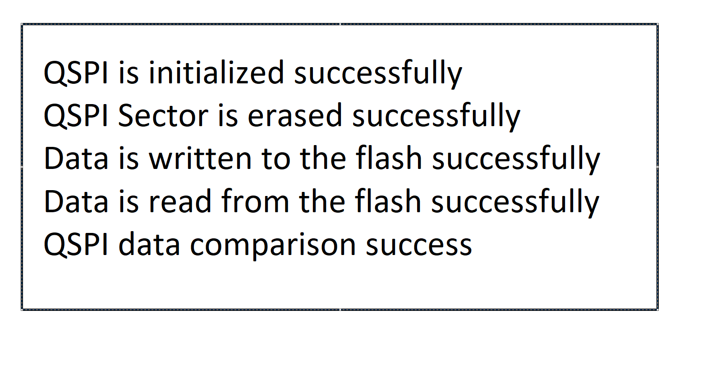

# SL QSPI

## Table of Contents

- [Purpose/Scope](#purposescope)
- [Overview](#overview)
- [About Example Code](#about-example-code)
- [Prerequisites/Setup Requirements](#prerequisitessetup-requirements)
  - [Hardware Requirements](#hardware-requirements)
  - [Software Requirements](#software-requirements)
  - [Setup Diagram](#setup-diagram)
- [Getting Started](#getting-started)
- [Application Build Environment](#application-build-environment)
  - [Pin Configuration](#pin-configuration)
- [Test the Application](#test-the-application)

## Purpose/Scope

- QSPI application demonstrates how to configure QSPI to write and read into external flash

## Overview

- This is a controller to interface with external flash memory through SPI interface. QSPI supports Single/ Dual/ Quad bit interfaces for SPI instructions and data transfers.
- This application is configured with following configs:
  - Single mode
  - Quad mode

## About Example Code

- This example code demonstrates configuration of the qspi for write and read data from external flash.
- It configures the pin muxing for the QSPI interface using RSI APIs.
- Then it sets the QSPI clock using the RSI APIs and configures the appropriate clock with the clock division factor.
- It also sets the spi configurations in the variable of type \ref spi_config_t.
- It initializes the QSPI interface using \ref RSI_QSPI_SpiInit() API.
- Note: Before enabling the QSPI interface, it is recommended to disable all the interrupts using \ref __disable_irq().
- Primarily it erases the sector using QSPI interface using \ref RSI_QSPI_SpiErase() API.
- Then it writes the data to the defined flash address using \ref RSI_QSPI_SpiWrite() API.
- If the MANUAL_READ_MODE macro is enabled, it encrypts the data using \ref RSI_QSPI_Aes_Encrypt_Decrypt_Standalone() API.
- Once the write is successful, if the MANUAL_READ_MODE macro is enabled then it reads the data in manual mode using \ref RSI_QSPI_ManualRead() API, else it directly reads the memory address and stores in the buffer.
- If the write and read from the flash is successful, the comparision between both the buffers is successful.

## Prerequisites/Setup Requirements

### Hardware Requirements

- Windows PC
- Silicon Labs Si917 Evaluation Kit [WPK(4002A) + BRD4338A]

### Software Requirements

- Si91x
- Simplicity Studio
- Common flash module
- Serial console Setup
  - For Serial Console setup instructions, refer [here](https://docs.silabs.com/wiseconnect/latest/wiseconnect-developers-guide-developing-for-silabs-hosts/#console-input-and-output).

### Setup Diagram


## Getting Started

Refer to the instructions [here](https://docs.silabs.com/wiseconnect/latest/wiseconnect-getting-started/) to:

- [Install Simplicity Studio](https://docs.silabs.com/wiseconnect/latest/wiseconnect-developers-guide-developing-for-silabs-hosts/#install-simplicity-studio)
- [Install WiSeConnect 3 extension](https://docs.silabs.com/wiseconnect/latest/wiseconnect-developers-guide-developing-for-silabs-hosts/#install-the-wi-se-connect-3-extension)
- [Connect your device to the computer](https://docs.silabs.com/wiseconnect/latest/wiseconnect-developers-guide-developing-for-silabs-hosts/#connect-si-wx91x-to-computer)
- [Upgrade your connectivity firmware ](https://docs.silabs.com/wiseconnect/latest/wiseconnect-developers-guide-developing-for-silabs-hosts/#update-si-wx91x-connectivity-firmware)
- [Create a Studio project ](https://docs.silabs.com/wiseconnect/latest/wiseconnect-developers-guide-developing-for-silabs-hosts/#create-a-project)

For details on the project folder structure, see the [WiSeConnect Examples](https://docs.silabs.com/wiseconnect/latest/wiseconnect-examples/#example-folder-structure) page.

## Application Build Environment

- Configure the following macros in qspi_example.h file and update/modify following macros if required.

  ``` C
  #define MANUAL_READ    DISABLE // To read data in Manual mode, enable this macro. When enabled, data from the QSPI FIFO can be accessed through I/O reads.
  #define QSPI_QUAD_MODE DISABLE // Enable this macro to read/write data in Quad mode via QSPI.
  ```

### Pin Configuration

| GPIO Pin  |   Description    |
| --------- | ---------------- |
| GPIO_46   | QSPI CLOCK PIN   |
| GPIO_47   | QSPI D0 PIN      |
| GPIO_48   | QSPI D1 PIN      |
| GPIO_49   | QSPI CSN0 PIN    |
| GPIO_50   | QSPI D2 PIN      |
| GPIO_51   | QSPI D3 PIN      |


## Test the Application

Refer to the instructions [here](https://docs.silabs.com/wiseconnect/latest/wiseconnect-getting-started/) to:

1. Compile and run the application.
2. When the application runs,QSPI writes and reads data from flash.
3. Data comparison success on console output can be observed.
4. After successful program execution the prints in serial console looks as shown below.

   > 


> **Note**:
>
>- Default Example is to read and write from flash in qspi manual mode
>- DMA read and writes are not supported in current example
>- To read the data in auto mode from flash , disable the #define MANUAL_READ macro in example file
