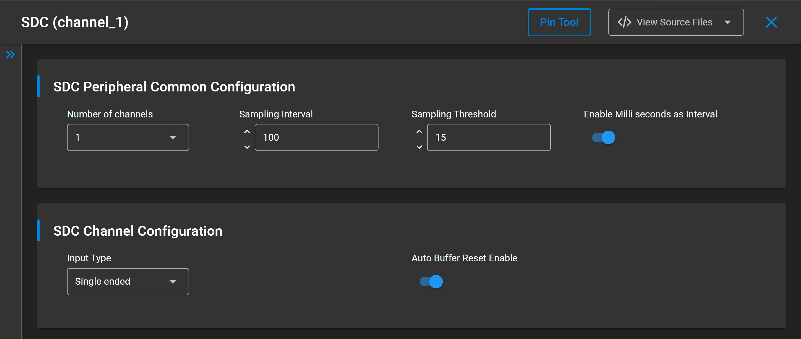
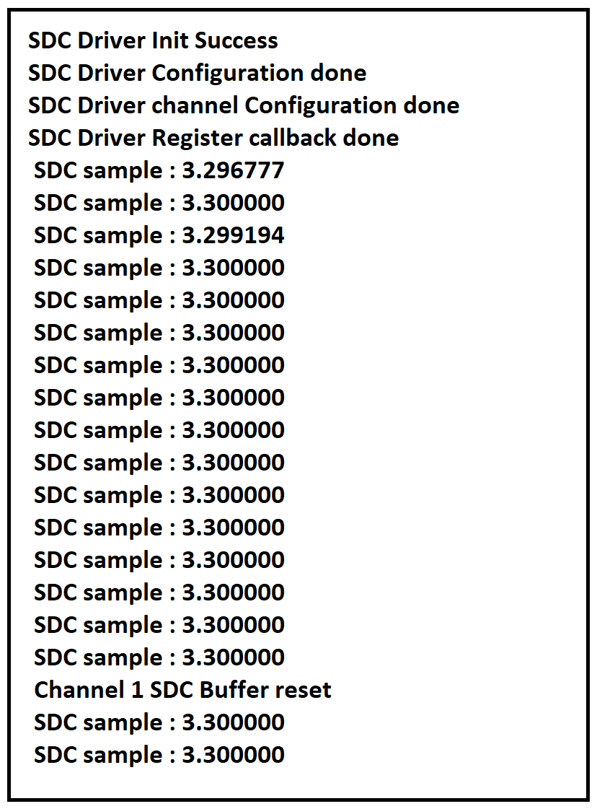

# SL SDC

## Table of Contents

- [Purpose/Scope](#purposescope)
- [Overview](#overview)
- [About Example Code](#about-example-code)
- [Prerequisites/Setup Requirements](#prerequisitessetup-requirements)
  - [Hardware Requirements](#hardware-requirements)
  - [Software Requirements](#software-requirements)
  - [Setup Diagram](#setup-diagram)
- [Getting Started](#getting-started)
- [Application Build Environment](#application-build-environment)
  - [Pin Configuration](#pin-configuration)
- [Test the Application](#test-the-application)

## Purpose and Scope

This application demonstrates the use of the Sensor Data Collector (SDC) peripheral, focusing on:

- Converting analog input signals to 12-bit digital output.
- Sampling data and storing it in a buffer.
- Converting digital data to the equivalent input voltage based on the selected operation mode.

## Overview

- The Sensor Data Collector (SDC) provides a low-energy sensor sampling mode using the AUX-ADC for data collection.
- The application outputs 12-bit ADC data in 2's complement format.
- SDC supports both single-ended and differential analog inputs.
- The auxiliary reference voltage (VRef) can be connected directly to Vbat (SDC LDO bypass mode) or to the SDC LDO output.
- Input selection GPIOs can be configured in the example application; users may also create custom instances for other input selections.
- The example is flexible, allowing users to adapt input selection and configuration as needed.

## About the Example Code

- This example demonstrates SDC operation in PS1 mode, reading sampled data and converting it to the corresponding input voltage.
- Parameters such as the number of channels, SDC operation mode, sampling interval, and sample threshold are configurable via UC.
- Common SDC configurations are defined in [`sl_si91x_sdc_common_config.h`](https://github.com/SiliconLabs/wiseconnect/blob/master/components/device/silabs/si91x/mcu/drivers/unified_api/config/sl_si91x_sdc_common_config.h), while channel-specific settings are in [`sl_si91x_sdc_init_inst_config.h`](https://github.com/SiliconLabs/wiseconnect/blob/master/components/device/silabs/si91x/mcu/drivers/unified_api/config/sl_si91x_sdc_init_inst_config.h).
- Initialize SDC using the `sl_si91x_sdc_driver_init` API, providing the reference voltage.
- Configure SDC parameters with `sl_si91x_sdc_driver_config`, passing a `sl_si91x_sdc_config_t` structure.
- Channel parameters are set using `sl_si91x_sdc_driver_channel_config`, which expects pointers to `sl_si91x_sdc_adc_config_t`, `sl_si91x_sdc_channel_info_t`, and `sl_si91x_sdc_channel_misc_config_t`.
- `sl_sdc_pin_config` of structure `sl_si91x_sdc_adc_config_t` and sl_sdc_channel_misc_config of struture`sl_si91x_sdc_channel_misc_config_t` are autogenerated same is used as parameters.
- Register a callback with `sl_si91x_sdc_driver_register_callback` to handle data-ready events and wakeup notifications.
- Start SDC sampling with `sl_si91x_sdc_driver_read_data_start`.
- The system then enters PS2 using `sl_si91x_wireless_shutdown` , `sl_si91x_power_manager_add_ps_requirement` and `configuring_ps2_power_state`.
- SDC is configured as a wakeup source using `sl_si91x_power_manager_set_wakeup_sources` to return to PS1.
- System then Enters PS1 and starts sampling data. After sample threshold is reached system ISR calls the callback with the event `SDC_EVENT_DATA_READY` in which data ready flag is set.
- Then application copies data using `sl_si91x_sdc_driver_store_data` into user provided buffer during channel configuration in `sl_si91x_sdc_channel_info_t`.
- After copying is done system goes back to PS1 , this process continues until enitr buffer is filled.
- After buffer is filled `sl_si91x_sdc_driver_store_data` calls callback with event `SDC_EVENT_BUFFER_RESET`.
- Output data is printed in `SDC_EVENT_BUFFER_RESET` and sampling process repeats.

## Prerequisites and Setup Requirements

### Hardware Requirements

- Windows PC
- Silicon Labs Si917 Evaluation Kit [WPK (BRD4002) + BRD4338A / BRD4342A / BRD4343A]
- SiWx917 AC1 Module Explorer Kit (BRD2708A)

### Software Requirements

- Simplicity Studio
- Serial console setup  
  - For setup instructions, refer to the [console input and output guide](https://docs.silabs.com/wiseconnect/latest/wiseconnect-developers-guide-developing-for-silabs-hosts/#console-input-and-output).

### Setup Diagram


## Getting Started

Follow the [WiSeConnect Getting Started Guide](https://docs.silabs.com/wiseconnect/latest/wiseconnect-getting-started/) to:

- [Install Simplicity Studio](https://docs.silabs.com/wiseconnect/latest/wiseconnect-developers-guide-developing-for-silabs-hosts/#install-simplicity-studio)
- [Install the WiSeConnect 3 extension](https://docs.silabs.com/wiseconnect/latest/wiseconnect-developers-guide-developing-for-silabs-hosts/#install-the-wi-se-connect-3-extension)
- [Connect your device to the computer](https://docs.silabs.com/wiseconnect/latest/wiseconnect-developers-guide-developing-for-silabs-hosts/#connect-si-wx91x-to-computer)
- [Upgrade your connectivity firmware](https://docs.silabs.com/wiseconnect/latest/wiseconnect-developers-guide-developing-for-silabs-hosts/#update-si-wx91x-connectivity-firmware)
- [Create a Studio project](https://docs.silabs.com/wiseconnect/latest/wiseconnect-developers-guide-developing-for-silabs-hosts/#create-a-project)

For details on the project folder structure, see the [WiSeConnect Examples](https://docs.silabs.com/wiseconnect/latest/wiseconnect-examples/#example-folder-structure).

## Application Build Environment

Configure UC from the slcp component:

- Open the **sl_si91x_sdc.slcp** project file, select the **Software Component** tab, and search for **SDC**.
- Use the configuration wizard to set parameters as needed.

  - **SDC Peripheral Common Configuration**
    - Number of channels (default: 1). When changing this, ensure you create the corresponding channel instances.
    - SDC sampling interval (default: 100 ms). set the time (1–1024 seconds or milliseconds) between samples.
    - SDC sampling threshold (default: 15). number of samples before waking from PS1.
    - Enable millisecond interval for finer sampling control.

  - **SDC Channel Configuration**
    - Input type: single-ended or differential.
    - Auto buffer reset: when enabled, data collection wraps to the buffer start after reaching the limit.

    

- After running the application, sampled data is stored in the user buffer until the transfer length is reached.
- The application prints the sampled voltages to the UART console.
- Apply different voltages (1.8 V to Vref) to the SDC input and observe the console output.
- Input voltage and console output should match.
> **Notes:**
>
> - Ensure that the number of channel instances matches the number of channels selected in UC.
> - The number of channels must be set to 1, 2, or 4. Selecting three channels is not supported.

## Pin Configuration

### Pin Mapping for WPK [BRD4002A] Base Board and Radio Board

- The following tables list the supported ULP GPIO pins for SDC. For other radio boards, refer to the board-specific user guide.
- Channels can be reconfigured to any SDC-supported pins.

| PIN TO SDCP    | BRD4338A/4342A+BRD4002A | BRD4343A+BRD4002A | BRD2708A  |
| ----------------------- | ------------------------------------ | ------------------------- | -------------- | 
| ULP_GPIO_0     |  NA                     |   NA             | Breakout 6  |
| ULP_GPIO_1     |  P16                     |   P16             | Breakout 5 |
| ULP_GPIO_2     |  F10                     |   P37             | NA        |
| ULP_GPIO_4     |  NA                     |   P17             | Breakout 7 |
| ULP_GPIO_5     |  NA                     |   P18             | Breakout 9 |
| ULP_GPIO_6     |  EXP 16                 |   P13             | NA        |
| ULP_GPIO_7     |  EXP 15                 |   P12             | NA        |
| ULP_GPIO_8     |  P15                    |    P15             | Breakout 2 |
| ULP_GPIO_9     |  F7                     |   NA              | NA       |
| ULP_GPIO_10    |  P17                     |   NA             | NA        |
| ULP_GPIO_11    |  F6                     |   NA              | NA       |

| PIN TO SDCN   | BRD4338A/4342A+BRD4002A | BRD4343A+BRD4002A | BRD2708A  |
| ----------------------- | ---------------------------------- | ---------------------------| -------------- | 
| ULP_GPIO_1     |  P16                    |  P16              | Breakout 5 |
| ULP_GPIO_5     |  NA                    |  P18              | Breakout 9 |
| ULP_GPIO_7     |  EXP15                 |  P12              | NA        |
| ULP_GPIO_9     |  F7                    |  NA              | NA        |
| ULP_GPIO_11    |   F6                   |  NA              |  NA        |

## Testing the Application

Refer to the [Getting Started Guide](https://docs.silabs.com/wiseconnect/latest/wiseconnect-getting-started/) for instructions:

1. Compile and run the application.
2. By default, the SDC channel is configured with the channel_1 instance for Si917.  
   - Single-ended mode: positive analog input to ULP_GPIO_8 (Si917).
   - Differential mode: positive input to ULP_GPIO_8, negative input to ULP_GPIO_1.
3. When running, SDC applies the user configuration and starts conversion.
4. After conversion, sampled data is stored in the user buffer, converted to voltage values, and printed to the serial console.
5. Example serial output for a 3.3 V input:


    

> **Notes:**
>
> - Input selection GPIO can be configured in `sl_si91x_sdc_init_channel_1_config.h` for channel 1, or the respective config for other channels.
> - In `sdc_example.c`, update the `sl_adc_channel_config_t` channel parameter to match the installed channel number.
> - When using a single channel, only channel 1 is available; for two channels, channels 1 and 2, and so on.
> - SDC DAC and OPAMP are not supported.
> - Sampling threshold 16 is currently not supported.

> **Formula for Calculating Input Voltage from ADC Output:**
>
> **Differential Mode:**
>
> ```
> vout = ((((float)SDC_output / 4095.0f) * Vref) - (Vref / 2.0f));
> ```
>
> *Example:* If the positive input is 2.4 V and the negative input is 1.5 V, the SDC output corresponds to 0.9 V.
>
> **Single-Ended Mode:**
>
> ```
> vout = ((float)ADC_output / 4095.0f) * Vref;
> ```

