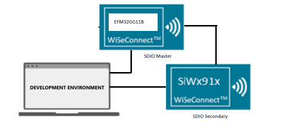
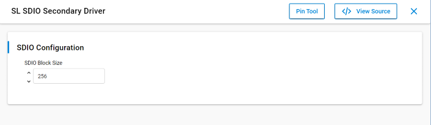
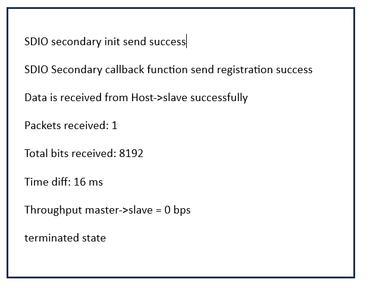

# SDIO Secondary

## Table of Contents

- [Purpose/Scope](#purposescope)
- [Prerequisites/Setup Requirements](#prerequisitessetup-requirements)
  - [Hardware Requirements](#hardware-requirements)
  - [Software Requirements](#software-requirements)
  - [Setup Diagram](#setup-diagram)
- [Getting Started](#getting-started)
- [Application Build Environment](#application-build-environment)
- [Test the Application](#test-the-application)

## Purpose/Scope

The SDIO Secondary application shows how to read and write data in SDIO Secondary.

## About Example Code

This example demonstrates about the SOC clock setting, SDIO secondary initialization, and transmitting and receiving the data to and from the SDIO master.

- To initialize the SDIO using \ref sl_si91x_sdio_secondary_init API.
- To register SDIO and DMA callback using \ref sl_si91x_sdio_secondary_register_event_callback API.
- To transfer and receive data to and from the master using the \ref  sl_si91x_sdio_secondary_send and \ref sl_si91x_sdio_secondary_receive APIs.   Send and receive APIs will configure all DMA descriptors and trigger the DMA to send and receive the data.
- Data will be received continuously after two seconds throughput will be calculated and printed over the console.

## Prerequisites/Setup Requirements

### Hardware Requirements

- Windows PC
- Silicon Labs Si917 Evaluation Kit [WPK(BRD4002) + BRD4338A / BRD4342A / BRD4343A ]
- An external SDIO host/master device.

### Software Requirements

- Simplicity Studio
- Serial console setup
  - For serial console setup instructions, see the [Console Input and Output](https://docs.silabs.com/wiseconnect/latest/wiseconnect-developers-guide-developing-for-silabs-hosts/#console-input-and-output) section in the *WiSeConnect Developer's Guide*.

### Setup Diagram



## Getting Started

Refer to the instructions [here](https://docs.silabs.com/wiseconnect/latest/wiseconnect-getting-started/) to:

- [Install Simplicity Studio](https://docs.silabs.com/wiseconnect/latest/wiseconnect-developers-guide-developing-for-silabs-hosts/#install-simplicity-studio)

- [Install WiSeConnect 3 extension](https://docs.silabs.com/wiseconnect/latest/wiseconnect-developers-guide-developing-for-silabs-hosts/#install-the-wi-se-connect-3-extension)
- [Connect your device to the computer](https://docs.silabs.com/wiseconnect/latest/wiseconnect-developers-guide-developing-for-silabs-hosts/#connect-si-wx91x-to-computer)
- [Upgrade your connectivity firmware](https://docs.silabs.com/wiseconnect/latest/wiseconnect-developers-guide-developing-for-silabs-hosts/#update-si-wx91x-connectivity-firmware)
- [Create a Studio project](https://docs.silabs.com/wiseconnect/latest/wiseconnect-developers-guide-developing-for-silabs-hosts/#create-a-project)

For details on the project folder structure, see the [WiSeConnect Examples](https://docs.silabs.com/wiseconnect/latest/wiseconnect-examples/#example-folder-structure) page.

## Application Build Environment

- Configure UC from the slcp component.

  >

- Modify current_mode in the `sdio_secondary_example.c` file to configure current_mode for SDIO Secondary.
  By default current mode is in RECEIVE_DATA.

  ```c
  /* Mode of Transmission */
  SEND_DATA /* Transmit data to the master  */
  RECEIVE_DATA /* Receive data from the master */

  /* Modify this macro to change mode of transmission for sdio secondary */

  current_mode = RECEIVE_DATA /*Default is receive mode, i.e., RX_PATH*/
  ```

- Modify BLOCK_LEN and NO_OF_BLOCKS in the `sdio_secondary.c` file to configure size for application buffer:

  ```c
  #define BLOCK_LEN         256
  #define NO_OF_BLOCKS      4
  #define XFER_BUFFER_SIZE  (BLOCK_LEN * NO_OF_BLOCKS) /* Buffer size is 256B*4 = 1KB */
   ```

### Pin Configuration

| GPIO pin  |  Connection |  Description|
|---  | ---  | --- |
|GPIO_25   | P25 | SDIO_CLK|
|GPIO_26   | P27 | SDIO_CMD |
|GPIO_27   | P29 | SDIO_DATA0 |
|GPIO_28   | P31 | SDIO_DATA1 |
|GPIO_29   | P33 | SDIO_DATA2 |
|GPIO_30   | P35 | SDIO_DATA3 |

NOTE: Pin configuration for SDIO Master.

## Test the Application

Refer to the instructions [here](https://docs.silabs.com/wiseconnect/latest/wiseconnect-getting-started/) to:

1. Connect secondary DATA*,CLK,CMD pins to Master DATA*,CLK,CMD pins properly.
2. Modify main file for SDIO secondary as per requirement.
3. When the application runs, master sends and secondary receives the data.

NOTE:

- TX_PATH (Transmit data from SDIO secondary to SDIO master).

   SDIO secondary transmits data from 'xfer_buffer'
- RX_PATH (Receive data from SDIO master to SDIO secondary).

   SDIO secondary receive data in 'xfer_buffer'

- After successful program execution, the prints in serial console looks as shown below.

  >


> **Note:**
>
> - Interrupt handlers are implemented in the driver layer, and user callbacks are provided for custom code. If you want to write your own interrupt handler instead of using the default one, make the driver interrupt handler a weak handler. Then, copy the necessary code from the driver handler to your custom interrupt handler.
