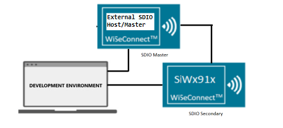
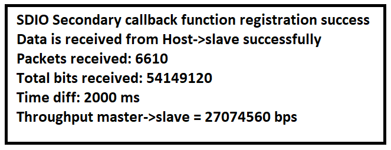

# SDIO Secondary

## Table of Contents

- [Purpose/Scope](#purposescope)
- [Prerequisites/Setup Requirements](#prerequisitessetup-requirements)
  - [Hardware Requirements](#hardware-requirements)
  - [Software Requirements](#software-requirements)
  - [Setup Diagram](#setup-diagram)
- [Getting Started](#getting-started)
- [Application Build Environment](#application-build-environment)
- [Test the Application](#test-the-application)

## Purpose/Scope

The SDIO Secondary application shows how to read and write data in SDIO Secondary

## About Example Code

- This example demonstrates about soc clock setting, sdio secondary initialization, transmitting and receiving the data to and from the sdio master.
- To initialize the sdio using \ref sl_si91x_sdio_secondary_init api.
- To register sdio and dma callback \ref sl_si91x_sdio_secondary_register_event_callback api is used.
- To transfer and receive data to and from the master \ref  sl_si91x_sdio_secondary_send and \ref sl_si91x_sdio_secondary_receive apis are used. send and receive apis will configure all dma descriptors and trigger the dma to send and receive the data.
- Data will be received continuously after two seconds throughput will be calculated and printed over the console.

## Prerequisites/Setup Requirements

### Hardware Requirements

- Windows PC
- Silicon Labs Si917 Evaluation Kit [WPK(BRD4002) + BRD4338A]
- An external SDIO host/master device - This example verified with EFM32GG11B SDIO Master

### Software Requirements

- Simplicity Studio
- Serial console Setup
  - The Serial Console setup instructions are provided below:
Refer [here](https://docs.silabs.com/wiseconnect/latest/wiseconnect-getting-started/getting-started-with-soc-mode#perform-console-output-and-input-for-brd4338-a).

### Setup Diagram



## Getting Started

Refer to the instructions [here](https://docs.silabs.com/wiseconnect/latest/wiseconnect-getting-started/) to:

- Install Studio and WiSeConnect 3 extension
- Connect your device to the computer
- Upgrade your connectivity firmware
- Create a Studio project

## Application Build Environment

- Configure UC from the slcp component.

  >

- Modify current_mode in sdio_secondary_example.c file to configure current_mode for SDIO Secondary:
  By default current mode is in RECEIVE_DATA

   ```c
  /* Mode of Transmission */
  SEND_DATA /* Transmit data to the master  */
  RECEIVE_DATA /* Receive data from the master */

  /* Modify this macro to change mode of transmission for sdio secondary */

 current_mode = RECEIVE_DATA /*Default is receive mode, i.e., RX_PATH*/

   ```

- Modify BLOCK_LEN and NO_OF_BLOCKS in sdio_secondary.c file to configure size for application buffer:

  #define BLOCK_LEN         256
  #define NO_OF_BLOCKS      4
  #define XFER_BUFFER_SIZE  (BLOCK_LEN * NO_OF_BLOCKS) /* Buffer size is 256B*4 = 1KB */
   ```

### Pin Configuration

|SiWx917 GPIO pin  | 1.0/1.2 EXP Header Connection  | 2.0 Connection |  Description|
|--- | --- | ---  | --- |
|GPIO_25  | 15 | P25 | SDIO_CLK|
|GPIO_26  | 16 | P27 | SDIO_CMD |
|GPIO_27  | 10 | P29 | SDIO_DATA0 |
|GPIO_28  | 8 | P31 | SDIO_DATA1 |
|GPIO_29  | 6 | P33 | SDIO_DATA2 |
|GPIO_30  | 4 | P35 | SDIO_DATA3 |

NOTE: pin configuration for SDIO Master.

>

## Test the Application

Refer to the instructions [here](https://docs.silabs.com/wiseconnect/latest/wiseconnect-getting-started/) to:

1. Connect secondary DATA*,CLK,CMD pins to Master DATA*,CLK,CMD pins properly.
2. Modify main file for SDIO secondary as per requirement.
3. When the application runs, master sends and secondary receives the data.

NOTE:

- TX_PATH (Transmit data from SDIO secondary to SDIO master).

   SDIO secondary transmits data from 'xfer_buffer'
- RX_PATH (Receive data from SDIO master to SDIO secondary).

   SDIO secondary receive data in 'xfer_buffer'

- After successful program execution the prints in serial console looks as shown below.

  >
