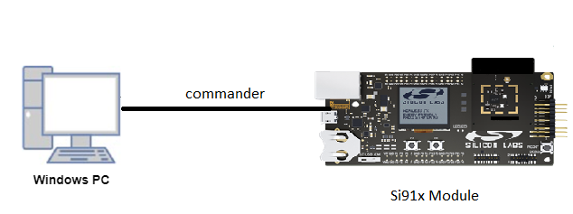

# SDIO Secondary Application

## Introduction
The SDIO Secondary application shows how to read and write data in SDIO Secondary
## Setting Up 
To use this application following Hardware, Software and the Project Setup is required:

### Hardware Requirements 
  - Windows PC 
  - Silicon Labs device [Evaluation Kit WSTK + SiWx917 Radio Board] as Secondary
  - An external SDIO host/master device - This example verified with EFM32GG11B SDIO Master


 


### Software Requirements
  - SiWx917 SDK
  - Embedded Development Environment
    - For Silicon Labs SiWx917, use the latest version of Simplicity Studio (refer **"Download and Install Simplicity Studio"** section in **getting-started-with-siwx917-soc** guide at **release_package/docs/index.html**)
 
### Project Setup
- **Silicon Labs SiWx917** refer **"Download SDKs"**, **"Add SDK to Simplicity Studio"**, **"Connect SiWx917"**, **"Open Example Project in Simplicity Studio"** section in **getting-started-with-siwx917-soc** guide at **release_package/docs/index.html** to work with SiWx917 and Simplicity Studio

## Configuration and Steps for Execution

- Modify current_mode in sdio_secondary_example.c file to configure current_mode for SDIO Secondary:
  By default current mode is in RECEIVE_DATA
   ```c
  /* Mode of Transmission */
  SEND_DATA /* Transmit data to the master  */
  RECEIVE_DATA /* Receive data from the master */

  /* Modify this macro to change mode of transmission for sdio secondary */
 current_mode = RECEIVE_DATA /* Default is receive mode, i.e., RX_PATH */
   ```

- Modify BLOCK_LEN and NO_OF_BLOCKS in sdio_secondary.c file to configure size for application buffer:

   ```c
#define BLOCK_LEN         256
#define NO_OF_BLOCKS      4
#define XFER_BUFFER_SIZE  (BLOCK_LEN * NO_OF_BLOCKS) /* Buffer size is 256B*4 = 1KB */
   ```

## Device Programming
To program the device ,refer **"Burn M4 Binary"** section in **getting-started-with-siwx917-soc** guide at **release_package/docs/index.html** to work with SiWx917 and Simplicity Studio

## Pin Configuration
|SiWx917 GPIO pin  | 1.0/1.2 EXP Header Connection  | 2.0 Connection |  Description|
|--- | --- | ---  | --- |
|GPIO_25  | 15 | P25 | SDIO_CLK|
|GPIO_26  | 16 | P27 | SDIO_CMD |
|GPIO_27  | 10 | P29 | SDIO_DATA0 |
|GPIO_28  | 8 | P31 | SDIO_DATA1 |
|GPIO_29  | 6 | P33 | SDIO_DATA2 |
|GPIO_30  | 4 | P35 | SDIO_DATA3 |

## Executing the Application
1. Compile and run the application.
2. Connect secondary DATA*,CLK,CMD pins to Master DATA*,CLK,CMD pins properly.
3. Modify main file for SDIO secondary as per requirement.
4. When the application runs, master sends and secondary receives the data. 

## Expected Results 
 - TX_PATH (Transmit data from SDIO secondary to SDIO master).
   SDIO secondary transmits data from 'xfer_buffer'
 - RX_PATH (Receive data from SDIO master to SDIO secondary).
   SDIO secondary receive data in 'xfer_buffer'