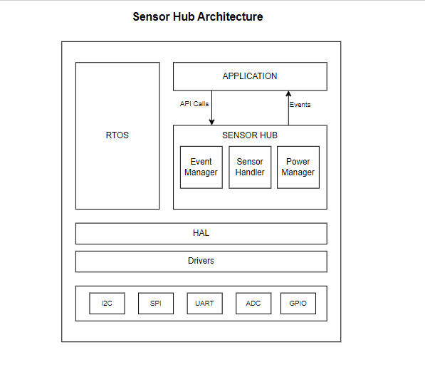
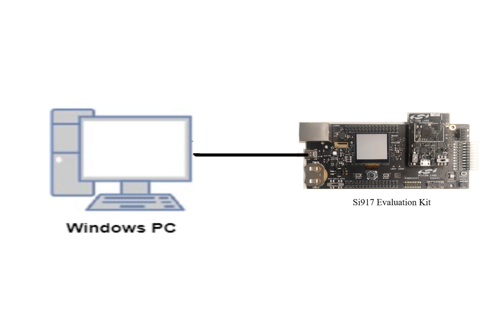
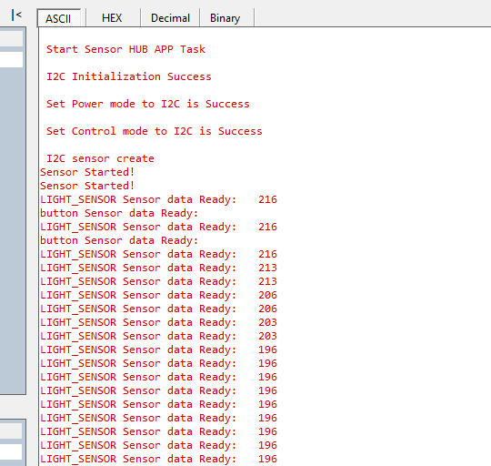

# SENSOR HUB

## Introduction 
- This application contains an example code to demonstrate the integration of Sensor Hub and its API usage. 
- It is a framework that can be easily integrated into any application where sensor handling is required. 
- The Sensor HUB works with sensors as per configurations provided by the application and notifies the necessary events throughout the application throughout the run. 
- The configuration for the sensors must be provided through the sensor hub config file on which the sensor hub should act.
- The application demonstrates the sensor hub functionalities with the help of two sensors namely a bh1750 Light Sensor and a Push Button-0 and prints the data on Debug UART.    

  
## Sensor Hub Framework



## Setting Up 
 - To use this application following Hardware, Software and Project Setup are required

### Hardware Requirements	
  - Windows PC 
  - Silicon Labs [Si917 Evaluation Kit WSTK + BRD4325A]
  - bh1750 Light Sensor
 


### Software Requirements
  - Si91x SDK
  - Embedded Development Environment
    - For Silicon Labs Si91x, use the latest version of Simplicity Studio (refer to **"Download and Install Simplicity Studio"** section in the **getting-started-with-siwx917-soc** guide at **release_package/docs/index.html**)
 
## Project Setup
- **Silicon Labs **Si91x** refer to **"Download**** SDKs"****, **"Add SDK to Simplicity Studio"**, **"Connect SiWx917**"**, and **"Open**** Example Project** in Simplicity Studio"** section in **getting-started-with-siwx917-soc** guide at **release_package/docs/index.html** to work with Si91x and Simplicity Studio

## Sensor Hub Configuration Parameters

- Configure the sensors info in the sensorhub_config.c file, in the config structure 
```C
#define MAX_NUM_SENSORS							// Maximum sensors present in the system

sl_sensor_info_t sensor_info[MAX_NUM_SENSORS];  //  configuration for the sensors  

```
### Data Delivery Modes
Configure the below parameters for data delivery mode in the sensorhub_config.c file.
- #### For **TIMEOUT Mode** configure the below parameters:
  .sampling_interval    = 100,  
  .data_deliver.mode    = TIMEOUT,  
  .data_deliver.timeout = 1000,

- #### For **THRESHOLD Mode** configure the below parameters:
  .sampling_interval    = 100,  
  .data_deliver.mode    = THRESHOLD,  
  .data_deliver.threshold = 1000,

- #### For **SAMPLING Mode** configure the below parameters:
  .sampling_interval    = 10,  
  .data_deliver.mode    = NUM_OF_SAMPLES,  
  .data_deliver.numOfSamples = 100,

## Sensor Pins Setup
### Light Sensor Pin Setup
| Sensor PIN | ULP GPIO PIN | Description |
| --- | --- | --- |
| SCL | ULP_GPIO_5 [EXP_HEADER-13] | Connect to SCL pin |
| SDA | ULP_GPIO_4 [EXP_HEADER-11] | Connect to SDA pin |
| VCC | (WPK) (3v3) | Connect to 3v3 pin |
| GND | (WPK) (GND) | Connect to GND pin |
| ADDR |(WPK) (GND) | Connect to GND pin |
## Build 
- Compile the application in Simplicity Studio using the build icon 


## Device Programming
- To program the device,refer **"**Burn M4 Binary"** section in **getting-started-with-siwx917-soc** guide at **release_package/docs/index.html** to work with Si91x and Simplicity Studio

## Executing the Application
- Compile and run the application.
- Connect the i2c-based light sensor based on the above pin configuration.
## Expected Results 
- The sensor events should be observed on the Serial Terminal as per the given configuration. 
- Button Zero is used for the interrupt mode. if you press the button zero on the base board we will get the "button Sensor data ready" print on the serial console.
- The figure shows the flow of the sensor hub based on user configuration.
