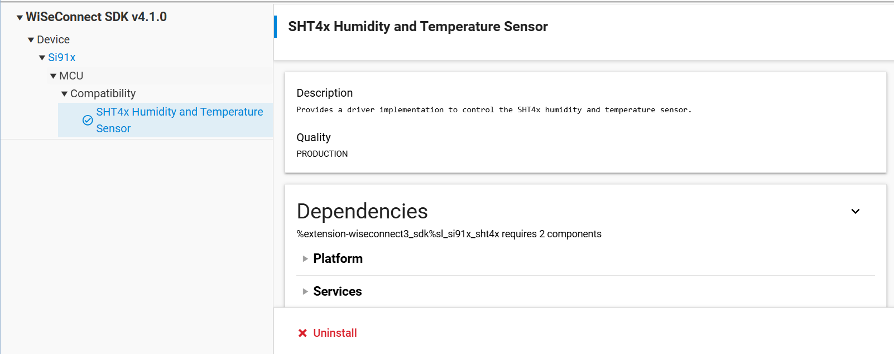
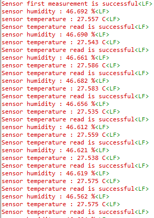

# SiWx91x Platform SHT4x

## Table of Contents

  - [SiWx91x Platform SHT4x](#platform-siwx91x-sht4x)
  - [Prerequisites/Setup Requirements](#prerequisitessetup-requirements)
    - [Hardware Requirements](#hardware-requirements)
    - [Software Requirements](#software-requirements)
    - [Setup Diagram](#setup-diagram)
  - [Getting Started](#getting-started)
  - [Application Build Environment](#application-build-environment)
    - [Pin Configuration](#pin-configuration)
  - [Test the Application](#test-the-application)
  - [Troubleshooting](#troubleshooting)
  - [Resources](#resources)
  - [Report Bugs/Support](#report-bugssupport)

## Purpose

This application demonstrates the SHT4x sensor: relative humidity and temperature measurement via I2C every 1 second, and how to use the SHT4x APIs.

## Prerequisites/Setup Requirements

### Hardware Requirements

- Windows PC
- Silicon Labs SiWx91x Evaluation Kit [[BRD4002](https://www.silabs.com/development-tools/wireless/wireless-pro-kit-mainboard?tab=overview) + [BRD4338A](https://www.silabs.com/development-tools/wireless/wi-fi/siwx917-rb4338a-wifi-6-bluetooth-le-soc-radio-board?tab=overview) / [BRD4342A](https://www.silabs.com/development-tools/wireless/wi-fi/siwx91x-rb4342a-wifi-6-bluetooth-le-soc-radio-board?tab=overview) / [BRD4343A](https://www.silabs.com/development-tools/wireless/wi-fi/siw917y-rb4343a-wi-fi-6-bluetooth-le-8mb-flash-radio-board-for-module?tab=overview) / [BRD4343C](https://www.silabs.com/development-tools/wireless/wi-fi/siw917y-rb4343c-wi-fi-6-bluetooth-le-8mb-flash-radio-board-for-module?tab=overview)]
- Kits
  - SiWx917 Development Kit [BRD2605B]

### Software Requirements

- Simplicity Studio
- Serial console setup
  - For Serial Console setup instructions, refer to [Console Input and Output](https://docs.silabs.com/wiseconnect/latest/wiseconnect-developers-guide-developing-for-silabs-hosts/using-the-simplicity-studio-ide#console-input-and-output).

### Setup Diagram

> 

## Getting Started

Refer to the instructions [here](https://docs.silabs.com/wiseconnect/latest/wiseconnect-getting-started/) to:

- [Install Simplicity Studio](https://docs.silabs.com/wiseconnect/latest/wiseconnect-developers-guide-developing-for-silabs-hosts/using-the-simplicity-studio-ide#install-simplicity-studio)
- [Install WiSeConnect extension](https://docs.silabs.com/wiseconnect/latest/wiseconnect-developers-guide-developing-for-silabs-hosts/using-the-simplicity-studio-ide#install-the-wiseconnect-3-extension)
- [Connect your device to the computer](https://docs.silabs.com/wiseconnect/latest/wiseconnect-developers-guide-developing-for-silabs-hosts/using-the-simplicity-studio-ide#connect-siwx91x-to-computer)
- [Upgrade your connectivity firmware](https://docs.silabs.com/wiseconnect/latest/wiseconnect-developers-guide-developing-for-silabs-hosts/using-the-simplicity-studio-ide#update-siwx91x-connectivity-firmware)
- [Create a Studio project](https://docs.silabs.com/wiseconnect/latest/wiseconnect-developers-guide-developing-for-silabs-hosts/using-the-simplicity-studio-ide#create-a-project)

For details on the project folder structure, see the [WiSeConnect Examples](https://docs.silabs.com/wiseconnect/latest/wiseconnect-examples/#example-folder-structure) page.

## Application Build Environment

- Configure the following macros in [`sht4x_example.c`](sht4x_example.c) file and update/modify following macros, if required.

  

  - `SHT4X_INIT_RETRIES`: Maximum number of retries that `sl_sht4x_init()` performs before giving up. By default, it is set to 10.

    ```c
      #define SHT4X_INIT_RETRIES  10                 // retries for sl_sht4x_init
    ```

  - `SHT4X_INIT_RETRY_MS`: Delay in milliseconds between consecutive `sl_sht4x_init()` retry attempts. By default, it is set to 1 ms.

    ```c
      #define SHT4X_INIT_RETRY_MS 1                  // delay between init retries
    ```

- `I2C instance`: Select I2C instance for communication through UC from the SHT4x Humidity and Temperature Sensor slcp component.
  By default I2C2 is selected.
- Make sure you install "SHT4x Humidity and Temperature Sensor" component.
      

### Pin Configuration

Tested on WPK Base board - 4002B and Radio board - BRD4338A.

| Description  | 917 GPIO  | Breakout pin |
| -------------| -----------| ----------|
| I2C_SDA      | ULP_GPIO_6 | EXP_16    |
| I2C_SCL      | ULP_GPIO_7 | EXP_15    |

Ensure the I2C instance (e.g. **i2c2**) is configured to use these pins.

> **Note**: For recommended settings, please refer the [recommendations guide](https://docs.silabs.com/wiseconnect/latest/wiseconnect-developers-guide-prog-recommended-settings/).

## Test the Application

Refer to the instructions [here](https://docs.silabs.com/wiseconnect/latest/wiseconnect-getting-started/) to:

1. Compile and run the application.
2. When the application runs, it measures relative humidity and temperature for every 1 second.
3. Connect an oscilloscope to the Evaluation Kit board's ULP_GPIO_6(EXP16) / GPIO_6(EXP16) and ULP_GPIO_7(EXP15) / GPIO_7(EXP15) and observe the temperature and humidity data on I2C line.
4. After successful program execution, the prints in the serial console looks as shown below.

   


## Troubleshooting

- If the project does not build, ensure Simplicity Studio and the WiSeConnect extension are installed and the board is connected.
- If the device is not detected, reinstall the connectivity firmware and check USB drivers.

## Resources

- [WiSeConnect Getting Started](https://docs.silabs.com/wiseconnect/latest/wiseconnect-getting-started/)
- [WiSeConnect Examples](https://docs.silabs.com/wiseconnect/latest/wiseconnect-examples/)
- [SiWx91x SoC Documentation](https://docs.silabs.com/wiseconnect/latest/)

## Report Bugs/Support

For issues and support, use the Silicon Labs Community or your normal support channel.

