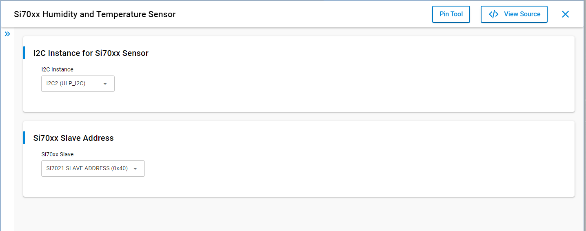
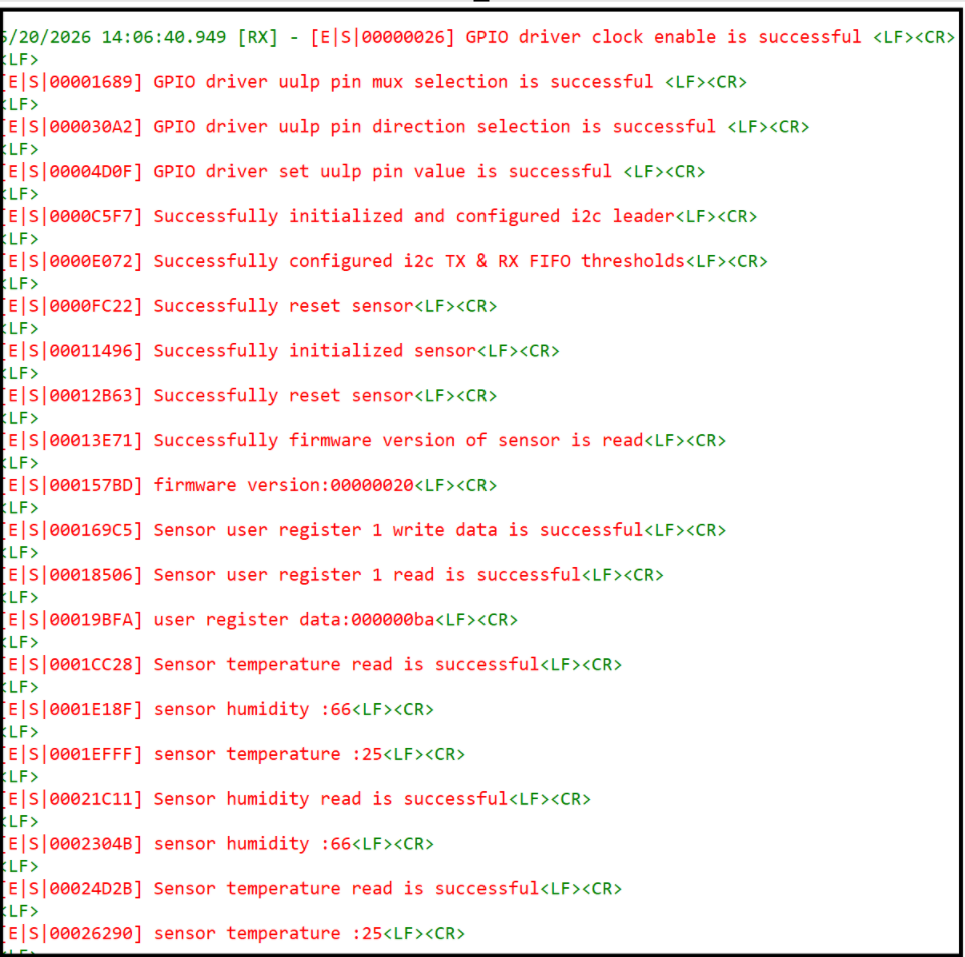
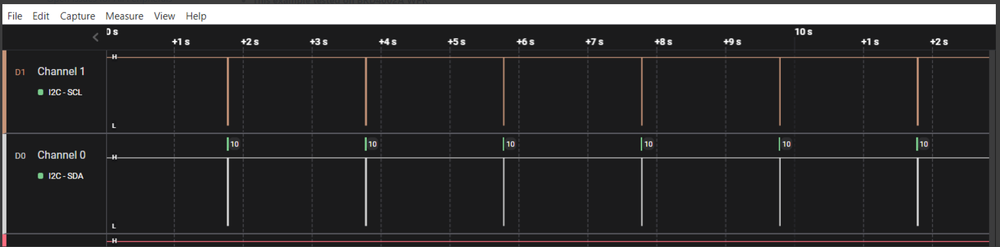

# SiWx91x Platform Si70xx

## Table of Contents

- [SiWx91x Platform Si70xx](#platform-siwx91x-si70xx)
  - [Table of Contents](#table-of-contents)
  - [Purpose/Scope](#purposescope)
  - [About Example Code](#about-example-code)
  - [Prerequisites/Setup Requirements](#prerequisitessetup-requirements)
    - [Hardware Requirements](#hardware-requirements)
    - [Software Requirements](#software-requirements)
    - [Setup Diagram](#setup-diagram)
  - [Getting Started](#getting-started)
  - [Application Build Environment](#application-build-environment)
    - [Pin Configuration](#pin-configuration)
  - [Test the Application](#test-the-application)
  - [Troubleshooting](#troubleshooting)
  - [Resources](#resources)
  - [Report Bugs/Support](#report-bugssupport)

## Purpose/Scope

This application demonstrate the si70xx RHT sensor, which measures the relative humidity and temperature via I2C interface for every 2 seconds.

## About Example Code

This example demonstrates the measurement of relative humidity and temperature for every 2 seconds. Also shows how to use different APIs present via I2C interface.

**Si70xx after reset:** The Si70xx needs 5–15 ms after a software or hardware reset before it responds on I2C (see datasheet). The driver performs a single I2C attempt (no retry). This example waits and retries `sl_si91x_si70xx_init()` for up to 15 ms after `sl_si91x_si70xx_reset()`. If you call init elsewhere (e.g. after your own reset), wait at least 15 ms before calling `sl_si91x_si70xx_init()` or `sl_si91x_si70xx_is_present()`.

## Prerequisites/Setup Requirements

### Hardware Requirements

- Windows PC
- Silicon Labs SiWx91x Evaluation Kit [[BRD4002](https://www.silabs.com/development-tools/wireless/wireless-pro-kit-mainboard?tab=overview) + [BRD4338A](https://www.silabs.com/development-tools/wireless/wi-fi/siwx917-rb4338a-wifi-6-bluetooth-le-soc-radio-board?tab=overview) / [BRD4342A](https://www.silabs.com/development-tools/wireless/wi-fi/siwx91x-rb4342a-wifi-6-bluetooth-le-soc-radio-board?tab=overview) / [BRD4343A](https://www.silabs.com/development-tools/wireless/wi-fi/siw917y-rb4343a-wi-fi-6-bluetooth-le-8mb-flash-radio-board-for-module?tab=overview) / [BRD4343C](https://www.silabs.com/development-tools/wireless/wi-fi/siw917y-rb4343c-wi-fi-6-bluetooth-le-8mb-flash-radio-board-for-module?tab=overview)]
- Kits
  - SiWx917 Development Kit [BRD2605A](https://www.silabs.com/development-tools/wireless/wi-fi/siwx917-dk2605a-wifi-6-bluetooth-le-soc-dev-kit?tab=overview)

### Software Requirements

- Simplicity Studio
- Serial console setup
  - For Serial Console setup instructions, refer to [link name](https://docs.silabs.com/wiseconnect/latest/wiseconnect-developers-guide-developing-for-silabs-hosts/using-the-simplicity-studio-ide#console-input-and-output).

### Setup Diagram

> 

## Getting Started

Refer to the instructions [here](https://docs.silabs.com/wiseconnect/latest/wiseconnect-getting-started/) to:

- [Install Simplicity Studio](https://docs.silabs.com/wiseconnect/latest/wiseconnect-developers-guide-developing-for-silabs-hosts/using-the-simplicity-studio-ide#install-simplicity-studio)
- [Install WiSeConnect extension](https://docs.silabs.com/wiseconnect/latest/wiseconnect-developers-guide-developing-for-silabs-hosts/using-the-simplicity-studio-ide#install-the-wiseconnect-3-extension)
- [Connect your device to the computer](https://docs.silabs.com/wiseconnect/latest/wiseconnect-developers-guide-developing-for-silabs-hosts/using-the-simplicity-studio-ide#connect-siwx91x-to-computer)
- [Upgrade your connectivity firmware](https://docs.silabs.com/wiseconnect/latest/wiseconnect-developers-guide-developing-for-silabs-hosts/using-the-simplicity-studio-ide#update-siwx91x-connectivity-firmware)
- [Create a Studio project](https://docs.silabs.com/wiseconnect/latest/wiseconnect-developers-guide-developing-for-silabs-hosts/using-the-simplicity-studio-ide#create-a-project)

For details on the project folder structure, see the [WiSeConnect Examples](https://docs.silabs.com/wiseconnect/latest/wiseconnect-examples/#example-folder-structure) page.

## Application Build Environment

- Configure the following macros in the [`si70xx_example.c`](si70xx_example.c) file and update/modify following macros, if required.

  - `I2C`: Specifies the I2C instance used for Si70xx communication; by default, it is set to `SI70XX_I2C_INSTANCE`.

    ```c
      #define I2C                           SI70XX_I2C_INSTANCE // I2C instance
    ```

  - `USER_REG_1`: Value written into the Si70xx user register 1. By default, it is set to 0xBA.

    ```c
      #define USER_REG_1                    0xBA                // writing data into user register
    ```

  - `DELAY_PERIODIC_MS1`: Periodic sleeptimer timeout in milliseconds used to pace sensor readings. By default, it is set to 2000 ms (2 seconds).

    ```c
      #define DELAY_PERIODIC_MS1            2000                // sleeptimer1 periodic timeout in ms
    ```

  - `SI70XX_POST_RESET_READY_MS`: Delay in milliseconds after a Si70xx reset before the device is considered ready on the I2C bus. By default, it is set to 15 ms.

    ```c
      #define SI70XX_POST_RESET_READY_MS    15                  // post-reset ready delay in ms
    ```

  - `SI70XX_INIT_RETRY_INTERVAL_MS`: Delay in milliseconds between consecutive `sl_si91x_si70xx_init()` retry attempts. By default, it is set to 1 ms.

    ```c
      #define SI70XX_INIT_RETRY_INTERVAL_MS 1                   // retry interval for init in ms
    ```

- `I2C instance`: Select I2C instance for communication through UC from the Si70xx Humidity and Temperature Sensor slcp component.
 By default I2C2 is selected.

   

### Pin Configuration

Tested on WPK Base board - 4002A and Radio board - BRD4338A.

| Description  | 917 GPIO  | Breakout pin |
| -------------| -----------| ----------|
| I2C_SDA      | ULP_GPIO_6 | EXP_16    |
| I2C_SCL      | ULP_GPIO_7 | EXP_15    |

>**Note:** Make sure the pin configurations are in the `RTE_Device_917.h` file:
>
> - SiWx917: RTE_Device_917.h (path: /$project/config/RTE_Device_917.h)

> **Note**: For recommended settings, please refer the [recommendations guide](https://docs.silabs.com/wiseconnect/latest/wiseconnect-developers-guide-prog-recommended-settings/).

## Test the Application

Refer to the instructions [here](https://docs.silabs.com/wiseconnect/latest/wiseconnect-getting-started/) to:

1. Compile and run the application.
2. When the application runs, it measures relative humidity and temperature for every 2 seconds.
3. Connect an oscilloscope to the Evaluation Kit board's ULP_GPIO_6(EXP16) / GPIO_6(EXP16) and ULP_GPIO_7(EXP15) / GPIO_7(EXP15) and observe the temperature and humidity data on I2C line.
4. After successful program execution, the prints in the serial console looks as shown below.

   

   

> **Note:**
>
> - Interrupt handlers are implemented in the driver layer, and user callbacks are provided for custom code. If you want to write your own interrupt handler instead of using the default one, make the driver interrupt handler a weak handler. Then, copy the necessary code from the driver handler to your custom interrupt handler.

## Troubleshooting

- If the project does not build, ensure Simplicity Studio and the WiSeConnect extension are installed and the board is connected.
- If the device is not detected, reinstall the connectivity firmware and check USB drivers.

## Resources

- [WiSeConnect Getting Started](https://docs.silabs.com/wiseconnect/latest/wiseconnect-getting-started/)
- [WiSeConnect Examples](https://docs.silabs.com/wiseconnect/latest/wiseconnect-examples/)
- [SiWx91x SoC Documentation](https://docs.silabs.com/wiseconnect/latest/)

## Report Bugs/Support

For issues and support, use the Silicon Labs Community or your normal support channel.

