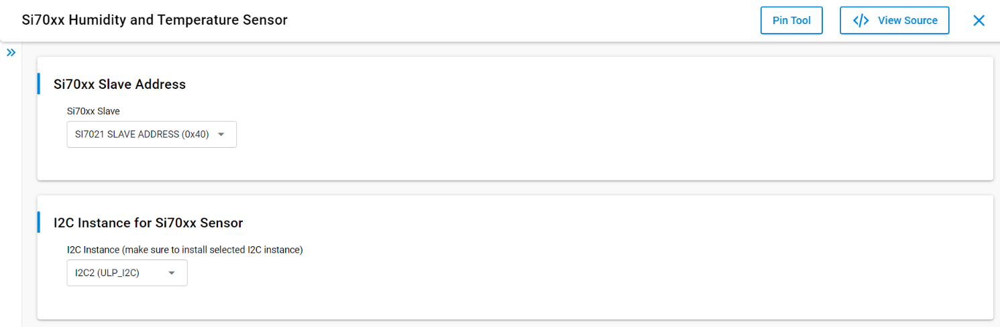

# SL SI70XX

## Table of Contents

- [SL SI70XX](#sl-si70xx)
  - [Table of Contents](#table-of-contents)
  - [Purpose/Scope](#purposescope)
  - [About Example Code](#about-example-code)
  - [Prerequisites/Setup Requirements](#prerequisitessetup-requirements)
    - [Hardware Requirements](#hardware-requirements)
    - [Software Requirements](#software-requirements)
    - [Setup Diagram](#setup-diagram)
  - [Getting Started](#getting-started)
  - [Application Build Environment](#application-build-environment)
    - [Pin Configuration](#pin-configuration)
  - [Test the Application](#test-the-application)

## Purpose/Scope

This application demonstrate the si70xx RHT sensor, which measures the relative humidity and temperature via I2C interface for every 2 seconds.

## About Example Code

This example demonstrates the measurement of relative humidity and temperature for every 2 seconds. Also shows how to use different APIs present via I2C interface.

## Prerequisites/Setup Requirements

### Hardware Requirements

- Windows PC
- Standalone
  - BRD4002A Wireless pro kit mainboard [SI-MB4002A]
  - Radio Boards
    - BRD4338A [SiWx917-RB4338A]
    - BRD4342A [SiWx917-RB4342A]
    - BRD4343A [SiWx917-RB4343A]
- Kits
  - SiWx917 Development Kit [ BRD2605A ]

### Software Requirements

- Simplicity Studio
- Serial console setup
  - For serial console setup instructions, refer [here](https://docs.silabs.com/wiseconnect/latest/wiseconnect-developers-guide-developing-for-silabs-hosts/#console-input-and-output).

### Setup Diagram

> 

## Getting Started

Refer to the instructions [here](https://docs.silabs.com/wiseconnect/latest/wiseconnect-getting-started/) to:

- [Install Simplicity Studio](https://docs.silabs.com/wiseconnect/latest/wiseconnect-developers-guide-developing-for-silabs-hosts/#install-simplicity-studio)
- [Install WiSeConnect 3 extension](https://docs.silabs.com/wiseconnect/latest/wiseconnect-developers-guide-developing-for-silabs-hosts/#install-the-wi-se-connect-3-extension)
- [Connect your device to the computer](https://docs.silabs.com/wiseconnect/latest/wiseconnect-developers-guide-developing-for-silabs-hosts/#connect-si-wx91x-to-computer)
- [Upgrade your connectivity firmware](https://docs.silabs.com/wiseconnect/latest/wiseconnect-developers-guide-developing-for-silabs-hosts/#update-si-wx91x-connectivity-firmware)
- [Create a Studio project](https://docs.silabs.com/wiseconnect/latest/wiseconnect-developers-guide-developing-for-silabs-hosts/#create-a-project)

For details on the project folder structure, see the [WiSeConnect Examples](https://docs.silabs.com/wiseconnect/latest/wiseconnect-examples/#example-folder-structure) page.

## Application Build Environment

- Configure the following macros in the [`si70xx_example.c`](https://github.com/SiliconLabs/wiseconnect/blob/master/examples/si91x_soc/peripheral/sl_si91x_si70xx/si70xx_example.c) file and update/modify following macros, if required.

- `I2C instance`: Select I2C instance for communication through UC from the Si70xx Humidity and Temperature Sensor slcp component.
 By default I2C2 is selected.

   

### Pin Configuration

Tested on WPK Base board - 4002A and Radio board - BRD4338A.

| Description  | 917 GPIO  | 915 GPIO  | Breakout pin |
| -------------| -----------| -----------| ----------|
| I2C_SDA      | ULP_GPIO_6 |   GPIO_6   | EXP_16    |
| I2C_SCL      | ULP_GPIO_7 |   GPIO_7   | EXP_15    |

>**Note:** Make sure the pin configurations are in the `RTE_Device_xxx.h` file:
>
> - SiWx917: RTE_Device_917.h (path: /$project/config/RTE_Device_917.h)
> - SiWx915: RTE_Device_915.h (path: /$project/config/RTE_Device_915.h)

> **Note**: For recommended settings, see the [recommendations guide](https://docs.silabs.com/wiseconnect/latest/wiseconnect-developers-guide-prog-recommended-settings/).

## Test the Application

Refer to the instructions [here](https://docs.silabs.com/wiseconnect/latest/wiseconnect-getting-started/) to:

1. Compile and run the application.
2. When the application runs, it measures relative humidity and temperature for every 2 seconds.
3. Connect an oscilloscope to the Evaluation Kit board's ULP_GPIO_6(EXP16) / GPIO_6(EXP16) and ULP_GPIO_7(EXP15) / GPIO_7(EXP15) and observe the temperature and humidity data on I2C line.
4. After successful program execution, the prints in the serial console looks as shown below.

   

   

> **Note:**
>
> - Interrupt handlers are implemented in the driver layer, and user callbacks are provided for custom code. If you want to write your own interrupt handler instead of using the default one, make the driver interrupt handler a weak handler. Then, copy the necessary code from the driver handler to your custom interrupt handler.
