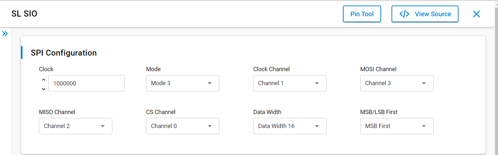
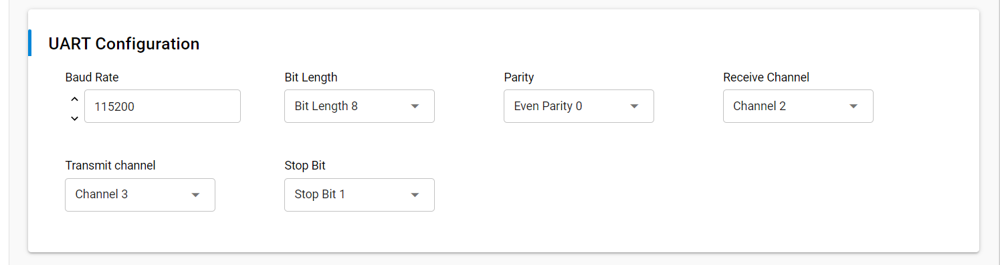
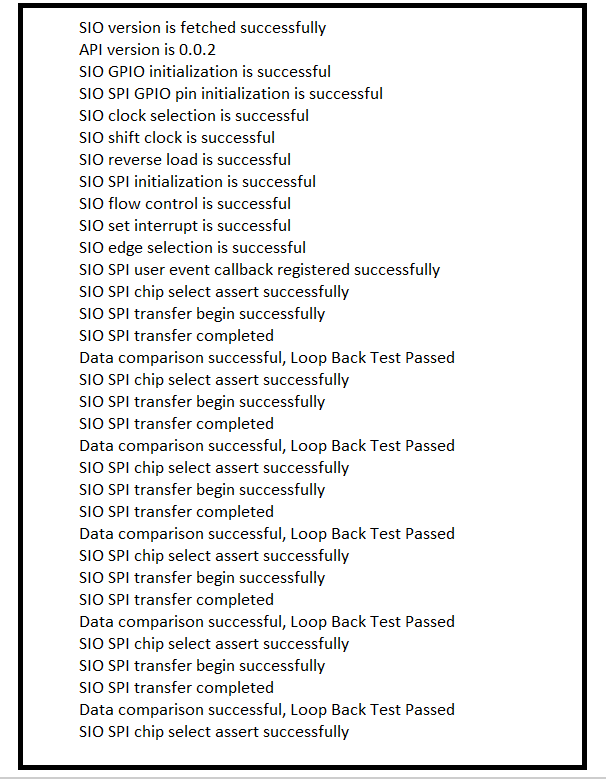

# SL SIO

## Table of Contents

- [Purpose/Scope](#purposescope)
- [Overview](#overview)
- [About Example Code](#about-example-code)
  - [SIO SPI functionality](#sio-spi-functionality)
  - [SIO UART functionality](#sio-uart-functionality)
- [Prerequisites/Setup Requirements](#prerequisitessetup-requirements)
  - [Hardware Requirements](#hardware-requirements)
  - [Software Requirements](#software-requirements)
  - [Setup Diagram](#setup-diagram)
- [Getting Started](#getting-started)
- [Application Build Environment](#application-build-environment)
  - [Application Configuration Parameters](#application-configuration-parameters)
  - [SIO SPI Pin Configuration](#sio-spi-pin-configuration)
  - [SIO UART Pin Configuration](#sio-uart-pin-configuration)
- [Test the Application](#test-the-application)

## Purpose/Scope

- This application demonstrate the SIO (Serial Input Output) for data transfer in SPI and UART.

## Overview

- It is a MCU HP peripheral, which is used to support a wide variety of SIO functionality.
- It can be used to implement Serial interfaces like UART, SPI protocols.
- Eight GPIOs support the SIO functionality.
- Support pattern matching based interrupt generation - the GPIO is monitored to compare against a pre-programmed bit pattern. The bit pattern can be between 1 and 32 bits.
- Generates interrupts on shift, swap (position counter reaching zero), pattern match (supported by 0,1st,2nd, 8th, 9th and 10th slices only), GPIO edge/level detection and underrun/overrun.
- Supports generation of interrupt for different events.
- Generates a shift clock from 14-bit shift counter.
- Clock used for shift operations can be internal counter clock or external clock coming in.
- Supports flow control mode in which operations and clock would be paused if data not available.
- Supports loading and reading of shift data in reverse order. This feature is required for peripherals which transmit/receive MSB first.

## About Example Code

### SIO SPI functionality

- This example demonstrates SIO SPI transfer of data between MOSI and MISO using API \ref sl_si91x_sio_spi_transfer.
- Various parameters SPI bit order, SPI clock, SPI clock channel, MOSI channel, MISO channel, SPI CS channel, bit length, SPI mode can be configured using UC. \ref pstcSpiConfig.
- sl_si91x_sio_config.h file contains the control configurations.
- In example code, firstly the output buffer is filled with some data which is to be transferred to the MISO.
- Firmware version of API is fetched using \ref sl_si91x_gspi_get_version which includes release version, major version and minor version \ref sl_sio_version_t.
- \ref sl_si91x_sio_init is used to initialize SIO.
- \ref sl_si91x_sio_spi_init is used to initialize the SIO SPI functionality, that includes SIO SPI configuration.
- After configuration, a callback register API is called to register the callback at the time of events \ref sl_si91x_sio_spi_register_event_callback.
- The current_mode is set to SL_SEND_DATA and calls the \ref sl_si91x_sio_spi_transfer API which expects structure of type \ref pstcSpiXfer, for sending and receiving data simultaneously.
- Before transfer has begin, chip select assert is to be done using \ref sl_si91x_sio_spi_cs_assert.
- This test is performed in loopback condition, i.e. connect MISO and MOSI pins.
- It waits till the transfer is completed.
- After transfer completion, chip select de-assert is to be done using \ref sl_si91x_sio_spi_cs_deassert.
- When the transfer complete event is generated, it compares the sent and received data.
- The result is printed on the console.

### SIO UART functionality

- This example demonstrates SIO UART send and receive data using API \ref sl_si91x_sio_uart_send, \ref sl_si91x_sio_uart_read.
- Various parameters UART baud rate, bit length, parity, receive channel selection, transmit channel selection, stop bits can be configured using UC. \ref UartInitstc.
- sl_si91x_sio_config.h file contains the control configurations.
- In example code, firstly the tx_buffer is filled with some data which is to be transferred to the uart receive.
- \ref sl_si91x_sio_init is used to initialize SIO.
- After configuration, a callback register API is called to register the callback at the time of events \ref sl_si91x_sio_uart_register_event_callback.
- \ref sl_si91x_sio_uart_init is used to initialize the SIO UART functionality, that includes SIO UART configuration.
- The current_mode is set to SL_SEND_DATA and calls the \ref sl_si91x_sio_uart_send API which expects tx_buffer (transmit buffer that needs to be sent) and number of bytes to send.
- Now the current_mode is set to the SL_RECEIVE_DATA and calls the \ref sl_si91x_sio_uart_read API which expects rx_buffer (empty buffer) and number of data bytes to be received.
- When the receive complete event is generated, it compares the sent and received data.
- The result is printed on the console.

## Prerequisites/Setup Requirements

Before running the application, the user will need the following things to setup.

### Hardware Requirements

- Windows PC
- Silicon Labs Si917 Evaluation Kit [WPK(BRD4002) + BRD4338A]

### Software Requirements

- Simplicity Studio
- Serial console Setup
  - The Serial Console setup instructions are provided below:
Refer [here](https://docs.silabs.com/wiseconnect/latest/wiseconnect-developers-guide-developing-for-silabs-hosts/#console-input-and-output)

### Setup Diagram

> 

## Getting Started

Refer to the instructions [here](https://docs.silabs.com/wiseconnect/latest/wiseconnect-getting-started/) to:

- Install Studio and WiSeConnect 3 extension
- Connect your device to the computer
- Upgrade your connectivity firmware
- Create a Studio project

For details on the project folder structure, see the [WiSeConnect Examples](https://docs.silabs.com/wiseconnect/latest/wiseconnect-examples/#example-folder-structure) page.

## Application Build Environment

### Application Configuration Parameters

- Configure UC from the slcp component.
- Open **sl_si91x_sio.slcp** project file select **software component** tab and search for **SIO** in search bar.
- Using configuration wizard, one can configure different parameters:

  - **General Configuration for SIO SPI**

    - Clock: SIO SPI Clock can be configured, between 9600 to 7372800.
    - Mode: SIO SPI mode can be configured, i.e. mode 0 and mode 3.
    - Clock Channel: SIO SPI clock channel can be configured, between channel 0 to channel 7.
    - MOSI Channel: SIO SPI MOSI channel can be configured, between channel 0 to channel 7.
    - MISO Channel: SIO SPI MISO channel can be configured, between channel 0 to channel 7.
    - CS Channel: SIO SPI CS channel can be configured, between channel 0 to channel 7.
    - Data Width: SIO SPI Data Width can be configured, i.e. Data Width 8 and Data Width 16.
    - MSB/LSB First: SIO SPI MSB/LSB first can be configured, i.e. MSB first/ LSB first.
    - Configure the UC as mentioned below.

      

  - **General Configuration for SIO UART**

    - Baud Rate: SIO UART baud rate can be configured, between 4800 to 128000.
    - Bit Length: SIO UART bit length can be configured, i.e. bit length 8 and bit length 9.
    - Parity: SIO UART parity can be configured, between odd parity and even parity.
    - Receive Channel: SIO UART rx channel can be configured, between channel 0 to channel 7.
    - Transmit Channel: SIO UART tx channel can be configured, between channel 0 to channel 7.
    - Stop Bit: SIO UART stop bit can be configured, between  stop bit 1 and stop bit 2.
    - Configure the UC as mentioned below.

      

- Configuration files are generated in **config folder**, if not changed then the code will run on default UC values.
- Configure the following macros in sio_example.h file and update/modify following macros if required. Please take care about gpio pin configurations, if different channels are being selected.

- `SIO-SPI Configuration parameters`: SIO SPI clock frequency anf bit length to be set.

  ```C
    #define SIO_SPI_CLK_FREQUENCY 1000000   // SIO-SPI 1Mhz clock frequency
    #define SIO_SPI_BIT_LEN       16        // SIO-SPI data length
  ```

- `SIO-UART Configuration parameters`: SIO UART baud rate to be set. By default it is 115200.

  ```C
    #define SIO_UART_BAUD_RATE  115200      // SIO-UART baud rate
  ```
  
### SIO SPI Pin Configuration

Tested on WPK Base board - 4002A and Radio board - BRD4338A.

| Description            | GPIO    | Connector    |
| -------------          | ------- | ------------ |
| SIO_SPI_MASTER_CS0_PIN | GPIO_6  |     P19      |
| SIO_SPI_MASTER_CLK_PIN | GPIO_7  |     P20      |
| SIO_SPI_MASTER_MISO_PIN| GPIO_27 |     P29      |
| SIO_SPI_MASTER_MOSI_PIN| GPIO_28 |     P31      |

### SIO UART Pin Configuration

| Description     | GPIO    | Connector    |
| -------------   | ------- | ------------ |
| SIO_UART_RX_PIN | GPIO_27 | P29          |
| SIO_UART_TX_PIN | GPIO_28 | P31          |

> **Note:** Make sure pin configuration in RTE_Device_917.h file.(path: /$project/config/RTE_Device_917.h)

## Test the Application

Refer to the instructions [here](https://docs.silabs.com/wiseconnect/latest/wiseconnect-getting-started/) to:

1. Compile and run the application.
2. By default SL_SIO_SPI instance is enabled.
3. Loopback GPIO-27 and GPIO-28 pins for SIO SPI data transfer.
4. When the application runs, SIO SPI transfer complete, loop back test passed prints are shown in console.
5. After successful program execution the prints in serial console looks as shown below.

   


> **Note:**
>
> - Interrupt handlers are implemented in the driver layer, and user callbacks are provided for custom code. If you want to write your own interrupt handler instead of using the default one, make the driver interrupt handler a weak handler. Then, copy the necessary code from the driver handler to your custom interrupt handler.
