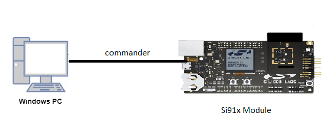

# SIO

## Introduction

- This application demonstrate the SIO (Serial Input Output) for data transfer in SPI, I2C and UART.
- Serial IO supports regular GPIO and enhanced serial stream processing features for 8/16 GPIO pins.

## Overview

- It is a MCU HP peripheral, which is used to support a wide variety of SIO functionality.
- It can be used to implement Serial interfaces like UART, I2C, SPI protocols.
- Eight GPIOs support the SIO functionality.
- Support pattern matching based interrupt generation - the GPIO is monitored to compare against a pre-programmed bit pattern. The bit pattern can be between 1 and 32 bits.
- Generates interrupts on shift, swap (position counter reaching zero), pattern match (supported by 0,1st,2nd, 8th, 9th and 10th slices only), GPIO edge/level detection and underun/overrun.
- Supports generation of interrupt for different events.
- Generates a shift clock from 14-bit shift counter.
- Clock used for shift operations can be internal counter clock or external clock coming in.
- Supports flow control mode in which operations and clock would be paused if data not available.
- Supports loading and reading of shift data in reverse order. This feature is required for peripherals which transmit/receive MSB first.

## About Example Code

## SIO SPI functionality

- This example demonstrates SIO SPI transfer of data between MOSI and MISO using API \ref sl_si91x_sio_spi_transfer.
- Various parameters SPI bit order, SPI clock, SPI clock channel, MOSI channel, MISO channel, SPI CS channel, bit length, SPI mode can be configured using UC. \ref pstcSpiConfig.
- sl_si91x_sio_config.h file contains the control configurations.
- In example code, firstly the output buffer is filled with some data which is to be transferred to the MISO.
- Firmware version of API is fetched using \ref sl_si91x_gspi_get_version which includes release version, major version and minor version \ref sl_sio_version_t.
- \ref sl_si91x_sio_init is used to initialize SIO.
- \ref sl_si91x_sio_spi_init is used to initialize the SIO SPI functionality, that includes SIO SPI configuration.
- After configuration, a callback register API is called to register the callback at the time of events \ref sl_si91x_sio_spi_register_event_callback.
- The current_mode is set to SL_SEND_DATA and calls the \ref sl_si91x_sio_spi_transfer API which expects structure of type \ref pstcSpiXfer, for sending and recieving data simultaneously.
- Before transfer has begin, chip select assert is to be done using \ref sl_si91x_sio_spi_cs_assert.
- This test is performed in loopback condition, i.e. connect MISO and MOSI pins.
- It waits till the transfer is completed.
- After transfer completion, chip select deassert is to be done using \ref sl_si91x_sio_spi_cs_deassert.
- When the transfer complete event is generated, it compares the sent and received data.
- The result is printed on the console.

## SIO UART functionality

- This example demonstrates SIO UART send and receive data using API \ref sl_si91x_sio_uart_send, \ref sl_si91x_sio_uart_read.
- Various parameters UART baud rate, bit length, parity, receive channel selection, transmit channel selection, stop bits can be configured using UC. \ref UartInitstc.
- sl_si91x_sio_config.h file contains the control configurations.
- In example code, firstly the tx_buffer is filled with some data which is to be transferred to the uart receive.
- \ref sl_si91x_sio_init is used to initialize SIO.
- After configuration, a callback register API is called to register the callback at the time of events \ref sl_si91x_sio_uart_register_event_callback.
- \ref sl_si91x_sio_uart_init is used to initialize the SIO UART functionality, that includes SIO UART configuration.
- The current_mode is set to SL_SEND_DATA and calls the \ref sl_si91x_sio_uart_send API which expects tx_buffer (transmit buffer that needs to be sent) and number of bytes to send.
- Now the current_mode is set to the SL_RECEIVE_DATA and calls the \ref sl_si91x_sio_uart_read API which expects rx_buffer (empty buffer) and number of data bytes to be received.
- When the receive complete event is generated, it compares the sent and received data.
- The result is printed on the console.

## SIO I2C functionality

- This example demonstrates SIO I2C transfer and read data using API \ref sl_si91x_sio_i2c_transfer, \ref sl_si91x_sio_i2c_read.
- Various parameters I2C baud rate, SCL channel, SDA channel can be configured using UC. \ref i2cConfig.
- sl_si91x_sio_config.h file contains the control configurations.
- In example code, firstly the tx_data is filled with some data which is to be transferred to the i2c receive.
- \ref sl_si91x_sio_init is used to initialize SIO.
- Generate I2C start using \ref sl_si91x_sio_i2c_generate_start.
- Transfer data using \ref sl_si91x_sio_i2c_transfer.
- Generate I2C stop using \ref sl_si91x_sio_i2c_generate_stop.

## Running Example Code

- To use this application following Hardware, Software and the Project Setup is required.

### Hardware Requirements

- Windows PC
- Silicon Labs [Si917 Evaluation Kit WPK/WSTK + BRD4325A]



### Software Requirements

- Si91x SDK
- Embedded Development Environment
  - For Silicon Labs Si91x, use the latest version of Simplicity Studio (refer **"Download and Install Simplicity Studio"** section in **getting-started-with-siwx917-soc** guide at **release_package/docs/index.html**)

## Project Setup

- **Silicon Labs Si91x** refer **"Download SDK"** section in **getting-started-with-siwx917-soc** guide at **release_package/docs/index.html** to work with Si91x and Simplicity Studio

## Loading Application on Simplicity Studio

1. With the product Si917 selected, navigate to the example projects by clicking on Example Projects & Demos
  in simplicity studio and click on to SIO Example application as shown below.


## Configuration and Steps for Execution

- Configure UC from the slcp component.
- Open **sl_si91x_sio.slcp** project file select **software component** tab and search for **SIO** in search bar.
- Using configuration wizard one can configure different parameters like:
  - **General Configuration for SIO SPI**
    - Clock: SIO SPI Clock can be configured, between 9600 to 7372800.
    - Mode: SIO SPI mode can be configured, i.e. mode 0 and mode 3.
    - Clock Channel: SIO SPI clock channel can be configured, between channel 0 to channel 7.
    - MOSI Channel: SIO SPI MOSI channel can be configured, between channel 0 to channel 7.
    - MISO Channel: SIO SPI MISO channel can be configured, between channel 0 to channel 7.
    - CS Channel: SIO SPI CS channel can be configured, between channel 0 to channel 7.
    - Data Width: SIO SPI Data Width can be configured, i.e. Data Width 8 and Data Width 16.
    - MSB/LSB First: SIO SPI MSB/LSB first can be configured, i.e. MSB first/ LSB first.

  - **General Configuration for SIO UART**
    - Baud Rate: SIO UART baud rate can be configured, between 4800 to 128000.
    - Bit Length: SIO UART bit length can be configured, i.e. bit length 8 and bit length 9.
    - Parity: SIO UART parity can be configured, between odd parity and even parity.
    - Receive Channel: SIO UART rx channel can be configured, between channel 0 to channel 7.
    - Transmit Channel: SIO UART tx channel can be configured, between channel 0 to channel 7.
    - Stop Bit: SIO UART stop bit can be configured, between  stop bit 1 and stop bit 2.

  - **General Configuration for SIO I2C**
    - Sample Rate: SIO I2C sample rate can be configured, between 100000 to 4000000.
    - SCL Channel: SIO I2C SCL Channel can be configured, between channel 0 to channel 7.
    - SDA Channel: SIO I2C SDA Channel can be configured, between channel 0 to channel 7.

- Configuration files are generated in **config folder**, if not changed then the code will run on default UC values.


- Configure the following macros in sio_example.h file and update/modify following macros if required. Please take care about gpio pin configurations, if different channels are being selected.

```C
// SIO-SPI Configuration parameters
#define SIO_SPI_CLK_FREQUENCY 1000000   // SIO-SPI 1Mhz clock frequency
#define SIO_SPI_BIT_LEN       16        // SIO-SPI data length

// SIO-UART Configuration parameters
#define SIO_UART_BAUD_RATE  115200      // SIO-UART baud rate

// SIO-I2C Configuration parameters
#define SIO_I2C_SAMPLE_RATE 100000      // SIO-I2C sample rate
#define SIO_SLAVE_ADDRESS   0x50        // SIO-I2C slave address
```

## Build

1. Compile the application in Simplicity Studio using build icon


## Device Programming

- To program the device ,refer **"Burn M4 Binary"** section in **getting-started-with-siwx917-soc** guide at **release_package/docs/index.html** to work with Si91x and Simplicity Studio

## SIO SPI Pin Configuration

Tested on WSTK Base board - 40002A and Radio boards - BRD4325A, BRD4325C.

| GPIO pin | Description |
| --- | --- |
| GPIO_6 [P14] | SIO_SPI_MASTER_CS0_PIN |
| GPIO_7 [P37] | SIO_SPI_MASTER_CLK_PIN |
| GPIO_27 [EXP_HEADER-10] | SIO_SPI_MASTER_MISO_PIN |
| GPIO_28 [EXP_HEADER-8] | SIO_SPI_MASTER_MOSI_PIN |

## SIO UART Pin Configuration

| GPIO pin  | Description |
| --- | --- |
| GPIO_27 [EXP_HEADER-10] | SIO_UART_RX_PIN |
| GPIO_28 [EXP_HEADER-8] | SIO_UART_TX_PIN |

## SIO I2C Pin Configuration

| GPIO pin | Description |
| --- | --- |
| GPIO_27 [EXP_HEADER-10] | SIO_I2C_SDA_PIN |
| GPIO_28 [EXP_HEADER-8] | SIO_I2C_SCL_PIN |

**Note!** Make sure pin configuration in RTE_Device_9117.h file.(path: /$project/wiseconnect3/components/siwx917_soc/drivers/cmsis_driver/config/RTE_Device_9117.h)

## Executing the Application

1. Compile and run the application.
2. By default SL_SIO_SPI instance is enabled.
3. Loopback GPIO-27 and GPIO-28 pins for SIO SPI data transfer.
4. When the application runs, it sends and receives data in loopback.

## Expected Results

- Console output of SIO SPI transfer complete, Loop back test passed.
- Console output of SIO UART send and receive complete, Loop back test passed.
