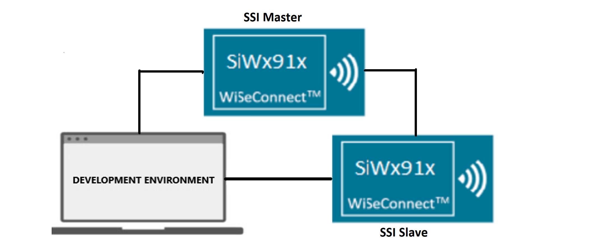
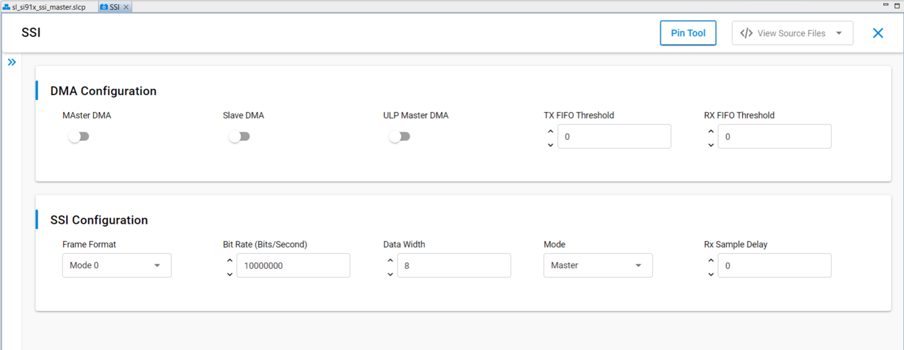
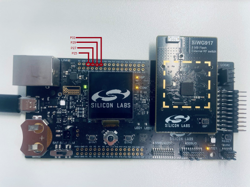
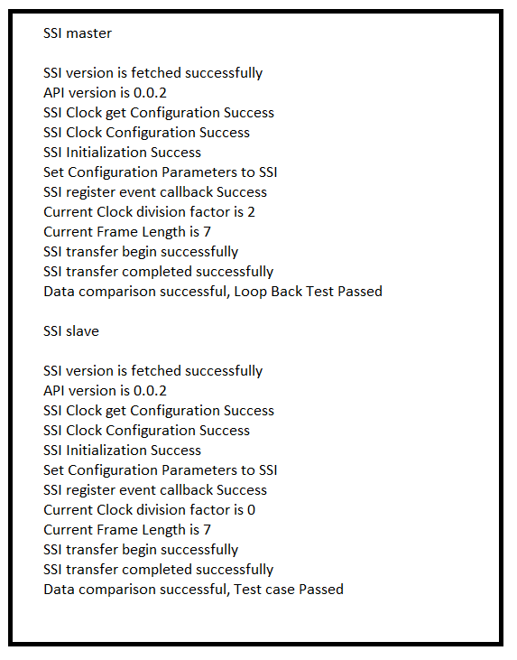

# SL SSI MASTER

## Table of Contents

- [Purpose/Scope](#purposescope)
- [Overview](#overview)
- [About Example Code](#about-example-code)
- [Prerequisites/Setup Requirements](#prerequisitessetup-requirements)
  - [Hardware Requirements](#hardware-requirements)
  - [Software Requirements](#software-requirements)
  - [Setup Diagram](#setup-diagram)
- [Getting Started](#getting-started)
- [Application Build Environment](#application-build-environment)
  - [Application Configuration Parameters](#application-configuration-parameters)
  - [Pin Configuration](#pin-configuration)
- [Test the Application](#test-the-application)

## Purpose/Scope

This application demonstrates the use of Synchronous Serial Interface (SSI) for data transfer in full duplex in master mode.

## Overview

- SSI is a synchronous, point-to-point, serial communication channel for digital data transmission.
- Synchronous data transmission is one in which the data is transmitted by synchronizing the transmission at the receiving and sending ends using a common clock signal.
- SSI is a synchronous four-wire interface consisting of two data pins (MOSI, MISO), a device select pin (CSN), and a gated clock pin(SCLK).
- With the two data pins, it allows for full-duplex operation with other SSI-compatible devices.
- It supports full-duplex, single-bit SPI master mode.
- It supports 6 modes:  
  - Mode 0: Clock Polarity is zero and Clock Phase is zero.
  - Mode 1: Clock Polarity is zero and Clock Phase is one.
  - Mode 2: Clock Polarity is one and Clock Phase is zero.
  - Mode 3: Clock Polarity is one and Clock Phase is one.
  - Mode-4: TEXAS_INSTRUMENTS SSI.
  - Mode-5: NATIONAL_SEMICONDUCTORS_MICROWIRE.
- The SPI clock is programmable to meet required baud rates.
- It can generates interrupts for different events like transfer complete, data lost, and mode fault.
- It supports up to 32K bytes of read data from a SSI device in a single read operation.
- It has support for DMA (Dynamic Memory Access).
- It can run in synchronous mode with full-duplex operation.
  - Master transmits data on MOSI pin and receives the same data on MISO pin.
- It also supports send and receive data with any SSI slave. Additionally, it also supports DMA and non-DMA transfer.
- For half-duplex communication (that is, send and receive), a master / slave connection is required.
- The SSI Master in MCU HP peripherals provides an option to connect up to four slaves and supports Single, Dual and Quad modes.

>**Note!** Make sure to use non-ROM SSI APIs for this application and SL_SSI driver.

## About Example Code

This example demonstrates SSI transfer (full=duplex communication) and SSI send/SSI receive (half-duplex communication).

- Various parameters like SSI clock mode, Bit-width, Manual cs pin, and SSI baud rate can be configured using the UC. Also, Master or Slave or ULP Master DMA can be configured using the UC.
- The `sl_si91x_ssi_config.h` file contains the control configurations, and `sl_si91x_ssi_common_config.h` contains DMA configuration selection.
- In the example code, first the output buffer is filled with some data which is transferred to the slave.
- The firmware version of API is fetched using \ref sl_si91x_ssi_get_version and includes the release version, major version, and minor version \ref sl_ssi_version_t.
- A static function is called to fill in the \ref sl_ssi_clock_config_t structure, which is passed in \ref sl_si91x_ssi_configure_clock API to configure the clock.
- \ref sl_si91x_ssi_init is used to initialize the peripheral, that includes pin configuration and it powers up the module.
- SSI instance must be passed in init to get the instance handle \ref sl_ssi_instance_t, which is used in other APIs.
- All the necessary parameters are configured using \ref sl_si91x_ssi_set_configuration API. It expects a structure with required parameters \ref sl_ssi_control_config_t.
- After configuration, a callback register API is called to register the callback at the time of events \ref sl_si91x_ssi_register_event_callback.
- The State machine code is implemented for transfer, send and receive data, the current mode is determined by ssi_mode_enum_t which is declared in `ssi_master_example.c file`.
- According to the macro which is enabled, the example code executes the transfer of data.
- Four serial slaves can be connected using this SSI master. For validation, you should change the slave number range from 0 to 3 in #line56 of the `ssi_master_example.c` file and should enable the respective macro (for example, M4_SSI_CS0 for slave 0) in the `RTE_Device_917.h` file. (path: /$project/config/RTE_Device_917.h)

>**Note:** The frequency of the SSI master bit-rate clock is one-half the frequency of SSI master input clock.
>
> The SOC_PLL_CLK macro present in the example file deals with SOC PLL clock frequency.
>
> #define SOC_PLL_CLK 20000000  // SOC PLL Clock frequency.

- If the **SSI_MASTER_TRANSFER** macro is enabled, it will transfer the data (that is, send and receive data in full-duplex mode).

  - The current_mode enum is set to SSI_MASTER_TRANSFER_DATA and calls the \ref sl_si91x_ssi_transfer_data API which expects data_out, data_in and number of data bytes to be transferred for sending and receiving data simultaneously (full duplex).
  - This test can also be performed in loopback state (that is, connect MISO and MOSI pins).
  - The example code waits until the transfer is completed. When the transfer complete event is generated, it compares the sent and received data. The result is printed on the console.
  - Now the current_mode enum is updated as per the macros enabled (either SSI_MASTER_SEND or SSI_MASTER_RECEIVE).
  - If no other macros are enabled, the current_mode is updated to SSI_MASTER_TRANSMISSION_COMPLETED.

- If the **SSI_MASTER_RECEIVE** macro is enabled, it only receives the data from slave. SPI slave must be connected; it cannot be tested in loopback mode.

  - The current_mode is set to the SSI_MASTER_RECEIVE_DATA and calls the \ref sl_si91x_ssi_receive_data API which expects data_in (empty buffer) and number of data bytes to be received.
  - It waits until the receive is completed (that is, until the transfer complete event is generated).
  - Now the current_mode enum is updated as per the macros enabled (SSI_MASTER_SEND).
  - If no other macros are enabled, the current_mode is updated to SSI_MASTER_TRANSMISSION_COMPLETED.

- If the **SSI_MASTER_SEND** macro is enabled, it only sends the data to slave. The SPI slave must be connected; it cannot be tested in loopback mode.
  - The current_mode enum is set to SSI_MASTER_SEND_DATA and calls the \ref sl_si91x_ssi_send_data API which expects data_out (data buffer that needs to be sent) and number of bytes to send.
  - It waits until the send is completed (that is, until the transfer complete event is generated).
  - Now the current_mode enum is updated to SSI_MASTER_TRANSMISSION_COMPLETED.

## Prerequisites/Setup Requirements

### Hardware Requirements

- Windows PC
- Silicon Labs Si917 Evaluation Kit [WPK(BRD4002) + BRD4338A / BRD4342A / BRD4343A ]
- SiWx917 AC1 Module Explorer Kit (BRD2708A)

### Software Requirements

- Simplicity Studio
- Serial console setup
  - For serial console setup instructions, refer [here](https://docs.silabs.com/wiseconnect/latest/wiseconnect-developers-guide-developing-for-silabs-hosts/#console-input-and-output).

### Setup Diagram



## Getting Started

Refer to the instructions [here](https://docs.silabs.com/wiseconnect/latest/wiseconnect-getting-started/) to:

- [Install Simplicity Studio](https://docs.silabs.com/wiseconnect/latest/wiseconnect-developers-guide-developing-for-silabs-hosts/#install-simplicity-studio)
- [Install WiSeConnect 3 extension](https://docs.silabs.com/wiseconnect/latest/wiseconnect-developers-guide-developing-for-silabs-hosts/#install-the-wi-se-connect-3-extension)
- [Connect your device to the computer](https://docs.silabs.com/wiseconnect/latest/wiseconnect-developers-guide-developing-for-silabs-hosts/#connect-si-wx91x-to-computer)
- [Upgrade your connectivity firmware](https://docs.silabs.com/wiseconnect/latest/wiseconnect-developers-guide-developing-for-silabs-hosts/#update-si-wx91x-connectivity-firmware)
- [Create a Studio project](https://docs.silabs.com/wiseconnect/latest/wiseconnect-developers-guide-developing-for-silabs-hosts/#create-a-project)

For details on the project folder structure, see the [WiSeConnect Examples](https://docs.silabs.com/wiseconnect/latest/wiseconnect-examples/#example-folder-structure) page.

## Application Build Environment

### Application Configuration Parameters

- Configure UC from the slcp component.
- Open the **sl_si91x_ssi_master.slcp** project file, select the **Software component** tab, and search for **SSI** in the search bar.
- You can use the configuration wizard to configure different parameters like:
  
   

  - **SSI Primary(Master) Configuration**
    - Frame Format: SSI Frame Format can be configured:
      - Mode 0: Clock Polarity is zero and Clock Phase is zero.
      - Mode 1: Clock Polarity is zero, Clock Phase is one.
      - Mode 2: Clock Polarity is one and Clock Phase is zero.
      - Mode 3: Clock Polarity is one and Clock Phase is one.
      - Mode-4: TEXAS_INSTRUMENTS SSI.
      - Mode-5: NATIONAL_SEMICONDUCTORS_MICROWIRE.
    - Bit Rate: The speed of transfer is configurable. The configuration range is from 500Kbps to 40Mbps in high-power mode.
    - Data Width: The size of data packet. The configuration range from 4 to 16.
    - Mode: SSI mode/instance can be configurable. It can be configured Primary.
    - Rx Sample Delay: Receive Data (rxd) Sample Delay. This to delay the sample of the rxd input signal. Each value represents a single SSI clock delay on the sample of the rxd signal. The configuration range is from 0 to 63.
  - **SSI Primary(Master) DMA Configuration**
    - Primary DMA: DMA enable for SSI Primary mode. It will interface with a DMA Controller using an optional set of DMA signals.
    - Tx FIFO Threshold: Transmit FIFO Threshold. It controls the level of entries (or below) at which the transmit FIFO controller triggers an interrupt. The configuration range from 0 to 15.
    - Rx FIFO Threshold: Receive FIFO Threshold. It controls the level of entries (or below) at which the receive FIFO controller triggers an interrupt. The configuration range from 0 to 15.
- Configuration files are generated in **config folder**. If the values are not changed, the code will run on default UC values.

- Configure the following macros in the `ssi_master_example.h` file and update/modify following macros, if required.

- `SSI_MASTER_TRANSFER`: This macro is enabled default. It sends and receives data in full=duplex.

  ```C
    #define SSI_MASTER_TRANSFER ENABLE    // To use the transfer API
  ```

- `SSI_MASTER_SEND (or) SSI_MASTER_RECEIVE`: If SSI_MASTER_RECEIVE or SSI_MASTER_SEND is enabled, the SSI slave will receive and send data in half-duplex respectively.

  ```C
    #define SSI_MASTER_SEND     DISABLE   // To use the send API
    #define SSI_MASTER_RECEIVE  DISABLE   // To use the receive API
  ```

- By default, an 8=bit unsigned integer is declared for data buffer. If using a data-width more than 8 bit, update the variable to a 16-bit unsigned integer.

  ```C
  // For data-width less than equal to 8
  static uint8_t ssi_master_tx_buffer[SSI_MASTER_BUFFER_SIZE] = { '\0' }; 
  static uint8_t ssi_master_rx_buffer[SSI_MASTER_BUFFER_SIZE] = { '\0' };
  // For data-width greater than 8
  static uint16_t ssi_master_tx_buffer[SSI_MASTER_BUFFER_SIZE] = { '\0' }; 
  static uint16_t ssi_master_rx_buffer[SSI_MASTER_BUFFER_SIZE] = { '\0' };
  ```

### Pin Configuration

| GPIO pin       | Explorer kit GPIO |  Description             |
| -------------- | ----------------- | ----------------------- |
|  GPIO_25 [P25] |   GPIO_25 [SCK]   | RTE_SSI_MASTER_SCK_PIN  |
|  GPIO_28 [P31] |   GPIO_28 [CS]    | RTE_SSI_MASTER_CS0_PIN  |
|  GPIO_26 [P27] |   GPIO_26 [MOSI]  | RTE_SSI_MASTER_MOSI_PIN |
|  GPIO_27 [P29] |   GPIO_27 [MISO]  | RTE_SSI_MASTER_MISO_PIN |



>**Note:** Make sure the following pin configurations are in the `RTE_Device_xxx.h` file:
>
> - SiWx917: RTE_Device_917.h (path: /$project/config/RTE_Device_917.h)
> - SiWx915: RTE_Device_915.h (path: /$project/config/RTE_Device_915.h)

## Test the Application

Refer to the instructions [here](https://docs.silabs.com/wiseconnect/latest/wiseconnect-getting-started/) to:

1. Compile and run the application.
2. Connect master SSI pins to slave SSI pins on WPK board.
3. First reset the slave board and then reset the master board. The time difference between these resets is expected up to 5 seconds.
4. Console output of successful configuration of clock, power mode, and SSI configuration.
5. Console output of SSI transfer complete, Loop back test passed.
6. In the case of loopback mode, when the loopback jumper wire is removed and the test is run, the result should come as data comparison fail and test case fail.
7. After successful program execution, the prints in serial console looks as shown below.

   

> **Note:**
>
> - Interrupt handlers are implemented in the driver layer, and user callbacks are provided for custom code. If you want to write your own interrupt handler instead of using the default one, make the driver interrupt handler a weak handler. Then, copy the necessary code from the driver handler to your custom interrupt handler.
