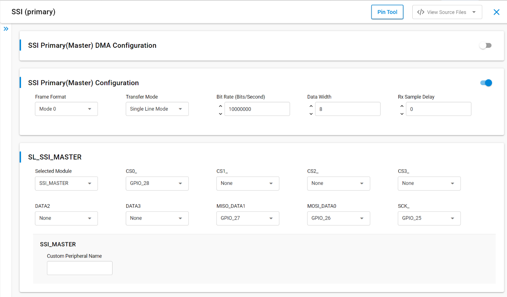
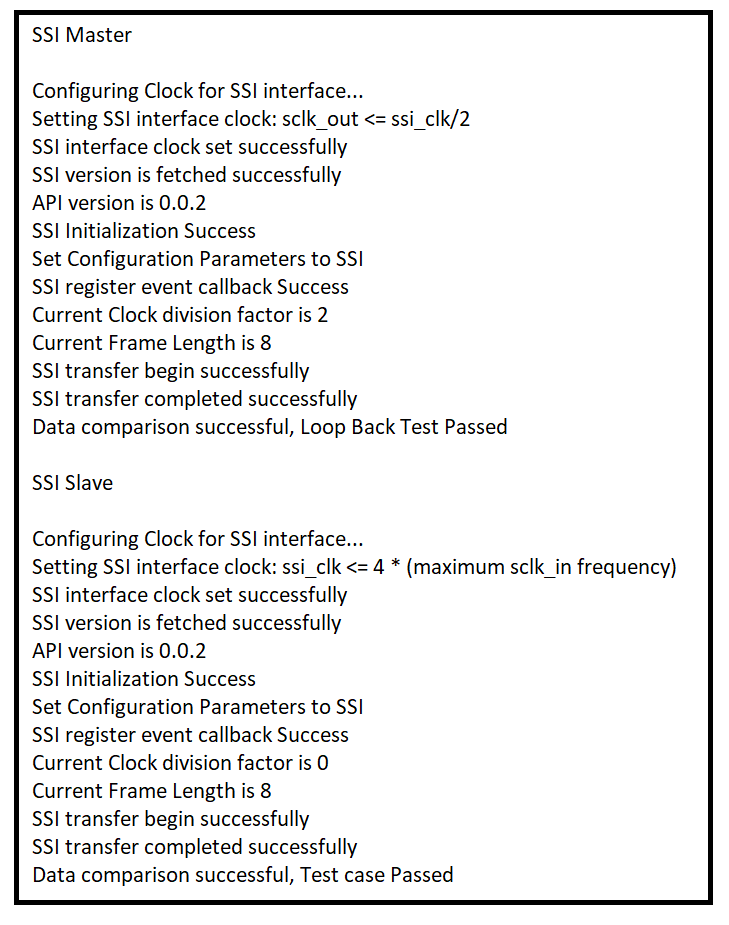

# SL SSI MASTER

## Table of Contents

- [Purpose/Scope](#purposescope)
- [Overview](#overview)
- [About Example Code](#about-example-code)
- [Prerequisites/Setup Requirements](#prerequisitessetup-requirements)
  - [Hardware Requirements](#hardware-requirements)
  - [Software Requirements](#software-requirements)
  - [Setup Diagram](#setup-diagram)
- [Getting Started](#getting-started)
- [Application Build Environment](#application-build-environment)
  - [Application Configuration Parameters](#application-configuration-parameters)
  - [Pin Configuration](#pin-configuration)
- [Test the Application](#test-the-application)

## Purpose/Scope

- This application demonstrates the use of SSI for data transfer in full duplex in master mode.

## Overview

- SSI (Synchronous Serial Interface) is a synchronous, point-to-point, serial communication channel for digital data transmission.
- Synchronous data transmission is one in which the data is transmitted by synchronizing the transmission at the receiving and sending ends using a common clock signal.
- SSI is a synchronous four-wire interface consisting of two data pins(MOSI, MISO), a device select pin (CSN) and a gated clock pin(SCLK).
- With the two data pins, it allows for full-duplex operation with other SSI compatible devices.
- It supports full duplex Single-bit SPI master mode.
- It supports 6 modes:  
  - Mode 0: Clock Polarity is zero and Clock Phase is zero.
  - Mode 1: Clock Polarity is zero, Clock Phase is one.
  - Mode 2: Clock Polarity is one and Clock Phase is zero.
  - Mode 3: Clock Polarity is one and Clock Phase is one.
  - Mode-4: TEXAS_INSTRUMENTS SSI.
  - Mode-5: NATIONAL_SEMICONDUCTORS_MICROWIRE.
- The SPI clock is programmable to meet required baud rates
- It can generates interrupts for different events like transfer complete, data lost, mode fault.
- It supports up to 32K bytes of read data from a SSI device in a single read operation.
- It has support for DMA (Dynamic Memory Access).
- It can run in synchronous mode with full-duplex operation
  - Master transmits data on MOSI pin and receives the same data on MISO pin
- It also supports send and receive data with any SSI slave, additionally it also supports DMA and non-DMA transfer.
- For half duplex communication, i.e., send and receive, master / slave connection is required.
- The SSI Master in MCU HP peripherals provides an option to connect up to four slaves and supports Single, Dual and Quad modes.

## About Example Code

- This example demonstrates SSI transfer i.e., full duplex communication and SSI send, SSI receive i.e., half duplex communication.
- Various parameters like SSI clock mode, bit-width, manual cs pin and SSI baud rate can be configured using UC. Also, Master or Slave or ULP Master DMA can be configured using UC.
- sl_si91x_ssi_config.h file contains the control configurations and sl_si91x_ssi_common_config.h contains DMA configuration selection.
- In the example code, first the output buffer is filled with some data which is transferred to the slave.
- Firmware version of API is fetched using \ref sl_si91x_ssi_get_version which includes release version, major version and minor version \ref sl_ssi_version_t.
- A static function is called to fill in the \ref sl_ssi_clock_config_t structure, which is passed in \ref sl_si91x_ssi_configure_clock API to configure the clock.
- \ref sl_si91x_ssi_init is used to initialize the peripheral, that includes pin configuration and it powers up the module.
- SSI instance must be passed in init to get the instance handle \ref sl_ssi_instance_t, which is used in other APIs.
- All the necessary parameters are configured using \ref sl_si91x_ssi_set_configuration API, it expects a structure with required parameters \ref sl_ssi_control_config_t.
- After configuration, a callback register API is called to register the callback at the time of events \ref sl_si91x_ssi_register_event_callback.
- The State machine code is implemented for transfer, send and receive data, the current mode is determined by ssi_mode_enum_t which is declared in ssi_master_example.c file.
- According to the macro which is enabled, the example code executes the transfer of data.
- Four serial slave can be connected using this SSI master. For validation should change the slave number range from 0 to 3 #line56 in ssi_master_example.c file, and should enable the respective macro (ex: M4_SSI_CS0 for slave 0) in RTE_Device_917.h file. (path: /$project/config/RTE_Device_917.h)

>**Note:** The frequency of the SSI master bit-rate clock is one-half the frequency of SSI master input clock.
>
> The SOC_PLL_CLK macro present in example file deals with SOC PLL clock frequency.
>
> #define SOC_PLL_CLK 20000000  // SOC PLL Clock frequency.

- If **SSI_MASTER_TRANSFER** macro is enabled, it will transfer the data, i.e. send and receive data in full duplex mode.

  - The current_mode enum is set to SSI_MASTER_TRANSFER_DATA and calls the \ref sl_si91x_ssi_transfer_data API which expects data_out, data_in and number of data bytes to be transferred for sending and receiving data simultaneously (full duplex).
  - This test can also be performed in loopback state, i.e. connect MISO and MOSI pins.
  - The example code waits till the transfer is completed, when the transfer complete event is generated, it compares the sent and received data.
  - The result is printed on the console.
  - Now the current_mode enum is updated as per the macros enabled i.e., either SSI_MASTER_SEND or SSI_MASTER_RECEIVE.
  - If no other macros are enabled, the current_mode is updated to SSI_MASTER_TRANSMISSION_COMPLETED.

- If **SSI_MASTER_RECEIVE** macro is enabled, it only receives the data from slave - SPI slave must be connected, it cannot be tested in loopback mode.

  - The current_mode is set to the SSI_MASTER_RECEIVE_DATA and calls the \ref sl_si91x_ssi_receive_data API which expects data_in (empty buffer) and number of data bytes to be received.
  - It waits till the receive is completed i.e., transfer complete event is generated.
  - Now the current_mode enum is updated as per the macros enabled i.e., SSI_MASTER_SEND.
  - If no other macros are enabled, the current_mode is updated to SSI_MASTER_TRANSMISSION_COMPLETED.

- If **SSI_MASTER_SEND** macro is enabled, it only sends the data to slave, SPI slave must be connected, it cannot be tested in loopback mode.
  - The current_mode enum is set to SSI_MASTER_SEND_DATA and calls the \ref sl_si91x_ssi_send_data API which expects data_out (data buffer that needs to be sent) and number of bytes to send.
  - It waits till the send is completed i.e., transfer complete event is generated.
  - Now the current_mode enum is updated to SSI_MASTER_TRANSMISSION_COMPLETED.

## Prerequisites/Setup Requirements

### Hardware Requirements

- Windows PC
- Silicon Labs Si917 Evaluation Kit [WPK(BRD4002) + BRD4338A]

### Software Requirements

- Simplicity Studio
- Serial console Setup
  - The Serial Console setup instructions are provided below:
Refer [here](https://docs.silabs.com/wiseconnect/latest/wiseconnect-getting-started/getting-started-with-soc-mode#perform-console-output-and-input-for-brd4338-a).

### Setup Diagram

> 

## Getting Started

Refer to the instructions [here](https://docs.silabs.com/wiseconnect/latest/wiseconnect-getting-started/) to:

- Install Studio and WiSeConnect 3 extension
- Connect your device to the computer
- Upgrade your connectivity firmware
- Create a Studio project

## Application Build Environment

### Application Configuration Parameters

- Configure UC from the slcp component.
- Open **sl_si91x_ssi_master.slcp** project file select **software component** tab and search for **SSI** in search bar.
- Using configuration wizard one can configure different parameters like:
  
   

  - **SSI Configuration**
    - Frame Format: SSI Frame Format can be configured, i.e.,
      - Mode 0: Clock Polarity is zero and Clock Phase is zero.
      - Mode 1: Clock Polarity is zero, Clock Phase is one.
      - Mode 2: Clock Polarity is one and Clock Phase is zero.
      - Mode 3: Clock Polarity is one and Clock Phase is one.
      - Mode-4: TEXAS_INSTRUMENTS SSI.
      - Mode-5: NATIONAL_SEMICONDUCTORS_MICROWIRE.
    - Bit Rate: The speed of transfer is configurable. The configuration range is from 500Kbps to 40Mbps in high power mode.
    - Data Width: The size of data packet. The configuration range from 4 to 16.
    - Mode: SSI mode/instance can be configurable, it can be configured Master/SLave/ULP Master.
    - Rx Sample Delay: Receive Data (rxd) Sample Delay, this to delay the sample of the rxd input signal. Each value represents a single SSI clock delay on the sample of the rxd signal. the configuration range from 0 to 63.
  - **DMA Configuration**
    - Master DMA: DMA enable for SSI master mode. it will interface with a DMA Controller using an optional set of DMA signals.
    - Slave DMA: DMA enable for SSI slave mode. it will interface with a DMA Controller using an optional set of DMA signals.
    - ULP Master DMA: DMA enable for ULP SSI master mode. it will interface with a DMA Controller using an optional set of DMA signals.
    - Tx FIFO Threshold: Transmit FIFO Threshold. Controls the level of entries (or below) at which the transmit FIFO controller triggers an interrupt. The configuration range from 0 to 15.
    - Rx FIFO Threshold: Receive FIFO Threshold. Controls the level of entries (or below) at which the receive FIFO controller triggers an interrupt. The configuration range from 0 to 15.
- Configuration files are generated in **config folder**, if not changed then the code will run on default UC values.

- Configure the following macros in ssi_master_example.h file and update/modify following macros if required.

- `SSI_MASTER_TRANSFER`: This macro is enabled default, it sends and receives data in full duplex.

  ```C
    #define SSI_MASTER_TRANSFER ENABLE    // To use the transfer API
  ```

- `SSI_MASTER_SEND (or) SSI_MASTER_RECEIVE`: If SSI_MASTER_RECEIVE (or) SSI_MASTER_SEND is enabled, SSI slave will receive and send data in half duplex respectively.

  ```C
    #define SSI_MASTER_SEND     DISABLE   // To use the send API
    #define SSI_MASTER_RECEIVE  DISABLE   // To use the receive API
  ```

- By default 8 bit unsigned integer is declared for data buffer. If using data-width more than 8 bit, update the variable to 16 bit unsigned integer.
  ```C
  // For data-width less than equal to 8
  static uint8_t ssi_master_tx_buffer[SSI_MASTER_BUFFER_SIZE] = { '\0' }; 
  static uint8_t ssi_master_rx_buffer[SSI_MASTER_BUFFER_SIZE] = { '\0' };
  // For data-width greater than 8
  static uint16_t ssi_master_tx_buffer[SSI_MASTER_BUFFER_SIZE] = { '\0' }; 
  static uint16_t ssi_master_rx_buffer[SSI_MASTER_BUFFER_SIZE] = { '\0' };
  ```

### Pin Configuration

| GPIO pin       | Description             |
| -------------- | ----------------------- |
|  GPIO_25 [P25] | RTE_SSI_MASTER_SCK_PIN  |
|  GPIO_28 [P31] | RTE_SSI_MASTER_CS0_PIN  |
|  GPIO_26 [P27] | RTE_SSI_MASTER_MOSI_PIN |
|  GPIO_27 [P29] | RTE_SSI_MASTER_MISO_PIN |


>**Note:** Make sure pin configuration in RTE_Device_917.h file. (path: /$project/config/RTE_Device_917.h)

## Test the Application

Refer to the instructions [here](https://docs.silabs.com/wiseconnect/latest/wiseconnect-getting-started/) to:

1. Compile and run the application.
2. Connect master ssi pins to slave ssi pins on WPK board.
3. First reset the slave board and then reset the master board. The time difference between these resets is expected upto 5 seconds. 
4. Console output of successful configuration of clock, power mode and SSI configuration.
5. Console output of SSI transfer complete, Loop back test passed.
6. In the case of loopback mode, when the loopback jumper wire is removed and the test is run - the result should come as data comparison fail and test case fail.
7. After successful program execution the prints in serial console looks as shown below.

   > 
