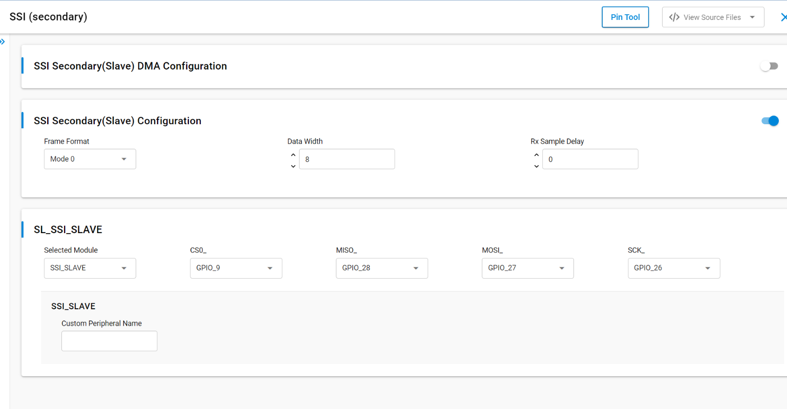
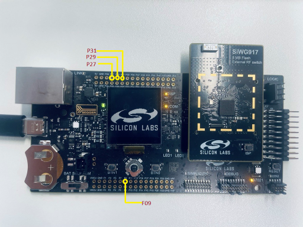
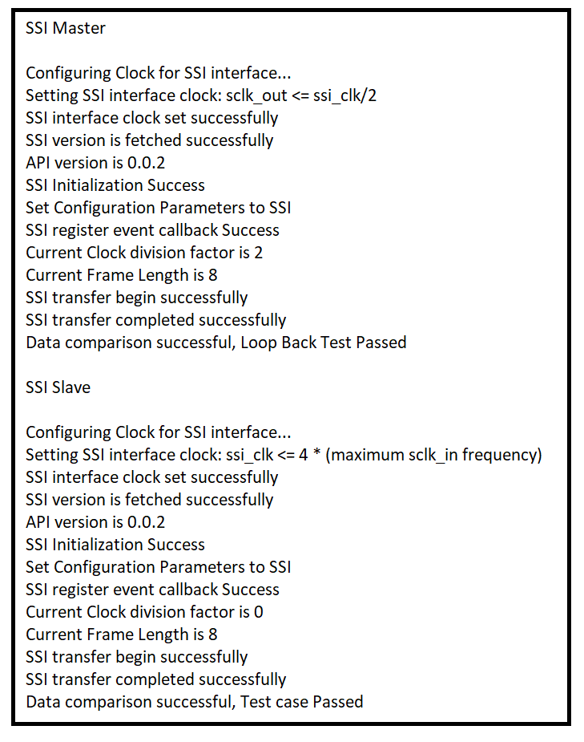

# SL SSI SLAVE

## Table of Contents

- [Purpose/Scope](#purposescope)
- [Overview](#overview)
- [About Example Code](#about-example-code)
- [Prerequisites/Setup Requirements](#prerequisitessetup-requirements)
  - [Hardware Requirements](#hardware-requirements)
  - [Software Requirements](#software-requirements)
  - [Setup Diagram](#setup-diagram)
- [Getting Started](#getting-started)
- [Application Build Environment](#application-build-environment)
  - [Application Configuration Parameters](#application-configuration-parameters)
  - [Pin Configuration](#pin-configuration)
- [Test the Application](#test-the-application)

## Purpose/Scope

This application demonstrates the use of Synchronous Serial Interface (SSI) for data transfer in full duplex in slave mode.

## Overview

- SSI  is a synchronous, point-to-point, serial communication channel for digital data transmission.
- Synchronous data transmission is one in which the data is transmitted by synchronizing the transmission at the receiving and sending ends using a common clock signal.
- SSI is a synchronous four-wire interface consisting of two data pins(MOSI, MISO), a device select pin (CSN) and a gated clock pin(SCLK).
- With the two data pins, it allows for full-duplex operation with other SSI compatible devices.
- It supports a full-duplex, single-bit SPI master mode.
- It supports 6 modes:  
  - Mode 0: Clock Polarity is zero and Clock Phase is zero.
  - Mode 1: Clock Polarity is zero, Clock Phase is one.
  - Mode 2: Clock Polarity is one and Clock Phase is zero.
  - Mode 3: Clock Polarity is one and Clock Phase is one.
  - Mode-4: TEXAS_INSTRUMENTS SSI.
  - Mode-5: NATIONAL_SEMICONDUCTORS_MICROWIRE.
- The SPI clock is programmable to meet required baud rates.
- It can generate interrupts for different events like transfer complete, data lost, and mode fault.
- It supports up to 32K bytes of read data from an SSI device in a single read operation.
- It has support for DMA (Dynamic Memory Access).
- It can run in synchronous mode with full-duplex operation.
  - Master transmits data on MOSI pin and receives the same data on MISO pin
- It also supports send and receives data with any SSI slave. Additionally, it also supports DMA and non-DMA transfer.
- For half-duplex communication (that is, send and receive), a master / slave connection is required.

>**Note!** Make sure to use non-ROM SSI APIs for this application and SL_SSI driver.

## About Example Code

- This example demonstrates SSI transfer (that is, full-duplex communication) and SSI send/SSI receive (that is, half-duplex communication).
- Various parameters like SSI clock mode, Bit-width, Manual cs pin, and SSI baud rate can be configured using the UC. Also, Master or Slave or ULP Master DMA can be configured using UC.
- The `sl_si91x_ssi_config.h` file contains the control configurations and `sl_si91x_ssi_common_config.h` contains DMA configuration selection.
- In the example code, first the output buffer is filled with some data which is transferred to the slave.
- The firmware version of API is fetched using \ref sl_si91x_ssi_get_version which includes the release version, major version, and minor version \ref sl_ssi_version_t.
- A static function is called to fill in the \ref sl_ssi_clock_config_t structure, which is passed in \ref sl_si91x_ssi_configure_clock API to configure the clock.
- \ref sl_si91x_ssi_init is used to initialize the peripheral, that includes pin configuration and it powers up the module.
- SSI instance must be passed in init to get the instance handle \ref sl_ssi_instance_t, which is used in other APIs.
- After initialization, \ref sl_si91x_ssi_configure_power_mode is called to set the power mode \ref sl_ssi_power_state_t.
- All the necessary parameters are configured using \ref sl_si91x_ssi_set_configuration API. It expects a structure with required parameters
  \ref sl_ssi_control_config_t.
- After configuration, a callback register API is called to register the callback at the time of events \ref sl_si91x_ssi_register_event_callback.
- The State machine code is implemented for transfer, send and receive data, and the current mode is determined by ssi_mode_enum_t which is declared in `ssi_slave_example.c file`.
- According to the macro which is enabled, the example code executes the transfer of data:

- If the **SSI_SLAVE_TRANSFER** macro is enabled, it will transfer the data (that is, send and receive data) in full-duplex mode.

  - The current_mode enum is set to SSI_SLAVE_TRANSFER_DATA and calls the \ref sl_si91x_ssi_transfer_data API which expects data_out, data_in and number of data bytes to be transferred for sending and receiving data simultaneously (full duplex).
  - This test can also be performed in loopback state (that is, connect MISO and MOSI pins).
  - The example code waits until the transfer is completed. When the transfer complete event is generated, it compares the sent and received data.
  - The result is printed on the console.
  - Now the current_mode enum is updated as per the macros enabled (either SSI_SLAVE_SEND or SSI_SLAVE_RECEIVE).
  - If no other macros are enabled, the current_mode is updated to SSI_SLAVE_TRANSMISSION_COMPLETED.

- If the **SSI_SLAVE_SEND** macro is enabled, it only sends the data to slave. The SPI slave must be connected; it cannot be tested in loopback mode.

  - The current_mode enum is set to SSI_SLAVE_SEND_DATA and calls the \ref sl_si91x_ssi_send_data API which expects data_out (data buffer that needs to be sent) and number of bytes to send.
  - It waits until the send is completed (that is, until the transfer complete event is generated).
  - Now the current_mode enum is updated to SSI_SLAVE_TRANSMISSION_COMPLETED.

- If the **SSI_SLAVE_RECEIVE** macro is enabled, it only receives the data from slave. The SPI slave must be connected; it cannot be tested in loopback mode.
  - The current_mode is set to the SSI_SLAVE_RECEIVE_DATA and calls the \ref sl_si91x_ssi_receive_data API, which expects data_in (empty buffer) and number of data bytes to be received.
  - It waits until the receive is completed (that is, until the transfer complete event is generated).
  - Now the current_mode enum is updated as per the macros enabled (SSI_SLAVE_SEND).
  - If no other macros are enabled, the current_mode is updated to SSI_SLAVE_TRANSMISSION_COMPLETED.

## Prerequisites/Setup Requirements

### Hardware Requirements

- Windows PC
- Silicon Labs Si917 Evaluation Kit [WPK(BRD4002) + BRD4338A / BRD4342A / BRD4343A ]
- SiWx917 AC1 Module Explorer Kit (BRD2708A)

### Software Requirements

- Simplicity Studio
- Serial console setup
  - For serial console setup instructions, refer [here](https://docs.silabs.com/wiseconnect/latest/wiseconnect-developers-guide-developing-for-silabs-hosts/#console-input-and-output).

### Setup Diagram

> 

## Getting Started

Refer to the instructions [here](https://docs.silabs.com/wiseconnect/latest/wiseconnect-getting-started/) to:

- [Install Simplicity Studio](https://docs.silabs.com/wiseconnect/latest/wiseconnect-developers-guide-developing-for-silabs-hosts/#install-simplicity-studio)
- [Install WiSeConnect 3 extension](https://docs.silabs.com/wiseconnect/latest/wiseconnect-developers-guide-developing-for-silabs-hosts/#install-the-wi-se-connect-3-extension)
- [Connect your device to the computer](https://docs.silabs.com/wiseconnect/latest/wiseconnect-developers-guide-developing-for-silabs-hosts/#connect-si-wx91x-to-computer)
- [Upgrade your connectivity firmware](https://docs.silabs.com/wiseconnect/latest/wiseconnect-developers-guide-developing-for-silabs-hosts/#update-si-wx91x-connectivity-firmware)
- [Create a Studio project](https://docs.silabs.com/wiseconnect/latest/wiseconnect-developers-guide-developing-for-silabs-hosts/#create-a-project)

For details on the project folder structure, see the [WiSeConnect Examples](https://docs.silabs.com/wiseconnect/latest/wiseconnect-examples/#example-folder-structure) page.

## Application Build Environment

### Application Configuration Parameters

- Configure UC from the slcp component.
- Open the **sl_si91x_ssi_slave.slcp** project file, select the **Software Component** tab, and search for **SSI** in the search bar.
- You can use the configuration wizard to configure different parameters like:

   

  - **SSI Secondary(Slave) Configuration**
    - Frame Format: SSI Frame Format can be configured:
      - Mode 0: Clock Polarity is zero and Clock Phase is zero.
      - Mode 1: Clock Polarity is zero, Clock Phase is one.
      - Mode 2: Clock Polarity is one and Clock Phase is zero.
      - Mode 3: Clock Polarity is one and Clock Phase is one.
      - Mode-4: TEXAS_INSTRUMENTS SSI.
      - Mode-5: NATIONAL_SEMICONDUCTORS_MICROWIRE.
    - Bit Rate: The speed of transfer is configurable. The configuration range is from 500Kbps to 40Mbps in high-power mode.
    - Data Width: The size of data packet. The configuration range from 4 to 16.
    - Mode: SSI mode/instance can be configurable. It can be configured Secondary.
    - Rx Sample Delay: Receive Data (rxd) Sample Delay. This to delay the sample of the rxd input signal. Each value represents a single SSI clock delay on the sample of the rxd signal. The configuration range from 0 to 63.
  - **SSI Secondary(Slave) DMA Configuration**
    - Secondary DMA: DMA enable for SSI Secondary mode. it will interface with a DMA Controller using an optional set of DMA signals.
    - Tx FIFO Threshold: Transmit FIFO Threshold. Controls the level of entries (or below) at which the transmit FIFO controller triggers an interrupt. The configuration range from 0 to 15.
    - Rx FIFO Threshold: Receive FIFO Threshold. Controls the level of entries (or below) at which the receive FIFO controller triggers an interrupt. The configuration range from 0 to 15.
- Configuration files are generated in the **config folder**. If the configurations are not changed, the code will run on default UC values.

- Configure the following macros in the `ssi_slave_example.h` file and update/modify following macros, if required.

- `SSI_SLAVE_TRANSFER`: This macro is enabled by default. It sends and receives data in full duplex.

  ```C
    #define SSI_SLAVE_TRANSFER ENABLE    // To use the transfer API
  ```

- `SSI_SLAVE_SEND (or) SSI_SLAVE_RECEIVE`: If SSI_SLAVE_RECEIVE or SSI_SLAVE_SEND is enabled, the SSI slave will receive and send data in half duplex respectively.

  ```C
    #define SSI_SLAVE_SEND     DISABLE   // To use the send API
    #define SSI_SLAVE_RECEIVE  DISABLE   // To use the receive API
  ```

- By default, an 8-bit unsigned integer is declared for the data buffer. If using data-width more than 8 bit, update the variable to 16-bit unsigned integer.

  ```C
  // For data-width less than equal to 8
  static uint8_t ssi_slave_tx_buffer[SSI_SLAVE_BUFFER_SIZE] = { '\0' }; 
  static uint8_t ssi_slave_rx_buffer[SSI_SLAVE_BUFFER_SIZE] = { '\0' };
  // For data-width greater than 8
  static uint16_t ssi_slave_tx_buffer[SSI_SLAVE_BUFFER_SIZE] = { '\0' }; 
  static uint16_t ssi_slave_rx_buffer[SSI_SLAVE_BUFFER_SIZE] = { '\0' };
  ```

### Pin Configuration

#### Pin Configuration of the WPK[BRD4002A] Base Board, and with BRD4338A radio board

| GPIO pin      | Description             |
| ------------- | ----------------------- |
| GPIO_26 [P27] | RTE_SSI_SLAVE_SCK_PIN   |
| GPIO_9  [F09] | RTE_SSI_SLAVE_CS_PIN    |
| GPIO_27 [P29] | RTE_SSI_SLAVE_MOSI_PIN  |
| GPIO_28 [P31] | RTE_SSI_SLAVE_MISO_PIN  |



#### Pin Configuration of the WPK[BRD4002A] Base Board, and with 917 Radio Board/917Y Module board, 915 radio board and Explorer kit

| GPIO pin      | Explorer kit GPIO | Description             |
| ------------- | ----------------- | ----------------------- |
| GPIO_26 [P27] |   GPIO_25 [SCK]   | RTE_SSI_SLAVE_SCK_PIN   |
| GPIO_25 [P25] |   GPIO_28 [CS]    | RTE_SSI_SLAVE_CS_PIN    |
| GPIO_27 [P29] |   GPIO_27 [MOSI]  | RTE_SSI_SLAVE_MOSI_PIN  |
| GPIO_28 [P31] |   GPIO_26 [MISO]  | RTE_SSI_SLAVE_MISO_PIN  |

>**Note:** Make sure the following pin configuration are in the `RTE_Device_xxx.h` file:
>
> - SiWx917: RTE_Device_917.h (path: /$project/config/RTE_Device_917.h)
> - SiWx915: RTE_Device_915.h (path: /$project/config/RTE_Device_915.h)

## Test the Application

Refer to the instructions [here](https://docs.silabs.com/wiseconnect/latest/wiseconnect-getting-started/) to:

1. Compile and run the application.
2. Connect master SSI pins to slave SSI pins on WPK board.
3. First reset the slave board and then reset the master board. The time difference between these resets is expected up to 5 seconds.
4. Console output of successful configuration of clock, power mode, and SSI configuration.
5. Post transfer the data with master, the slave should print the console output as test case passed.
6. After successful program execution, the prints in serial console looks as shown below.

    

> **Note:**
>
> - Interrupt handlers are implemented in the driver layer, and user callbacks are provided for custom code. If you want to write your own interrupt handler instead of using the default one, make the driver interrupt handler a weak handler. Then, copy the necessary code from the driver handler to your custom interrupt handler.
