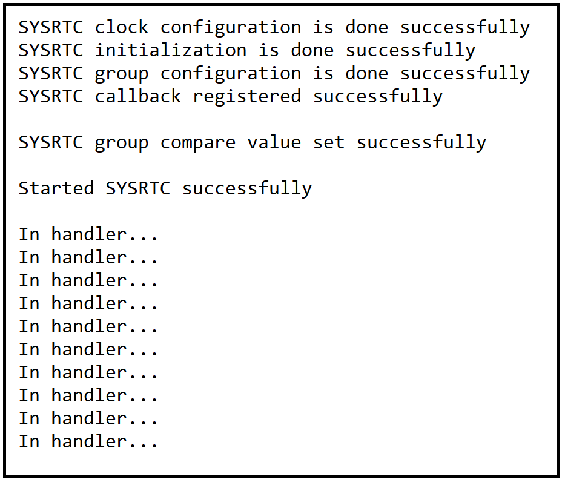

# SL SYSRTC

## Table of Contents

- [SL SYSRTC](#sl-sysrtc)
  - [Table of Contents](#table-of-contents)
  - [Purpose/Scope](#purposescope)
  - [Overview](#overview)
  - [About Example Code](#about-example-code)
    - [If compare channel0 or compare channel1 is enabled through UC](#if-compare-channel0-or-compare-channel1-is-enabled-through-uc)
    - [If capture channel0 is enabled through UC](#if-capture-channel0-is-enabled-through-uc)
    - [If no channels enabled through UC](#if-no-channels-enabled-through-uc)
  - [Prerequisites/Setup Requirements](#prerequisitessetup-requirements)
    - [Hardware Requirements](#hardware-requirements)
    - [Software Requirements](#software-requirements)
    - [Setup Diagram](#setup-diagram)
  - [Getting Started](#getting-started)
  - [Application Build Environment](#application-build-environment)
    - [Macros for SYSRTC Configurations](#macros-for-sysrtc-configurations)
  - [Test the Application](#test-the-application)

## Purpose/Scope

- This application demonstrates toggling an LED five times at 1-second intervals and then stops the timer.
  - LED0 for ACx Module boards and LED1 for ICs

## Overview

- The SYSRTC (System Real Time Clock) is a highly configurable RTC capable of serving multiple cores. It contains up to 2 groups, where the number of compare- and capture-channels within each group is parameterized individually. Each group has it's own interrupt- and configuration-registers. The main idea is to save power by letting all groups share a single counter.
- Counter - The counter is shared between all groups. It can be started/stopped by writing to START/STOP fields in CMD register. RUNNING field in STATUS register indicates if counter is running or not. By default, counter will halt when core is halted during debug. RUNNING is not affected by halting. If DEBUGRUN in CFG register is set, counter will not halt when core is halted. The count value can be accessed via CNT register even when it is not running. When CNT is written, count value will be updated on the next clock edge. When the counter reaches the maximum value of 0xFFFFFFFF, it will overflow to 0x00000000 on the next clock edge. All OVFIF interrupt flags are set when this happens.
- Compare Channel - When count value matches CMPnVALUE, and CMPnEN in CTRL register is set, the CMPnIF interrupt flag is set. At the same time, PRS output is updated according to CMPnCMOA value in CTRL register. CTRL and CMPnVALUE can be written at any time and will take effect immediately.
- Capture Channel- When CAPnEN in CTRL register is set, the count value will be captured into CAPnVALUE based on PRS input edges. CAPnEDGE in CTRL register controls which edges that will result in capture. When count value is captured, CAPnIF interrupt flag is set.A capture event is generated whenever RUNNING status set, the corresponding GRP_CTRL_CAPEN register setting set and the desired PRS input edge occurs according to the GRP_CTRL_CAPEDGE register setting. This event is followed by GRP_IF_CAPIF being set after up to 3 cycles. At the same time when the corresponding flag is set the GRP_CAPVALUE register captures the current counter value. Note that PRS input edges should not occur more frequently than once in 3 cycles. If counter is being started/stopped or GRP_CTRL_CAPEN/GRP_CTRL_CAPEDGE being reprogrammed close to the PRS input edge, please account for the race condition.

## About Example Code

- [`sysrtc_example.c`](https://github.com/SiliconLabs/wiseconnect/blob/master/examples/si91x_soc/peripheral/sl_si91x_sysrtc/sysrtc_example.c) this example file demonstrates how to use sysrtc
- Initializes SYSRTC module through [sl_si91x_sysrtc_init](https://docs.silabs.com/wiseconnect/3.5.0/wiseconnect-api-reference-guide-si91x-peripherals/sysrtc#sl-si91x-sysrtc-init)
- Sets counter start value for counter through [sl_si91x_sysrtc_set_count](https://docs.silabs.com/wiseconnect/3.5.0/wiseconnect-api-reference-guide-si91x-peripherals/sysrtc#sl-si91x-sysrtc-set-count), can change by updating [`COUNTER_VALUE1`](https://github.com/SiliconLabs/wiseconnect/blob/master/examples/si91x_soc/peripheral/sl_si91x_sysrtc/sysrtc_example.c) macro in [`sysrtc_example.c`](https://github.com/SiliconLabs/wiseconnect/blob/master/examples/si91x_soc/peripheral/sl_si91x_sysrtc/sysrtc_example.c) file.

### If compare channel0 or compare channel1 is enabled through UC

- Then SYSRTC groups are configured as per UC values through [sl_si91x_sysrtc_configure_group](https://docs.silabs.com/wiseconnect/3.5.0/wiseconnect-api-reference-guide-si91x-peripherals/sysrtc#sl-si91x-sysrtc-configure-group) API.
- Sets compare value for selected group's selected compare channel through [sl_si91x_sysrtc_set_compare_channel_value](https://docs.silabs.com/wiseconnect/3.5.0/wiseconnect-api-reference-guide-si91x-peripherals/sysrtc#sl-si91x-sysrtc-set-compare-channel-value), can change compare value by updating [`COMPARE_VALUE`](https://github.com/SiliconLabs/wiseconnect/blob/master/examples/si91x_soc/peripheral/sl_si91x_sysrtc/sysrtc_example.c) macro in [`sysrtc_example.c`](https://github.com/SiliconLabs/wiseconnect/blob/master/examples/si91x_soc/peripheral/sl_si91x_sysrtc/sysrtc_example.c) file.
- Then registers sysrtc callback and enabled selected compare channel interrupt, through [sl_si91x_sysrtc_register_callback](https://docs.silabs.com/wiseconnect/3.5.0/wiseconnect-api-reference-guide-si91x-peripherals/sysrtc#sl-si91x-sysrtc-register-callback).
- Starts counter through [sl_si91x_sysrtc_start](https://docs.silabs.com/wiseconnect/3.5.0/wiseconnect-api-reference-guide-si91x-peripherals/sysrtc#sl-si91x-sysrtc-start)
- When counter reaches compare-value generates respective channel compare interrupt and toggles LED on every second.
- After every interrupt, compare value is updated again through [sl_si91x_sysrtc_set_compare_channel_value](https://docs.silabs.com/wiseconnect/3.5.0/wiseconnect-api-reference-guide-si91x-peripherals/sysrtc#sl-si91x-sysrtc-set-compare-channel-value) with sum of current count (read through [sl_si91x_sysrtc_get_count](https://docs.silabs.com/wiseconnect/3.5.0/wiseconnect-api-reference-guide-si91x-peripherals/sysrtc#sl-si91x-sysrtc-get-count)) and compare-value.
- After 10 interrupts sysrtc is stopped through [sl_si91x_sysrtc_stop](https://docs.silabs.com/wiseconnect/3.5.0/wiseconnect-api-reference-guide-si91x-peripherals/sysrtc#sl-si91x-sysrtc-stop)
- Callbacks are unregistered and interrupts are disabled through [sl_si91x_sysrtc_unregister_callback](https://docs.silabs.com/wiseconnect/3.5.0/wiseconnect-api-reference-guide-si91x-peripherals/sysrtc#sl-si91x-sysrtc-unregister-callback)
- And SYSRTC is de-initialized through [sl_si91x_sysrtc_deinit](https://docs.silabs.com/wiseconnect/3.5.0/wiseconnect-api-reference-guide-si91x-peripherals/sysrtc#sl-si91x-sysrtc-deinit)

### If capture channel0 is enabled through UC

- Then SYSRTC capture channel of selected group is configured to capture at rising edge of input through [sl_si91x_sysrtc_configure_group](https://docs.silabs.com/wiseconnect/3.5.0/wiseconnect-api-reference-guide-si91x-peripherals/sysrtc#sl-si91x-sysrtc-configure-group) API.
- To capture at Register input , gpio capture input is disabled through [sl_si91x_sysrtc_enable_input_output_gpio](https://docs.silabs.com/wiseconnect/3.5.0/wiseconnect-api-reference-guide-si91x-peripherals/sysrtc#sl-si91x-sysrtc-enable-input-output-gpio) API call.
- Then registers sysrtc callback and enabled capture channel interrupt, through [sl_si91x_sysrtc_register_callback](https://docs.silabs.com/wiseconnect/3.5.0/wiseconnect-api-reference-guide-si91x-peripherals/sysrtc#sl-si91x-sysrtc-register-callback).
- Starts counter through [sl_si91x_sysrtc_start](https://docs.silabs.com/wiseconnect/3.5.0/wiseconnect-api-reference-guide-si91x-peripherals/sysrtc#sl-si91x-sysrtc-start)
- After starting waits unless counter reaches compare value for 1-second and then sets SYSRTC register capture input high through [sl_si91x_sysrtc_sets_register_capture_input](https://docs.silabs.com/wiseconnect/3.5.0/wiseconnect-api-reference-guide-si91x-peripherals/sysrtc#sl-si91x-sysrtc-sets-register-capture-input) API.
- A capture interrupt is generated and toggles LED one time.
- And SYSRTC is de-initialized through [sl_si91x_sysrtc_deinit](https://docs.silabs.com/wiseconnect/3.5.0/wiseconnect-api-reference-guide-si91x-peripherals/sysrtc#sl-si91x-sysrtc-deinit)

### If no channels enabled through UC

- Then SYSRTC overflow interrupt of selected group will be enabled through application.
- Then registers sysrtc callback and enabled selected group's overflow interrupt, through [sl_si91x_sysrtc_register_callback](https://docs.silabs.com/wiseconnect/3.5.0/wiseconnect-api-reference-guide-si91x-peripherals/sysrtc#sl-si91x-sysrtc-register-callback).
- Sets counter start value for counter through [sl_si91x_sysrtc_set_count](https://docs.silabs.com/wiseconnect/3.5.0/wiseconnect-api-reference-guide-si91x-peripherals/sysrtc#sl-si91x-sysrtc-set-count), can change by updating [`COUNTER_VALUE2`](https://github.com/SiliconLabs/wiseconnect/blob/master/examples/si91x_soc/peripheral/sl_si91x_sysrtc/sysrtc_example.c) macro in [`sysrtc_example.c`](https://github.com/SiliconLabs/wiseconnect/blob/master/examples/si91x_soc/peripheral/sl_si91x_sysrtc/sysrtc_example.c) file.
- Starts counter through [sl_si91x_sysrtc_start](https://docs.silabs.com/wiseconnect/3.5.0/wiseconnect-api-reference-guide-si91x-peripherals/sysrtc#sl-si91x-sysrtc-start)
- After starting waits unless counter reaches overflow value (0xffffffff).
- Then a overflow interrupt is generated and toggles LED one time.

## Prerequisites/Setup Requirements

### Hardware Requirements

- Windows PC
- Silicon Labs Si917 Evaluation Kit [WPK(BRD4002) + BRD4338A / BRD4342A / BRD4343A ]
- SiWx917 AC1 Module Explorer Kit (BRD2708A)

### Software Requirements

- Simplicity Studio
- Serial console Setup
  - For Serial Console setup instructions, refer [here](https://docs.silabs.com/wiseconnect/latest/wiseconnect-developers-guide-developing-for-silabs-hosts/#console-input-and-output).

### Setup Diagram

> 

## Getting Started

Refer to the instructions [here](https://docs.silabs.com/wiseconnect/latest/wiseconnect-getting-started/) to:

- [Install Simplicity Studio](https://docs.silabs.com/wiseconnect/latest/wiseconnect-developers-guide-developing-for-silabs-hosts/#install-simplicity-studio)
- [Install WiSeConnect 3 extension](https://docs.silabs.com/wiseconnect/latest/wiseconnect-developers-guide-developing-for-silabs-hosts/#install-the-wi-se-connect-3-extension)
- [Connect your device to the computer](https://docs.silabs.com/wiseconnect/latest/wiseconnect-developers-guide-developing-for-silabs-hosts/#connect-si-wx91x-to-computer)
- [Upgrade your connectivity firmware](https://docs.silabs.com/wiseconnect/latest/wiseconnect-developers-guide-developing-for-silabs-hosts/#update-si-wx91x-connectivity-firmware)
- [Create a Studio project](https://docs.silabs.com/wiseconnect/latest/wiseconnect-developers-guide-developing-for-silabs-hosts/#create-a-project)

For details on the project folder structure, see the [WiSeConnect Examples](https://docs.silabs.com/wiseconnect/latest/wiseconnect-examples/#example-folder-structure) page.

## Application Build Environment

- Open **sl_si91x_sysrtc.slcp** project file select **software component**tab and search for **sysrtc** in search bar.
- Click on **sysrtc** and configure the SYSRTC parameters.
- After creation of instances separate configuration files are get generated in **config folder**.
- If project built without selecting configurations, it will take default values from UC.
- Configure SYSRTC using UC.

  
  
- For updating/modifying counter and compare value use \ref [`COUNTER_VALUE`](https://github.com/SiliconLabs/wiseconnect/blob/master/examples/si91x_soc/peripheral/sl_si91x_sysrtc/sysrtc_example.c) & \ref SYSRTC_COMPARE_VALUE (for 32.768 KHZ clock) macros respectively, present in [`sysrtc_example.c`](https://github.com/SiliconLabs/wiseconnect/blob/master/examples/si91x_soc/peripheral/sl_si91x_sysrtc/sysrtc_example.c) file.

### Macros for SYSRTC Configurations

- [`SL_SYSRTC_RUN_ENABLE_DURING_DEBUG`](https://github.com/SiliconLabs/wiseconnect/blob/master/examples/si91x_soc/peripheral/sl_si91x_sysrtc/sysrtc_example.c), for enabling sysrtc run during debug
- [`SL_SYSRTC_GROUP`](https://github.com/SiliconLabs/wiseconnect/blob/master/examples/si91x_soc/peripheral/sl_si91x_sysrtc/sysrtc_example.c), for selecting SYSRTC channel group
- [`SL_SYSRTC_COMPARE_CHANNEL0_ENABLE`](https://github.com/SiliconLabs/wiseconnect/blob/master/examples/si91x_soc/peripheral/sl_si91x_sysrtc/sysrtc_example.c), for enabling compare channel-0 of selected SYSRTC group
- [`SL_SYSRTC_COMPARE_CHANNEL1_ENABLE`](https://github.com/SiliconLabs/wiseconnect/blob/master/examples/si91x_soc/peripheral/sl_si91x_sysrtc/sysrtc_example.c), for enabling compare channel-1 of selected SYSRTC group
- [`SL_SYSRTC_CAPTURE_CHANNEL0_ENABLE`](https://github.com/SiliconLabs/wiseconnect/blob/master/examples/si91x_soc/peripheral/sl_si91x_sysrtc/sysrtc_example.c), for enabling capture channel-0 of selected SYSRTC group

- After configuring above macros, their values are passed to [sysrtc_config_t](https://docs.silabs.com/wiseconnect/3.5.0/wiseconnect-api-reference-guide-si91x-peripherals/sysrtc#sysrtc-config-t) structure type variable [`sl_timer_handle`](https://github.com/SiliconLabs/wiseconnect/blob/master/examples/si91x_soc/peripheral/sl_si91x_sysrtc/sysrtc_example.c) which is used to configure timer using API-[sl_si91x_sysrtc_configure_group](https://docs.silabs.com/wiseconnect/3.5.0/wiseconnect-api-reference-guide-si91x-peripherals/sysrtc#sl-si91x-sysrtc-configure-group).

> **Note**: For recommended settings, see the [recommendations guide](https://docs.silabs.com/wiseconnect/latest/wiseconnect-developers-guide-prog-recommended-settings/).

## Test the Application

Refer to the instructions [here](https://docs.silabs.com/wiseconnect/latest/wiseconnect-getting-started/) to:

1. Compile and run the application.
2. When the application runs, LED0 (ULP_GPIO_0 for ACx Module boards) or LED1 (GPIO_10 for ICs) will be toggled five times at a 1-second periodic rate.
3. After successful program execution the prints in serial console looks as shown below.

    

> **Note:**
>
>- When Compare channels are enabled : Toggles LED for ten times every second and timer stops
>- When Capture channel is enabled : Toggles LED one time after one second
>- When no channels are enabled, the overflow interrupt is enabled: Toggles LED once when the counter reaches overflow.

  

> **Note:**
>
> - Interrupt handlers are implemented in the driver layer, and user callbacks are provided for custom code. If you want to write your own interrupt handler instead of using the default one, make the driver interrupt handler a weak handler. Then, copy the necessary code from the driver handler to your custom interrupt handler.
