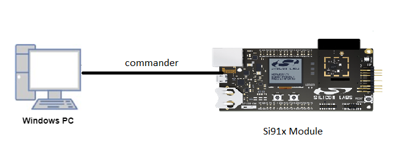

# SYSRTC

## Introduction 
- The SYSRTC (System Real Time Clock) is a highly configurable RTC capable of serving multiple cores. It contains up to 8 groups, where the number of compare- and capture-channels within each group is parameterized individually. Each group has it's own interrupt- and configuration-registers. The main idea is to save power by letting all groups share a single counter.

- Counter - The counter is shared between all groups. It can be started/stopped by writing to START/STOP fields in CMD register. RUNNING field in STATUS register
indicates if counter is running or not. By default, counter will halt when core is halted during debug. RUNNING is not affected by halting. If DEBUGRUN in CFG register
is set, counter will not halt when core is halted. The count value can be accessed via CNT register even when it is not running. When CNT is written, count value will
be updated on the next clock edge. When the counter reaches the maximum value of 0xFFFFFFFF, it will overflow to 0x00000000 on the next clock edge. All OVFIF
interrupt flags are set when this happens.
 
- Compare Channel - When count value matches CMPnVALUE, and CMPnEN in CTRL register is set, the CMPnIF interrupt flag is set. At the same time, PRS output is updated
according to CMPnCMOA value in CTRL register. CTRL and CMPnVALUE can be written at any time and will take effect immediately.

- Capture Channel- When CAPnEN in CTRL register is set, the count value will be captured into CAPnVALUE based on PRS input edges. CAPnEDGE in CTRL register
controls which edges that will result in capture. When count value is captured, CAPnIF interrupt flag is set.A capture event is generated whenever RUNNING status
set, the corresponding GRP_CTRL_CAPEN register setting set and the desired PRS input edge occurs according to the GRP_CTRL_CAPEDGE register setting. This event is
followed by GRP_IF_CAPIF being set after up to 3 cycles. At the same time when the corresponding flag is set the GRP_CAPVALUE register captures the current counter value. Note that PRS input edges should not occur more frequently than once in 3 cycles. If counter is being started/stopped or GRP_CTRL_CAPEN/GRP_CTRL_CAPEDGE being reprogrammed close to the PRS input edge, please account for the race condition.

## Overview
- 32-bit counter
- 32 kHz / 1kHz intended operation
- Low energy mode and wake-up
- Up to 2 groups
- 1-2 compare channels per group
- 0-1 capture channel per group
- Optional debug halting
- Software Reset

## About Example Code
- \ref sysrtc_example.c this example file demonstrates how to use sysrtc
- In this example, first clock is configured with UC values through \ref sl_si91x_sysrtc_configure_clock
- Initializes SYSRTC module through \ref sl_si91x_sysrtc_init
- Sets counter start value for counter through \ref sl_si91x_sysrtc_set_count, can change by updating \ref COUNTER_VALUE1 macro in sysrtc_example.c file.
### If compare channel-0 or compare channel-1 is enabled through UC:
- Then SYSRTC groups are configured as per UC values through \ref sl_si91x_sysrtc_configure_group API.
- Sets compare value for selected group's selected compare channel through \ref sl_si91x_sysrtc_set_compare_channel_value, can change compare value by updating \ref      COMPARE_VALUE macro in sysrtc_example.c file.
- Then registers sysrtc callback and enabled selected compare channel interrupt, through \ref sl_si91x_sysrtc_register_callback.
- Starts counter through \ref sl_si91x_sysrtc_start
- When counter reaches compare-value generates respective channel compare interrupt and toggles LED1 on every second.
- After every interrupt, compare value is updated again through \ref sl_si91x_sysrtc_set_compare_channel_value with sum of current count (read through \ref sl_si91x_sysrtc_get_count) and compare-value.
- After 10 interrupts sysrtc is stopped through \ref sl_si91x_sysrtc_stop
- Callbacks are unregistered and interrupts are disabled through \ref sl_si91x_sysrtc_unregister_callback
- And SYSRTC is deinitialized through \ref sl_si91x_sysrtc_deinit
### If capture channel-0 is enabled through UC:
- Then SYSRTC capture channel of selected group is configured to capture at rising edge of input through \ref sl_si91x_sysrtc_configure_group API.
- To capture at Register input , gpio capture input is disabled through \ref sl_si91x_sysrtc_enable_input_output_gpio API call.
- Then registers sysrtc callback and enabled capture channel interrupt, through \ref sl_si91x_sysrtc_register_callback.
- Starts counter through \ref sl_si91x_sysrtc_start
- After starting waits unless counter reaches compare value for 1-second and then sets SYSRTC register capture input high through \ref sl_si91x_sysrtc_sets_register_capture_input API.
- A capture interrupt is generated and toggles LED1 one time.
### If no channels enabled through UC: 
- Then SYSRTC overflow interrupt of selected group will be enabled through application.
- Then registers sysrtc callback and enabled selected group's overflow interrupt, through \ref sl_si91x_sysrtc_register_callback.
- Sets counter start value for counter through \ref sl_si91x_sysrtc_set_count, can change by updating \ref COUNTER_VALUE2 macro in sysrtc_example.c file.
- Starts counter through \ref sl_si91x_sysrtc_start
- After starting waits unless counter reaches overflow value (0xffffffff).
- Then a overflow interrupt is generated and toggles LED1 one time.
## Running Example Code
 - To use this application following Hardware, Software and the Project Setup is required.

### Hardware Setup
  - Windows PC 
  - Silicon Labs Si917 Evaluation Kit [WSTK + BRD4325C]
 

### Software Setup
  - Si91x SDK
  - Embedded Development Environment
    - For Silicon Labs Si91x, use the latest version of Simplicity Studio (refer **"Download and Install Simplicity Studio"** section in **getting-started-with-siwx917-soc** guide at **release_package/docs/index.html**)

### Project Setup
- **Silicon Labs Si91x** refer **"Download SDK"** section in **getting-started-with-siwx917-soc** guide at **release_package/docs/index.html** to work with Si91x and Simplicity Studio.
 
### Loading Application on Simplicity Studio
- With the product **Si917** selected, navigate to the example projects by clicking on **Example Projects & Demos** 
in simplicity studio and click on to SYSRTC Example application as shown below.

## Configuration and Steps for Execution:
- Open **sl_si91x_sysrtc.slcp** project file select **software component**tab and search for **sysrtc** in search bar.
- Click on **sysrtc** and configure the SYSRTC parmeters
- After creation of instances seperate configuration files are get generated in **config folder**.
- If project built without selecting configurations, it will take default values from UC
- Configure Clock and SYSRTC using UC
- For updating/modifying counter and compare value use \ref COUNTER_VALUE & \ref COMPARE_VALUE_32KHZ (for 32 KHZ clock) macros repectively, present in sysrtc_example.c file.

### Macros for Clock Configurations:
- \ref SL_SYSRTC_CLK_INPUT_SOURCE, for possible options \ref sl_clock_sources_t
- \ref SL_SYSRTC_CLK_DIVISION_FACTOR, for clock division factor
- To use 32kHZ clock, select 1KHZ clock source from UC and provide division factor value as 0.
- To use 1kHZ clock, select 1KHZ clock source from UC and provide division factor value as 16.
- To use other clock frequency change division factor and update \ref CLOCKS_PER_MILLISECONDS macro value accordingly, the macro is present in sysrtc_example.c file.
- After configuring above macros, their values are passed to \ref sl_sysrtc_clock_config_t structure type variable \ref sl_sysrtc_clk_config_handle which is used to configure clock using API-\ref sl_si91x_sysrtc_configure_clock.

### Macros for SYSRTC Configurations:
- \ref SL_SYSRTC_RUN_ENABLE_DURING_DEBUG, for enabling sysrtc run during debug
- \ref SL_SYSRTC_GROUP, for selecting SYSRTC channel group
- \ref SL_SYSRTC_COMPARE_CHANNEL0_ENABLE, for enabling compare channel-0 of selected SYSRTC group
- \ref SL_SYSRTC_COMPARE_CHANNEL1_ENABLE, for enabling compare channel-1 of selected SYSRTC group
- \ref SL_SYSRTC_CAPTURE_CHANNEL0_ENABLE, for enabling capture channel-0 of selected SYSRTC group

- After configuring above macros, their values are passed to \ref sysrtc_config_t structure type variable \ref sl_timer_handle which is used to configure timer using API-\ref sl_si91x_sysrtc_configure_group.

## Build 
- Compile the application in Simplicity Studio using build icon.

## Device Programming
- To program the device ,refer **"Burn M4 Binary"** section in **getting-started-with-siwx917-soc** guide at **release_package/docs/index.html** to work with Si91x and Simplicity Studio.

## Executing the Application
- Compile and run the application.

## Expected Results 
 - Evaluation kit board's LED1 will be toggled five times at 1sec periodic rate.
 - When Compare channels are enabled : Toggles LED1 for ten times every second and timer stops
 - When Capture channel is enabled : Toggles LED1 one time after one second
 - When no channels are enabled then overflow interrupt is enabled : Toggles LED1 one time as counter reaches overflow

