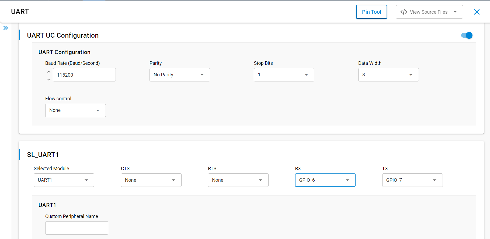

# SL UART

## Table of Contents

- [Purpose/Scope](#purposescope)
- [Overview](#overview)
- [About Example Code](#about-example-code)
- [Prerequisites/Setup Requirements](#prerequisitessetup-requirements)
  - [Hardware Requirements](#hardware-requirements)
  - [Software Requirements](#software-requirements)
  - [Setup Diagram](#setup-diagram)
- [Getting Started](#getting-started)
- [Application Build Environment](#application-build-environment)
- [Test the Application](#test-the-application)

## Purpose/Scope

 This application demonstrates how to configure Universal Asynchronous Receiver-Transmitter (UART). In asynchronous mode, it will send data to the serial console and receives from the serial console.

## Overview

- UART is used in communication through wired medium in asynchronous fashion. It enables the device to communicate using serial protocols.
- This application is configured with following configurations:
  - Tx and Rx enabled
  - Asynchronous mode
  - 8 Bit data transfer
  - Stop bits 1
  - No Parity
  - No Auto Flow control
  - Baud Rate - 115200

## About Example Code

- \ref uart_example.c - This example code demonstrates how to configure the UART to send and receive data.
- In this example, first UART get initialized if it is not initialized already with clock and DMA configurations if DMA is
  enabled using \ref sl_si91x_usart_init.
- After UART initialization, the UART power mode is set using \ref sl_si91x_usart_set_power_mode(). Then UART is configured with the default configurations from UC along with the UART transmit and receive lines using \ref sl_si91x_usart_set_configuration().
- The register user event callback for send and receive complete notification is set using \ref sl_si91x_usart_register_event_callback().
- After setting the user event callback, the data send and receive can happen through \ref sl_si91x_usart_send_data() and \ref sl_si91x_usart_receive_data() respectively.
- Once the receive data event is triggered, the transmitted and received buffer data is compared to confirm that the received data is the same.

## Prerequisites/Setup Requirements

### Hardware Requirements

- Windows PC
- Silicon Labs Si917 Evaluation Kit [WPK(4002A) + BRD4338A]
- SiWx917 AC1 Module Explorer Kit (BRD2708A)

### Software Requirements

- Simplicity Studio
- Serial console setup
  - For serial console setup instructions, refer [here](https://docs.silabs.com/wiseconnect/latest/wiseconnect-developers-guide-developing-for-silabs-hosts/#console-input-and-output)..

### Setup Diagram

> 

## Getting Started

Refer to the instructions [here](https://docs.silabs.com/wiseconnect/latest/wiseconnect-getting-started/) to:

- [Install Simplicity Studio](https://docs.silabs.com/wiseconnect/latest/wiseconnect-developers-guide-developing-for-silabs-hosts/#install-simplicity-studio)
- [Install WiSeConnect 3 extension](https://docs.silabs.com/wiseconnect/latest/wiseconnect-developers-guide-developing-for-silabs-hosts/#install-the-wi-se-connect-3-extension)
- [Connect your device to the computer](https://docs.silabs.com/wiseconnect/latest/wiseconnect-developers-guide-developing-for-silabs-hosts/#connect-si-wx91x-to-computer)
- [Upgrade your connectivity firmware](https://docs.silabs.com/wiseconnect/latest/wiseconnect-developers-guide-developing-for-silabs-hosts/#update-si-wx91x-connectivity-firmware)
- [Create a Studio project](https://docs.silabs.com/wiseconnect/latest/wiseconnect-developers-guide-developing-for-silabs-hosts/#create-a-project)

For details on the project folder structure, see the [WiSeConnect Examples](https://docs.silabs.com/wiseconnect/latest/wiseconnect-examples/#example-folder-structure) page.

## Application Build Environment

Configuration of UART at UC (Universal Configuration):

- Configure UC from the slcp component.
- Open the **sl_si91x_uart.slcp** project file, select the **Software Component** tab, and search for **UART** in the search bar.
- You can use the configuration wizard to configure different parameters, as required.

  > 

## Pin Configuration

  | UART PINS     |  GPIO   |  917 Breakout pin |  915 Breakout pin | Explorer kit Breakout pin |  UART-TTL cable |
  | ------------- | ------- | ----------------- | ----------------- | ------------------------- |---------------- |
  | UART1_TX_PIN  | GPIO_7  |          P20      |       EXP15       |             [SCL]         |    RX pin       |
  | UART1_RX_PIN  | GPIO_6  |          P19      |       EXP16       |             [SDA]         |    TX Pin       |

## Flow Control Configuration

- Set the SL_USART_FLOW_CONTROL_TYPE parameter to SL_USART_FLOW_CONTROL_RTS_CTS to enable UART flow control.
- Make sure the following two macros in `RTE_Device_917.h` or `RTE_Device_915.h` are set to '1' to map RTS and CTS pins to WSTK/WPK Main Board EXP header or breakout pins.

  ```C
  #define RTE_UART1_CTS_PORT_ID    1
  #define RTE_UART1_RTS_PORT_ID    1
  ```

  | USART PINS     | GPIO    |   Breakout pin  | Explorer kit Breakout pin|
  | -------------- | ------- | --------------- | ------------------------ |
  | UART_CTS_PIN   | GPIO_28 |     P31         |           [CS]           |
  | UART_RTS_PIN   | GPIO_27 |     P29         |           [MOSI]         |

## Test the Application
1. Connect the TX pin (GPIO_7) of the board to the RX pin of the UART-TTL cable, and the RX pin (GPIO_6) of the board to the TX pin of the UART-TTL cable.
2. Power on the board and run the application.
3. Use a serial terminal on your PC to receive the transmitted data and send it back to the board.
4. The application will transmit 1024 bytes over UART to the serial port and wait for the user to send back 1024 bytes for data comparison.
5. Observe the UART data transfer in the serial terminal. The application will verify that the received data matches the transmitted data.
6. The output on the serial terminal should resemble the example shown below.

    > 
>
> **Note**:
>
>- Add data_in buffer to watch window for checking receive data.

## Configuring higher clock

For baud rates higher than 2 million, Change the clock source to USART_SOCPLLCLK in `RTE_Device_917.h` (/$project/config/RTE_Device_917.h):

    ```c
    #define RTE_UART1_CLK_SRC  // for UART1
    ```
> **Note:**
>
> - Interrupt handlers are implemented in the driver layer, and user callbacks are provided for custom code. If you want to write your own interrupt handler instead of using the default one, make the driver interrupt handler a weak handler. Then, copy the necessary code from the driver handler to your custom interrupt handler.
> - By default, Request to Send (RTS) and Clear to Send (CTS) flow control signals are disabled in the UART driver UC, and their corresponding GPIO pins are not assigned in the Pintool. If you enable RTS/CTS in the Driver UC, you must manually configure and assign the appropriate GPIO pins in the Pintool to ensure proper hardware flow control functionality.
