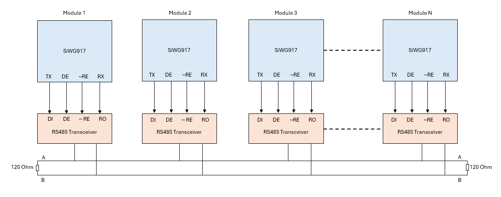
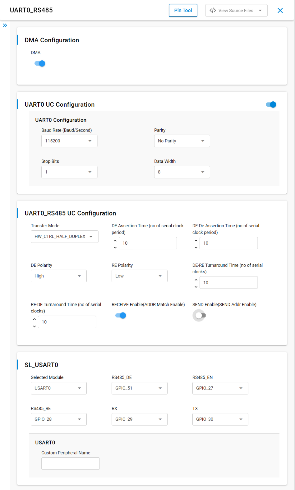
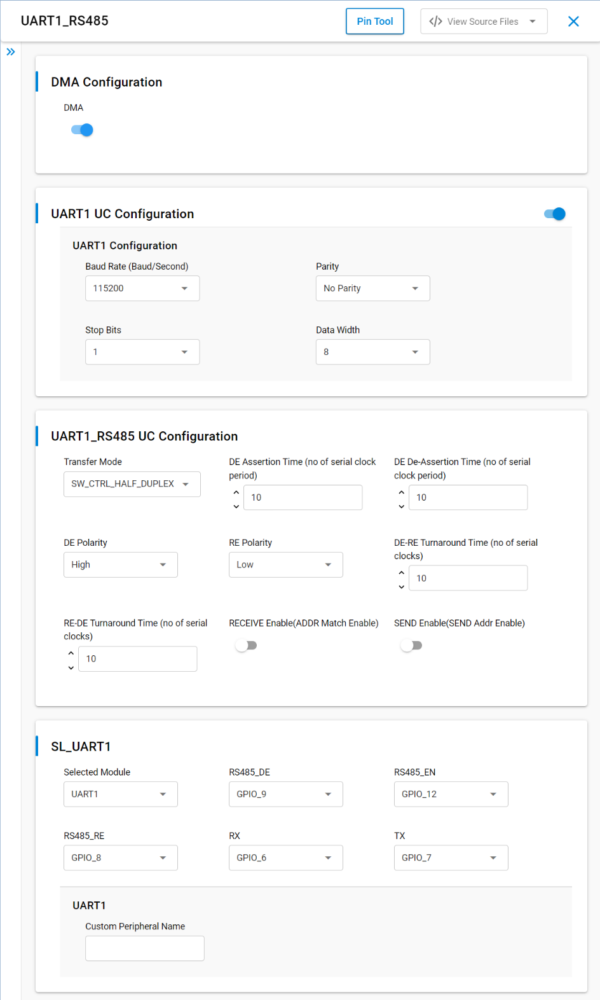

# SL UART RS485

## Table of Contents

- [Purpose/Scope](#purposescope)
- [Overview](#overview)
- [About Example Code](#about-example-code)
- [Prerequisites/Setup Requirements](#prerequisitessetup-requirements)
  - [Hardware Requirements](#hardware-requirements)
  - [Software Requirements](#software-requirements)
  - [Setup Diagram](#setup-diagram)
- [Steps for N-board setup](#steps-for-n-board-setup) 
- [Getting Started](#getting-started)
- [Application Build Environment](#application-build-environment)
- [Test the Application](#test-the-application)

## Purpose/Scope

- This application demonstrates how to configure UART0/1 to use in rs485 multidrop mode and send and receive the data.

## Overview

- UART is used in communication through wired medium in asynchronous fashion. It enables the device to communicate using serial protocols
- This application is configured with following configurations
  - Tx and Rx enabled
  - 8 Bit data transfer
  - Stop bits 1
  - No Parity
  - Baud Rate - 115200

## About Example Code

- \ref uart_rs485_example.c this example code demonstrates how to configure the UART in RS485 to send and receive data.
- In this example, first UART get initialized using \ref sl_si91x_usart_init.
- After UART initialization then UART configured with the default configurations from UC along with the UART transmit and receive lines using \ref sl_si91x_usart_set_configuration()
- Initializes the RS485 and Configures the RS485 using \ref sl_si91x_uart_rs485_init() and \ref sl_si91x_uart_rs485_set_configuration()
- Enables the Driver enable and Receiver Enable signals using \ref sl_si91x_uart_rs485_de_enable() and sl_si91x_uart_rs485_re_enable()
- Then register's user event callback for send and receive complete notification are set using
  \ref sl_si91x_usart_register_event_callback()
- After setting the user event callback, 
For hardware controlled half duplex mode, the address will be sent using \ref sl_si91x_uart_rs485_transfer_hardware_address() in send mode and \ref sl_si91x_uart_rs485_rx_hardware_address_set() used to set the address in receive mode. Data send and receive can happen through \ref sl_si91x_usart_send_data() and \ref sl_si91x_usart_receive_data() respectively
For software controlled half duplex mode, send address and data is performed using \ref sl_si91x_usart_send_data() and receive address and data is performed using \ref sl_si91x_usart_receive_data(). 
- Once the receive data event is triggered, both transmit and receive buffer data is compared to confirm if the received data is same.
- There are 2 UC's each one for UART1, UART0. By default UART1 is installed. If user wants to install UART0, install UART0 UC.

## Prerequisites/Setup Requirements

### Hardware Requirements

- Windows PC
- Two Silicon Labs Si917 Evaluation Kit [WPK(4002A) + BRD4338A]
- RS485 Trans-receiver 

### Software Requirements

- Simplicity Studio
- Serial console Setup
  - The Serial Console setup instructions are provided below:
Refer [here](https://docs.silabs.com/wiseconnect/latest/wiseconnect-developers-guide-developing-for-silabs-hosts/#console-input-and-output).

### Setup Diagram

> 

- connection circuit diagram for 2-board setup

> 

## Steps for N-board setup 

- Create N applications for N boards.
- Each secondary board needs to be assigned with unique address.
- The primary board will send data to a specific secondary address using 9-bit data for addressing.
- The secondaries will only respond if their address matches the address sent by the primary.
- Driver Enable (DE) and Receiver Enable (RE) pins must be controlled for each board (especially for slaves) to switch between send and receive modes.
- For hardware-controlled half duplex, the DE and RE pins will automatically handle the switching between transmit and receive.
- For software-controlled half duplex, manually control DE and RE to toggle between sending and receiving modes.
- Below is the setup for N-board setup,

> 

## Getting Started

Refer to the instructions [here](https://docs.silabs.com/wiseconnect/latest/wiseconnect-getting-started/) to:

- Install Studio and WiSeConnect 3 extension
- Connect your device to the computer
- Upgrade your connectivity firmware

For details on the project folder structure, see the [WiSeConnect Examples](https://docs.silabs.com/wiseconnect/latest/wiseconnect-examples/#example-folder-structure) page.

## Application Build Environment

- Create a Two Studio projects, one for  RS485 send and another for RS485 receive
- In rs485 Receive project, Enable ADDR Match Enable from UC, Disable SEND Addr Enable from UC and add **current_mode = SL_UART_RS485_RECEIVE** in example project when hardware controlled half duplex is selected.

- In rs485 Send project, Disable ADDR Match Enable from UC, Enable SEND Addr Enable from UC and add **current_mode = SL_UART_RS485_SEND** in example project when hardware controlled half duplex is selected.

- In rs485 Send and Receive project, disable ADDR Match Enable from UC, disable SEND Addr Enable from UC in example project when software controlled half duplex is selected. Below are the snaps, referring to different scenarios mentioned above. 

- Configuration of UART0 RS485 configs from UC, when hardware controlled half duplex in receive mode is performed.

    > 

- Configuration of UART0 RS485 configs from UC, when hardware controlled half duplex in send mode is performed.

    > 

- Configuration of UART0 RS485 configs from UC, when software controlled half duplex is performed.

    > 

- Configuration of UART1 RS485 configs from UC, when hardware controlled half duplex in receive mode is performed.

    > 

- Configuration of UART1 RS485 configs from UC, when hardware controlled half duplex in send mode is performed.

    > 

- Configuration of UART1 RS485 configs from UC, when software controlled half duplex is performed.

    > 

- **DMA Configuration**
  - Enable/Disable the DMA configuration. 

- **UART UC Configuration**
  - Baud Rate: The speed of transfer can be configured.
  - Parity: Configures the parity of the data i.e Even Parity, Odd Parity and No Parity.
  - Stop Bits: Configures the no of stop bits in uart frame i.e STOP_BIT_1, STOP_BIT_1.5 and STOP_BIT_2.
  - Data Width: Configures the UART Data Width in the frame i.e 5, 6, 7, 8 bits

- **UART_RS485 UC Configuration**
  - Transfer Mode: RS485 Transfer modes
    - SW_CTRL_HALF_DUPLEX: The software-controlled half duplex mode supports either transmit or receive transfers at a time but not both simultaneously. The switching between transmit to receive or receive to transmit is through 
    programming the Driver output enable (DE_EN) and Receiver output enable (RE_EN).
    - HW_CTRL_HALF_DUPLEX: The hardware-controlled half duplex mode supports either transmit or receive transfers at a time but not both simultaneously. If both 'DE Enable' and 'RE Enable' enabled, the switching between transmit to receive or receive to transmit is automatically done by the hardware.
  - DE Assertion Time: Driver enable assertion time. This field controls the amount of time (in terms of number of serial clock periods) between the assertion of rising edge of Driver output enable signal to serial transmit enable. Any data in transmit buffer, will start on serial output (sout) after the transmit enable.
  - DE De-Assertion Time: Driver enable de-assertion time. This field controls the amount of time (in terms of number of serial clock periods) between the end of stop bit on the serial output (sout) to the falling edge of Driver output enable signal.
  - DE Polarity: Driver Enable Polarity
    - 0: DE signal is active low
    - 1: DE signal is active high
  - RE Polarity: Receiver Enable Polarity
    - 0: RE signal is active low
    - 1: RE signal is active high
  - DE-RE Turnaround Time: Driver Enable to Receiver Enable Turn Around time in terms of serial clocks.
  - RE-DE Turnaround Time: Receiver Enable to Driver Enable Turn Around time. Turnaround time (in terms of serial clock) for RE de-assertion to DE assertion.
  - Data bit 9 set: This is used to enable 9-bit data for transmit and receive.
    - 1 : 9 bits per character
    - 0 : Number of data bits set in UART UC config.
  - Addr Match Enable: This configures address match feature during receive.
    - 0 - Software Address Match Receive Mode; uart will start to receive the data and 9-bit character will be formed and written into the receive RxFIFO. User is responsible to read the data and differentiate b/n address and data.
    - 1 - Hardware Address Match Receive Mode; uart will wait until the incoming character with 9-th bit set to 1. And, further checks to see if the address matches with  what is programmed in "Receive Address Match Register". If  match is found, then sub-sequent characters will be treated as valid data and uart starts receiving data.
  - Send Addr Enable: This configures the Send Address feature, for the user to determine when to send the address during transmit mode.
    - 0 - 9-bit character will be transmitted with 9-th bit set to 0 and the remaining 8-bits will be taken from the TxFIFO which is programmed through 8-bit wide THR register.
    - 1 - 9-bit character will be transmitted with 9-th bit set to 1 and the remaining 8-bits will match to what is being programmed in "Transmit Address Register".   

## Pin Configuration

### UART1 RS485 pin configuration

  ------------------------------------------------------------------------------

  | SI91X Interface       | Default SI91X Pin | External RS485 Driver Pin |
  | ----------------------|-------------------|---------------------------|
  | Transmit Data (TxD)   | GPIO7[P20]        |           DI              |
  | Receive Data (RxD)    | GPIO6[P19]        |           RO              |
  | Driver Enable (DE)    | GPIO9[F9]         |           DE              |
  | Receiver Enable (RE)  | GPIO8[F8]         |          ~RE              |

  ------------------------------------------------------------------------------

### UART0 RS485 pin configuration

  ------------------------------------------------------------------------------

  | SI91X Interface       | Default SI91X Pin    | External RS485 Driver Pin |
  | ----------------------|----------------------|---------------------------|
  | Transmit Data (TxD)   | GPIO30[P35]          |           DI              |
  | Receive Data (RxD)    | GPIO29[P33]          |           RO              |
  | Driver Enable (DE)    | GPIO51[P34]          |           DE              |
  | Receiver Enable (RE)  | GPIO28[P31]          |          ~RE              |

  ------------------------------------------------------------------------------

## Test the Application

1. Connect Two modules as per connection diagram shown above.
2. When the application runs, UART sends the data to the second module and compare whether received data is proper.
3. After running this application below console output can be observed.

    > 

> **Note:**
>
> - Interrupt handlers are implemented in the driver layer, and user callbacks are provided for custom code. If you want to write your own interrupt handler instead of using the default one, make the driver interrupt handler a weak handler. Then, copy the necessary code from the driver handler to your custom interrupt handler.
