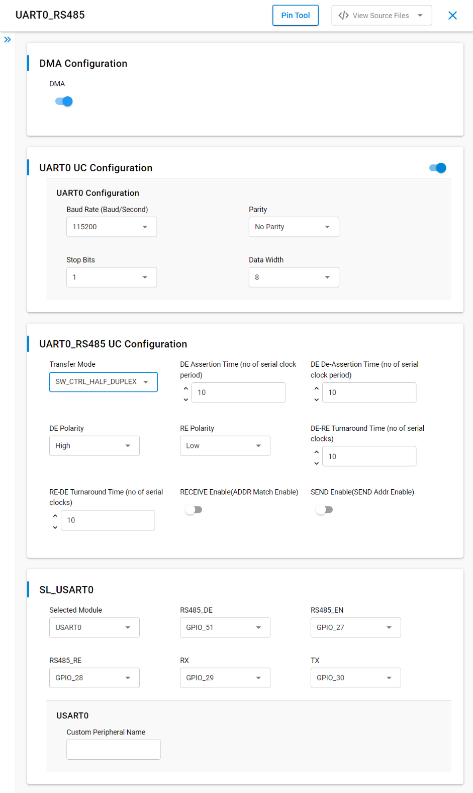
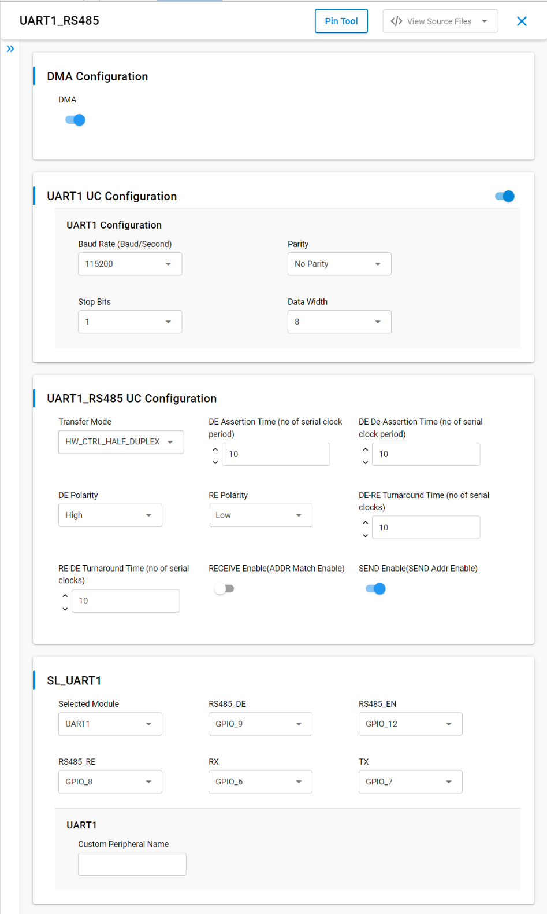
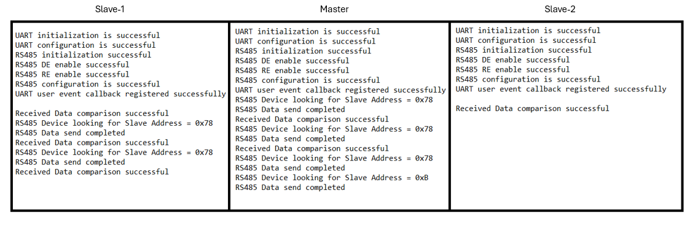

# SL UART RS485

## Table of Contents

- [Purpose/Scope](#purposescope)
- [Overview](#overview)
- [About Example Code](#about-example-code)
- [Prerequisites/Setup Requirements](#prerequisitessetup-requirements)
  - [Hardware Requirements](#hardware-requirements)
  - [Software Requirements](#software-requirements)
  - [Setup Diagram](#setup-diagram)
  - [Pin Configuration](#pin-configuration)
- [Steps for N-board setup](#steps-for-n-board-setup) 
- [Getting Started](#getting-started)
- [Application Build Environment](#application-build-environment)
- [Test the Application](#test-the-application)

## Purpose/Scope

- This application demonstrates how to configure UART0/1 to use in rs485 multidrop mode and send and receive the data.

## Overview

- UART is used in communication through wired medium in asynchronous fashion. It enables the device to communicate using serial protocols
- This application is configured with following configurations
  - Tx and Rx enabled
  - 8 Bit data transfer
  - Stop bits 1
  - No Parity
  - Baud Rate - 115200

## About Example Code

- The UART is initialized using the API \ref sl_si91x_usart_init.
- After initialization, the UART is configured with default settings from the Universal Configuration (UC), including the UART transmit and receive lines, using the API \ref sl_si91x_usart_set_configuration.
- RS485 mode is initialized and configured using the APIs \ref sl_si91x_uart_rs485_init and \ref sl_si91x_uart_rs485_set_configuration.
- The Driver Enable (DE) and Receiver Enable (~RE) signals are activated using the APIs \ref sl_si91x_uart_rs485_de_enable and \ref sl_si91x_uart_rs485_re_enable.
- User-defined event callbacks for send and receive completion notifications are registered using the API \ref sl_si91x_usart_register_event_callback.
- For hardware-controlled half-duplex mode:
  - The address is sent using \ref sl_si91x_uart_rs485_transfer_hardware_address in send mode.
  - The address is set using \ref sl_si91x_uart_rs485_rx_hardware_address_set in receive mode.
  - Data transmission and reception are performed using \ref sl_si91x_usart_send_data and \ref sl_si91x_usart_receive_data, respectively.
- For software-controlled half-duplex mode:
  - Address and data transmission are performed using \ref sl_si91x_usart_send_data.
  - Address and data reception are performed using \ref sl_si91x_usart_receive_data.
- Once the receive data event is triggered, the transmitted and received buffer data are compared to ensure data integrity.
- Two UC configurations are available for UART1 and UART0. By default, UART1 is installed. To operate on UART0, the UART0 UC must be installed.
- This example provides a comprehensive demonstration of RS485 communication using UART, supporting both hardware-controlled and software-controlled half-duplex modes and full-dulpex mode with RS422.

## Prerequisites/Setup Requirements

### Hardware Requirements

- Windows PC
- 3 Silicon Labs Si917 Evaluation Kit [WPK(4002A) + BRD4338A]
- 3 RS485 Transceivers 

### Software Requirements

- Simplicity Studio
- Serial console Setup
  - The Serial Console setup instructions are provided below:
Refer [here](https://docs.silabs.com/wiseconnect/latest/wiseconnect-developers-guide-developing-for-silabs-hosts/#console-input-and-output).

### Setup Diagram

> 

- Circuit diagram for 3 boards

> 

### Pin Configuration

#### UART1 RS485 pin configuration

  ------------------------------------------------------------------------------

  | SI91X Interface        | Default SI91X Pin | External RS485 Driver Pin |
  | -----------------------|-------------------|---------------------------|
  | Transmit Data (TxD)    | GPIO7[P20]        |           DI              |
  | Receive Data (RxD)     | GPIO6[P19]        |           RO              |
  | Driver Enable (DE)     | GPIO9[F9]         |           DE              |
  | Receiver Enable (~RE)  | GPIO8[F8]         |          ~RE              |

  ------------------------------------------------------------------------------

#### UART0 RS485 pin configuration

  ------------------------------------------------------------------------------

  | SI91X Interface        | Default SI91X Pin    | External RS485 Driver Pin |
  | -----------------------|----------------------|---------------------------|
  | Transmit Data (TxD)    | GPIO30[P35]          |           DI              |
  | Receive Data (RxD)     | GPIO29[P33]          |           RO              |
  | Driver Enable (DE)     | GPIO51[P34]          |           DE              |
  | Receiver Enable (~RE)  | GPIO28[P31]          |          ~RE              |

  ------------------------------------------------------------------------------

## Steps for N-board setup 

- Create N applications for N boards.
- Each secondary board needs to be assigned with unique address.
- The primary board will send data to a specific secondary address using 9-bit data for addressing.
- The secondaries will only respond if their address matches the address sent by the primary.
- Driver Enable (DE) and Receiver Enable (~RE) pins must be controlled for each board (especially for slaves) to switch between send and receive modes.
- For hardware-controlled half duplex, the DE and ~RE pins will automatically handle the switching between transmit and receive.
- For software-controlled half duplex, manually control DE and ~RE to toggle between sending and receiving modes.
- Below is the setup for N-board setup,

> 

## Getting Started

Refer to the instructions [here](https://docs.silabs.com/wiseconnect/latest/wiseconnect-getting-started/) to:

- Install Studio and WiSeConnect 3 extension
- Connect your device to the computer
- Upgrade your connectivity firmware

For details on the project folder structure, see the [WiSeConnect Examples](https://docs.silabs.com/wiseconnect/latest/wiseconnect-examples/#example-folder-structure) page.

## Application Build Environment

- This example demonstrates RS485 multi-slave communication using three Simplicity Studio projects: one master (sending) and two slaves (receiving). Below are the necessary configurations and changes required in the application code.

  - Master Project: 
    - Set `current_mode = SL_UART_RS485_SEND` and `current_slave = RS485_SLAVE1`in `uart_rs485_example.c` application.
    - This configures the master to transmit data to RS485_SLAVE1 in half-duplex mode, once SLAVE1 data transfer is done, current slave is changed to RS485_SLAVE2 and sends data to RS485_SLAVE2 in one direction(master sends, SLAVE2 receives).

  - Slave Project 1:
    - Set `current_mode = SL_UART_RS485_RECEIVE` and `current_slave = RS485_SLAVE1` in `uart_rs485_example.c` application.
    - This configures the slave to listen for and process messages addressed to `RS485_HW_SLAVE1_ADDRESS`.

  - Slave Project 2:
    - Set `current_mode = SL_UART_RS485_RECEIVE` and `current_slave = RS485_SLAVE2` in `uart_rs485_example.c` application.
    - This configures the slave to handle messages directed to `RS485_HW_SLAVE2_ADDRESS`.

- This setup enables the master project to transmit data to two distinct slave projects, using RS485 addressing. The same steps apply to software-controlled half-duplex mode.

- In `hardware-controlled half-duplex` mode, configure `Transfer Mode = HW_CTRL_HALF_DUPLEX`, enable both `SEND Enable(SEND Addr Enable)` and `RECEIVE Enable(ADDR Match Enable)` in the UC settings.

- In `software-controlled half-duplex` mode, configure `Transfer Mode = SW_CTRL_HALF_DUPLEX` disable both `SEND Enable(SEND Addr Enable)` and `RECEIVE Enable(ADDR Match Enable)` in the UC settings, as shown in the provided snapshots. 

- RECEIVE Enable(ADDR Match Enable):
  - Configures the RS485 hardware to enable the receiver functionality.
  - It is used to control the Receiver Enable (~RE) signal for hardware-controlled modes.
- SEND Enable(SEND Addr Enable):
  - Configures the RS485 hardware to enable the driver functionality for sending data.
  - It is used to control the Driver Enable (DE) signal for hardware-controlled modes.

> **Note:**
>
> - `RECEIVE Enable(ADDR Match Enable)` and `SEND Enable(SEND Addr Enable)` do not refer to the actual sending or receiving of data from the device. Instead, they control the hardware signals for enabling the driver or receiver functionality.

- The full-duplex mode supports simultaneous transmit and receive operations.
  - In this mode:
    - Master Application:
      - Configure `Transfer Mode = FULL_DUPLEX`.
      - Set `current_mode = SL_UART_RS485_FULL_DUPLEX_SEND_RECEIVE` to enable the master to send data to the slave and receive data from the slave simultaneously.
    - Slave Application:
      - Configure `Transfer Mode = FULL_DUPLEX`.
      - Set `current_mode = SL_UART_RS485_FULL_DUPLEX_RECEIVE_SEND` to enable the slave to receive data from the master and send data to the master simultaneously.
  - Both `SEND Enable (SEND Addr Enable)` and `RECEIVE Enable (ADDR Match Enable)` must be disabled in the UC settings for full-duplex mode.

- Configuration of UART0 RS485 configs from UC, when hardware controlled half duplex in receive mode is performed.

    > 

- Configuration of UART0 RS485 configs from UC, when hardware controlled half duplex in send mode is performed.

    > 

- Configuration of UART0 RS485 configs from UC, when software controlled half duplex is performed.

    > 

- Configuration of UART1 RS485 configs from UC, when hardware controlled half duplex in receive mode is performed.

    > 

- Configuration of UART1 RS485 configs from UC, when hardware controlled half duplex in send mode is performed.

    > 

- Configuration of UART1 RS485 configs from UC, when software controlled half duplex is performed.

    > 

- ~RE and DE are mandatory for hardware-controlled modes to enable automatic switching between transmit and receive operations.
- ~RE and DE are optional for software-controlled modes, where the application handles the switching programmatically.
- EN is typically required to enable the RS485 transceiver or UART functionality, depending on the context.

- **DMA Configuration**
  - Enable/Disable the DMA configuration. 

- **UART UC Configuration**
  - Baud Rate: The speed of transfer can be configured.
  - Parity: Configures the parity of the data i.e Even Parity, Odd Parity and No Parity.
  - Stop Bits: Configures the no of stop bits in uart frame i.e STOP_BIT_1, STOP_BIT_1.5 and STOP_BIT_2.
  - Data Width: Configures the UART Data Width in the frame i.e 5, 6, 7, 8 bits

- **UART_RS485 UC Configuration**
  - Transfer Mode: RS485 Transfer modes
    - SW_CTRL_HALF_DUPLEX: The software-controlled half duplex mode supports either transmit or receive transfers at a time but not both simultaneously. The switching between transmit to receive or receive to transmit is through programming the Driver output enable (DE_EN) and Receiver output enable (~RE_EN).
    - HW_CTRL_HALF_DUPLEX: The hardware-controlled half duplex mode supports either transmit or receive transfers at a time but not both simultaneously. If both 'DE Enable' and '~RE Enable' enabled, the switching between transmit to receive or receive to transmit is automatically done by the hardware.
    - FULL_DUPLEX: Full-duplex mode allows simultaneous data transmission and reception.
  - DE Assertion Time: Driver enable assertion time. This field controls the amount of time (in terms of number of serial clock periods) between the assertion of rising edge of Driver output enable signal to serial transmit enable. Any data in transmit buffer, will start on serial output (sout) after the transmit enable.
  - DE De-Assertion Time: Driver enable de-assertion time. This field controls the amount of time (in terms of number of serial clock periods) between the end of stop bit on the serial output (sout) to the falling edge of Driver output enable signal.
  - DE Polarity: Driver Enable Polarity
    - 0: DE signal is active low
    - 1: DE signal is active high
  - RE Polarity: Receiver Enable Polarity
    - 0: RE signal is active low
    - 1: RE signal is active high
  - DE-RE Turnaround Time: Driver Enable to Receiver Enable Turn Around time in terms of serial clocks.
  - RE-DE Turnaround Time: Receiver Enable to Driver Enable Turn Around time. Turnaround time (in terms of serial clock) for RE de-assertion to DE assertion.
  - Receive Enable(Addr Match Enable): This configures address match feature during receive.
    - 0: Software Address Match Receive Mode - uart will start to receive the data and 9-bit character will be formed and written into the receive RxFIFO. User is responsible to read the data and differentiate b/n address and data.
    - 1: Hardware Address Match Receive Mode - uart will wait until the incoming character with 9-th bit set to 1. And, further checks to see if the address matches with what is programmed in "Receive Address Match Register". If match is found, then sub-sequent characters will be treated as valid data and uart starts receiving data.
  - Send Enable(Send Addr Enable): This configures the Send Address feature, for the user to determine when to send the address during transmit mode.
    - 0: 9-bit character will be transmitted with 9-th bit set to 0 and the remaining 8-bits will be taken from the TxFIFO which is programmed through 8-bit wide THR register.
    - 1: 9-bit character will be transmitted with 9-th bit set to 1 and the remaining 8-bits will match to what is being programmed in "Transmit Address Register".

## Test the Application

1. Connect 3 modules as per connection diagram shown above.
2. The steps to be changed before running the application are mentioned above in Application Build Environment section.
3. When the application runs, UART sends the data to the slave modules and compare whether received data is proper.
4. After running this application below console output can be observed.

    > 

> **Note:**
>
> - Interrupt handlers are implemented in the driver layer, and user callbacks are provided for custom code. If you want to write your own interrupt handler instead of using the default one, make the driver interrupt handler a weak handler. Then, copy the necessary code from the driver handler to your custom interrupt handler.
> - In a project utilizing both RS485-capable UART0 and UART1, the application must use uint16_t data buffers for both UARTs to ensure proper handling of the 9-bit data inherent in RS485.
> - The application has been tested on the BRD4338A board using the RS485 interface, where the 9th bit is utilized for addressing. Users may need to modify the application to accommodate their specific protocol requirements.
> - This application has been tested with an RS485 module, which supports half-duplex communication, and an RS422 module, which supports full-duplex communication.
> - Ensure that the slave is started before the master to avoid application failures. 
> - User may need to modify the application to suit their specific requirements when more than 2 slaves are connected.
