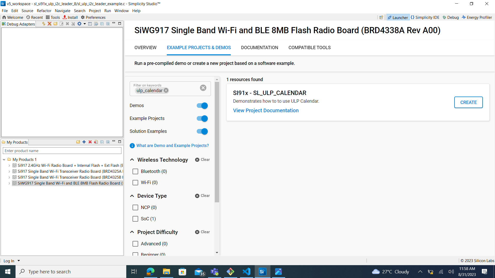

# ULP CALENDAR

## Introduction

- This example demonstrates the clock configuration, one millisecond trigger, one second trigger, alarm configuration and time conversion in this example.
- Before enabling any trigger, it is recommended to calibrate the clock.

## Overview

- Calendar calculates milliseconds, seconds, minutes, hours, days, months and years upto 4 centuries.
- It also calculates days of week and takes care of number of days in month as well as leap year.
- It can also configure alarm for desired time as a oneshot trigger.
- It can generate triggers on one second and one millisecond time interval.
- It uses APB for read and write operations in real time.
- RC clock and RO clock are configurable, and it can also be calibrated using the APIs.

## About Example Code

- This example demonstrates clock configuration, set calendar date-time, calendar get date-time, set alarm date-time, get alarm date-time, alarm trigger, one millisecond trigger, one second trigger and clock calibration.
- To configure the calendar clock, select the clock from UC. \ref sl_si91x_calendar_config is used to set the calendar clock.
- A structure is created which contains default values for calendar date-time. It is created using \ref sl_si91x_calendar_build_datetime_struct, After entering all the parameters, it returns a stucture filled with all the parameters.
- Calendar date-time is configured using \ref sl_si91x_calendar_set_date_time API. It configures the date time and the calendar blocks starts counting from that time.
- To verify if the desired time is set, \ref sl_si91x_calendar_get_date_time API is used, It reutrns a structure which has current date-time.

- If **ALARM_EXAMPLE** macro is enabled:

  - A date-time structure is created using \ref sl_si91x_calendar_build_datetime_struct for configuring the Alarm.
  - Alarm is configured using \ref sl_si91x_calendar_set_alarm API.
  - Now callback is registered to perform action at the time of trigger using \ref sl_si91x_calendar_register_alarm_trigger_callback API.
  - To verify if the desired alarm is set, \ref sl_si91x_calendar_get_alarm API is used, It returns a structure which has configured alarm date-time.
  - At the time of trigger, it prints current date-time on the console.

- If **CLOCK_CALIBRATION** macro is enabled:

  - It is recommended to calibrate clock before activating any trigger.
  - Initialization of clock is performed using \ref sl_si91x_calendar_calibration_init API.
  - According to the clock configured in UC, either RO or RC, use respective API to configure the clock. In this example RC clock is selected so \ref sl_si91x_calendar_rcclk_calibration API is used.
  - This API expects \ref clock_calibration_config_t structure. For rc_trigger_time, \ref RC_CLOCK_CALIBRATION_ENUM enum can be used, and for ro_trigger_time \ref RO_CLOCK_CALIBRATION_ENUM enum can be used.
  - After calibration \ref sl_si91x_calendar_rtc_start is called to start the calendar clock.

- If **SEC_INTR** macro is enabled:

  - Callback is registered for one second trigger using \ref sl_si91x_calendar_register_sec_trigger_callback API.
  - At every one second, the console prints `one_sec_callback`.

- If **MILLI_SEC_INTR** macro is enabled:

  - Callback is registered for one millisecond trigger using \ref sl_si91x_calendar_register_msec_trigger_callback API.
  - At every one second, the console prints `on_msec_callback triggered 1000 times`.
  - It accumulates the 1000 trigger at one millisecond time frame and prints at only one second.

- If **TIME_CONVERSION** macro is enabled:
  - This converts NTP time to Unix Time and vice versa.
  - In this example, \ref sl_si91x_calendar_convert_unix_time_to_ntp_time API is called to convert unix time to ntp time, it expects unix time as parameter.
  - It updates the variable with ntp time which is passed as parameter.
  - After conversion, ntp time and unix time are printed on the console.
  - Now \ref sl_si91x_calendar_convert_ntp_time_to_unix_time API is used to convert ntp time to unix time, it expects ntp time as parameter.
  - It updates the variable with unix time which is passed as parameter.
  - After conversion, ntp time and unix time are printed on the console.

## Running Example Code

- To use this application following Hardware, Software and the Project Setup is required.

### Hardware Requirements

- Windows PC
- Silicon Labs Si917 Evaluation Kit [WPK/WSTK + BRD4338A]


### Software Requirements

- Si91x SDK
- Embedded Development Environment
  - For Silicon Labs Si91x, use the latest version of Simplicity Studio (refer **"Download and Install Simplicity Studio"** section in **getting-started-with-siwx917-soc** guide at **release_package/docs/index.html**)
### VCOM Setup
- The Docklight tool's setup instructions are provided below..


## Project Setup

- **Silicon Labs Si91x** refer **"Download SDK"** section in **getting-started-with-siwx917-soc** guide at **release_package/docs/index.html** to work with Si91x and Simplicity Studio.

## Loading Application on Simplicity Studio

1. With the product Si917 selected, navigate to the example projects by clicking on Example Projects & Demos
   in simplicity studio and click on to rtc Example application as shown below.



## Configuration and Steps for Execution

- Configure UC from the slcp component.
- Open **sl_si91x_calendar.slcp** project file select **software component** tab and search for **Calendar** in search bar.
- Using configuration wizard one can configure the Calendar clock, i.e., RO, RC and XTAL.
- Configuration file is generated in **config folder**, if not changed then the code will run on default UC values.

- Configure the following macros in calenadar_example.h file and update/modify following macros if required.

```C
#define ALARM_EXAMPLE     0 ///< To enable alarm trigger \n
#define CLOCK_CALIBRATION 0 ///< To enable clock calibration \n
#define SEC_INTR          0 ///< To enable one second trigger \n
#define MILLI_SEC_INTR    0 ///< To enable one millisecond trigger \n
#define TIME_CONVERSION   0 ///< To enable time conversion \n
```

## Build

1. Compile the application in Simplicity Studio using build icon.


## Device Programming

- To program the device ,refer **Burn M4 Binary** section in **getting-started-with-siwx917-soc** guide at **release_package/docs/index.html** to work with Si91x and Simplicity Studio.

## Executing the Application

1. Enable any of the macro whose functionality needs to be tested.
2. Compile and run the application.

## Expected Results

- By default time and date is configured and print on serial console is there.
- If ALARM_EXAMPLE is enabled, it prints 'Alarm Triggered' on console when alarm is triggered.
- If SEC_INTR is enabled, every one second serial console print is there.
- If MILLI_SEC_INTR is enabled, every one millisecond serial console print is there.
- If TIME_CONVERSION is enabled, time conversion between unix and ntp is printed on serial console.
## Note
 - This application is executed from RAM.
 - In this application while changing the MCU mode from PS4 to PS2, M4 flash will be turned off.
 - The debug feature of Simplicity Studio will not work after M4 flash is turned off.
 
## Expected Scenario:
 - After Flashing ULP examples as M4 flash will be turned off,flash erase does not work.
 - To Erase the chip follow the below procedure
   - Turn ON ISP switch and press the reset button → Turn OFF ISP Switch → Now perform Chip erase 
      through commander. 
