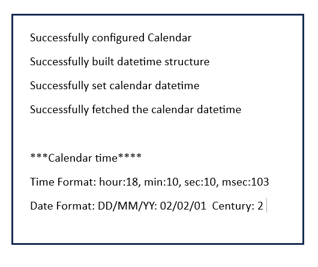

# SiWx91x Platform ULP CALENDAR

## Table of Contents

- [SiWx91x Platform ULP CALENDAR](#platform-siwx91x-ulp-calendar)
  - [Table of Contents](#table-of-contents)
  - [Purpose/Scope](#purposescope)
  - [Overview](#overview)
  - [About Example Code](#about-example-code)
  - [Prerequisites/Setup Requirements](#prerequisitessetup-requirements)
    - [Hardware Requirements](#hardware-requirements)
    - [Software Requirements](#software-requirements)
    - [Setup Diagram](#setup-diagram)
  - [Getting Started](#getting-started)
  - [Application Build Environment](#application-build-environment)
  - [Test the Application](#test-the-application)
  - [Troubleshooting](#troubleshooting)
  - [Resources](#resources)
  - [Report Bugs/Support](#report-bugssupport)

## Purpose/Scope

- This example demonstrates the clock configuration, one millisecond trigger, one second trigger, alarm configuration and time conversion in this example.
- Before enabling any trigger, it is recommended to calibrate the clock.

## Overview

- Calendar calculates milliseconds, seconds, minutes, hours, days, months and years up to 4 centuries.
- It also calculates days of week and takes care of number of days in month as well as leap year.
- It can also configure alarm for desired time as a one shot trigger.
- It can generate triggers on one second and one millisecond time interval.
- It uses APB for read and write operations in real time.
- RC clock and RO clock are configurable, and it can also be calibrated using the APIs.

## About Example Code

- This example demonstrates clock configuration, set calendar date-time, calendar get date-time, set alarm date-time, get alarm date-time, alarm trigger, one millisecond trigger, one second trigger and clock calibration.
- To configure the calendar clock, select the clock from UC. [sl_si91x_calendar_config](https://docs.silabs.com/wiseconnect/latest/wiseconnect-api-reference-guide-si91x-peripherals/calendar#sl-si91x-calendar-config) is used to set the calendar clock.
- A structure is created which contains default values for calendar date-time. It is created using [sl_si91x_calendar_build_datetime_struct](https://docs.silabs.com/wiseconnect/latest/wiseconnect-api-reference-guide-si91x-peripherals/calendar#sl-si91x-calendar-build-datetime-struct), After entering all the parameters, it returns a structure filled with all the parameters.
- Calendar date-time is configured using [sl_si91x_calendar_set_date_time](https://docs.silabs.com/wiseconnect/latest/wiseconnect-api-reference-guide-si91x-peripherals/calendar#sl-si91x-calendar-set-date-time) API. It configures the date time and the calendar blocks starts counting from that time.
- To verify if the desired time is set, [sl_si91x_calendar_get_date_time](https://docs.silabs.com/wiseconnect/latest/wiseconnect-api-reference-guide-si91x-peripherals/calendar#sl-si91x-calendar-get-date-time) API is used, It returns a structure which has current date-time.

- If **ALARM_EXAMPLE** macro is enabled:

  - A date-time structure is created using [sl_si91x_calendar_build_datetime_struct](https://docs.silabs.com/wiseconnect/latest/wiseconnect-api-reference-guide-si91x-peripherals/calendar#sl-si91x-calendar-build-datetime-struct) for configuring the Alarm.
  - Alarm is configured using [sl_si91x_calendar_set_alarm](https://docs.silabs.com/wiseconnect/latest/wiseconnect-api-reference-guide-si91x-peripherals/calendar#sl-si91x-calendar-set-alarm) API.
  - Now callback is registered to perform action at the time of trigger using [sl_si91x_calendar_register_alarm_trigger_callback](https://docs.silabs.com/wiseconnect/latest/wiseconnect-api-reference-guide-si91x-peripherals/calendar#sl-si91x-calendar-register-alarm-trigger-callback) API.
  - To verify if the desired alarm is set, [sl_si91x_calendar_get_alarm](https://docs.silabs.com/wiseconnect/latest/wiseconnect-api-reference-guide-si91x-peripherals/calendar#sl-si91x-calendar-get-alarm) API is used, It returns a structure which has configured alarm date-time.
  - At the time of trigger, it prints current date-time on the console.

- If **SEC_INTR** macro is enabled:

  - Callback is registered for one second trigger using [sl_si91x_calendar_register_sec_trigger_callback](https://docs.silabs.com/wiseconnect/latest/wiseconnect-api-reference-guide-si91x-peripherals/calendar#sl-si91x-calendar-register-sec-trigger-callback) API.
  - At every one second, the console prints `one_sec_callback`.

- If **MILLI_SEC_INTR** macro is enabled:

  - Callback is registered for one millisecond trigger using [sl_si91x_calendar_register_msec_trigger_callback](https://docs.silabs.com/wiseconnect/latest/wiseconnect-api-reference-guide-si91x-peripherals/calendar#sl-si91x-calendar-register-msec-trigger-callback) API.
  - At every one second, the console prints `on_msec_callback triggered 1000 times`.
  - It accumulates the 1000 trigger at one millisecond time frame and prints at only one second.

- If **TIME_CONVERSION** macro is enabled:
  - This converts NTP time to Unix Time and vice versa.
  - In this example, [sl_si91x_calendar_convert_unix_time_to_ntp_time](https://docs.silabs.com/wiseconnect/latest/wiseconnect-api-reference-guide-si91x-peripherals/calendar#sl-si91x-calendar-convert-unix-time-to-ntp-time) API is called to convert unix time to ntp time, it expects unix time as parameter.
  - It updates the variable with ntp time which is passed as parameter.
  - After conversion, ntp time and unix time are printed on the console.
  - Now [sl_si91x_calendar_convert_ntp_time_to_unix_time](https://docs.silabs.com/wiseconnect/latest/wiseconnect-api-reference-guide-si91x-peripherals/calendar#sl-si91x-calendar-convert-ntp-time-to-unix-time) API is used to convert ntp time to unix time, it expects ntp time as parameter.
  - It updates the variable with unix time which is passed as parameter.
  - After conversion, ntp time and unix time are printed on the console.


## Prerequisites/Setup Requirements

### Hardware Requirements

- Windows PC
- Silicon Labs SiWx91x Evaluation Kit [[BRD4002](https://www.silabs.com/development-tools/wireless/wireless-pro-kit-mainboard?tab=overview) + [BRD4338A](https://www.silabs.com/development-tools/wireless/wi-fi/siwx917-rb4338a-wifi-6-bluetooth-le-soc-radio-board?tab=overview) / [BRD4342A](https://www.silabs.com/development-tools/wireless/wi-fi/siwx91x-rb4342a-wifi-6-bluetooth-le-soc-radio-board?tab=overview) / [BRD4343A](https://www.silabs.com/development-tools/wireless/wi-fi/siw917y-rb4343a-wi-fi-6-bluetooth-le-8mb-flash-radio-board-for-module?tab=overview) / [BRD4343C](https://www.silabs.com/development-tools/wireless/wi-fi/siw917y-rb4343c-wi-fi-6-bluetooth-le-8mb-flash-radio-board-for-module?tab=overview)]
- SiWx917 AC1 Module Explorer Kit [BRD2708A](https://www.silabs.com/development-tools/wireless/wi-fi/siw917y-ek2708a-explorer-kit)

### Software Requirements

- Simplicity Studio
- Serial console Setup
  - For Serial Console setup instructions, refer to [link name](https://docs.silabs.com/wiseconnect/latest/wiseconnect-developers-guide-developing-for-silabs-hosts/using-the-simplicity-studio-ide#console-input-and-output).

### Setup Diagram

 

## Getting Started

Refer to the instructions [here](https://docs.silabs.com/wiseconnect/latest/wiseconnect-getting-started/) to:

- [Install Simplicity Studio](https://docs.silabs.com/wiseconnect/latest/wiseconnect-developers-guide-developing-for-silabs-hosts/using-the-simplicity-studio-ide#install-simplicity-studio)
- [Install WiSeConnect extension](https://docs.silabs.com/wiseconnect/latest/wiseconnect-developers-guide-developing-for-silabs-hosts/using-the-simplicity-studio-ide#install-the-wiseconnect-3-extension)
- [Connect your device to the computer](https://docs.silabs.com/wiseconnect/latest/wiseconnect-developers-guide-developing-for-silabs-hosts/using-the-simplicity-studio-ide#connect-siwx91x-to-computer)
- [Upgrade your connectivity firmware](https://docs.silabs.com/wiseconnect/latest/wiseconnect-developers-guide-developing-for-silabs-hosts/using-the-simplicity-studio-ide#update-siwx91x-connectivity-firmware)
- [Create a Studio project](https://docs.silabs.com/wiseconnect/latest/wiseconnect-developers-guide-developing-for-silabs-hosts/using-the-simplicity-studio-ide#create-a-project)

For details on the project folder structure, see the [WiSeConnect Examples](https://docs.silabs.com/wiseconnect/latest/wiseconnect-examples/#example-folder-structure) page.

## Application Build Environment

- Set any of the macros in `calendar_example.h` whose functionality needs to be tested.

- `ALARM_EXAMPLE`: If ALARM_EXAMPLE is enabled, it prints "Alarm Callback is Triggered" on console when the alarm is triggered. By default, it is set to 1.

  ```c
    #define ALARM_EXAMPLE       1 ///< To enable alarm trigger \n
  ```

- `SEC_INTR`: If SEC_INTR is enabled, every one second "One Sec Callback is Triggered" print is displayed on the serial console. By default, it is set to 1.

  ```c
    #define SEC_INTR            1 ///< To enable one second trigger \n
  ```

- `MILLI_SEC_INTR`: If MILLI_SEC_INTR is enabled, every one second "One Milli-Sec Callback triggered 1000 times" print is displayed on the serial console. By default, it is set to 1.

  ```c
    #define MILLI_SEC_INTR      1 ///< To enable one millisecond trigger \n
  ```

- `TIME_CONVERSION`: If TIME_CONVERSION is enabled, time conversion between Unix and NTP is printed on serial console. By default, it is set to 1.

  ```c
    #define TIME_CONVERSION     1 ///< To enable time conversion trigger \n
  ```

- Configure the following macros in the [`ulp_calendar_example.c`](ulp_calendar_example.c) file and update/modify following macros, if required.

- `MAX_SECOND`: Total number of seconds in one minute, used as a bound when iterating time values. By default, it is set to 60u.

  ```c
    #define MAX_SECOND          60u        // Total seconds in one minute
  ```

- `MAX_MINUTE`: Total number of minutes in one hour, used as a bound when iterating time values. By default, it is set to 60u.

  ```c
    #define MAX_MINUTE          60u        // Total minutes in one hour
  ```

- `MAX_HOUR`: Total number of hours in one day, used as a bound when iterating time values. By default, it is set to 24u.

  ```c
    #define MAX_HOUR            24u        // Total hours in one day
  ```

- `SECONDS_IN_HOUR`: Total number of seconds in one hour, used in time calculations. By default, it is set to 3600u.

  ```c
    #define SECONDS_IN_HOUR     3600u      // Total seconds in one hour
  ```

- `UNIX_TEST_TIMESTAMP`: Unix timestamp used as a reference value for time-conversion tests (2001-02-02 18:10:00). By default, it is set to 981117600u.

  ```c
    #define UNIX_TEST_TIMESTAMP 981117600u // Unix Time Stamp for 2001-02-02 18:10:00
  ```

- `MS_DEBUG_DELAY`: Number of one-millisecond trigger counts required before a debug print is emitted from the millisecond callback. By default, it is set to 1000u.

  ```c
    #define MS_DEBUG_DELAY      1000u      // Debug prints after every 1000 counts (callback trigger)
  ```

- `ALARM_CENTURY`: Century value used when building the alarm date-time. By default, it is set to 2u.

  ```c
    #define ALARM_CENTURY      2u
  ```

- `ALARM_YEAR`: Year value used when building the alarm date-time. By default, it is set to 1u.

  ```c
    #define ALARM_YEAR         1u
  ```

- `ALARM_MONTH`: Month used when building the alarm date-time. By default, it is set to February.

  ```c
    #define ALARM_MONTH        February
  ```

- `ALARM_DAY_OF_WEEK`: Day of the week used when building the alarm date-time. By default, it is set to Friday.

  ```c
    #define ALARM_DAY_OF_WEEK  Friday
  ```

- `ALARM_DAY`: Day of the month used when building the alarm date-time. By default, it is set to 2u.

  ```c
    #define ALARM_DAY          2u
  ```

- `ALARM_HOUR`: Hour used when building the alarm date-time. By default, it is set to 18u.

  ```c
    #define ALARM_HOUR         18u
  ```

- `ALARM_MINUTE`: Minute used when building the alarm date-time. By default, it is set to 10u.

  ```c
    #define ALARM_MINUTE       10u
  ```

- `ALARM_SECONDS`: Seconds value used when building the alarm date-time. By default, it is set to 15u.

  ```c
    #define ALARM_SECONDS      15u
  ```

- `ALARM_MILLISECONDS`: Milliseconds value used when building the alarm date-time. By default, it is set to 100u.

  ```c
    #define ALARM_MILLISECONDS 100u
  ```

> **Note**: For recommended settings, please refer the [recommendations guide](https://docs.silabs.com/wiseconnect/latest/wiseconnect-developers-guide-prog-recommended-settings/).

## Test the Application

> **Note:** Use **`Log_script.py`** from the **SiWx91x Platform Logger** example (`examples/si91x_soc/service/sl_si91x_logger/`) to decode structured console log output. Run:
>
> `python Log_script.py --out firmware.out --descriptor SYSVIEW_CaptiveCore.txt --port COM5 --max-args 3`
>
> Replace **COM5** with the serial port your board uses on the host PC.


Refer to the instructions [here](https://docs.silabs.com/wiseconnect/latest/wiseconnect-getting-started/) to:

- Build the SL ULP CALENDAR example in Studio.
- Flash, run and debug the application.
- After successful program execution the prints in serial console looks as shown below.

  >

> **Note:**
>
>- The required files for low power state are moved to RAM rest of the application is executed from flash.
>- In this application we are changing the power state from PS4 to PS2 and SET the ALARM_EXAMPLE to switch from the PS2 TO PS4.


> **Note:**
>
> - Interrupt handlers are implemented in the driver layer, and user callbacks are provided for custom code. If you want to write your own interrupt handler instead of using the default one, make the driver interrupt handler a weak handler. Then, copy the necessary code from the driver handler to your custom interrupt handler.
>
> **Note:**
>
>- This application is intended for demonstration purposes only to showcase the ULP peripheral functionality. It should not be used as a reference for real-time use case project development, because the wireless shutdown scenario is not supported in the current SDK.
## Troubleshooting

- If the project does not build, ensure Simplicity Studio and the WiSeConnect extension are installed and the board is connected.
- If the device is not detected, reinstall the connectivity firmware and check USB drivers.

## Resources

- [WiSeConnect Getting Started](https://docs.silabs.com/wiseconnect/latest/wiseconnect-getting-started/)
- [WiSeConnect Examples](https://docs.silabs.com/wiseconnect/latest/wiseconnect-examples/)
- [SiWx91x SoC Documentation](https://docs.silabs.com/wiseconnect/latest/)

## Report Bugs/Support

For issues and support, use the Silicon Labs Community or your normal support channel.

