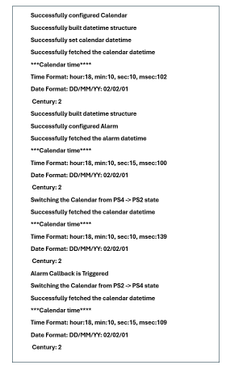

# SL ULP CALENDAR

## Table of Contents

- [Purpose/Scope](#purposescope)
- [Overview](#overview)
- [About Example Code](#about-example-code)
- [Prerequisites/Setup Requirements](#prerequisitessetup-requirements)
  - [Hardware Requirements](#hardware-requirements)
  - [Software Requirements](#software-requirements)
  - [Setup Diagram](#setup-diagram)
- [Getting Started](#getting-started)
- [Application Build Environment](#application-build-environment)
- [Test the Application](#test-the-application)

## Purpose/Scope

- This example demonstrates the clock configuration, one millisecond trigger, one second trigger, alarm configuration and time conversion in this example.
- Before enabling any trigger, it is recommended to calibrate the clock.

## Overview

- Calendar calculates milliseconds, seconds, minutes, hours, days, months and years up to 4 centuries.
- It also calculates days of week and takes care of number of days in month as well as leap year.
- It can also configure alarm for desired time as a one shot trigger.
- It can generate triggers on one second and one millisecond time interval.
- It uses APB for read and write operations in real time.
- RC clock and RO clock are configurable, and it can also be calibrated using the APIs.

## About Example Code

- This example demonstrates clock configuration, set calendar date-time, calendar get date-time, set alarm date-time, get alarm date-time, alarm trigger, one millisecond trigger, one second trigger and clock calibration.
- To configure the calendar clock, select the clock from UC. \ref sl_si91x_calendar_config is used to set the calendar clock.
- A structure is created which contains default values for calendar date-time. It is created using \ref sl_si91x_calendar_build_datetime_struct, After entering all the parameters, it returns a structure filled with all the parameters.
- Calendar date-time is configured using \ref sl_si91x_calendar_set_date_time API. It configures the date time and the calendar blocks starts counting from that time.
- To verify if the desired time is set, \ref sl_si91x_calendar_get_date_time API is used, It returns a structure which has current date-time.

- If **ALARM_EXAMPLE** macro is enabled:

  - A date-time structure is created using \ref sl_si91x_calendar_build_datetime_struct for configuring the Alarm.
  - Alarm is configured using \ref sl_si91x_calendar_set_alarm API.
  - Now callback is registered to perform action at the time of trigger using \ref sl_si91x_calendar_register_alarm_trigger_callback API.
  - To verify if the desired alarm is set, \ref sl_si91x_calendar_get_alarm API is used, It returns a structure which has configured alarm date-time.
  - At the time of trigger, it prints current date-time on the console.

- If **SEC_INTR** macro is enabled:

  - Callback is registered for one second trigger using \ref sl_si91x_calendar_register_sec_trigger_callback API.
  - At every one second, the console prints `one_sec_callback`.

- If **MILLI_SEC_INTR** macro is enabled:

  - Callback is registered for one millisecond trigger using \ref sl_si91x_calendar_register_msec_trigger_callback API.
  - At every one second, the console prints `on_msec_callback triggered 1000 times`.
  - It accumulates the 1000 trigger at one millisecond time frame and prints at only one second.

- If **TIME_CONVERSION** macro is enabled:
  - This converts NTP time to Unix Time and vice versa.
  - In this example, \ref sl_si91x_calendar_convert_unix_time_to_ntp_time API is called to convert unix time to ntp time, it expects unix time as parameter.
  - It updates the variable with ntp time which is passed as parameter.
  - After conversion, ntp time and unix time are printed on the console.
  - Now \ref sl_si91x_calendar_convert_ntp_time_to_unix_time API is used to convert ntp time to unix time, it expects ntp time as parameter.
  - It updates the variable with unix time which is passed as parameter.
  - After conversion, ntp time and unix time are printed on the console.

## Prerequisites/Setup Requirements

### Hardware Requirements

- Windows PC
- Silicon Labs Si917 Evaluation Kit [WPK(BRD4002) + BRD4338A / BRD4342A / BRD4343A ]
- SiWx917 AC1 Module Explorer Kit (BRD2708A)

### Software Requirements

- Simplicity Studio
- Serial console Setup
  - For Serial Console setup instructions, refer [here](https://docs.silabs.com/wiseconnect/latest/wiseconnect-developers-guide-developing-for-silabs-hosts/#console-input-and-output).

### Setup Diagram

 

## Getting Started

Refer to the instructions [here](https://docs.silabs.com/wiseconnect/latest/wiseconnect-getting-started/) to:

- [Install Simplicity Studio](https://docs.silabs.com/wiseconnect/latest/wiseconnect-developers-guide-developing-for-silabs-hosts/#install-simplicity-studio)
- [Install WiSeConnect 3 extension](https://docs.silabs.com/wiseconnect/latest/wiseconnect-developers-guide-developing-for-silabs-hosts/#install-the-wi-se-connect-3-extension)
- [Connect your device to the computer](https://docs.silabs.com/wiseconnect/latest/wiseconnect-developers-guide-developing-for-silabs-hosts/#connect-si-wx91x-to-computer)
- [Upgrade your connectivity firmware ](https://docs.silabs.com/wiseconnect/latest/wiseconnect-developers-guide-developing-for-silabs-hosts/#update-si-wx91x-connectivity-firmware)
- [Create a Studio project ](https://docs.silabs.com/wiseconnect/latest/wiseconnect-developers-guide-developing-for-silabs-hosts/#create-a-project)

For details on the project folder structure, see the [WiSeConnect Examples](https://docs.silabs.com/wiseconnect/latest/wiseconnect-examples/#example-folder-structure) page.

## Application Build Environment

- Set any of the macro in calender_example.h whose functionality needs to be tested.

- To enable alarm trigger callback set the ALARM_EXAMPLE macro.

  ```C
   #define ALARM_EXAMPLE       1 ///< To enable alarm trigger \n
  ```

- To enable second trigger callback set the SEC_INTR macro.

   ```C
    #define SEC_INTR           1 ///< To enable one second trigger \n
   ```

- To enable millisecond trigger callback set the MILLI_SEC_INTR macro.

   ```C
    #define MILLI_SEC_INTR     1 ///< To enable one millisecond trigger \n
   ```

- To enable time conversion set the TIME_CONVERSION macro.

   ```C
    #define TIME_CONVERSION    1 ///< To enable time conversion trigger \n
   ```

## Test the Application

Refer to the instructions [here](https://docs.silabs.com/wiseconnect/latest/wiseconnect-getting-started/) to:

- Build the SL ULP CALENDAR example in Studio.
- Flash, run and debug the application.
- After successful program execution the prints in serial console looks as shown below.

  >

> **Note:**
>
>- The required files for low power state are moved to RAM rest of the application is executed from flash.
>- In this application we are changing the power state from PS4 to PS2 and SET the ALARM_EXAMPLE to switch from the PS2 TO PS4.


> **Note:**
>
> - Interrupt handlers are implemented in the driver layer, and user callbacks are provided for custom code. If you want to write your own interrupt handler instead of using the default one, make the driver interrupt handler a weak handler. Then, copy the necessary code from the driver handler to your custom interrupt handler.
>
> **Note:**
>
>- This application is intended for demonstration purposes only to showcase the ULP peripheral functionality. It should not be used as a reference for real-time use case project development, because the wireless shutdown scenario is not supported in the current SDK.