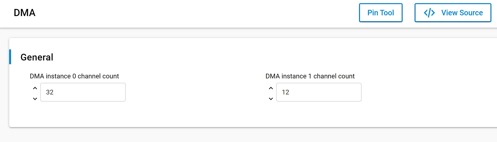
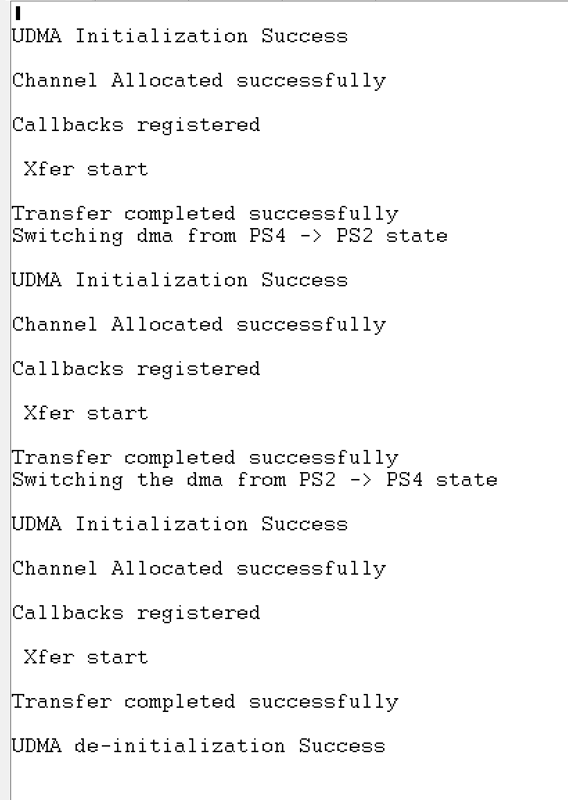

# SL ULP DMA

## Table of Contents

- [Purpose/Scope](#purposescope)
- [Overview](#overview)
- [About Example Code](#about-example-code)
- [Prerequisites/Setup Requirements](#prerequisitessetup-requirements)
  - [Hardware Requirements](#hardware-requirements)
  - [Software Requirements](#software-requirements)
  - [Setup Diagram](#setup-diagram)
- [Getting Started](#getting-started)
- [Application Build Environment](#application-build-environment)
- [Test the Application](#test-the-application)

## Purpose/Scope

- This DMA example performs memory to memory DMA transfer of different sizes. User can change the DMA transfer size by updating SL_DMA_TRANSFER_SIZE in UC.
- This example used both simple DMA transfer API and generic API for performing DMA transfer

## Overview

- DMA is used for performing transfers without processor intervention.
- Si91x DMA supports 3 types of DMA transfers. They are memory to memory, peripheral to memory, memory to peripheral
- This DMA supports 32 channels. Out of which last 24 are dedicated channels for particular peripherals. First 8 channels can support 32 different peripherals.
- The number of transfers in a single DMA cycle can be programmed from 1 to 1024
- The transfer address increment can be greater than the data width
- ULP_DMA only supports 12 channels.

## About Example Code

- \ref ulp_dma_example.c file demonstrates how to use DMA peripheral to perform memory to memory transfers
- In this example first dma initialization is done using \ref sl_si91x_dma_init
- Then \ref sl_si91x_dma_allocate_channel is used to allocate ULP_DMA_CHANNEL for transfer.
- After configuring channel, callbacks are registered using \ref sl_si91x_dma_register_callbacks
- In this example DMA transfer can be initiated by two methods,
  1.  Using \ref sl_si91x_dma_simple_transfer, user can quickly perform DMA transfer using bare minimum configurations.
  2.  Using \ref sl_si91x_dma_transfer, user can configure more DMA parameters for transfer
- User can either use any of above functions for performing DMA transfer.
> **Note:** When utilizing the ULP_DMA instance in high power mode, it is advisable to allocate buffers in the ULP Memory block.

## Prerequisites/Setup Requirements

Before running the application, the user will need the following things to setup.

### Hardware Requirements

- Windows PC
- Silicon Labs Si917 Evaluation Kit [WPK(BRD4002) + BRD4338A / BRD4342A / BRD4343A ]
- SiWx917 AC1 Module Explorer Kit (BRD2708A)

### Software Requirements

- Simplicity Studio
- Serial console Setup
  - For Serial Console setup instructions, refer [here](https://docs.silabs.com/wiseconnect/latest/wiseconnect-developers-guide-developing-for-silabs-hosts/#console-input-and-output).

### Setup Diagram


## Getting Started

Refer to the instructions [here](https://docs.silabs.com/wiseconnect/latest/wiseconnect-getting-started/) to:

- [Install Simplicity Studio](https://docs.silabs.com/wiseconnect/latest/wiseconnect-developers-guide-developing-for-silabs-hosts/#install-simplicity-studio)
- [Install WiSeConnect 3 extension](https://docs.silabs.com/wiseconnect/latest/wiseconnect-developers-guide-developing-for-silabs-hosts/#install-the-wi-se-connect-3-extension)
- [Connect your device to the computer](https://docs.silabs.com/wiseconnect/latest/wiseconnect-developers-guide-developing-for-silabs-hosts/#connect-si-wx91x-to-computer)
- [Upgrade your connectivity firmware ](https://docs.silabs.com/wiseconnect/latest/wiseconnect-developers-guide-developing-for-silabs-hosts/#update-si-wx91x-connectivity-firmware)
- [Create a Studio project ](https://docs.silabs.com/wiseconnect/latest/wiseconnect-developers-guide-developing-for-silabs-hosts/#create-a-project)

For details on the project folder structure, see the [WiSeConnect Examples](https://docs.silabs.com/wiseconnect/latest/wiseconnect-examples/#example-folder-structure) page.

## Application Build Environment

### Application Configuration Parameters
- Configure UC from the slcp component.

  

- Open **sl_si91x_ulp_dma.slcp** project file select **software component** tab and search for **SL_DMA** in search bar.
- Configure SL_ULP_DMA_CHANNEL_COUNT(0 - 12) - Number of available channels for ULP_DMA
- Configure the following macros in ulp_dma_example.c file and update/modify following macros if required.

```C
#define ULP_DMA_SIMPLE_TRANSFER 1    ///< Enable/Disable simple transfer
#define ULP_DMA_CHANNEL         12   ///< ULP_DMA channel number 12
#define ULP_DMA_TRANSFER_SIZE   2048 ///< DMA transfer size
```

## Test the Application

Refer to the instructions [here](https://docs.silabs.com/wiseconnect/latest/wiseconnect-getting-started/) to:

- Build the SL ULP DMA example in Studio.
- Flash, run and debug the application.
- After successful program execution the prints in serial console looks as shown below.

  >

**Note:**
>- The required files for low power state are moved to RAM rest of the application is executed from flash.
>- In this application we are changing the power state from PS4 to PS2 and vice - versa. 


> **Note:**
>
> - Interrupt handlers are implemented in the driver layer, and user callbacks are provided for custom code. If you want to write your own interrupt handler instead of using the default one, make the driver interrupt handler a weak handler. Then, copy the necessary code from the driver handler to your custom interrupt handler.
