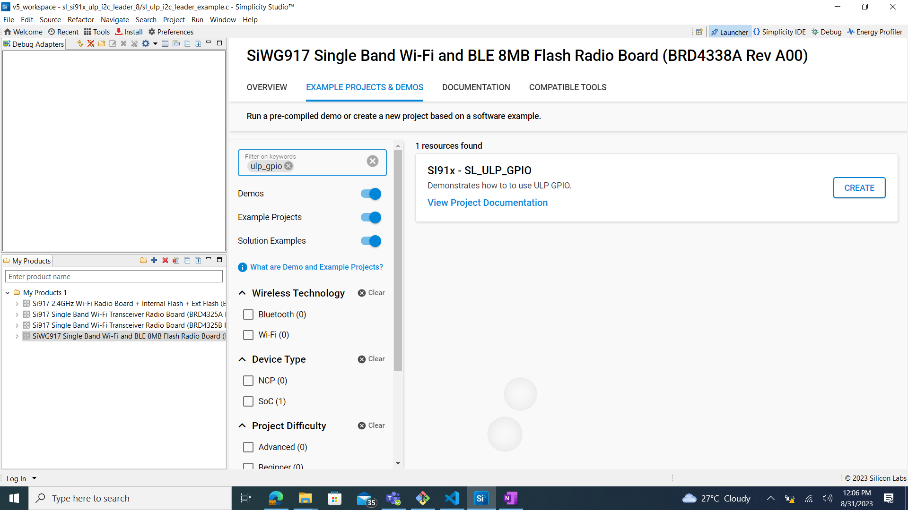

# ULP GPIO

## Introduction

- The ULP GPIO has 2 instances in MCU.
  - ULP Domain is used to control the ULP GPIO's(ULP_GPIO_n; n=0 to 11)
  - UULP Domain which is used to control the UULP GPIO's(UULP_GPIO_n; n=0 to 4)
- ULP GPIO domain has only one port and calling as Port 4 in program which has maximum of 12 pins.
- All the GPIO pins in ULP Domain support set,clear,toggle,programmed as output,input etc.

## Setting Up

- To use this application following Hardware, Software and the Project Setup is required

### Hardware Requirements

- Windows PC
- Silicon Labs [Si917 Evaluation Kit WSTK/WPK + BRD4338A]


### Software Requirements

- Si91x SDK
- Embedded Development Environment
  - For Silicon Labs Si91x, use the latest version of Simplicity Studio (refer **"Download and Install Simplicity Studio"** section in **getting-started-with-siwx917-soc** guide at **release_package/docs/index.html**)

## Examples

- Details for the example code are described in the following sub-sections.

## Initialization of GPIO in ULP Domain

NOTE : GPIO ULP instance have port-4.

- GPIO to work in ULP Domain requires few steps to consider.
- Call \ref ulp_gpio_initialization(). This API has some API's being called, which are discussed below.
  - Enable \ref sl_si91x_gpio_enable_clock(), passing enumerator ULPCLK_GPIO of type sl_si91x_gpio_select_clock_t as parameter.
  - Enable PAD receiver for GPIO pin to program if using pin as input \ref sl_si91x_gpio_enable_ulp_pad_receiver(), passing GPIO pin number as parameter.
  - Set mode of the GPIO pin using \ref sl_gpio_set_pin_mode() API. Pass port of type \ref sl_gpio_port_t, pin, mode of type \ref sl_gpio_mode_t, output value as parameters.
  - Set direction of the GPIO pin using \ref sl_si91x_gpio_set_pin_direction() API. Pass port, pin , direction of type \ref sl_si91x_gpio_direction_t as parameters.
- We can use \ref sl_gpio_get_pin_input() API, to get/read status from gpio pin. Parameters passed are ULP port and pin.
- To handle the pin interrupt in ULP GPIO, API \ref sl_si91x_gpio_configure_ulp_pin_interrupt() is used.
- To handle the group interrupt in ULP GPIO, API \ref sl_si91x_gpio_configure_ulp_group_interrupt() is used.

## Initialization of GPIO in UULP Domain

- GPIO to work in UULP Domain requires few steps to consider.
- Call \ref uulp_gpio_initialization(). This API has some API's being called, which are discussed below.
  - Enable \ref sl_si91x_gpio_enable_clock(), passing enumerator ULPCLK_GPIO of type sl_si91x_gpio_select_clock_t as parameter.
  - Enable input buffer for GPIO pin \ref sl_si91x_gpio_select_uulp_npss_input_buffer(), passing GPIO pin number, buffer of type \ref sl_si91x_gpio_input_buffer_t as parameter.
  - Set mode of the GPIO pin using \ref sl_si91x_gpio_set_uulp_npss_pin_mux() API. Pass pin, mode of type \ref sl_si91x_uulp_npss_mode_t as parameters.
  - Set direction of the GPIO pin using \ref sl_si91x_gpio_set_uulp_npss_direction() API. Pass pin , direction of type \ref sl_si91x_gpio_direction_t as parameters.
- We can use \ref sl_si91x_gpio_set_uulp_npss_pin_value() API, to set the GPIO pin.
- To handle the pin interrupt in UULP GPIO, API \ref sl_si91x_gpio_configure_uulp_interrupt() is used.
- To get the status of the GPIO pin use \ref sl_si91x_gpio_get_uulp_npss_pin() API, by passing pin number as parameter.

## Project Setup

- **Silicon Labs Si91x** refer **"Download SDK"** section in **getting-started-with-siwx917-soc** guide at **release_package/docs/index.html** to work with Si91x and Simplicity Studio

### VCOM Setup

- The Serial Console tool's setup instructions are provided below..


## Loading Application on Simplicity Studio

1. With the product Si917 selected, navigate to the example projects by clicking on Example Projects & Demos in simplicity studio and click on to GPIO Example application as shown below.



## Configuration and Steps for Execution

- Configure the following parameters in ulp_gpio_example.c (examples/si91x_soc/peripheral/sl_si91x_ulp_gpio/) file and update/modify following macros if required

  ```c
  #define PORT0                    0      // GPIO Port number(0 to 4)
  #define PIN_COUNT                2      // Number of interrupts needed
  #define POLARITY                 0      // Polarity for GPIO pin
  #define GRP_CNT                  2      // Count of group interrupt pins
  #define INT_CH                   0      // GPIO Pin interrupt 0
  #define NPSS_INTR                2      // NPSS GPIO interrupt number
  #define DELAY                    1000   // Delay for 1sec
  ```

## Build

1. Compile the application in Simplicity Studio using build icon.


## Device Programming

- To program the device ,refer **"Burn M4 Binary"** section in **getting-started-with-siwx917-soc** guide at **release_package/docs/index.html** to work with Si91x and Simplicity Studio

## Executing the Application

1. Compile and run the application. Please refer **getting-started-with-siwx917-soc** guide at **release_package/docs/index.html** on how to complie and run the application. 

## Expected Results

- GPIO should be continously toggled ,connect logic analyser to F11 on WSTK board to observe the toggle state.

NOTE: These pin configurations are specific to BRD4338A board.

## Additional Information:
  NOTE: ALL enumerators defined below are of type \ref gpio_instance_type_t which are present in ulp_gpio_example.c. Make corresponding enumerator to '1', in order to enable the individual functionalities mentioned below.
- By default ULP_GPIO_PIN(ULP GPIO instance) is enabled, ULP pin direction, mode are printed on the serial console. Connect ULP_GPIO_1 pin to 0v and to 3.3v, and observe the LED0 toggle state. By default led(LED0) will be in high state. Connect logic analyser to P16(ULP_GPIO_1), F10(LED0) and observe the pins state.
- If UULP_GPIO_PIN is enabled, UULP pin direction is printed on the serial console. Connect logic analyser to P14 on WSTK board to observe the toggle state.
- If ULP_GPIO_PIN_INTR is enabled, it triggers ULP Domain pin interrupt. For analyzing pin interrupt keep a print (or) toggle (or) set(or) clear in ULP_PIN_IRQ_Handler() present in ulp_gpio_example.c.
- If ULP_GPIO_GROUP_INTR is enabled, it triggers ULP group interrupt. For analyzing group interrupt keep a print (or) toggle (or) set(or) clear in ULP_GROUP_IRQ_Handler() present in ulp_gpio_example.c.
- If UULP_GPIO_PIN_INTR is enabled, it triggers UULP pin interrupt. For analyzing pin interrupt keep a print (or) toggle (or) set(or) clear in UULP_PIN_IRQ_Handler() present in ulp_gpio_example.c.

