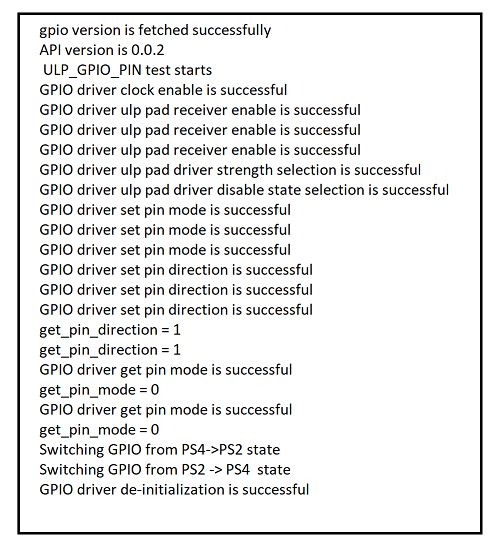

# SL ULP GPIO STATE TRANSITION EXAMPLE

## Table of Contents

- [SL ULP GPIO STATE TRANSITION EXAMPLE](#sl-ulp-gpio-state-transition-example)
  - [Table of Contents](#table-of-contents)
  - [Purpose/Scope](#purposescope)
  - [Overview](#overview)
  - [About Example Code](#about-example-code)
  - [Prerequisites/Setup Requirements](#prerequisitessetup-requirements)
    - [Hardware Requirements](#hardware-requirements)
    - [Software Requirements](#software-requirements)
    - [Setup Diagram](#setup-diagram)
  - [Getting Started](#getting-started)
  - [Application Build Environment](#application-build-environment)
    - [Application Configuration Parameters](#application-configuration-parameters)
  - [Test the Application](#test-the-application)

## Purpose/Scope

This default application demonstrates the toggling of ULP (Ultra Low Power) instance GPIO by switching from PS4 -> PS2 and PS2 -> PS4 states.

## Overview

- The GPIO functionality in the MCU consists of three instances:
  - HP (High Power) Instance: Controls the SoC GPIOs (GPIO_n; n=0 to 57).
  - ULP (Ultra Low Power) Instance: Controls the ULP GPIOs (ULP_GPIO_n; n=0 to 11).
  - UULP (Ultra Ultra Low Power) Instance: Controls the UULP GPIOs (UULP_GPIO_n; n=0 to 4).
- HP and ULP Instance have the same features and functionality except for different base address.
- Each port in the HP domain supports a maximum of 16 GPIO pins, with a total of four ports (SL_GPIO_PORT_A, SL_GPIO_PORT_B, SL_GPIO_PORT_C, SL_GPIO_PORT_D).
- The ULP GPIO domain has only one port (SL_GPIO_ULP_PORT) with a maximum of 12 pins.  
- Similarly, the UULP GPIO domain has only one port (SL_GPIO_UULP_PORT) with a maximum of 5 pins.

  > **Note:** Note that GPIO_n (n=0:5) are dedicated for the Secure Zone Processor's Flash interface. The MCU should NOT be changing any configuration related to these GPIOs under any circumstances since it may lead to the Flash content being corrupted, rendering the chip unusable. This is applicable to MCU HP EGPIO Instance.

- All GPIO pins in the HP/ULP/UULP instances support operations such as set, clear, and toggle, and can be programmed as either output or input.

   As HP GPIO instance has 4 ports and each port has 16 pins. Each port pins are represented from 0 - 15 set.

   The following below explains the Port and Pin selection for different instances:

   |  GPIO Instance                 |    GPIO Port      |  GPIO Pin Number  |
   |--------------------------------|-------------------|-------------------|  
   |                                |  SL_GPIO_PORT_A   |   (0-15)          |
   | HP GPIO Instance               |  SL_GPIO_PORT_B   |   (16-31)         |
   |                                |  SL_GPIO_PORT_C   |   (32-47)         |
   |                                |  SL_GPIO_PORT_D   |   (48-57)         |
   |--------------------------------|-------------------|-------------------|
   | ULP GPIO Instance              |  SL_GPIO_ULP_PORT |   (0-11)          |
   |--------------------------------|-------------------|-------------------|
   | UULP GPIO Instance             | SL_GPIO_UULP_PORT |   (0-4)           |

>**Notes**
>- There is also option to select (0-57) pins with SL_GPIO_PORT_A. For example, to select HP GPIO pin number 49, you can select Port as SL_GPIO_PORT_A and pin number as 49. This option is given only when SL_GPIO_PORT_A GPIO port is selected. (57-63) pins are reserved.
>- For information about selecting Port and Pin number for different instances,  see the following points:
>
>   - To select HP GPIO pin number 16 for usage, select the Port as SL_GPIO_PORT_B and Pin number as 0.
>   - To select HP GPIO pin number 31 for usage, select the Port as SL_GPIO_PORT_B and Pin number as 15.
>   - To select HP GPIO pin number 33 for usage, select the Port as SL_GPIO_PORT_C and Pin number as 1.
>   - To select HP GPIO pin number 56 for usage, select the Port as SL_GPIO_PORT_D and Pin number as 14.
>   - To select ULP  GPIO pin number 10 for usage, select the Port as SL_GPIO_ULP_PORT and Pin number as 10.
>   - To select UULP  GPIO pin number 2 for usage, select the Port as SL_GPIO_UULP_PORT and Pin number as 2.

- Refer to the following APIs that are common for all three instances and are differentiated based on Port and Pin:

  - [sl_gpio_set_configuration()](https://docs.silabs.com/wiseconnect/3.5.0/wiseconnect-api-reference-guide-si91x-peripherals/gpio#sl-gpio-set-configuration) // configure GPIO pin
  - [sl_gpio_driver_set_pin()](https://docs.silabs.com/wiseconnect/3.5.0/wiseconnect-api-reference-guide-si91x-peripherals/gpio#sl-gpio-driver-set-pin) // set the GPIO pin
  - [sl_gpio_driver_clear_pin()](https://docs.silabs.com/wiseconnect/3.5.0/wiseconnect-api-reference-guide-si91x-peripherals/gpio#sl-gpio-driver-clear-pin) // clear the GPIO pin
  - [sl_gpio_driver_get_pin()](https://docs.silabs.com/wiseconnect/3.5.0/wiseconnect-api-reference-guide-si91x-peripherals/gpio#sl-gpio-driver-get-pin)  // get the status of the GPIO pin
  - [sl_gpio_driver_toggle_pin()](https://docs.silabs.com/wiseconnect/3.5.0/wiseconnect-api-reference-guide-si91x-peripherals/gpio#sl-gpio-driver-toggle-pin) // toggle the GPIO pin
  - [sl_gpio_driver_configure_interrupt()](https://docs.silabs.com/wiseconnect/3.5.0/wiseconnect-api-reference-guide-si91x-peripherals/gpio#sl-gpio-driver-configure-interrupt) // configure the HP/ULP/UULP  pin interrupt

- Using [sl_gpio_set_configuration()](https://docs.silabs.com/wiseconnect/3.5.0/wiseconnect-api-reference-guide-si91x-peripherals/gpio#sl-gpio-set-configuration), you can configure mode and direction using port and pin for all three instances. By default, the mode is set to mode0 using this API.
- To configure the GPIO to a different mode, use [sl_gpio_driver_set_pin_mode()](https://docs.silabs.com/wiseconnect/3.5.0/wiseconnect-api-reference-guide-si91x-peripherals/gpio#sl-gpio-driver-set-pin-mode) - applicable to HP and ULP  instances.
- Configure GPIO to another direction using [sl_si91x_gpio_driver_set_pin_direction()](https://docs.silabs.com/wiseconnect/3.5.0/wiseconnect-api-reference-guide-si91x-peripherals/gpio#sl-si91x-gpio-driver-set-pin-direction) - applicable for all three instances, [sl_si91x_gpio_driver_set_uulp_npss_pin_mux()](https://docs.silabs.com/wiseconnect/3.5.0/wiseconnect-api-reference-guide-si91x-peripherals/gpio#sl-si91x-gpio-driver-set-uulp-npss-pin-mux) for UULP  instance. To achieve other modes in GPIO, refer to pin MUX section in HRM.
- There are several individual APIs available for specific GPIO configurations:
  - Driver Strength (HP instance): The [sl_si91x_gpio_driver_select_pad_driver_strength()](https://docs.silabs.com/wiseconnect/3.5.0/wiseconnect-api-reference-guide-si91x-peripherals/gpio#sl-si91x-gpio-driver-select-pad-driver-strength) function allows you to adjust the driver strength in the HP instance.
  - Driver Strength (ULP instance): The [sl_si91x_gpio_driver_select_ulp_pad_driver_strength()](https://docs.silabs.com/wiseconnect/3.5.0/wiseconnect-api-reference-guide-si91x-peripherals/gpio#sl-si91x-gpio-driver-select-ulp-pad-driver-strength) function allows you to adjust the driver strength in the ULP instance.
  - Slew Rate (HP instance): Use [sl_gpio_driver_set_slew_rate()](https://docs.silabs.com/wiseconnect/3.5.0/wiseconnect-api-reference-guide-si91x-peripherals/gpio#sl-gpio-driver-set-slew-rate) to configure the slew rate for the HP instance.
  - Slew Rate (ULP instance): The [sl_si91x_gpio_driver_select_ulp_pad_slew_rate()](https://docs.silabs.com/wiseconnect/3.5.0/wiseconnect-api-reference-guide-si91x-peripherals/gpio#sl-si91x-gpio-driver-select-ulp-pad-slew-rate) function is used to set the slew rate for the ULP instance.
  - Driver Disable State (HP instance): The [sl_si91x_gpio_driver_select_pad_driver_disable_state()](https://docs.silabs.com/wiseconnect/3.5.0/wiseconnect-api-reference-guide-si91x-peripherals/gpio#sl-si91x-gpio-driver-select-pad-driver-disable-state) function enables the configuration of pull-up, pull-down, or repeater functionality for GPIO pins in the HP instance.
  - Driver Disable State (ULP instance): The [sl_si91x_gpio_driver_select_ulp_pad_driver_disable_state()](https://docs.silabs.com/wiseconnect/3.5.0/wiseconnect-api-reference-guide-si91x-peripherals/gpio#sl-si91x-gpio-driver-select-ulp-pad-driver-disable-state) function enables the configuration of pull-up, pull-down, or repeater functionality for GPIO pins in the ULP instance.
- The PAD selection for corresponding GPIO is taken care implicitly in [sl_gpio_set_configuration()](https://docs.silabs.com/wiseconnect/3.5.0/wiseconnect-api-reference-guide-si91x-peripherals/gpio#sl-gpio-set-configuration). If you explicitly want to use, refer to [sl_si91x_gpio_driver_enable_pad_selection()](https://docs.silabs.com/wiseconnect/3.5.0/wiseconnect-api-reference-guide-si91x-peripherals/gpio#sl-si91x-gpio-driver-enable-pad-selection).
- To enable host PAD selection for GPIO pin numbers (25 - 30), refer to [sl_si91x_gpio_driver_enable_host_pad_selection()](https://docs.silabs.com/wiseconnect/3.5.0/wiseconnect-api-reference-guide-si91x-peripherals/gpio#sl-si91x-gpio-driver-enable-host-pad-selection).
> **Note:** Do not enable PAD selection number 9, as it is pre-configured for another function .

## About Example Code

- By default, the ULP_GPIO_PIN macro is enabled. For Si917, ULP GPIO 2 (F10) will toggle during the transition from PS4 to PS2 and from PS2 back to PS4, after which the GPIO is de-initialized. If using the Si915 board, GPIO 10 (F10) will perform the same toggling. Connect an analyzer to F10 to observe the toggles.
- By enabling UULP_GPIO_PIN macro, UULP_GPIO_0(P14) will be toggled when transition takes place from PS4 -> PS2 and from PS2 -> PS4 and finally it de-initializes the GPIO. Connect analyzer to P14 and observe toggles.
- By enabling ULP_GPIO_PIN_INTR macro, ULP_GPIO_8(P15) acts as a ULP pin interrupt. Connect P15 to BTN1/BTN0 and trigger interrupt. Interrupt occurs during state transitions only, after that GPIO de-initializes.
- By enabling ULP_GPIO_GROUP_INTR macro, ULP_GPIO_8(P15) and ULP_GPIO_10(P17) acts as a ULP group interrupt on the IC board **or** ULP GPIO8 and ULP_GPIO_4 on the ACX Module board. Connect P15 to BTN1, P17 to BTN0, **or** vice-versa and trigger both interrupts at a time as it is AND event. Interrupt occurs during state transitions only, after that GPIO de-initializes.
- By enabling UULP_GPIO_PIN_INTR macro, UULP_GPIO_2(F12) acts as a UULP pin interrupt. Press BTN0 and trigger interrupt. Interrupt occurs during state transitions only, after that GPIO de-initializes.

## Prerequisites/Setup Requirements

### Hardware Requirements

- Windows PC
- Silicon Labs Si917 Evaluation Kit [WPK(BRD4002) + BRD4338A/ BRD4342A / BRD4343A ]
- SiWx917 AC1 Module Explorer Kit (BRD2708A)

### Software Requirements

- Simplicity Studio
- Serial console setup
  - For serial console setup instructions, refer [here](https://docs.silabs.com/wiseconnect/latest/wiseconnect-developers-guide-developing-for-silabs-hosts/#console-input-and-output).

### Setup Diagram


## Getting Started

Refer to the instructions [here](https://docs.silabs.com/wiseconnect/latest/wiseconnect-getting-started/) to:

- [Install Simplicity Studio](https://docs.silabs.com/wiseconnect/latest/wiseconnect-developers-guide-developing-for-silabs-hosts/#install-simplicity-studio)
- [Install WiSeConnect 3 extension](https://docs.silabs.com/wiseconnect/latest/wiseconnect-developers-guide-developing-for-silabs-hosts/#install-the-wi-se-connect-3-extension)
- [Connect your device to the computer](https://docs.silabs.com/wiseconnect/latest/wiseconnect-developers-guide-developing-for-silabs-hosts/#connect-si-wx91x-to-computer)
- [Upgrade your connectivity firmware](https://docs.silabs.com/wiseconnect/latest/wiseconnect-developers-guide-developing-for-silabs-hosts/#update-si-wx91x-connectivity-firmware)
- [Create a Studio project](https://docs.silabs.com/wiseconnect/latest/wiseconnect-developers-guide-developing-for-silabs-hosts/#create-a-project)

For details on the project folder structure, see the [WiSeConnect Examples](https://docs.silabs.com/wiseconnect/latest/wiseconnect-examples/#example-folder-structure) page.

## Application Build Environment

### Application Configuration Parameters

- Configure the following parameters in the [`ulp_gpio_example.c`](https://github.com/SiliconLabs/wiseconnect/blob/master/examples/si91x_soc/peripheral/sl_si91x_ulp_gpio/ulp_gpio_example.c) file and update/modify following macros, if required.

  ```c
  #define PORT0                    0      // GPIO Port number(0 to 4)
  #define PIN_COUNT                2      // Number of interrupts needed
  #define POLARITY                 0      // Polarity for GPIO pin
  #define GRP_CNT                  2      // Count of group interrupt pins
  #define INT_CH                   0      // GPIO Pin interrupt 0
  #define NPSS_INTR                2      // NPSS GPIO interrupt number
  #define DELAY                    1000   // Delay for 1sec
  ```

> **Note**: For recommended settings, see the [recommendations guide](https://docs.silabs.com/wiseconnect/latest/wiseconnect-developers-guide-prog-recommended-settings/).

## Test the Application

Refer to the instructions [here](https://docs.silabs.com/wiseconnect/latest/wiseconnect-getting-started/) to:

1. Compile and run the application.
2. By default, ULP GPIO 2 (LED0) or GPIO 10 (LED0) on Si915 board toggles during power transition from PS4 -> PS2 and PS2 -> PS4.
3. Connect logic analyzer to ULP GPIO 2(F10) / GPIO 10(F10) on WPK board to observe toggle state.
4. After successful program execution, the prints in serial console looks as shown below.

   

>**Note:**
>
>- The required files for low power state are moved to RAM rest of the application is executed from flash.
>- In this application, we are changing the power state from PS4 to PS2 and vice - versa.
>
> **Note:**
>
>- Interrupt handlers are implemented in the driver layer, and user callbacks are provided for custom code. If you want to write your own interrupt handler instead of using the default one, make the driver interrupt handler a weak handler. Then, copy the necessary code from the driver handler to your custom interrupt handler.
>
> **Note:**
>
>- This application is intended for demonstration purposes only to showcase the ULP peripheral functionality. It should not be used as a reference for real-time use case project development, as the wireless shutdown scenario is not supported in the current SDK.
>
> **Note:**
>
>- Header connection pin references mentioned here are all specific to BRD4338A. If the user runs this application on a different board, it is recommended to refer the board specific schematic for GPIO-Header connection pin mapping.
>- To use GPIO pins 31-34 in GPIO mode, see the [SiWx917 Software Reference Manual](docs/software-reference/manuals/siwx91x-software-reference-manual.md).
