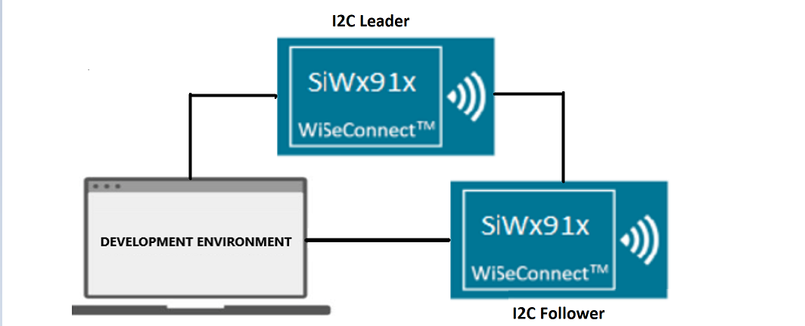
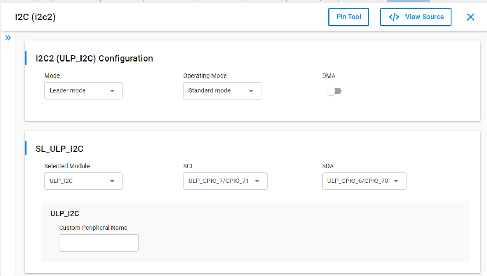
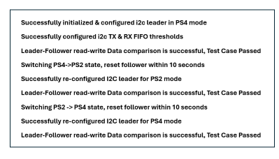

# SL ULP I2C DRIVER LEADER

## Table of Contents

- [Purpose/Scope](#purposescope)
- [Overview](#overview)
- [About Example Code](#about-example-code)
- [Prerequisites/Setup Requirements](#prerequisitessetup-requirements)
  - [Hardware Requirements](#hardware-requirements)
  - [Software Requirements](#software-requirements)
  - [Setup Diagram](#setup-diagram)
- [Getting Started](#getting-started)
- [Application Build Environment](#application-build-environment)
  - [Application Configuration Parameters](#application-configuration-parameters)
  - [Pin Configuration](#pin-configuration)
- [Test the Application](#test-the-application)

## Purpose/Scope

- The application demonstrates the data transfer from leader to follower and then follower to leader in high power & low power states. After transmission the data is compared and result is printed on the console.

> **Note:** The master-slave terminology is now replaced with leader-follower. Master is now recognized as Leader and slave is now recognized as Follower.

## Overview

- The I2C will be configured in leader mode. The SCL and SDA lines of leader controller are connected to Follower's SCL and SDA pins.
- There are three configurable I2C controllers in M4 - two in the MCU HP peripherals (I2C1, I2C2) and one in the MCU ULP subsystem (ULP_I2C). For I2C follower all instances will in MCU HP mode.
- The I2C interface allows the processor to serve as a leader or follower on the I2C bus.
- I2C can be configured with following features
  - I2C standard compliant bus interface with open-drain pins
  - Configurable as Leader or Follower
  - Four speed modes: Standard Mode (100 kbps), Fast Mode (400 kbps), Fast Mode Plus (1Mbps) and High-Speed Mode (3.4 Mbps)
  - For ULP_I2C only standard and Fast speed modes are supported. 
  - 7 or 10-bit addressing and combined format transfers
  - Support for Clock synchronization and Bus Clear

## About Example Code

- This example code demonstrates I2C data transfer between leader and follower using Blocking APIs.
- In this example i2c instance is first initialized using \ref sl_i2c_driver_init to configure various init structure parameters
- This structure includes:
  - \ref sl_i2c_operating_mode_t bus speed, it can be Standard, Fast, Fast plus or High speed.
  - \ref sl_i2c_mode_t mode, it should be leader mode for leader application.
  - \ref sl_i2c_transfer_type_t, using NON-DMA.
  - \ref sl_i2c_callback_t , I2C callback
- It also initializes I2C clock and configures I2C SDA & SCL pins.
- Now transmit and receive FIFO threshold values are configured using \ref sl_i2c_driver_configure_fifo_threshold API.
- Now write_buffer is filled with some data which needs to be sent to the follower.
- Current_mode enum is set to I2C_SEND_DATA and it calls send_data API to send data to follower & configures follower address through \ref sl_i2c_driver_send_data_blocking for blocking Application.
- For Blocking usecase : When all bytes are sent then mode changes to I2C_RECEIVE_DATA (Blocking API won't update any transfer complete flag, as control will be blocked until all bytes are sent).
- Then it receives data from follower through \ref sl_i2c_driver_receive_data_blocking for blocking Application.
- For Blocking usecase : When all bytes are recieved then mode changes to I2C_TRANSMISSION_COMPLETED (Blocking API won't update any transfer complete flag, as control will be blocked until all bytes are received).
- Now it compares the data which is received from the follower device to the data which it has sent.
- If the data is same, it will print Test Case Passed on the console.
- After this first cycle of data transfer application switches to ULP mode using sl_si91x_power_manager_add_ps_requirement API and reconfig I2C leader params as per ULP mode through \ref sl_i2c_driver_leader_reconfig_on_power_mode_change API.
- Then current_mode enum changed to I2C_SEND_DATA & application waits for 10 seconds so that user can reset follower application
- Once Follower gets reset then whole data transfer cycle repeats once again and compares data again.
- After second cycle of data transfer application switches to HP mode using sl_si91x_power_manager_add_ps_requirement API and reconfig I2C leader params as per HP mode using \ref sl_i2c_driver_leader_reconfig_on_power_mode_change API.
- Then current_mode enum changed to I2C_SEND_DATA & application waits for 10 seconds so that user can reset follower application
- Once Follower gets reset then whole data transfer cycle repeats once again and compares data again.
- After third cycle of data tranfer I2c gets de-initialized.

> **Note:** The Non-Blocking receive API is not performing as expected in ULP Mode (PS2), so it is advisable to use the Blocking receive API instead.

> **Note:**
>
>- I2C has three instances. User can handle these i2c-instances by adding their instances.
>- I2C0, I2C1, and I2C2 are predefined names for the I2C instances, while ULP I2C specifically refers to instance 2.
>- For user defined instances, one may have to define his hardware specific definitions in config.h file.
>- User can directly use APIs in application by passing appropriate structure members, if user doesn't want to configure from UC.

## Prerequisites/Setup Requirements

### Hardware Requirements

- Windows PC
- Silicon Labs Si917 Evaluation Kit [WPK(BRD4002) + BRD4338A / BRD4342A / BRD4343A ]
- SiWx917 AC1 Module Explorer Kit (BRD2708A)

### Software Requirements

- Simplicity Studio
- Serial console Setup
  - For Serial Console setup instructions, refer [here](https://docs.silabs.com/wiseconnect/latest/wiseconnect-developers-guide-developing-for-silabs-hosts/#console-input-and-output).

### Setup Diagram



## Getting Started

Refer to the instructions [here](https://docs.silabs.com/wiseconnect/latest/wiseconnect-getting-started/) to:

- [Install Simplicity Studio](https://docs.silabs.com/wiseconnect/latest/wiseconnect-developers-guide-developing-for-silabs-hosts/#install-simplicity-studio)
- [Install WiSeConnect 3 extension](https://docs.silabs.com/wiseconnect/latest/wiseconnect-developers-guide-developing-for-silabs-hosts/#install-the-wi-se-connect-3-extension)
- [Connect your device to the computer](https://docs.silabs.com/wiseconnect/latest/wiseconnect-developers-guide-developing-for-silabs-hosts/#connect-si-wx91x-to-computer)
- [Upgrade your connectivity firmware ](https://docs.silabs.com/wiseconnect/latest/wiseconnect-developers-guide-developing-for-silabs-hosts/#update-si-wx91x-connectivity-firmware)
- [Create a Studio project ](https://docs.silabs.com/wiseconnect/latest/wiseconnect-developers-guide-developing-for-silabs-hosts/#create-a-project)

For details on the project folder structure, see the [WiSeConnect Examples](https://docs.silabs.com/wiseconnect/latest/wiseconnect-examples/#example-folder-structure) page.

## Application Build Environment

### Application Configuration Parameters

- Open sl_si91x_i2c_driver_leader.slcp project file select software component tab and search for i2c in search bar.
- Click on **I2C2** and configure the ULP_I2C instance as per configuration parameters given in wizard.
- For ULP application instance used should be 2 only
- After creation of instances separate configuration files are get generated in **config folder**.
- If project built without selecting configurations, it will take default values from UC.
- Configure mode, operating-mode and transfer-type of I2C instance using respective instance UC.
- Change 'Operating Mode' as per bus-speed requirement.
- After above UC configurations also configure following macros in i2c_leader_example.c file and update/modify following macros if required.

  ```C
    #define FOLLOWER_I2C_ADDR        // Update I2C follower address
    #define I2C_SIZE_BUFFERS             // To change the number of bytes to send and receive.Its value should be less than maximum buffer size macro value.
  ```

- Configure the UC as mentioned below.

  

### Pin Configuration

**ULP_I2C:**

| PIN |   ULP GPIO PIN             |  Explorer kit GPIO  |   Description             |
| --- | -------------------------- | ------------------- | ------------------------- |
| SCL | ULP_GPIO_7 [EXP_HEADER-15] |   ULP_GPIO_7 [TX]   | Connect to Follower SCL pin |
| SDA | ULP_GPIO_6 [EXP_HEADER-16] |   ULP_GPIO_6 [RX]   | Connect to Follower SDA pin |


## Test the Application

Refer to the instructions [here](https://docs.silabs.com/wiseconnect/latest/wiseconnect-getting-started/) to:

1. Compile and run the application.
2. Connect SCL(ULP_GPIO_7) and SDA(ULP_GPIO_6) pins with the follower device.
3. When the application runs, it receives and send data.
4. After the transfer is completed, it validates the data and prints "Test Case Passed" on the console.
5. Will get "Test Case Passed" print on console.
6. Then again reset follower once application switches to ULP mode and observe "Test Case Passed" print on console.
7. After this again reset follower once application switches to HP mode back and observe "Test Case Passed" print on console.
6. Connect Analyzer channels to respective I2C instance SDA & SCA pins to observe the data on lines.
7. After successful program execution the prints in serial console looks as shown below.For follower also 3 times testcase pass will appear on console.

   

> **Note:**
>- The required files for low power state are moved to RAM rest of the application is executed from flash
>- In this application while changing the power state from PS4 to PS2 and vice - versa.


> **Note:**
>
> - Interrupt handlers are implemented in the driver layer, and user callbacks are provided for custom code. If you want to write your own interrupt handler instead of using the default one, make the driver interrupt handler a weak handler. Then, copy the necessary code from the driver handler to your custom interrupt handler.
