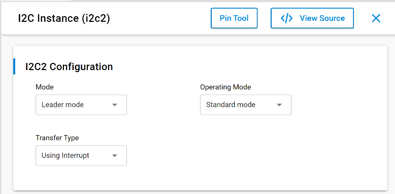
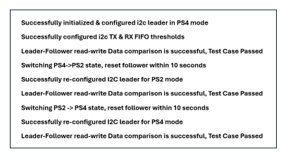

# SiWx91x Platform ULP I2C Driver Leader

## Table of Contents

- [SiWx91x Platform ULP I2C Driver Leader](#platform-siwx91x-ulp-i2c-driver-leader)
  - [Table of Contents](#table-of-contents)
  - [Purpose/Scope](#purposescope)
  - [Overview](#overview)
  - [About Example Code](#about-example-code)
  - [Prerequisites/Setup Requirements](#prerequisitessetup-requirements)
    - [Hardware Requirements](#hardware-requirements)
    - [Software Requirements](#software-requirements)
    - [Setup Diagram](#setup-diagram)
  - [Getting Started](#getting-started)
  - [Application Build Environment](#application-build-environment)
    - [Application Configuration Parameters](#application-configuration-parameters)
    - [Pin Configuration](#pin-configuration)
  - [Test the Application](#test-the-application)
  - [Troubleshooting](#troubleshooting)
  - [Resources](#resources)
  - [Report Bugs/Support](#report-bugssupport)

## Purpose/Scope

- The application demonstrates the data transfer from leader to follower and then follower to leader in high power & low power states. After transmission the data is compared and result is printed on the console.

> **Note:** The master-slave terminology is now replaced with leader-follower. Master is now recognized as Leader and slave is now recognized as Follower.

## Overview

- The I2C will be configured in leader mode. The SCL and SDA lines of leader controller are connected to Follower's SCL and SDA pins.
- There are three configurable I2C controllers in M4 - two in the MCU HP peripherals (I2C1, I2C2) and one in the MCU ULP subsystem (ULP_I2C). For I2C follower all instances will in MCU HP mode.
- The I2C interface allows the processor to serve as a leader or follower on the I2C bus.
- I2C can be configured with following features
  - I2C standard compliant bus interface with open-drain pins
  - Configurable as Leader or Follower
  - Four speed modes: Standard Mode (100 kbps), Fast Mode (400 kbps), Fast Mode Plus (1Mbps) and High-Speed Mode (3.4 Mbps)
  - For ULP_I2C only standard and Fast speed modes are supported.
  - 7 or 10-bit addressing and combined format transfers
  - Support for Clock synchronization and Bus Clear

## About Example Code

- This example code demonstrates I2C data transfer between leader and follower using Blocking APIs.
- In this example i2c instance is first initialized using [sl_i2c_driver_init](https://docs.silabs.com/wiseconnect/latest/wiseconnect-api-reference-guide-si91x-peripherals/i2-c#sl-i2c-driver-init) to configure various init structure parameters
- This structure includes:
  - [sl_i2c_operating_mode_t](https://docs.silabs.com/wiseconnect/latest/wiseconnect-api-reference-guide-si91x-peripherals/i2-c#sl-i2c-operating-mode-t) bus speed, it can be Standard, Fast, Fast plus or High speed.
  - [sl_i2c_mode_t](https://docs.silabs.com/wiseconnect/latest/wiseconnect-api-reference-guide-si91x-peripherals/i2-c#sl-i2c-mode-t) mode, it should be leader mode for leader application.
  - [sl_i2c_transfer_type_t](https://docs.silabs.com/wiseconnect/latest/wiseconnect-api-reference-guide-si91x-peripherals/i2-c#sl-i2c-transfer-type-t), using NON-DMA.
  - [sl_i2c_callback_t](https://docs.silabs.com/wiseconnect/latest/wiseconnect-api-reference-guide-si91x-peripherals/i2-c#sl-i2c-callback-t),  I2C callback
- It also initializes I2C clock and configures I2C SDA & SCL pins.
- Now transmit and receive FIFO threshold values are configured using [sl_i2c_driver_configure_fifo_threshold](https://docs.silabs.com/wiseconnect/latest/wiseconnect-api-reference-guide-si91x-peripherals/i2-c#sl-i2c-driver-configure-fifo-threshold) API.
- Now write_buffer is filled with some data which needs to be sent to the follower.
- Current_mode enum is set to I2C_SEND_DATA and it calls send_data API to send data to follower & configures follower address through [sl_i2c_driver_send_data_blocking](https://docs.silabs.com/wiseconnect/latest/wiseconnect-api-reference-guide-si91x-peripherals/i2-c#sl-i2c-driver-send-data-blocking) for blocking Application.
- For Blocking usecase : When all bytes are sent then mode changes to I2C_RECEIVE_DATA (Blocking API won't update any transfer complete flag, as control will be blocked until all bytes are sent).
- Then it receives data from follower through [sl_i2c_driver_receive_data_blocking](https://docs.silabs.com/wiseconnect/latest/wiseconnect-api-reference-guide-si91x-peripherals/i2-c#sl-i2c-driver-receive-data-blocking) for blocking Application.
- For Blocking usecase : When all bytes are received then mode changes to I2C_TRANSMISSION_COMPLETED (Blocking API won't update any transfer complete flag, as control will be blocked until all bytes are received).
- Now it compares the data which is received from the follower device to the data which it has sent.
- If the data is same, it will print Test Case Passed on the console.
- After this first cycle of data transfer application switches to ULP mode using sl_si91x_power_manager_add_ps_requirement API and reconfig I2C leader params as per ULP mode through [sl_i2c_driver_leader_reconfig_on_power_mode_change](https://docs.silabs.com/wiseconnect/latest/wiseconnect-api-reference-guide-si91x-peripherals/i2-c#sl-i2c-driver-leader-reconfig-on-power-mode-change) API.
- Then current_mode enum changed to I2C_SEND_DATA & application waits for 10 seconds so that user can reset follower application
- Once Follower gets reset then whole data transfer cycle repeats once again and compares data again.
- After second cycle of data transfer application switches to HP mode using sl_si91x_power_manager_add_ps_requirement API and reconfig I2C leader params as per HP mode using [sl_i2c_driver_leader_reconfig_on_power_mode_change](https://docs.silabs.com/wiseconnect/latest/wiseconnect-api-reference-guide-si91x-peripherals/i2-c#sl-i2c-driver-leader-reconfig-on-power-mode-change) API.
- Then current_mode enum changed to I2C_SEND_DATA & application waits for 10 seconds so that user can reset follower application
- Once Follower gets reset then whole data transfer cycle repeats once again and compares data again.
- After third cycle of data tranfer I2c gets de-initialized.

> **Note:** The Non-Blocking receive API is not performing as expected in ULP Mode (PS2), so it is advisable to use the Blocking receive API instead.

> **Note:**
>
>- I2C has three instances. User can handle these i2c-instances by adding their instances.
>- I2C0, I2C1, and I2C2 are predefined names for the I2C instances, while ULP I2C specifically refers to instance 2.
>- For user defined instances, one may have to define his hardware specific definitions in config.h file.
>- User can directly use APIs in application by passing appropriate structure members, if user doesn't want to configure from UC.


## Prerequisites/Setup Requirements

### Hardware Requirements

- Windows PC
- Silicon Labs SiWx91x Evaluation Kit [[BRD4002](https://www.silabs.com/development-tools/wireless/wireless-pro-kit-mainboard?tab=overview) + [BRD4338A](https://www.silabs.com/development-tools/wireless/wi-fi/siwx917-rb4338a-wifi-6-bluetooth-le-soc-radio-board?tab=overview) / [BRD4342A](https://www.silabs.com/development-tools/wireless/wi-fi/siwx91x-rb4342a-wifi-6-bluetooth-le-soc-radio-board?tab=overview) / [BRD4343A](https://www.silabs.com/development-tools/wireless/wi-fi/siw917y-rb4343a-wi-fi-6-bluetooth-le-8mb-flash-radio-board-for-module?tab=overview) / [BRD4343C](https://www.silabs.com/development-tools/wireless/wi-fi/siw917y-rb4343c-wi-fi-6-bluetooth-le-8mb-flash-radio-board-for-module?tab=overview)]
- SiWx917 AC1 Module Explorer Kit [BRD2708A](https://www.silabs.com/development-tools/wireless/wi-fi/siw917y-ek2708a-explorer-kit)

### Software Requirements

- Simplicity Studio
- Serial console Setup
  - For Serial Console setup instructions, refer to [link name](https://docs.silabs.com/wiseconnect/latest/wiseconnect-developers-guide-developing-for-silabs-hosts/using-the-simplicity-studio-ide#console-input-and-output).

### Setup Diagram


## Getting Started

Refer to the instructions [here](https://docs.silabs.com/wiseconnect/latest/wiseconnect-getting-started/) to:

- [Install Simplicity Studio](https://docs.silabs.com/wiseconnect/latest/wiseconnect-developers-guide-developing-for-silabs-hosts/using-the-simplicity-studio-ide#install-simplicity-studio)
- [Install WiSeConnect extension](https://docs.silabs.com/wiseconnect/latest/wiseconnect-developers-guide-developing-for-silabs-hosts/using-the-simplicity-studio-ide#install-the-wiseconnect-3-extension)
- [Connect your device to the computer](https://docs.silabs.com/wiseconnect/latest/wiseconnect-developers-guide-developing-for-silabs-hosts/using-the-simplicity-studio-ide#connect-siwx91x-to-computer)
- [Upgrade your connectivity firmware](https://docs.silabs.com/wiseconnect/latest/wiseconnect-developers-guide-developing-for-silabs-hosts/using-the-simplicity-studio-ide#update-siwx91x-connectivity-firmware)
- [Create a Studio project](https://docs.silabs.com/wiseconnect/latest/wiseconnect-developers-guide-developing-for-silabs-hosts/using-the-simplicity-studio-ide#create-a-project)

For details on the project folder structure, see the [WiSeConnect Examples](https://docs.silabs.com/wiseconnect/latest/wiseconnect-examples/#example-folder-structure) page.

## Application Build Environment

### Application Configuration Parameters

- Open sl_si91x_i2c_driver_leader.slcp project file select software component tab and search for i2c in search bar.
- Click on **I2C2** and configure the ULP_I2C instance as per configuration parameters given in wizard.
- For ULP application instance used should be 2 only
- After creation of instances separate configuration files are get generated in **config folder**.
- If project built without selecting configurations, it will take default values from UC.
- Configure mode, operating-mode and transfer-type of I2C instance using respective instance UC.
- Change 'Operating Mode' as per bus-speed requirement.
- After above UC configurations also configure following macros in [`ulp_i2c_leader_example.c`](ulp_i2c_leader_example.c) file and update/modify following macros if required.

- `FOLLOWER_I2C_ADDR`: 7-bit I2C follower (target) address that the leader communicates with. Must match the `OWN_I2C_ADDR` configured on the follower device. By default, it is set to `0x50`.

  ```c
    #define FOLLOWER_I2C_ADDR            0x50  // I2C follower address
  ```

- `I2C_INSTANCE_USED`: Selects the I2C instance used by the application. For ULP application the instance used should be 2 only. By default, it is set to 2.

  ```c
    #define I2C_INSTANCE_USED            2     // For ULP application instance used should be 2 only
  ```

- `I2C_BUFFER_SIZE`: Defines the size of the data buffer used for I2C transfer. By default, it is set to 1024.

  ```c
    #define I2C_BUFFER_SIZE              1024  // Size of data buffer
  ```

- `MS_DELAY_COUNTER`: Defines the loop counter used for producing a millisecond-scale software delay. By default, it is set to 4600.

  ```c
    #define MS_DELAY_COUNTER             4600  // Delay count
  ```

- `TEN_SECOND_DELAY_HP_MODE`: Defines the delay count used to wait for approximately 10 seconds when the application is running in HP mode. By default, it is set to 20000.

  ```c
    #define TEN_SECOND_DELAY_HP_MODE     20000 // 10 second delay in HP mode
  ```

- `TEN_SECOND_DELAY_ULP_MODE`: Defines the delay count used to wait for approximately 10 seconds when the application is running in ULP mode. By default, it is set to 10000.

  ```c
    #define TEN_SECOND_DELAY_ULP_MODE    10000 // 10 second delay in ULP mode
  ```

- Configure the UC as mentioned below.

  

### Pin Configuration

**ULP_I2C:**

| PIN |   ULP GPIO PIN             |  Explorer kit GPIO  |   Description             |
| --- | -------------------------- | ------------------- | ------------------------- |
| SCL | ULP_GPIO_7 [EXP_HEADER-15] |   ULP_GPIO_7 [TX]   | Connect to Follower SCL pin |
| SDA | ULP_GPIO_6 [EXP_HEADER-16] |   ULP_GPIO_6 [RX]   | Connect to Follower SDA pin |


> **Note**
>  In case of sleep-wakeup, if the project uses UC-generated I2C instances, call `sl_i2c_init_instances()` after wakeup before resuming I2C transfers so the configured I2C instances are restored.

> **Note**: For recommended settings, please refer the [recommendations guide](https://docs.silabs.com/wiseconnect/latest/wiseconnect-developers-guide-prog-recommended-settings/).

## Test the Application

> **Note:** Use **`Log_script.py`** from the **SiWx91x Platform Logger** example (`examples/si91x_soc/service/sl_si91x_logger/`) to decode structured console log output. Run:
>
> `python Log_script.py --out firmware.out --descriptor SYSVIEW_CaptiveCore.txt --port COM5 --max-args 3`
>
> Replace **COM5** with the serial port your board uses on the host PC.


Refer to the instructions [here](https://docs.silabs.com/wiseconnect/latest/wiseconnect-getting-started/) to:

1. Compile and run the application.
2. Connect SCL(ULP_GPIO_7) and SDA(ULP_GPIO_6) pins with the follower device.
3. When the application runs, it receives and send data.
4. After the transfer is completed, it validates the data and prints "Test Case Passed" on the console.
5. Will get "Test Case Passed" print on console.
6. Then again reset follower once application switches to ULP mode and observe "Test Case Passed" print on console.
7. After this again reset follower once application switches to HP mode back and observe "Test Case Passed" print on console.
6. Connect Analyzer channels to respective I2C instance SDA & SCA pins to observe the data on lines.
7. After successful program execution the prints in serial console looks as shown below.For follower also 3 times testcase pass will appear on console.

   

> **Note:**
>- The required files for low power state are moved to RAM rest of the application is executed from flash
>- In this application while changing the power state from PS4 to PS2 and vice - versa.


> **Note:**
>
> - Interrupt handlers are implemented in the driver layer, and user callbacks are provided for custom code. If you want to write your own interrupt handler instead of using the default one, make the driver interrupt handler a weak handler. Then, copy the necessary code from the driver handler to your custom interrupt handler.
>
> **Note:**
>
>- This application is intended for demonstration purposes only to showcase the ULP peripheral functionality. It should not be used as a reference for real-time use case project development, because the wireless shutdown scenario is not supported in the current SDK.
## Troubleshooting

- If the project does not build, ensure Simplicity Studio and the WiSeConnect extension are installed and the board is connected.
- If the device is not detected, reinstall the connectivity firmware and check USB drivers.

## Resources

- [WiSeConnect Getting Started](https://docs.silabs.com/wiseconnect/latest/wiseconnect-getting-started/)
- [WiSeConnect Examples](https://docs.silabs.com/wiseconnect/latest/wiseconnect-examples/)
- [SiWx91x SoC Documentation](https://docs.silabs.com/wiseconnect/latest/)

## Report Bugs/Support

For issues and support, use the Silicon Labs Community or your normal support channel.

