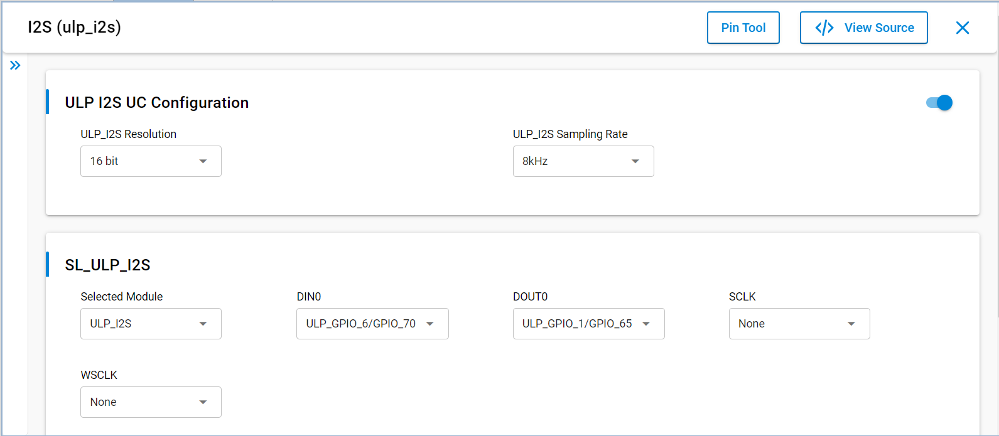

# SI91x - SL_ULP_I2S

## Table of Contents

- [Purpose/Scope](#purposescope)
- [Overview](#overview)
- [About Example Code](#about-example-code)
- [Prerequisites/Setup Requirements](#prerequisitessetup-requirements)
  - [Hardware Requirements](#hardware-requirements)
  - [Software Requirements](#software-requirements)
  - [Setup Diagram](#setup-diagram)
- [Getting Started](#getting-started)
- [Application Build Environment](#application-build-environment)
- [Test the Application](#test-the-application)

## Purpose/Scope

- This application demonstrates ULP_I2S will be configured in PS2 state and master mode.Here we will connect TX pin to RX pin in loopback mode
- Master transmits data on TX pin using DMA and receives same data on RX pin using DMA
- The data received should match with the transmitted data

## Overview

- The I2S_2CH supports two stereo channels while the ULP_I2S and the NWP/Security subsystem I2S support one stereo channel
- Programmable Audio data resolutions of 12, 16, 20, 24 and 32 bits
- Supported audio sampling rates are 8, 11.025, 16, 22.05, 24, 32, 44.1, 48, 88.2, 96 and 192 kHz
- Support for Master and Slave modes
- Full duplex communication due to the independence of transmitter and receiver
- Programmable FIFO thresholds with maximum FIFO depth of 8 and support for DMA
- Supports generation of interrupts for different events

## About Example Code

- This example fetches current I2S version using sl_si91x_i2s_get_version()
- Initializes I2S peripheral and store driver handle in i2s_driver_handle using sl_si91x_i2s_init()
- Get the transfer status of I2S peripheral using sl_si91x_i2s_get_status()
- Configure ARM power mode to full power using sl_si91x_i2s_configure_power_mode()
- Register user callback using sl_si91x_i2s_register_event_callback()
- Configure transmitter and receiver transfer parameters for i2s using sl_si91x_i2s_transmit_receive_config()
- Configure receive DMA channel and prepare I2S for data receiving
- Configure transmit DMA channel and send data
- When send data is received by receiver channel, it compares the data received with transferred data
- Loopback test will be pass after successful data comparison.
- Switch the power state from PS4 to PS2
- Perform another loopback test
- Switch the power state from PS2 to PS4
- Perform another loopback test

> **Note:** When utilizing the I2S1 instance in high power mode with DMA enabled, it is advisable to allocate buffers in the ULP Memory block.

**Note!** 
1. sl_i2s_xfer_config_t has following parameters,
	(a) mode - Configure I2S device in Primary(Master)/Secondary(Slave) mode
	(b) sync - I2S synchronous mode (4-pin mode: SCK and WS signals are shared between I2S transmit and receive blocks) 
	     and asynchronous mode(requires SCK and WS pins). Currently, the driver only supports ASYNC mode.
	(c) protocol - I2S/PCM protocol. Currently, the driver only supports I2S protocol.
	(d) resolution - Audio data resolutions (12-bit, 16-bit, 20-bit, 24-bit and 32-bit)
	(e) data_size - Transfer buffer data type (8-bit, 16-bit and 32-bit)
	(f) sampling_rate - Audio sampling rate
	(g) transfer_type - Transfer type (Transmit, Receive, Transmit abort, and Receive abort)
2. Transfers with 12-bit and 16-bit resolutions must use uint16_t data type buffer and pass SL_I2S_DATA_SIZE16 to data_size parameter
   in sl_i2s_xfer_config_t while configuring transfer.
3. Transfers with 20-bit, 24-bit and 32-bit resolutions must use uint32_t data type buffer and pass SL_I2S_DATA_SIZE32 to data_size parameter
   in sl_i2s_xfer_config_t while configuring transfer
4. Since 8-bit resolution is not supported, uint8_t data type buffer can use 16-bit resolution for transfer and pass SL_I2S_DATA_SIZE8 
   to data_size parameter in sl_i2s_xfer_config_t while configuring transfer. While performing this operation data buffer should be 
   typecast to (uint16_t *) and the transfer size should be half of the 8-bit data type buffer. (Refer to the I2S loopback application for more details). For 8-bit transfers, transfer size should be multiples of 4 (8,12,16,20...)
5. Any I2S transfers with 16-bit, 20-bit and 32-bit resolutions should only have an even transfer size (8,10,12,14...)
6. Any I2S transfers with 12-bit and 24-bit resolutions should only have transfer size as multiples of 4 (8,12,16,20...)
7. I2S_LOOP_BACK macro is only used for i2s loopback applications to avoid clock generation from the receiver block during transfer.
8. SCK frequency is calculated using SCK = 2 * bit_width * sampling_frequency. By default, I2S0 uses I2S_PLL_CLK as a clock source. This can generate any frequency range mentioned in section 6.11.7 of Si91x HRM.
9. By default ULP_I2S/I2S1 uses ULP_MHZ_RC_CLK to support I2S operation in low power states. This limits the maximum supported sampling frequency of ULP_I2S to 48kHz (32 MHz RC trims to 20MHz in sleep).

## Prerequisites/Setup Requirements

### Hardware Requirements

- Windows PC
- Silicon Labs Si917 Evaluation Kit [WPK(BRD4002) + BRD4338A / BRD4342A / BRD4343A ]
- SiWx917 AC1 Module Explorer Kit (BRD2708A)
- Ezurio Veda SL917 Explorer Kit Board (BRD2911A)

### Software Requirements

- Simplicity Studio
- Serial console Setup
  - For Serial Console setup instructions, refer [here](https://docs.silabs.com/wiseconnect/latest/wiseconnect-developers-guide-developing-for-silabs-hosts/#console-input-and-output).

### Setup Diagram


## Getting Started

Refer to the instructions [here](https://docs.silabs.com/wiseconnect/latest/wiseconnect-getting-started/) to:

- [Install Simplicity Studio](https://docs.silabs.com/wiseconnect/latest/wiseconnect-developers-guide-developing-for-silabs-hosts/#install-simplicity-studio)
- [Install WiSeConnect 3 extension](https://docs.silabs.com/wiseconnect/latest/wiseconnect-developers-guide-developing-for-silabs-hosts/#install-the-wi-se-connect-3-extension)
- [Connect your device to the computer](https://docs.silabs.com/wiseconnect/latest/wiseconnect-developers-guide-developing-for-silabs-hosts/#connect-si-wx91x-to-computer)
- [Upgrade your connectivity firmware ](https://docs.silabs.com/wiseconnect/latest/wiseconnect-developers-guide-developing-for-silabs-hosts/#update-si-wx91x-connectivity-firmware)
- [Create a Studio project ](https://docs.silabs.com/wiseconnect/latest/wiseconnect-developers-guide-developing-for-silabs-hosts/#create-a-project)

For details on the project folder structure, see the [WiSeConnect Examples](https://docs.silabs.com/wiseconnect/latest/wiseconnect-examples/#example-folder-structure) page.

## Application Build Environment

- Configure UC from the slcp component.

   

- Open **sl_si91x_ulp_i2s.slcp** project file select **software component** tab and search for **I2S** in search bar.
- Using configuration wizard one can configure different parameters like:

### General Configuration
- SL_ULP_I2S_RESOLUTION: ULP_I2S resolution can be configured through this macro,valid resolution values are 12, 16, 20, 24 and 32 bit.
- SL_ULP_I2S_SAMPLING_RATE: ULP_I2S sampling rate can be configured through this macro,valid sampling rate values are
    8kHz, 11.025kHz, 16kHz, 22.05kHz, 24kHz, 32kHz, 44.1kHz, 48kHz, 88.2kHz, 96kHz and 192kHz
- Configuration files are generated in **config folder**, if not changed then the code will run on default UC values.

- Configure the following macros in ulp_i2s_example.c file and update/modify following macros if required.

```C
#define I2S_LOWPOWER_BUFFER_SIZE 1024    ///< Transmit/Receive buffer size
```

### Pin Configuration

|            GPIO            |    Explorer kit GPIO    | Description      |
| -------------------------- | ----------------------- | ---------------- |
| ULP_GPIO_1 [P16]           | ULP_GPIO_1 [EXP_HEADER-5] | I2S DOUT       |
| ULP_GPIO_6 [EXP_HEADER-16] | ULP_GPIO_6 [RX]           | I2S DIN        |

### Pin Description

**Note!** Make sure pin configuration in RTE_Device_917.h file.(path: /$project/config/RTE_Device_917.h)

## Test the Application

Refer to the instructions [here](https://docs.silabs.com/wiseconnect/latest/wiseconnect-getting-started/) to:

1. Connect DOUT to DIN for loopback connection.
2. Compile and run the application.
3. When the application runs,It sends and receives data in loopback.
4. Data send/receive success and data comparison success prints can be seen on serial console.
5. After successful program execution the prints in serial console looks as shown below.

   >

**Note:**
>- The required files for low power state are moved to RAM rest of the application is executed from flash.
>- In this application we are changing the power state from PS4 to PS2 and vice - versa. 


> **Note:**
>
> - Interrupt handlers are implemented in the driver layer, and user callbacks are provided for custom code. If you want to write your own interrupt handler instead of using the default one, make the driver interrupt handler a weak handler. Then, copy the necessary code from the driver handler to your custom interrupt handler.
