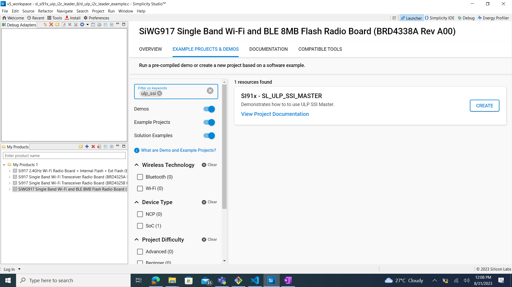

# ULP SSI MASTER

## Introduction

- This application demonstrate the use of ULP SSI MASTER for data transfer in full duplex as well as half duplex mode in master mode.
- This application can run in synchronous mode with full-duplex operation
  - Master transmits data on MOSI pin and receives the same data on MISO pin
- This also supports send and receive data with any SSI slave, additionally it also supports DMA and non-DMA transfer.
- For half duplex communication, i.e., send and receive, master / slave connection is required.

## Overview

- SSI (Synchronous Serial Interface) is a synchronous, point-to-point, serial communication channel for digital data transmission.
- Synchronous data transmission is one in which the data is transmitted by synchronizing the transmission at the receiving and sending ends using a common clock signal.
- SSI is a synchronous four-wire interface consisting of two data pins(MOSI, MISO), a device select pin (CSN) and a gated clock pin(SCLK).
- With the two data pins, it allows for full-duplex operation with other SSI compatible devices.
- It supports full duplex Single-bit SPI master mode.
- It has support for 6 modes total - Mode 0: Clock Polarity is zero and Clock Phase is zero, Mode 1: Clock Polarity is zero, Clock Phase is one, Mode 2: Clock Polarity is one and Clock Phase is zero, Mode 3: Clock Polarity is one and Clock Phase is one and Mode-4 (TI SSI) and Mode-5 (Microwire).
- The SPI clock is programmable to meet required baud rates
- It can generates interrupts for different events like transfer complete, data lost, mode fault.
- It supports upto 32K bytes of read data from a SSI device in a single read operation.
- It has support for DMA (Dynamic Memory Access).

## About Example Code

- This example demonstrates SSI transfer i.e., full duplex communication and SSI send, SSI receive i.e., half duplex communication.
- Various parameters like SSI clock mode, bit-width, manual cs pin and SSI baudrate can be configured using UC. Also, Master or Slave or ULP Master DMA can be configured using UC.
- sl_si91x_ssi_config.h file contains the control configurations and sl_si91x_ssi_common_config.h contains DMA configuration selection.
- In the example code, first the output buffer is filled with some data which is transferred to the slave.
- Firmware version of API is fetched using \ref sl_si91x_ssi_get_version which includes release version, major version and minor version \ref sl_ssi_version_t.
- A static function is called to fill in the \ref sl_ssi_clock_config_t structure, which is passed in \ref sl_si91x_ssi_configure_clock API to configure the clock.
- \ref sl_si91x_ssi_init is used to initialize the peripheral, that includes pin configuration and it powers up the module.
- SSI instance must be passed in init to get the instance handle \ref sl_ssi_instance_t, which is used in other APIs.
- After initialization \ref sl_si91x_ssi_configure_power_mode is called to set the power mode \ref sl_ssi_power_state_t.
- All the necessary parameters are configured using \ref sl_si91x_ssi_set_configuration API, it expects a structure with required parameters \ref sl_ssi_control_config_t.
- After configuration, a callback register API is called to register the callback at the time of events \ref sl_si91x_ssi_register_event_callback.
- The State machine code is implemented for transfer, send and receive data, the current mode is determined by ssi_mode_enum_t which is declared in ulp_ssi_master_example.c file.
- According to the macro which is enabled, the example code executes the transfer of data:

- If **SL_USE_TRANSFER** macro is enabled, it will transfer the data, i.e. send and receive data in full duplex mode.

  - The current_mode enum is set to SL_TRANSFER_DATA and calls the \ref sl_si91x_ssi_transfer_data API which expects data_out, data_in and number of data bytes to be transferred for sending and recieving data simultaneously (full duplex).
  - This test can also be performed in loopback state, i.e. connect MISO and MOSI pins.
  - The example code waits till the transfer is completed, when the transfer complete event is generated, it compares the sent and received data.
  - The result is printed on the console.
  - Now the current_mode enum is updated as per the macros enabled i.e., either SL_USE_SEND or SL_USE_RECEIVE.
  - If no other macros are enabled, the current_mode is updated to SL_TRANSMISSION_COMPLETED.

- If **SL_USE_RECEIVE** macro is enabled, it only receives the data from slave - SPI slave must be connected, it cannot be tested in loopback mode.

  - The current_mode is set to the SL_RECEIVE_DATA and calls the \ref sl_si91x_ssi_receive_data API which expects data_in (empty buffer) and number of data bytes to be received.
  - It waits till the receive is completed i.e., transfer complete event is generated.
  - Now the current_mode enum is updated as per the macros enabled i.e., SL_USE_SEND.
  - If no other macros are enabled, the current_mode is updated to SL_TRANSMISSION_COMPLETED.

- If **SL_USE_SEND** macro is enabled, it only sends the data to slave, SPI slave must be connected, it cannot be tested in loopback mode.
  - The current_mode enum is set to SL_SEND_DATA and calls the \ref sl_si91x_ssi_send_data API which expects data_out (data buffer that needs to be sent) and number of bytes to send.
  - It waits till the send is completed i.e., transfer complete event is generated.
  - Now the current_mode enum is updated to TRANSMISSION_COMPLETED.

## Running Example Code

- To use this application following Hardware, Software and the Project Setup is required

### Hardware Requirements

- Windows PC
- Silicon Labs [Si917 Evaluation Kit WPK/WSTK + BRD4338A]


### Software Requirements

- Si91x SDK
- Embedded Development Environment
  - For Silicon Labs Si91x, use the latest version of Simplicity Studio (refer **"Download and Install Simplicity Studio"** section in **getting-started-with-siwx917-soc** guide at **release_package/docs/index.html**)

### VCOM Setup
- The Docklight tool's setup instructions are provided below..


## Project Setup

- **Silicon Labs Si91x** refer **"Download SDK"** section in **getting-started-with-siwx917-soc** guide at **release_package/docs/index.html** to work with Si91x and Simplicity Studio

## Loading Application on Simplicity Studio

1. With the product Si917 selected, navigate to the example projects by clicking on Example Projects & Demos
   in simplicity studio and click on to SSI Example application as shown below.



## Configuration and Steps for Execution

- Configure UC from the slcp component.
- Open **sl_si91x_gspi.slcp** project file select **software component** tab and search for **SSI** in search bar.
- Using configuration wizard one can configure different parameters like:
  - **General Configuration**
  - Mode: SSI mode can be configured, i.e. Mode 0: Clock Polarity is zero and Clock Phase is zero, Mode 1: Clock Polarity is zero, Clock Phase is one, Mode 2: Clock Polarity is one and Clock Phase is zero, Mode 3: Clock Polarity is one and Clock Phase is one, Mode-4 (TI SSI) and Mode-5 (Microwire).
  - SSI Baudrate: The speed of transfer can be configured, i.e. bits/second.
  - Data Width: The size of data packet, it can be configured between 4 to 32.
  - CS Control (Master): When device is in slave mode, it can be configured as H/w control or S/w control.
  - CS Control (Slave): When device is in slave mode, it can be configured as H/w control or S/w control.
  - **DMA Configuration**
  - Enable/Disable the DMA configuration.
- Configuration files are generated in **config folder**, if not changed then the code will run on default UC values.

- Configure the following macros in ssi_master_example.h file and update/modify following macros if required.

```C
#define SL_USE_TRANSFER ENABLE    // To use the transfer API
#define SL_USE_SEND     DISABLE   // To use the send API
#define SL_USE_RECEIVE  DISABLE   // To use the receive API
```

## Build

1. Compile the application in Simplicity Studio using build icon


## Device Programming

- To program the device ,refer **"Burn M4 Binary"** section in **getting-started-with-siwx917-soc** guide at **release_package/docs/index.html** to work with Si91x and Simplicity Studio

## Pin Configuration of the WPK[BRD4002A]/WSTK[BRD4001A] Base Board

| GPIO pin       | Description             |
| -------------- | ----------------------- |
|ULP_GPIO_1 [P16]  |ULP_SSI_MASTER_MOSI_PIN|
|ULP_GPIO_2 [F10]  |ULP_SSI_MASTER_MISO_PIN|


**Note!** Make sure pin configuration in RTE_Device_917.h file.(path: /$project/wiseconnect3/components/siwx917_soc/drivers/cmsis_driver/config/RTE_Device_917.h)

## Executing the Application
1. Compile and run the application.
2. Connect ULP_GPIO_1 to ULP_GPIO_2 for loopback connection.
3. When the application runs, It sends and receives data in loopback if USE_TRANSFER is enabled.
4. If USE_RECEIVE or USE_SEND is enabled, SSI slave will receive and send data respectively.

## Expected Results

- Console output of successful configuration of clock, power mode and SSI configuration
- Console output of SSI transfer complete, Loop back test passed.
- In the case of loopback mode, when the loopback jumper wire is removed and the test is run - the result should come as data comparison fail and test case fail.

## Note
 - This applicatin is executed from RAM.
 - In this application while changing the MCU mode from PS4 to PS2, M4 flash will be turned off.
 - The debug feature of Simplicity Studio will not work after M4 flash is turned off.

## Expected Scenario:
 - After Flashing ULP examples as M4 flash will be turned off,flash erase does not work.
 - To Erase the chip follow the below procedure
 - Turn ON ISP switch and press the reset button → Turn OFF ISP Switch → Now perform Chip erase 
      through commander. 
