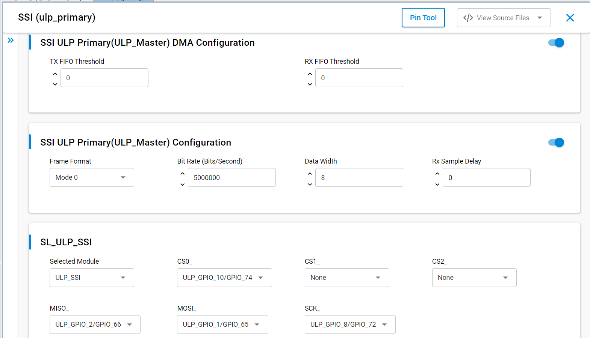

# SL ULP SSI MASTER

## Table of Contents

- [SL ULP SSI MASTER](#sl-ulp-ssi-master)
  - [Table of Contents](#table-of-contents)
  - [Purpose/Scope](#purposescope)
  - [Overview](#overview)
  - [About Example Code](#about-example-code)
  - [Prerequisites/Setup Requirements](#prerequisitessetup-requirements)
    - [Hardware Requirements](#hardware-requirements)
    - [Software Requirements](#software-requirements)
    - [Setup Diagram](#setup-diagram)
  - [Getting Started](#getting-started)
  - [Application Build Environment](#application-build-environment)
  - [Pin Configuration of the WPK\[BRD4002A\] Base Board, and with BRD4338A radio board](#pin-configuration-of-the-wpkbrd4002a-base-board-and-with-brd4338a-radio-board)
  - [Pin Configuration of the WPK\[BRD4002A\] Base Board, and with BRD4343A radio board](#pin-configuration-of-the-wpkbrd4002a-base-board-and-with-brd4343a-radio-board)
  - [Test the Application](#test-the-application)

## Purpose/Scope

This application demonstrates the use of ULP Synchronous Serial Interface (SSI) PRIMARY for data transfer in full-duplex as well as half-duplex mode.

This application can run in synchronous mode with full-duplex operation. Primary transmits data on MOSI pin and receives the same data on MISO pin.

This also supports send and receive data with any SSI slave.  Additionally, it also supports DMA and non-DMA transfer.

For half-duplex communication (that is, send and receive), a primary / secondary connection is required.

## Overview

- SSI is a synchronous, point-to-point, serial communication channel for digital data transmission.
- Synchronous data transmission is one in which the data is transmitted by synchronizing the transmission at the receiving and sending ends using a common clock signal.
- SSI is a synchronous four-wire interface consisting of two data pins (MOSI, MISO), a device select pin (CSN) and a gated clock pin(SCLK).
- With the two data pins, it allows for full-duplex operation with other SSI compatible devices.
- It supports full-duplex, single-bit SPI Primary mode.
- It supports 6 modes:  
  - Mode 0: Clock Polarity is zero and Clock Phase is zero.
  - Mode 1: Clock Polarity is zero, Clock Phase is one.
  - Mode 2: Clock Polarity is one and Clock Phase is zero.
  - Mode 3: Clock Polarity is one and Clock Phase is one.
  - Mode-4: TEXAS_INSTRUMENTS SSI.
  - Mode-5: NATIONAL_SEMICONDUCTORS_MICROWIRE.
- The SPI clock is programmable to meet required baud rates.
- It can generates interrupts for different events, like transfer complete, data lost, and mode fault.
- It supports up to 32K bytes of read data from an SSI device in a single read operation.
- It has support for DMA (Dynamic Memory Access).
- The ULP_SSI_MST in the MCU ULP peripherals supports single-bit mode and can be connected to only one slave.

## About Example Code

- This example demonstrates SSI transfer (full-duplex communication) and SSI send/SSI receive (half-duplex communication).
- Various parameters like SSI clock mode, bit-width, manual CS pin, and SSI baud rate can be configured using the UC. Additionally, Primary or Secondary or ULP Primary DMA can be configured using UC.
- The [`sl_si91x_ssi_config.h`](https://github.com/SiliconLabs/wiseconnect/blob/master/components/device/silabs/si91x/mcu/drivers/unified_api/config/sl_si91x_ssi_config.h) file contains the control configurations, and [`sl_si91x_ssi_common_config.h`](https://github.com/SiliconLabs/wiseconnect/blob/master/components/device/silabs/si91x/mcu/drivers/unified_api/config/sl_si91x_ssi_common_config.h) contains DMA configuration selection.
- In the example code, the output buffer is first filled  with data to be transferred to the slave.
- The firmware version of API is retrieved using [sl_si91x_ssi_get_version](https://docs.silabs.com/wiseconnect/3.5.0/wiseconnect-api-reference-guide-si91x-peripherals/ssi#sl-si91x-ssi-get-version) which includes the release version, major version, and minor version via the [sl_ssi_version_t](https://docs.silabs.com/wiseconnect/3.5.0/wiseconnect-api-reference-guide-si91x-peripherals/ssi#sl-ssi-version-t) structure.
- A static function is called to populate the [sl_ssi_clock_config_t](https://docs.silabs.com/wiseconnect/3.5.0/wiseconnect-api-reference-guide-si91x-peripherals/ssi#sl-ssi-clock-config-t) structure, which is passed to the [sl_si91x_ssi_configure_clock](https://docs.silabs.com/wiseconnect/3.5.0/wiseconnect-api-reference-guide-si91x-peripherals/ssi#sl-si91x-ssi-configure-clock) API to configure the clock.
- [sl_si91x_ssi_init](https://docs.silabs.com/wiseconnect/3.5.0/wiseconnect-api-reference-guide-si91x-peripherals/ssi#sl-si91x-ssi-init) initializes the peripheral, including pin configuration and powering up the module.
- The SSI instance must be passed during initialization to get the instance handle [sl_ssi_instance_t](https://docs.silabs.com/wiseconnect/3.5.0/wiseconnect-api-reference-guide-si91x-peripherals/ssi#sl-ssi-instance-t), which is used in other APIs.
- After initialization, [sl_si91x_ssi_configure_power_mode](https://docs.silabs.com/wiseconnect/3.5.0/wiseconnect-api-reference-guide-si91x-peripherals/ssi#sl-si91x-ssi-configure-power-mode) is called to set the power mode [sl_ssi_power_state_t](https://docs.silabs.com/wiseconnect/3.5.0/wiseconnect-api-reference-guide-si91x-peripherals/ssi#sl-ssi-power-state-t).
- All required parameters are configured using the [sl_si91x_ssi_set_configuration](https://docs.silabs.com/wiseconnect/3.5.0/wiseconnect-api-reference-guide-si91x-peripherals/ssi#sl-si91x-ssi-set-configuration) API, which expects a structure of type [sl_ssi_control_config_t](https://docs.silabs.com/wiseconnect/3.5.0/wiseconnect-api-reference-guide-si91x-peripherals/ssi#sl-ssi-control-config-t).
- After configuration, a callback register API is called to register the callback at the time of events [sl_si91x_ssi_register_event_callback](https://docs.silabs.com/wiseconnect/3.5.0/wiseconnect-api-reference-guide-si91x-peripherals/ssi#sl-si91x-ssi-register-event-callback).
- A state machine is implemented to handle transfer, send, and receive data operations. The current mode is determined by ssi_mode_enum_t, which is declared in [`ulp_ssi_master_example.c`](https://github.com/SiliconLabs/wiseconnect/blob/master/examples/si91x_soc/peripheral/sl_si91x_ulp_ssi_master/ulp_ssi_master_example.c) file.
- Based on the enabled macro, the example code executes the corresponding data transfer operation:

- If the **ULP_SSI_MASTER_TRANSFER** macro is enabled, it will transfer the data (send and receive data) in full-duplex mode.

  - The current_mode enum is set to ULP_SSI_MASTER_TRANSFER_DATA and calls the [sl_si91x_ssi_transfer_data](https://docs.silabs.com/wiseconnect/3.5.0/wiseconnect-api-reference-guide-si91x-peripherals/ssi#sl-si91x-ssi-transfer-data) API which expects data_out, data_in and number of data bytes to be transferred for sending and receiving data simultaneously (full duplex).
  - This test can also be performed in loopback state (connect MISO and MOSI pins).
  - The example code waits until the transfer is completed. When the transfer complete event is generated, it compares the sent and received data.
  - The result is printed on the console.
  - Now the current_mode enum is updated as per the macros enabled (either ULP_SSI_MASTER_SEND or ULP_SSI_MASTER_RECEIVE).
  - If no other macros are enabled, the current_mode is updated to ULP_SSI_MASTER_TRANSMISSION_COMPLETED.

- If the **ULP_SSI_MASTER_RECEIVE** macro is enabled, it only receives the data from slave. An SPI slave must be connected; it cannot be tested in loopback mode.

  - The current_mode is set to the ULP_SSI_MASTER_RECEIVE_DATA and calls the [sl_si91x_ssi_receive_data](https://docs.silabs.com/wiseconnect/3.5.0/wiseconnect-api-reference-guide-si91x-peripherals/ssi#sl-si91x-ssi-receive-data) API which expects data_in (empty buffer) and number of data bytes to be received.
  - It waits until the receive is completed (that is, until the transfer complete event is generated).
  - Now the current_mode enum is updated as per the macros enabled (ULP_SSI_MASTER_SEND).
  - If no other macros are enabled, the current_mode is updated to ULP_SSI_MASTER_TRANSMISSION_COMPLETED.

- If the **ULP_SSI_MASTER_SEND** macro is enabled, it only sends the data to slave. An SPI slave must be connected; it cannot be tested in loopback mode.
  - The current_mode enum is set to ULP_SSI_MASTER_SEND_DATA and calls the [sl_si91x_ssi_send_data](https://docs.silabs.com/wiseconnect/3.5.0/wiseconnect-api-reference-guide-si91x-peripherals/ssi#sl-si91x-ssi-send-data) API which expects data_out (data buffer that needs to be sent) and number of bytes to send.
  - It waits till the send is completed i.e., transfer complete event is generated.
  - Now the current_mode enum is updated to ULP_SSI_MASTER_TRANSMISSION_COMPLETED.

> **Note:** When utilizing the ULP SSI instance in high-power mode with DMA enabled, it is advisable to allocate buffers in the ULP memory block.

## Prerequisites/Setup Requirements

### Hardware Requirements

- Windows PC
- Silicon Labs Si917 Evaluation Kit [WPK(BRD4002) + BRD4338A / BRD4342A / BRD4343A ]

### Software Requirements

- Si91x
- Simplicity Studio
- Serial console setup
  - The serial console setup instructions are provided below:
Refer [here](https://docs.silabs.com/wiseconnect/latest/wiseconnect-developers-guide-developing-for-silabs-hosts/#console-input-and-output)

### Setup Diagram

 > 

## Getting Started

Refer to the instructions [here](https://docs.silabs.com/wiseconnect/latest/wiseconnect-getting-started/) to:

- [Install Simplicity Studio](https://docs.silabs.com/wiseconnect/latest/wiseconnect-developers-guide-developing-for-silabs-hosts/#install-simplicity-studio)
- [Install WiSeConnect 3 extension](https://docs.silabs.com/wiseconnect/latest/wiseconnect-developers-guide-developing-for-silabs-hosts/#install-the-wi-se-connect-3-extension)
- [Connect your device to the computer](https://docs.silabs.com/wiseconnect/latest/wiseconnect-developers-guide-developing-for-silabs-hosts/#connect-si-wx91x-to-computer)
- [Upgrade your connectivity firmware](https://docs.silabs.com/wiseconnect/latest/wiseconnect-developers-guide-developing-for-silabs-hosts/#update-si-wx91x-connectivity-firmware)
- [Create a Studio project](https://docs.silabs.com/wiseconnect/latest/wiseconnect-developers-guide-developing-for-silabs-hosts/#create-a-project)

## Application Build Environment

Configure UC from the slcp component.

1. Open **sl_si91x_ulp_ssi_master.slcp** project file, select the **SOFTWARE COMPONENT** tab, and search for **SSI** in the search bar.
2. You cna use the configuration wizard to configure different parameters like:

   

   - **SSI ULP Primary(ULP_Master) Configuration**
     - **Frame Format**: SSI Frame Format can be configured:
       - Mode 0: Clock Polarity is zero and Clock Phase is zero.
       - Mode 1: Clock Polarity is zero, Clock Phase is one.
       - Mode 2: Clock Polarity is one and Clock Phase is zero.
       - Mode 3: Clock Polarity is one and Clock Phase is one.
       - Mode 4: TEXAS_INSTRUMENTS SSI.
       - Mode5: NATIONAL_SEMICONDUCTORS_MICROWIRE.
     - **Bit Rate**: The speed of transfer is configurable. The configuration range is from 500Kbps to 5Mbps in low-power mode.
     - **Data Width**: The size of data packet. The configuration range from 4 to 16.
     - **Mode**: SSI mode/instance can be configurable; it can be configured ULP Primary.
     - **Rx Sample Delay**: Receive Data (rxd) Sample Delay. This to delay the sample of the rxd input signal. Each value represents a single SSI clock delay on the sample of the rxd signal. the configuration range from 0 to 63.
   - **SSI ULP Primary(ULP_Master) DMA Configuration**
     - **ULP Primary DMA**: DMA enable for ULP SSI Primary mode. It will interface with a DMA Controller using an optional set of DMA signals.
     - **Tx FIFO Threshold**: Transmit FIFO Threshold. Controls the level of entries (or below) at which the transmit FIFO controller triggers an interrupt. The configuration range from 0 to 15.
     - **Rx FIFO Threshold**: Receive FIFO Threshold. Controls the level of entries (or below) at which the receive FIFO controller triggers an interrupt. The configuration range from 0 to 15.
   - Configuration files are generated in **config folder**. If the values are not changed, the code will run on default UC values.
- Configure the following macros in the [`ulp_ssi_master_example.h`](https://github.com/SiliconLabs/wiseconnect/blob/master/examples/si91x_soc/peripheral/sl_si91x_ulp_ssi_master/ulp_ssi_master_example.h) file and update/modify following macros, if required.

      ```C
      #define ULP_SSI_MASTER_TRANSFER ENABLE    // To use the transfer API
      #define ULP_SSI_MASTER_SEND     DISABLE   // To use the send API
      #define ULP_SSI_MASTER_RECEIVE  DISABLE   // To use the receive(Click Lock symbol to allow editing and add documentation here) API
      ```

- By default, CS0 is selected in the pintool. To use a different chip select (CS), update the corresponding slave number in the [`ulp_ssi_master_example.c`](https://github.com/SiliconLabs/wiseconnect/blob/master/examples/si91x_soc/peripheral/sl_si91x_ulp_ssi_master/ulp_ssi_master_example.c) file after configuring the desired CS in the pintool.

    ```C
    // For CS0
    static uint32_t ulp_ssi_master_slave_number = SSI_SLAVE_0;
    // For CS1
    static uint32_t ulp_ssi_master_slave_number = SSI_SLAVE_1;
    // For CS2
    static uint32_t ulp_ssi_master_slave_number = SSI_SLAVE_2;
    ```

- To unregister a user event callback for a specific instance, use the API [sl_si91x_ssi_per_instance_unregister_event_callback](https://docs.silabs.com/wiseconnect/3.5.0/wiseconnect-api-reference-guide-si91x-peripherals/ssi#sl-si91x-ssi-per-instance-unregister-event-callback). Alternatively, to unregister callbacks for all instances simultaneously, use the API [sl_si91x_ssi_unregister_event_callback](https://docs.silabs.com/wiseconnect/3.5.0/wiseconnect-api-reference-guide-si91x-peripherals/ssi#sl-si91x-ssi-unregister-event-callback).

## Pin Configuration of the WPK[BRD4002A] Base Board, and with BRD4338A radio board

| GPIO pin           | Description              |
| ------------------ | ------------------------ |
| ULP_GPIO_8  [P15]  |RTE_SSI_ULP_MASTER_SCK_PIN|
| ULP_GPIO_10 [P17]  |RTE_SSI_ULP_MASTER_CS0_PIN|
| ULP_GPIO_1  [P16]  | ULP_SSI_MASTER_MOSI_PIN  |
| ULP_GPIO_2  [F10]  | ULP_SSI_MASTER_MISO_PIN  |

## Pin Configuration of the WPK[BRD4002A] Base Board, and with BRD4343A radio board

| GPIO pin           | Description              |
| ------------------ | ------------------------ |
| ULP_GPIO_8  [P15]  |RTE_SSI_ULP_MASTER_SCK_PIN|
| ULP_GPIO_4  [P17]  |RTE_SSI_ULP_MASTER_CS1_PIN|
| ULP_GPIO_1  [P16]  | ULP_SSI_MASTER_MOSI_PIN  |
| ULP_GPIO_2  [P37]  | ULP_SSI_MASTER_MISO_PIN  |

>**Note**: Make sure pin configuration is set in the `RTE_Device_917.h` file.(path: /$project/config/RTE_Device_917.h)

> **Note**: For recommended settings, see the [recommendations guide](https://docs.silabs.com/wiseconnect/latest/wiseconnect-developers-guide-prog-recommended-settings/).

## Test the Application

Refer to the instructions [here](https://docs.silabs.com/wiseconnect/latest/wiseconnect-getting-started/) to:

- Build the SL ULP SSI MASTER example in Studio.
- Flash, run and debug the application

Follow the steps below for successful execution of the application:

1. Connect ULP SSI Primary SCK, CS, MOSI, and MISO pins with the SSI Secondary device.
2. In the SSI slave example, enable Secondary DMA.
3. When the application runs, it transfers the data.
4. After the transfer is completed, it validates the data and prints "Test Case Passed" on the console.
5. Then again reset the SSI slave once application switches to ULP mode and observe "Test Case Passed" print on console.
6. After this, again reset SSI slave once application switches to HP mode back and observe "Test Case Passed" print on console.
7. If ULP_SSI_MASTER_RECEIVE or ULP_SSI_MASTER_SEND is enabled, SSI slave will receive and send data respectively.
8. After successful program execution, the prints in serial console looks as shown below.

   - ULP Primary output:

     

   - Secondary output:

     

> **Note:**
>
>- After Flashing ULP examples as M4 flash will be turned off, flash erase does not work.
>- For ULP SSI Primary Non-DMA configuration, Secondary device running with ssi_slave_example might not work as expected in all the power states. It requires an handshake mechanism or tuning Secondary device speed to achieve synchronization for large data packets. To verify this case, it is recommended to refer  to the sl_si91x_icm40627 example where a real slave device is demonstrated.
>
- To erase, the chip follow the below procedure:
  - **Press ISP and RESET button at same time and then release, now perform Chip erase through commander.**

> **Note:**
>
>- Interrupt handlers are implemented in the driver layer, and user callbacks are provided for custom code. If you want to write your own interrupt handler instead of using the default one, make the driver interrupt handler a weak handler. Then, copy the necessary code from the driver handler to your custom interrupt handler.
>
> **Note:**
>
>- This application is intended for demonstration purposes only to showcase the ULP peripheral functionality. It should not be used as a reference for real-time use case project development, because the wireless shutdown scenario is not supported in the current SDK.
>
>**Note:**
>
>- The required files for low-power state are moved to RAM; the rest of the application is executed from flash.
>- In this application, we are changing the power state from PS4 to PS2 and vice - versa.
