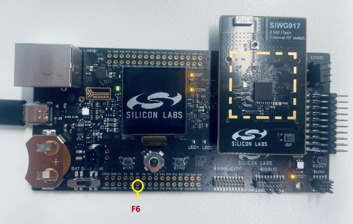

# SL ULP Timer

## Table of Contents

- [Purpose/Scope](#purposescope)
- [Overview](#overview)
- [About Example Code](#about-example-code)
- [Prerequisites/Setup Requirements](#prerequisitessetup-requirements)
  - [Hardware Requirements](#hardware-requirements)
  - [Software Requirements](#software-requirements)
  - [Setup Diagram](#setup-diagram)
- [Getting Started](#getting-started)
- [Application Build Environment](#application-build-environment)
- [Test the Application](#test-the-application)

## Purpose/Scope

- This ULP_Timer example demonstrates the ULP-TIMER with LED toggle functionality. The timer instance is configured to generate interrupts upon expiration which is when the LED0 is toggled. The timer-0 is set to expire at 1-second (1Hz) intervals.
- ULP Timer expiration depends on the TIMER_MATCH_VALUE, which is configurable. When Timer count matches to TIMER_MATCH_VALUE the interrupt hits and the LED0 toggle can be seen.

## Overview

- Timers are used in counting clocks, micro seconds, milli seconds, seconds
  and minutes with both ref clock and system (SoC) clock.
- The ULP-Timer module supports 4 timers, which can be used simultaneously to generate various
  timing events for the software.
- Each of the ULP-timers can be independently programmed to work in periodic or one-shot mode.
- Each of the ULP-timers can be independently configured as a 32-bit counter or as a microsecond timer.
- In ULP-mode it runs at 20MHZ clock frequency
- Supports 1µs type, 256µs type and normal down-counter type per timer.
- Programmed from APB interface

## About Example Code

- \ref ulp_timer_example.c this example file demonstrates how to use an ULP-timer instance to toggle onboard
  LED at 1sec periodic rate.
- In this example, first clock and timer are configured with default high power  configurations values from UC through \ref sl_si91x_ulp_timer_init and \ref sl_si91x_ulp_timer_set_configuration APIs respectively
- Then registers callback for the timer instance through sl_si91x_ulp_timer_register_timeout_callback API
- Then timer instance is started through \ref sl_si91x_ulp_timer_start API
- Then onboard LED-0 is toggled on every interrupt(timeout value 1 second), after five times LED toggle, timer is stopped through \ref sl_si91x_ulp_timer_stop API
- After that timer configured with new parameters through following APIs:
  \ref sl_si91x_ulp_timer_set_type to change to timer-type to 256US type (time in microseconds/256)
  \ref sl_si91x_ulp_timer_set_direction to change timer direction to up-counting
  \ref sl_si91x_ulp_timer_set_count to change match-value equal to number of ticks required for 1 second timeout in 256US type
- Then started timer again and after 5 interrupts and it will stop and switches to ultra low power state by calling the api \ref sl_si91x_power_manager_add_ps_requirement.
- As the interrupt is initialized with 5 it will configure the set type, direction, count and toggles the LED-0 5 times.
- similarly after toggling the LED-0 for 5 times it will stop the timer and switches back to high power mode by calling \ref sl_si91x_power_manager_add_ps_requirement and configures the set type, direction, count and toggles the LED-0 5 times and stops the timer. 
callback is unregistered through \ref sl_si91x_ulp_timer_stop API
- At last timer is de-initialized through \ref sl_si91x_ulp_timer_deinit API
- Before above steps first timer power state is changed to ULP, through \ref hardware_setup, for using timers in ULP mode

## Prerequisites/Setup Requirements

### Hardware Requirements

- Windows PC
- Silicon Labs Si917 Evaluation Kit [WPK(BRD4002) + BRD4338A]

### Software Requirements

- Si91x
- Simplicity Studio
- Serial console Setup
  - The Serial Console setup instructions are provided below:
Refer [here](https://docs.silabs.com/wiseconnect/latest/wiseconnect-getting-started/getting-started-with-soc-mode#perform-console-output-and-input-for-brd4338-a).

### Setup Diagram

## Getting Started

Refer to the instructions [here](https://docs.silabs.com/wiseconnect/latest/wiseconnect-getting-started/) to:

- Install Studio and WiSeConnect 3 extension
- Connect your device to the computer
- Upgrade your connectivity firmware
- Create a Studio project

For details on the project folder structure, see the [WiSeConnect Examples](https://docs.silabs.com/wiseconnect/latest/wiseconnect-examples/#example-folder-structure) page.

## Application Build Environment

- Open **sl_si91x_ulp_timer.slcp** project file select **software component** tab and search for **ULP-Timer** in search bar.
- Click on **timer0** and configure the ULP-timer instance as per configuration parameters given in wizard
- For using any other timer instance user has to add that timer instance by clicking on **ULP Timer Instance** from configuration wizard and then clicking on **Add New Instance**
- For creating timer instances write 'timer0', 'timer1', 'timer2' or 'timer3' on the wizard for respective instance and then click on **Done**
- After creation of instances separate configuration files are get generated in **config folder**.
- If project built without selecting configurations, it will take default values from UC.

  

- Configure Clock and timer using following macros, defined in \ref sl_si91x_ulp_timer_inst_config.h file and update/modify following macros if required:

### Macros for Clock Configurations:

- \ref SL_ULP_TIMER_CLK_TYPE, true to enable type-static and false to enable type-dynamic
- \ref SL_ULP_TIMER_SYNC_TO_ULPSS_PCLK, true to Enable & false to disable sync to ULPSS pclock
- \ref SL_ULP_TIMER_CLK_INPUT_SOURCE, for possible options \ref ulp_timer_clk_input_source_t
- \ref SL_ULP_TIMER_DIRECTION, true to enable waiting for switching timer clk & false to skip waiting for switching timer clk.
- After configuring above macros, their values are passed to \ref ulp_timer_clk_src_config_t structure type variable \ref sl_timer_clk_handle which is used to     configure clock using API-\ref sl_si91x_ulp_timer_init.
- To use SOC clock source use API \ref sl_si91x_ulp_timer_configure_soc_clock() API in place of \ref sl_si91x_ulp_timer_init API. Also comment out hardware_setup()
call from ulp_timer_example.c file as this clock source should be used in high power mode only.

### Macros for Timer Configurations:

- \ref SL_ULP_TIMER_DEFAULT (number), for possible values \ref ulp_timer_instance_t
- \ref SL_ULP_TIMER_MODE (periodic and oneshot), for possible values \ref ulp_timer_mode_t
- \ref SL_ULP_TIMER_TYP (1-microseconds, 256-microseconds & down-counter), for possible values \ref ulp_timer_type_t
- \ref SL_ULP_TIMER_DIRECTION (up & down), for possible values \ref ulp_timer_direction_t
- Also configure following macros in ulp_timer_example.c file:
- Update \ref ULP_TIMER_INSTANCE macro value to change the timer instance to be used for the application.
- Update \ref SL_TIMER_MATCH_VALUE macro before calling \ref sl_si91x_ulp_timer_set_configurations API to change the timer match value, update this macro as per clock source and timer-type selected.
- After configuring above macros, their values are passed to \ref ulp_timer_config_t structure type variable \ref sl_timer_handle which is used to configure timer using API-\ref sl_si91x_ulp_timer_set_configurations.

## Test the Application

Refer to the instructions [here](https://docs.silabs.com/wiseconnect/latest/wiseconnect-getting-started/) to:

- Build the SL ULP Timer example in Studio.
- Flash, run and debug the application

  

  
  
  

- Evaluation kit board's LED0 will be toggled five times at 1sec periodic rate.
- After toggling LED0 for five times, timer stops and configured with new parameters and toggles LED0 five more times.
- If timer-mode is 'one-shot' mode then LED0 will toggle only one time and then timer will stop.
- After that timer is stopped and and switches the power state from High power to Ultra low power and configured with new parameters and toggles LED again five times.
- similarly timer is stopped and switches the power state from Ultra Low Power
to High power and configured with new parameters and toggles LED again five times.
- At the end of this example "Unregistered timer timeout callback, on timer operation completion" serial console print can be noticed.
- After successful program execution the prints in serial console looks as shown below.

  
  
**Note:**
>- The required files for low power state are moved to RAM rest of the application is executed from flash.
>- In this application we are changing the power state from PS4 to PS2 and vice - versa. 

