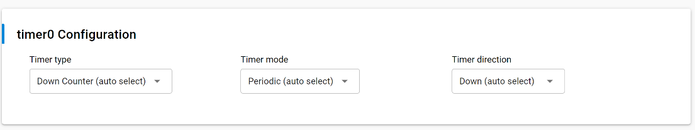
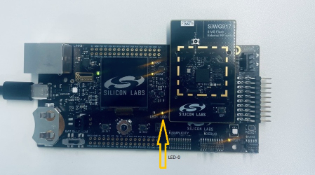
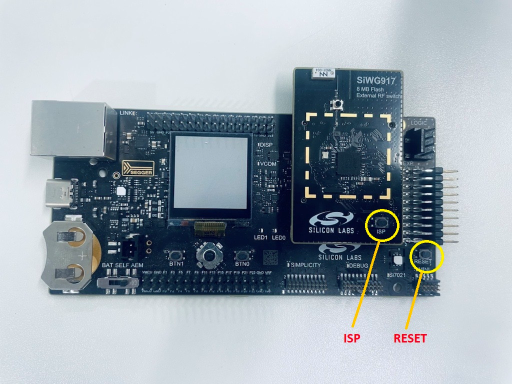
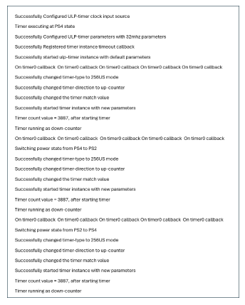

# SiWx91x Platform ULP Timer

## Table of Contents

- [SiWx91x Platform ULP Timer](#platform-siwx91x-ulp-timer)
  - [Table of Contents](#table-of-contents)
  - [Purpose/Scope](#purposescope)
  - [Overview](#overview)
  - [About Example Code](#about-example-code)
  - [Prerequisites/Setup Requirements](#prerequisitessetup-requirements)
    - [Hardware Requirements](#hardware-requirements)
    - [Software Requirements](#software-requirements)
    - [Setup Diagram](#setup-diagram)
  - [Getting Started](#getting-started)
  - [Application Build Environment](#application-build-environment)
    - [Macros for Timer Configurations](#macros-for-timer-configurations)
  - [Test the Application](#test-the-application)
  - [Troubleshooting](#troubleshooting)
  - [Resources](#resources)
  - [Report Bugs/Support](#report-bugssupport)

## Purpose/Scope

- This ULP_Timer example demonstrates the ULP-TIMER with LED flash functionality. The timer instance is configured to generate interrupts upon expiration, which flashes LED0. Timer-0 is set to expire at 1-second (1Hz) intervals. ULP Timer expiration depends on the TIMER_MATCH_VALUE, which is configurable.
- When the timer count matches the TIMER_MATCH_VALUE, the interrupt occurs, and the LED0 flash can be seen.

## Overview

- Timers are utilized for counting clocks, microseconds, milliseconds, seconds, and minutes with both reference clock and system (SoC) clock.
- The ULP-Timer module supports 4 timers, which can be used simultaneously to generate various timing events for the software.
- Each of the ULP-timers can be independently programmed to operate in periodic or one-shot mode. Additionally, each ULP-timer can be configured independently as a 32-bit counter or as a microsecond timer.
- In ULP mode, it runs at a 20MHz clock frequency and supports 1µs type, 256µs type, and normal down-counter type per timer.
- The timers are programmed from the APB interface.

## About Example Code

- The [`ulp_timer_example.c`](ulp_timer_example.c) example file demonstrates how to use a ULP-timer instance to flash the onboard LED at a 1-second periodic rate.
- In this example, first, timer is configured with default high-power configuration values from UC through the [sl_si91x_ulp_timer_init](https://docs.silabs.com/wiseconnect/latest/wiseconnect-api-reference-guide-si91x-peripherals/ulp-timer#sl-si91x-ulp-timer-init) and [sl_si91x_ulp_timer_set_configurations](https://docs.silabs.com/wiseconnect/latest/wiseconnect-api-reference-guide-si91x-peripherals/ulp-timer#sl-si91x-ulp-timer-set-configurations) APIs respectively.
- Match value is fetched based on timer type and TIME_IN_MICROSECONDS(Time in microseconds for which the match value needs to be calculated) using [sl_si91x_ulp_timer_get_match_value](https://docs.silabs.com/wiseconnect/latest/wiseconnect-api-reference-guide-si91x-peripherals/ulp-timer#sl-si91x-ulp-timer-get-match-value) API respectively.
- Then, a callback is registered for the timer instance through the [sl_si91x_ulp_timer_register_timeout_callback](https://docs.silabs.com/wiseconnect/latest/wiseconnect-api-reference-guide-si91x-peripherals/ulp-timer#sl-si91x-ulp-timer-register-timeout-callback) API.
- Next, the timer instance is started using the [sl_si91x_ulp_timer_start](https://docs.silabs.com/wiseconnect/latest/wiseconnect-api-reference-guide-si91x-peripherals/ulp-timer#sl-si91x-ulp-timer-start) API.
- The onboard LED-0 is then flashed on every interrupt (timeout value 1 second), and after flashing the LED five times, the timer is stopped using the [sl_si91x_ulp_timer_stop](https://docs.silabs.com/wiseconnect/latest/wiseconnect-api-reference-guide-si91x-peripherals/ulp-timer#sl-si91x-ulp-timer-stop) API.
- After that, the timer is configured with new parameters using the following APIs:
- [sl_si91x_ulp_timer_set_type](https://docs.silabs.com/wiseconnect/latest/wiseconnect-api-reference-guide-si91x-peripherals/ulp-timer#sl-si91x-ulp-timer-set-type) to change the timer type to 256US type (time in microseconds/256)
- [sl_si91x_ulp_timer_set_direction](https://docs.silabs.com/wiseconnect/latest/wiseconnect-api-reference-guide-si91x-peripherals/ulp-timer#sl-si91x-ulp-timer-set-direction) to change the timer direction to up-counting
- [sl_si91x_ulp_timer_set_count](https://docs.silabs.com/wiseconnect/latest/wiseconnect-api-reference-guide-si91x-peripherals/ulp-timer#sl-si91x-ulp-timer-set-count) to change the match value equal to the number of ticks required for a 1-second timeout in 256US type
- Then, the timer is started again, and after five interrupts, it will stop and switch to ultra-low-power state by calling the API [sl_si91x_power_manager_add_ps_requirement](https://docs.silabs.com/wiseconnect/latest/wiseconnect-api-reference-guide-si91x-peripherals/ulp-timer#sl-si91x-power-manager-add-ps-requirement). As the interrupt is initialized with 5, it will configure the set type, direction, count, and flash the LED-0 5 times.
- Similarly, after flashing the LED-0 five times, it will stop the timer and switch back to high-power mode by calling [sl_si91x_power_manager_add_ps_requirement](https://docs.silabs.com/wiseconnect/latest/wiseconnect-api-reference-guide-si91x-peripherals/ulp-timer#sl-si91x-power-manager-add-ps-requirement) and configure the set type, direction, count, and flash the LED0 5 times before stopping the timer.
- The callback is unregistered using the [sl_si91x_ulp_timer_stop](https://docs.silabs.com/wiseconnect/latest/wiseconnect-api-reference-guide-si91x-peripherals/ulp-timer#sl-si91x-ulp-timer-stop) API. Finally, the timer is deinitialized using the [sl_si91x_ulp_timer_deinit](https://docs.silabs.com/wiseconnect/latest/wiseconnect-api-reference-guide-si91x-peripherals/ulp-timer#sl-si91x-ulp-timer-deinit) API.


## Prerequisites/Setup Requirements

### Hardware Requirements

- Windows PC
- Silicon Labs SiWx91x Evaluation Kit [[BRD4002](https://www.silabs.com/development-tools/wireless/wireless-pro-kit-mainboard?tab=overview) + [BRD4338A](https://www.silabs.com/development-tools/wireless/wi-fi/siwx917-rb4338a-wifi-6-bluetooth-le-soc-radio-board?tab=overview) / [BRD4342A](https://www.silabs.com/development-tools/wireless/wi-fi/siwx91x-rb4342a-wifi-6-bluetooth-le-soc-radio-board?tab=overview) / [BRD4343A](https://www.silabs.com/development-tools/wireless/wi-fi/siw917y-rb4343a-wi-fi-6-bluetooth-le-8mb-flash-radio-board-for-module?tab=overview) / [BRD4343C](https://www.silabs.com/development-tools/wireless/wi-fi/siw917y-rb4343c-wi-fi-6-bluetooth-le-8mb-flash-radio-board-for-module?tab=overview)]
- SiWx917 AC1 Module Explorer Kit [BRD2708A](https://www.silabs.com/development-tools/wireless/wi-fi/siw917y-ek2708a-explorer-kit)

### Software Requirements

- SiWx91x
- Simplicity Studio
- Serial console Setup
  - For Serial Console setup instructions, refer to [link name](https://docs.silabs.com/wiseconnect/latest/wiseconnect-developers-guide-developing-for-silabs-hosts/using-the-simplicity-studio-ide#console-input-and-output).

### Setup Diagram


## Getting Started

Refer to the instructions [here](https://docs.silabs.com/wiseconnect/latest/wiseconnect-getting-started/) to:

- [Install Simplicity Studio](https://docs.silabs.com/wiseconnect/latest/wiseconnect-developers-guide-developing-for-silabs-hosts/using-the-simplicity-studio-ide#install-simplicity-studio)
- [Install WiSeConnect extension](https://docs.silabs.com/wiseconnect/latest/wiseconnect-developers-guide-developing-for-silabs-hosts/using-the-simplicity-studio-ide#install-the-wiseconnect-3-extension)
- [Connect your device to the computer](https://docs.silabs.com/wiseconnect/latest/wiseconnect-developers-guide-developing-for-silabs-hosts/using-the-simplicity-studio-ide#connect-siwx91x-to-computer)
- [Upgrade your connectivity firmware](https://docs.silabs.com/wiseconnect/latest/wiseconnect-developers-guide-developing-for-silabs-hosts/using-the-simplicity-studio-ide#update-siwx91x-connectivity-firmware)
- [Create a Studio project](https://docs.silabs.com/wiseconnect/latest/wiseconnect-developers-guide-developing-for-silabs-hosts/using-the-simplicity-studio-ide#create-a-project)

For details on the project folder structure, see the [WiSeConnect Examples](https://docs.silabs.com/wiseconnect/latest/wiseconnect-examples/#example-folder-structure) page.

## Application Build Environment

- Open **sl_si91x_ulp_timer.slcp** project file, select the **software component** tab and search for **ULP-Timer** in the search bar.
- Click on **timer0** and configure the ULP-timer instance as per configuration parameters given in the wizard.
- For using any other timer instance, the user has to add that timer instance by clicking on **ULP Timer Instance** from configuration wizard and then clicking on **Add New Instance**
- For creating timer instances write 'timer0', 'timer1', 'timer2' or 'timer3' on the wizard for respective instance and then click on **Done**
- After the creation of instances, separate configuration files are get generated in **config folder**.
- If the project is built without selecting configurations, it will take default values from UC.

  

- Configure timer using following macros, defined in [`sl_si91x_ulp_timer_inst_config.h`](https://github.com/SiliconLabs/wiseconnect/blob/v4.1.0-content-for-docs/components/device/silabs/si91x/mcu/drivers/unified_api/config/sl_si91x_ulp_timer_inst_config.h) file and update/modify following macros if required:

### Macros for Timer Configurations

- SL_ULP_TIMER_DEFAULT (number): for possible values [ulp_timer_instance_t](https://docs.silabs.com/wiseconnect/latest/wiseconnect-api-reference-guide-si91x-peripherals/ulp-timer#ulp-timer-instance-t)
- SL_ULP_TIMER_MODE (periodic and oneshot): for possible values [ulp_timer_mode_t](https://docs.silabs.com/wiseconnect/latest/wiseconnect-api-reference-guide-si91x-peripherals/ulp-timer#ulp-timer-mode-t)
- SL_ULP_TIMER_TYP (1-microseconds, 256-microseconds & down-counter): for possible values [ulp_timer_type_t](https://docs.silabs.com/wiseconnect/latest/wiseconnect-api-reference-guide-si91x-peripherals/ulp-timer#ulp-timer-type-t)
- SL_ULP_TIMER_DIRECTION (up & down): for possible values [ulp_timer_direction_t](https://docs.silabs.com/wiseconnect/latest/wiseconnect-api-reference-guide-si91x-peripherals/ulp-timer#ulp-timer-direction-t)
- Also, configure the following macros in [`ulp_timer_example.c`](ulp_timer_example.c) file:

- `TIME_IN_MICROSECONDS`: Timer timeout duration in microseconds for which the match value is calculated. By default, it is set to 1000000 (1 second).

  ```c
    #define TIME_IN_MICROSECONDS  1000000 // Timer timeout for 1 second in microseconds
  ```

- `LED0`: Identifier for the on-board LED-0, which is flashed on every timer timeout interrupt. By default, it is set to 0.

  ```c
    #define LED0                  0       // For On-board LED-0
  ```

- `ZERO_INTERRUPT_COUNT`: Reference count used for the zeroth timeout interrupt condition. By default, it is set to 0.

  ```c
    #define ZERO_INTERRUPT_COUNT  0       // Count for zeroth timeout interrupt
  ```

- `FIFTH_INTERRUPT_COUNT`: Number of interrupts after which the timer stops its first toggle cycle (LED flashed five times). By default, it is set to 5.

  ```c
    #define FIFTH_INTERRUPT_COUNT 5       // Count for fifth timeout interrupt
  ```

- `TENTH_INTERRUPT_COUNT`: Number of interrupts after which the timer completes its second toggle cycle (LED flashed ten times total). By default, it is set to 10.

  ```c
    #define TENTH_INTERRUPT_COUNT 10      // Count for tenth timeout interrupt
  ```

- `ULP_TIMER_INSTANCE`: Selects the ULP-timer instance used by the application. Update this value (0, 1, 2, or 3) to switch between timer instances. By default, it is set to 0.

  ```c
    #define ULP_TIMER_INSTANCE    0       // timer instance used, pass selected timer instance number in place of '0'
  ```

- Update ULP_TIMER_INSTANCE macro value to change the timer instance to be used for the application.
- Update SL_TIMER_MATCH_VALUE macro before calling [sl_si91x_ulp_timer_set_configurations](https://docs.silabs.com/wiseconnect/latest/wiseconnect-api-reference-guide-si91x-peripherals/ulp-timer#sl-si91x-ulp-timer-set-configurations) API to change the timer match value. Update this macro as per the clock source and timer-type selected.
- After configuring the above macros, their values are passed to [ulp_timer_config_t](https://docs.silabs.com/wiseconnect/latest/wiseconnect-api-reference-guide-si91x-peripherals/ulp-timer#ulp-timer-config-t) structure type variable sl_timer_handle which is used to configure the timer using the API - [sl_si91x_ulp_timer_set_configurations](https://docs.silabs.com/wiseconnect/latest/wiseconnect-api-reference-guide-si91x-peripherals/ulp-timer#sl-si91x-ulp-timer-set-configurations).

> **Note**: For recommended settings, please refer the [recommendations guide](https://docs.silabs.com/wiseconnect/latest/wiseconnect-developers-guide-prog-recommended-settings/).

## Test the Application

> **Note:** Use **`Log_script.py`** from the **SiWx91x Platform Logger** example (`examples/si91x_soc/service/sl_si91x_logger/`) to decode structured console log output. Run:
>
> `python Log_script.py --out firmware.out --descriptor SYSVIEW_CaptiveCore.txt --port COM5 --max-args 3`
>
> Replace **COM5** with the serial port your board uses on the host PC.


Refer to the instructions [here](https://docs.silabs.com/wiseconnect/latest/wiseconnect-getting-started/) to:

- Build the SL ULP Timer example in Studio.
- Flash, run and debug the application

  

  

- The evaluation kit board's LED0 will flash five times at a 1-second periodic rate.
- After flashing LED0 five times, the timer stops and is configured with new parameters, flashing LED0 five more times.
- If the timer mode is 'one-shot' mode, LED0 will flash only one time, and then the timer will stop.
- After that, the timer is stopped and switches the power state from High power to Ultra-low power and is configured with new parameters, flashling the LED again five times.
- Similarly, the timer is stopped and switches the power state from Ultra Low Power to High power and is configured with new parameters, flashing the LED again five times.
- At the end of this example, the serial console prints "Unregistered timer timeout callback, on timer operation completion."
- After successful program execution, the prints in the serial console look as shown below:

  

**Note:**
>
>- The required files for low power state are moved to RAM rest of the application is executed from flash.
>- In this application we are changing the power state from PS4 to PS2 and vice - versa.

> **Note:**
>
> - Interrupt handlers are implemented in the driver layer, and user callbacks are provided for custom code. If you want to write your own interrupt handler instead of using the default one, make the driver interrupt handler a weak handler. Then, copy the necessary code from the driver handler to your custom interrupt handler.
>
> **Note:**
>
>- This application is intended for demonstration purposes only to showcase the ULP peripheral functionality. It should not be used as a reference for real-time use case project development because the wireless shutdown scenario is not supported in the current SDK.

## Troubleshooting

- If the project does not build, ensure Simplicity Studio and the WiSeConnect extension are installed and the board is connected.
- If the device is not detected, reinstall the connectivity firmware and check USB drivers.

## Resources

- [WiSeConnect Getting Started](https://docs.silabs.com/wiseconnect/latest/wiseconnect-getting-started/)
- [WiSeConnect Examples](https://docs.silabs.com/wiseconnect/latest/wiseconnect-examples/)
- [SiWx91x SoC Documentation](https://docs.silabs.com/wiseconnect/latest/)

## Report Bugs/Support

For issues and support, use the Silicon Labs Community or your normal support channel.

