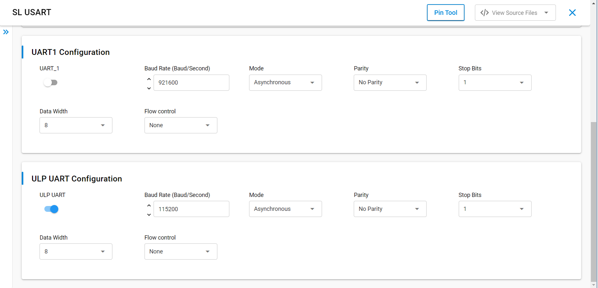
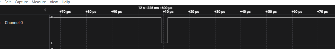
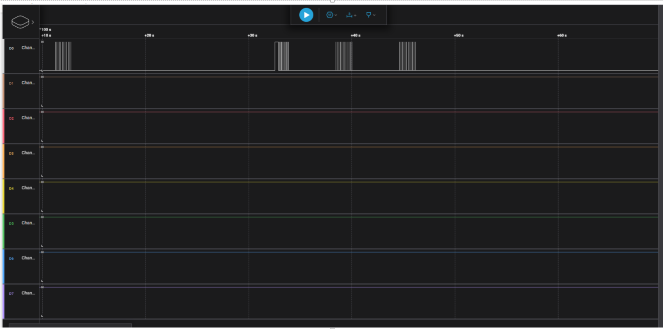

# SL ULP UART

## Table of Contents

- [Purpose/Scope](#purposescope)
- [Overview](#overview)
- [About Example Code](#about-example-code)
- [Prerequisites/Setup Requirements](#prerequisitessetup-requirements)
  - [Hardware Requirements](#hardware-requirements)
  - [Software Requirements](#software-requirements)
  - [Setup Diagram](#setup-diagram)
- [Getting Started](#getting-started)
- [Application Build Environment](#application-build-environment)
- [Test the Application](#test-the-application)

## Purpose/Scope

- This application demonstrates how to configure ULP UART In asynchronous mode, it will send and receive data in loopback mode

## Overview

- ULP UART is used in communication through wired medium in Asynchronous fashion. It enables the device to
  communicate using serial protocols
- This application is configured with following configs
  - Tx and Rx enabled
  - Asynchronous mode
  - 8 Bit data transfer
  - Stop bits 1
  - No Parity
  - No Auto Flow control
  - Baud Rates - 115200

## About Example Code

- \ref ulp_uart_example.c this example code demonstrates how to configure the uart to send and receive data in loopback mode
- In this example, first uart get initialized if it's not initialized already with clock and dma configurations if dma is
  enabled using \ref sl_si91x_uart_init
- After uart initialization ,sets the uart power mode using \ref sl_si91x_uart_set_power_mode() and configures the UART
  with default configurations from UC and uart transmit and receive lines using \ref sl_si91x_uart_set_configuration()
- Then register's user event callback for send ,receive and transfer complete notification using
  \ref sl_si91x_uart_register_event_callback()
- After user event callback registered data send and receive can happen through \ref sl_si91x_uart_send_data() and
  \ref sl_si91x_uart_receive_data() respectively.

## Prerequisites/Setup Requirements

### Hardware Requirements

- Windows PC
- Silicon Labs Si917 Evaluation Kit [WPK(BRD4002) + BRD4338A]

### Software Requirements

- Simplicity Studio
- Serial console Setup
  - The Serial Console setup instructions are provided below:
Refer [here](https://docs.silabs.com/wiseconnect/latest/wiseconnect-getting-started/getting-started-with-soc-mode#perform-console-output-and-input-for-brd4338-a).

### Setup Diagram


## Getting Started

Refer to the instructions [here](https://docs.silabs.com/wiseconnect/latest/wiseconnect-getting-started/) to:

- Install Studio and WiSeConnect 3 extension
- Connect your device to the computer
- Upgrade your connectivity firmware
- Create a Studio project

## Application Build Environment

- - Enable the ULP_UART mode in UC before running/flashing the code.

   

- Remove DEBUG_UART macro from preprocessor window
- Data send and receive from vcom console is for one iteration. To check continuous data transfer modify below macro to ENABLE in ulp_uart_example.h file.

  ```c
  #define USE_SEND    ENABLE
  ```

- Loopback ULP_GPIO_2 to ULP_GPIO_11 to observe continuous toggle, once data sent and received matches.

## Pin Configuration 

|         GPIO pin    |Description|
|   --------------    | --------- |
|ULP_GPIO_11  [F6]    |    TX     |
|ULP_GPIO_9   [F7]    |    RX     |
|ULP_GPIO_10 [P17]    |GPIO_Toggle|

## Test the Application

Refer to the instructions [here](https://docs.silabs.com/wiseconnect/latest/wiseconnect-getting-started/) to:

- Build the SL ULP UART example in Studio.
- Flash, run and debug the application

Follow the steps below for successful execution of the application:

1. When the application runs,ULP_UART sends and receives data in full duplex mode
2. When tx and rx data both are matching ULP_GPIO_10 should be toggled ,connect logic analyzer to observe the toggle state. 
3. Here same PINS which are used to send and receive the data where used for data transfer so we cannot able to see prints 
 we can use GPIO toggling instead like shown below.
 - when use send disabled:

   

- when use send enabled:

   


 
> **Note:**
>
>- This application is executed from RAM.
>- In this application while changing the MCU mode from PS4 to PS2, M4 flash will be turned off.
>- The debug feature of Simplicity Studio will not work after M4 flash is turned off.
>- After Flashing ULP examples as M4 flash will be turned off,flash erase does not work.
>- To Erase the chip follow the below procedure
>- Press ISP and RESET button at same time and then release, now perform Chip erase through commander.
