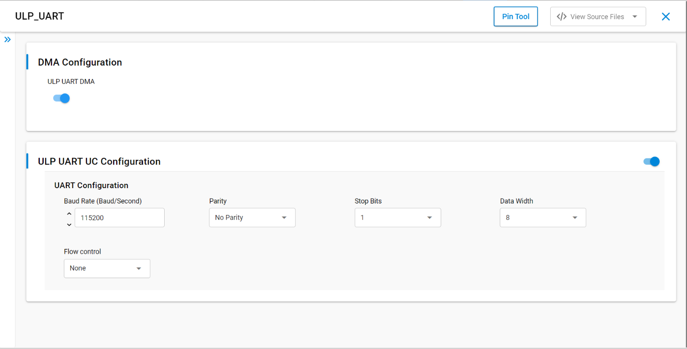
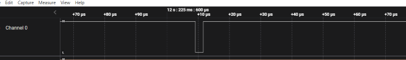
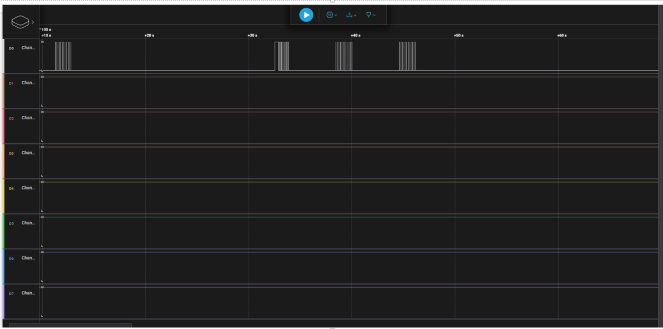

# SiWx91x Platform ULP UART

## Table of Contents

- [SiWx91x Platform ULP UART](#platform-siwx91x-ulp-uart)
  - [Table of Contents](#table-of-contents)
  - [Purpose/Scope](#purposescope)
  - [Overview](#overview)
  - [About Example Code](#about-example-code)
  - [Prerequisites/Setup Requirements](#prerequisitessetup-requirements)
    - [Hardware Requirements](#hardware-requirements)
    - [Software Requirements](#software-requirements)
    - [Setup Diagram](#setup-diagram)
  - [Getting Started](#getting-started)
  - [Application Build Environment](#application-build-environment)
  - [Pin Configuration](#pin-configuration)
  - [Test the Application](#test-the-application)
  - [Troubleshooting](#troubleshooting)
  - [Resources](#resources)
  - [Report Bugs/Support](#report-bugssupport)

## Purpose/Scope

This application demonstrates how to configure ULP UART In asynchronous mode, it will send and receive data.

## Overview

- ULP UART is used in communication through wired medium in Asynchronous fashion. It enables the device to communicate using serial protocols.
- This application is configured with following configs:
  - Tx and Rx enabled
  - Asynchronous mode
  - 8 Bit data transfer
  - Stop bits 1
  - No Parity
  - No Auto Flow control
  - Baud Rates - 115200
- HW flow control is supported only when running non-ROM uart code.
- RS485 is not supported by ULP UART.

## About Example Code

- [`ulp_uart_example.c`](ulp_uart_example.c) - This example code demonstrates how to configure the UART to send and receive data in loopback mode.
- In this example, the UART is first initialized—if not already done—using [`sl_si91x_usart_init`](https://docs.silabs.com/wiseconnect/latest/wiseconnect-api-reference-guide-si91x-peripherals/usart#sl-si91x-usart-init), along with clock, power mode and DMA configurations when DMA is enabled.
**Note:** If the UART/USART instance is selected for debug output logs, initialization will return `SL_STATUS_NOT_AVAILABLE`.
- After UART initialization, ULP UART is configured with default configurations from UC along with UART transmit and receive lines using the [`sl_si91x_usart_set_configuration()`](https://docs.silabs.com/wiseconnect/latest/wiseconnect-api-reference-guide-si91x-peripherals/usart#sl-si91x-usart-set-configuration).
- Then the register the user event callback for send and receive complete notification is set using [`sl_si91x_usart_multiple_instance_register_event_callback()`](https://docs.silabs.com/wiseconnect/latest/wiseconnect-api-reference-guide-si91x-peripherals/usart#sl-si91x-usart-multiple-instance-register-event-callback).
- After setting the user event callback, the data send and receive can happen through [`sl_si91x_usart_send_data`](https://docs.silabs.com/wiseconnect/latest/wiseconnect-api-reference-guide-si91x-peripherals/usart#sl-si91x-usart-send-data) and [`sl_si91x_usart_receive_data`](https://docs.silabs.com/wiseconnect/latest/wiseconnect-api-reference-guide-si91x-peripherals/usart#sl-si91x-usart-receive-data) respectively.
- Once the receive data event is triggered, both transmit and receive buffer data is compared to confirm if the received data is the same.

> **Note:** When utilizing the ULP UART instance in high-power mode with DMA enabled, it is advisable to allocate buffers in the ULP memory block.


## Prerequisites/Setup Requirements

### Hardware Requirements

- Windows PC
- Silicon Labs SiWx91x Evaluation Kit [[BRD4002](https://www.silabs.com/development-tools/wireless/wireless-pro-kit-mainboard?tab=overview) + [BRD4338A](https://www.silabs.com/development-tools/wireless/wi-fi/siwx917-rb4338a-wifi-6-bluetooth-le-soc-radio-board?tab=overview) / [BRD4342A](https://www.silabs.com/development-tools/wireless/wi-fi/siwx91x-rb4342a-wifi-6-bluetooth-le-soc-radio-board?tab=overview) / [BRD4343A](https://www.silabs.com/development-tools/wireless/wi-fi/siw917y-rb4343a-wi-fi-6-bluetooth-le-8mb-flash-radio-board-for-module?tab=overview) / [BRD4343C](https://www.silabs.com/development-tools/wireless/wi-fi/siw917y-rb4343c-wi-fi-6-bluetooth-le-8mb-flash-radio-board-for-module?tab=overview)]
- SiWx917 AC1 Module Explorer Kit [BRD2708A](https://www.silabs.com/development-tools/wireless/wi-fi/siw917y-ek2708a-explorer-kit)

### Software Requirements

- Simplicity Studio
- Serial console Setup
  - For serial console setup instructions, see the [Console Input and Output](https://docs.silabs.com/wiseconnect/latest/wiseconnect-developers-guide-developing-for-silabs-hosts/using-the-simplicity-studio-ide#console-input-and-output) section of the *WiSeConnect Developer's Guide*.

### Setup Diagram


## Getting Started

Refer to the instructions [here](https://docs.silabs.com/wiseconnect/latest/wiseconnect-getting-started/) to:

- [Install Simplicity Studio](https://docs.silabs.com/wiseconnect/latest/wiseconnect-developers-guide-developing-for-silabs-hosts/using-the-simplicity-studio-ide#install-simplicity-studio)
- [Install WiSeConnect extension](https://docs.silabs.com/wiseconnect/latest/wiseconnect-developers-guide-developing-for-silabs-hosts/using-the-simplicity-studio-ide#install-the-wiseconnect-3-extension)
- [Connect your device to the computer](https://docs.silabs.com/wiseconnect/latest/wiseconnect-developers-guide-developing-for-silabs-hosts/using-the-simplicity-studio-ide#connect-siwx91x-to-computer)
- [Upgrade your connectivity firmware](https://docs.silabs.com/wiseconnect/latest/wiseconnect-developers-guide-developing-for-silabs-hosts/using-the-simplicity-studio-ide#update-siwx91x-connectivity-firmware)
- [Create a Studio project](https://docs.silabs.com/wiseconnect/latest/wiseconnect-developers-guide-developing-for-silabs-hosts/using-the-simplicity-studio-ide#create-a-project)

For details on the project folder structure, see the [WiSeConnect Examples](https://docs.silabs.com/wiseconnect/latest/wiseconnect-examples/#example-folder-structure) page.

## Application Build Environment

- Enable the ULP_UART mode in UC before running/flashing the code.

   

- Configure the following macros in [`ulp_uart_example.c`](ulp_uart_example.c) if required:

- `ULP_UART_BUFFER_SIZE`: Defines the length (in bytes) of the buffer used to send and receive ULP UART data. By default, it is set to 1024.

  ```c
  #define ULP_UART_BUFFER_SIZE  1024   // Data send and receive length
  ```

- `USART_BAUDRATE`: Specifies the ULP UART baud rate used for transmission and reception. Supported range is 9600-7372800. By default, it is set to 115200.

  ```c
  #define USART_BAUDRATE        115200 // Baud rate <9600-7372800>
  ```

- `ULP_GPIO_PIN`: Selects the ULP GPIO pin used as the receive line reference. By default, it is set to 2.

  ```c
  #define ULP_GPIO_PIN          2      // ULP GPIO to receive
  ```

- `ULP_GPIO_TOGGLE`: Selects the ULP GPIO pin that is toggled when TX and RX data match. By default, it is set to 8.

  ```c
  #define ULP_GPIO_TOGGLE       8      // ULP GPIO to toggle
  ```

- `OUTPUT_VALUE`: Defines the logic level driven on the GPIO output. By default, it is set to 1.

  ```c
  #define OUTPUT_VALUE          1      // GPIO output value
  ```

- `ULP_GPIO_PORT`: Specifies the GPIO port number used for ULP GPIO operations. By default, it is set to 4.

  ```c
  #define ULP_GPIO_PORT         4      // GPIO Port no
  ```

- `SET`: Convenience macro used to drive a GPIO or flag to its set state. By default, it is set to 1.

  ```c
  #define SET                   1      // Macro to set
  ```

- `FIRST_ITERATION`: Identifier for the first iteration which transitions from High Power (PS4) to Ultra Low Power (PS2) state. By default, it is set to 1.

  ```c
  #define FIRST_ITERATION       1    // First iteration from High Power to Ultra Low Power state
  ```

- `SECOND_ITERATION`: Identifier for the second iteration which transitions from Ultra Low Power (PS2) back to High Power state. By default, it is set to 2.

  ```c
  #define SECOND_ITERATION      2    // Second iteration from Ultra Low Power state to High Power
  ```

- `THIRD_ITERATION`: Identifier for the third iteration which de-initializes the UART. By default, it is set to 3.

  ```c
  #define THIRD_ITERATION       3    // Third iteration deinitialization of uart
  ```

- `MS_DELAY_COUNTER`: Loop count used to generate a short millisecond-level delay. By default, it is set to 4600.

  ```c
  #define MS_DELAY_COUNTER      4600 // Delay count
  ```

- `FIVE_SECOND_DELAY`: Delay (in milliseconds) inserted between power state changes. By default, it is set to 5000.

  ```c
  #define FIVE_SECOND_DELAY     5000 // 5 second delay between state changes
  ```

- `MINIMUM_COUNT_VALUE`: Lower bound used when iterating/comparing toggle counts. By default, it is set to 0.

  ```c
  #define MINIMUM_COUNT_VALUE   0    // Minimum count value
  ```

- `MAXIMUM_COUNT_VALUE`: Upper bound used for the number of comparison pin triggers for reference. By default, it is set to 10.

  ```c
  #define MAXIMUM_COUNT_VALUE   10   // Maximum comparison pin triggering for reference
  ```

- Data send and receive from VCOM console is for one iteration only. On VCOM console, set the configuration such that the received data is sent back on the same port.
- To check continuous data transfer, modify the following macro to ENABLE in the [`ulp_uart_example.h`](ulp_uart_example.h) file.

- `USE_SEND`: When set to ENABLE, the application continuously sends data over ULP UART so that continuous transfer/toggling can be observed. By default, it is set to DISABLE.

  ```c
  #define USE_SEND    ENABLE
  ```

- Set the ULP_UART_RX pin to any other GPIO than ULP_GPIO_9 because ULP_GPIO_9 is dedicated for VCOM.
- Do loopback of selected GPIO to ULP_GPIO_11 to observe toggles, once data sent and received matches.
- The output in the logic analyser will show toggling in PS4 state 12 times as well as in PS2 and PS4 also it will toggles for 12 times respectively on the ULP_GPIO_8.

## Pin Configuration

|     SiWx91xM       |      SiWx91xY     | Description |
| ------------------ | ----------------- | ----------- |
| ULP_GPIO_11  [F6]  | ULP_GPIO_11 [F6]  | TX (VCOM)   |
| ULP_GPIO_9   [F7]  | ULP_GPIO_9  [F7]  | RX (VCOM)   |
| ULP_GPIO_8   [P15] | ULP_GPIO_8  [P15] | GPIO_Toggle |

> **Note**: For recommended settings, please refer the [recommendations guide](https://docs.silabs.com/wiseconnect/latest/wiseconnect-developers-guide-prog-recommended-settings/).

## Test the Application

> **Note:** Use **`Log_script.py`** from the **SiWx91x Platform Logger** example (`examples/si91x_soc/service/sl_si91x_logger/`) to decode structured console log output. Run:
>
> `python Log_script.py --out firmware.out --descriptor SYSVIEW_CaptiveCore.txt --port COM5 --max-args 3`
>
> Replace **COM5** with the serial port your board uses on the host PC.


Refer to the instructions [here](https://docs.silabs.com/wiseconnect/latest/wiseconnect-getting-started/) to:

- Build the SL ULP UART example in Studio.
- Flash, run and debug the application

Follow the steps below for successful execution of the application:

1. When the application runs, ULP_UART sends and receives data in full-duplex modes
2. When TX and RX data match, ULP_GPIO_8 should be toggled for the SiWx91x. Connect the logic analyzer to observe the toggle state.
3. Here the same pins which are used to send and receive the data are used for data transfer. As a result, you cannot observe prints. Instead, you can use GPIO toggling method as shown below.

   - when use send disabled:

   

   - when use send enabled:

   

>**Note:**
>
>- The required files for low-power state are moved to RAM. The rest of the application is executed from flash.
>- In this application, we are changing the power state from PS4 to PS2 and vice - versa.
>- Once the power state changes from PS4 to PS2 and vice - versa, you have to reconfigure the uart configs once again using sl_si91x_usart_set_configuration() API  because of frequency change. Refer to  file for more info.
>
- Once the power state changes from PS4 to PS2 and vice - versa, you have to reconfigure the uart configs once again using sl_si91x_usart_set_configuration() API  because of frequency change. Refer to [`ulp_uart_example.c`](ulp_uart_example.c) file for more info.
- Once the power state changes from PS4 to PS2 and vice - versa, you have to reconfigure the uart configs once again using sl_si91x_usart_set_configuration() API  because of frequency change. Refer to [`ulp_uart_example.c`](ulp_uart_example.c) file for more info.
- Once the power state changes from PS4 to PS2 and vice - versa, you have to reconfigure the uart configs once again using sl_si91x_usart_set_configuration() API  because of frequency change. Refer to [`ulp_uart_example.c`](ulp_uart_example.c) file for more info.
>
>- CTS and RTS only works when not using ROM driver for UART
>
> **Note:**
>
>- Interrupt handlers are implemented in the driver layer, and user callbacks are provided for custom code. If you want to write your own interrupt handler instead of using the default one, make the driver interrupt handler a weak handler. Then, copy the necessary code from the driver handler to your custom interrupt handler.
>
>- To configure the SoC GPIO as ULP GPIO follow below code snippets, In below code snippet shown demonstrates configuring SOC_GPIO_8 and SOC_GPIO_9 as ulp_gpio_2 and ulp_gpio_3 to use as ulp_uart rx and tx pins respectively
>- This gpio should configure as ulp_gpio's only when ulp_uart functioning in  PS4 and PS3 state.

**GPIO 8 as ULP_UART_RX:**

```c
  // Enable PAD selection GPIO HP instance
  // sl_si91x_gpio_enable_pad_selection(gpio_padnum)
  sl_si91x_gpio_enable_pad_selection(3);
  // Set the pin mode
  // sl_gpio_set_pin_mode(port, pin, mode, output_value)
  sl_gpio_set_pin_mode(0,8,9,1);
  // Enable PAD receiver for gpio 8
  // sl_si91x_gpio_enable_pad_receiver(gpio_num);
  sl_si91x_gpio_enable_pad_receiver(8);
  // Set the pin mode
  // sl_gpio_set_pin_mode(port, pin, mode, output_value)
  sl_gpio_set_pin_mode(4,2,0,1);
  // Sets ulp soc gpio mode
  // sl_si91x_gpio_ulp_soc_mode(ulp_gpio_num,mode)
  sl_si91x_gpio_ulp_soc_mode(2,3);
  ```

**GPIO 9 as ULP_UART_TX:**

```c
  // Enable PAD selection GPIO HP instance
  // sl_si91x_gpio_enable_pad_selection(gpio_padnum)
  sl_si91x_gpio_enable_pad_selection(4);
  // Set the pin mode
  // sl_gpio_set_pin_mode(port, pin, mode, output_value)
  sl_gpio_set_pin_mode(0,9,9,1);
  // Enable PAD receiver for gpio 9
  // sl_si91x_gpio_enable_pad_receiver(gpio_num);
  sl_si91x_gpio_enable_pad_receiver(9);
  // Set the pin mode
  // sl_gpio_set_pin_mode(port, pin, mode, output_value)
  sl_gpio_set_pin_mode(4,3,0,1);
  // Sets ulp soc gpio mode
  // sl_si91x_gpio_ulp_soc_mode(ulp_gpio_num,mode)
  sl_si91x_gpio_ulp_soc_mode(3,3);
  ```

> **Note:**
> Header connection pin references mentioned here are all specific to BRD4338A. If user runs this application on a different board, it is recommended to refer the board specific schematic for GPIO-Header connection pin mapping.
>
> **Note:**
>
>- This application is intended for demonstration purposes only to showcase the ULP peripheral functionality. It should not be used as a reference for real-time use case project development, because the wireless shutdown scenario is not supported in the current SDK.
>- On the SiWx91x device, only 4KB of ULP RAM is available for application use. In this example, both the TX (transmit) and RX (receive) data buffers must be placed in ULP memory. Specifically, 2KB of ULP RAM is allocated for TX and 2KB for RX, enabling up to 2KB of data to be transmitted and received per operation.

## Troubleshooting

- If the project does not build, ensure Simplicity Studio and the WiSeConnect extension are installed and the board is connected.
- If the device is not detected, reinstall the connectivity firmware and check USB drivers.

## Resources

- [WiSeConnect Getting Started](https://docs.silabs.com/wiseconnect/latest/wiseconnect-getting-started/)
- [WiSeConnect Examples](https://docs.silabs.com/wiseconnect/latest/wiseconnect-examples/)
- [SiWx91x SoC Documentation](https://docs.silabs.com/wiseconnect/latest/)

## Report Bugs/Support

For issues and support, use the Silicon Labs Community or your normal support channel.

# SiWx91x Platform ULP UART

## Table of Contents

- [SiWx91x Platform ULP UART](#platform-siwx91x-ulp-uart)
  - [Table of Contents](#table-of-contents)
  - [Purpose/Scope](#purposescope)
  - [Overview](#overview)
  - [About Example Code](#about-example-code)
  - [Prerequisites/Setup Requirements](#prerequisitessetup-requirements)
    - [Hardware Requirements](#hardware-requirements)
    - [Software Requirements](#software-requirements)
    - [Setup Diagram](#setup-diagram)
  - [Getting Started](#getting-started)
  - [Application Build Environment](#application-build-environment)
  - [Pin Configuration](#pin-configuration)
  - [Test the Application](#test-the-application)
  - [Troubleshooting](#troubleshooting)
  - [Resources](#resources)
  - [Report Bugs/Support](#report-bugssupport)

## Purpose/Scope

This application demonstrates how to configure ULP UART In asynchronous mode, it will send and receive data.

## Overview

- ULP UART is used in communication through wired medium in Asynchronous fashion. It enables the device to communicate using serial protocols.
- This application is configured with following configs:
  - Tx and Rx enabled
  - Asynchronous mode
  - 8 Bit data transfer
  - Stop bits 1
  - No Parity
  - No Auto Flow control
  - Baud Rates - 115200
- HW flow control is supported only when running non-ROM uart code.
- RS485 is not supported by ULP UART.

## About Example Code

- [`ulp_uart_example.c`](ulp_uart_example.c) - This example code demonstrates how to configure the UART to send and receive data in loopback mode.
- In this example, the UART is first initialized—if not already done—using [`sl_si91x_usart_init`](https://docs.silabs.com/wiseconnect/latest/wiseconnect-api-reference-guide-si91x-peripherals/usart#sl-si91x-usart-init), along with clock, power mode and DMA configurations when DMA is enabled.
**Note:** If the UART/USART instance is selected for debug output logs, initialization will return `SL_STATUS_NOT_AVAILABLE`.
- After UART initialization, ULP UART is configured with default configurations from UC along with UART transmit and receive lines using the [`sl_si91x_usart_set_configuration()`](https://docs.silabs.com/wiseconnect/latest/wiseconnect-api-reference-guide-si91x-peripherals/usart#sl-si91x-usart-set-configuration).
- Then the register the user event callback for send and receive complete notification is set using [`sl_si91x_usart_multiple_instance_register_event_callback()`](https://docs.silabs.com/wiseconnect/latest/wiseconnect-api-reference-guide-si91x-peripherals/usart#sl-si91x-usart-multiple-instance-register-event-callback).
- After setting the user event callback, the data send and receive can happen through [`sl_si91x_usart_send_data`](https://docs.silabs.com/wiseconnect/latest/wiseconnect-api-reference-guide-si91x-peripherals/usart#sl-si91x-usart-send-data) and [`sl_si91x_usart_receive_data`](https://docs.silabs.com/wiseconnect/latest/wiseconnect-api-reference-guide-si91x-peripherals/usart#sl-si91x-usart-receive-data) respectively.
- Once the receive data event is triggered, both transmit and receive buffer data is compared to confirm if the received data is the same.

> **Note:** When utilizing the ULP UART instance in high-power mode with DMA enabled, it is advisable to allocate buffers in the ULP memory block.


## Prerequisites/Setup Requirements

### Hardware Requirements

- Windows PC
- Silicon Labs SiWx91x Evaluation Kit [[BRD4002](https://www.silabs.com/development-tools/wireless/wireless-pro-kit-mainboard?tab=overview) + [BRD4338A](https://www.silabs.com/development-tools/wireless/wi-fi/siwx917-rb4338a-wifi-6-bluetooth-le-soc-radio-board?tab=overview) / [BRD4342A](https://www.silabs.com/development-tools/wireless/wi-fi/siwx91x-rb4342a-wifi-6-bluetooth-le-soc-radio-board?tab=overview) / [BRD4343A](https://www.silabs.com/development-tools/wireless/wi-fi/siw917y-rb4343a-wi-fi-6-bluetooth-le-8mb-flash-radio-board-for-module?tab=overview)]
- SiWx917 AC1 Module Explorer Kit [BRD2708A](https://www.silabs.com/development-tools/wireless/wi-fi/siw917y-ek2708a-explorer-kit)

### Software Requirements

- Simplicity Studio
- Serial console Setup
  - For serial console setup instructions, see the [Console Input and Output](https://docs.silabs.com/wiseconnect/latest/wiseconnect-developers-guide-developing-for-silabs-hosts/using-the-simplicity-studio-ide#console-input-and-output) section of the *WiSeConnect Developer's Guide*.

### Setup Diagram


## Getting Started

Refer to the instructions [here](https://docs.silabs.com/wiseconnect/latest/wiseconnect-getting-started/) to:

- [Install Simplicity Studio](https://docs.silabs.com/wiseconnect/latest/wiseconnect-developers-guide-developing-for-silabs-hosts/using-the-simplicity-studio-ide#install-simplicity-studio)
- [Install WiSeConnect extension](https://docs.silabs.com/wiseconnect/latest/wiseconnect-developers-guide-developing-for-silabs-hosts/using-the-simplicity-studio-ide#install-the-wiseconnect-3-extension)
- [Connect your device to the computer](https://docs.silabs.com/wiseconnect/latest/wiseconnect-developers-guide-developing-for-silabs-hosts/using-the-simplicity-studio-ide#connect-siwx91x-to-computer)
- [Upgrade your connectivity firmware](https://docs.silabs.com/wiseconnect/latest/wiseconnect-developers-guide-developing-for-silabs-hosts/using-the-simplicity-studio-ide#update-siwx91x-connectivity-firmware)
- [Create a Studio project](https://docs.silabs.com/wiseconnect/latest/wiseconnect-developers-guide-developing-for-silabs-hosts/using-the-simplicity-studio-ide#create-a-project)

For details on the project folder structure, see the [WiSeConnect Examples](https://docs.silabs.com/wiseconnect/latest/wiseconnect-examples/#example-folder-structure) page.

## Application Build Environment

- Enable the ULP_UART mode in UC before running/flashing the code.

   

- Configure the following macros in [`ulp_uart_example.c`](ulp_uart_example.c) if required:

- `ULP_UART_BUFFER_SIZE`: Defines the length (in bytes) of the buffer used to send and receive ULP UART data. By default, it is set to 1024.

  ```c
  #define ULP_UART_BUFFER_SIZE  1024   // Data send and receive length
  ```

- `USART_BAUDRATE`: Specifies the ULP UART baud rate used for transmission and reception. Supported range is 9600-7372800. By default, it is set to 115200.

  ```c
  #define USART_BAUDRATE        115200 // Baud rate <9600-7372800>
  ```

- `ULP_GPIO_PIN`: Selects the ULP GPIO pin used as the receive line reference. By default, it is set to 2.

  ```c
  #define ULP_GPIO_PIN          2      // ULP GPIO to receive
  ```

- `ULP_GPIO_TOGGLE`: Selects the ULP GPIO pin that is toggled when TX and RX data match. By default, it is set to 8.

  ```c
  #define ULP_GPIO_TOGGLE       8      // ULP GPIO to toggle
  ```

- `OUTPUT_VALUE`: Defines the logic level driven on the GPIO output. By default, it is set to 1.

  ```c
  #define OUTPUT_VALUE          1      // GPIO output value
  ```

- `ULP_GPIO_PORT`: Specifies the GPIO port number used for ULP GPIO operations. By default, it is set to 4.

  ```c
  #define ULP_GPIO_PORT         4      // GPIO Port no
  ```

- `SET`: Convenience macro used to drive a GPIO or flag to its set state. By default, it is set to 1.

  ```c
  #define SET                   1      // Macro to set
  ```

- `FIRST_ITERATION`: Identifier for the first iteration which transitions from High Power (PS4) to Ultra Low Power (PS2) state. By default, it is set to 1.

  ```c
  #define FIRST_ITERATION       1    // First iteration from High Power to Ultra Low Power state
  ```

- `SECOND_ITERATION`: Identifier for the second iteration which transitions from Ultra Low Power (PS2) back to High Power state. By default, it is set to 2.

  ```c
  #define SECOND_ITERATION      2    // Second iteration from Ultra Low Power state to High Power
  ```

- `THIRD_ITERATION`: Identifier for the third iteration which de-initializes the UART. By default, it is set to 3.

  ```c
  #define THIRD_ITERATION       3    // Third iteration deinitialization of uart
  ```

- `MS_DELAY_COUNTER`: Loop count used to generate a short millisecond-level delay. By default, it is set to 4600.

  ```c
  #define MS_DELAY_COUNTER      4600 // Delay count
  ```

- `FIVE_SECOND_DELAY`: Delay (in milliseconds) inserted between power state changes. By default, it is set to 5000.

  ```c
  #define FIVE_SECOND_DELAY     5000 // 5 second delay between state changes
  ```

- `MINIMUM_COUNT_VALUE`: Lower bound used when iterating/comparing toggle counts. By default, it is set to 0.

  ```c
  #define MINIMUM_COUNT_VALUE   0    // Minimum count value
  ```

- `MAXIMUM_COUNT_VALUE`: Upper bound used for the number of comparison pin triggers for reference. By default, it is set to 10.

  ```c
  #define MAXIMUM_COUNT_VALUE   10   // Maximum comparison pin triggering for reference
  ```

- Data send and receive from VCOM console is for one iteration only. On VCOM console, set the configuration such that the received data is sent back on the same port.
- To check continuous data transfer, modify the following macro to ENABLE in the [`ulp_uart_example.h`](ulp_uart_example.h) file.

- `USE_SEND`: When set to ENABLE, the application continuously sends data over ULP UART so that continuous transfer/toggling can be observed. By default, it is set to DISABLE.

  ```c
  #define USE_SEND    ENABLE
  ```

- Set the ULP_UART_RX pin to any other GPIO than ULP_GPIO_9 because ULP_GPIO_9 is dedicated for VCOM.
- Do loopback of selected GPIO to ULP_GPIO_11 to observe toggles, once data sent and received matches.
- The output in the logic analyser will show toggling in PS4 state 12 times as well as in PS2 and PS4 also it will toggles for 12 times respectively on the ULP_GPIO_8.

## Pin Configuration

|     SiWx91xM       |      SiWx91xY     | Description |
| ------------------ | ----------------- | ----------- |
| ULP_GPIO_11  [F6]  | ULP_GPIO_11 [F6]  | TX (VCOM)   |
| ULP_GPIO_9   [F7]  | ULP_GPIO_9  [F7]  | RX (VCOM)   |
| ULP_GPIO_8   [P15] | ULP_GPIO_8  [P15] | GPIO_Toggle |

> **Note**: For recommended settings, please refer the [recommendations guide](https://docs.silabs.com/wiseconnect/latest/wiseconnect-developers-guide-prog-recommended-settings/).

## Test the Application

> **Note:** Use **`Log_script.py`** from the **SiWx91x Platform Logger** example (`examples/si91x_soc/service/sl_si91x_logger/`) to decode structured console log output. Run:
>
> `python Log_script.py --out firmware.out --descriptor SYSVIEW_CaptiveCore.txt --port COM5 --max-args 3`
>
> Replace **COM5** with the serial port your board uses on the host PC.


Refer to the instructions [here](https://docs.silabs.com/wiseconnect/latest/wiseconnect-getting-started/) to:

- Build the SL ULP UART example in Studio.
- Flash, run and debug the application

Follow the steps below for successful execution of the application:

1. When the application runs, ULP_UART sends and receives data in full-duplex modes
2. When TX and RX data match, ULP_GPIO_8 should be toggled for the SiWx91x. Connect the logic analyzer to observe the toggle state.
3. Here the same pins which are used to send and receive the data are used for data transfer. As a result, you cannot observe prints. Instead, you can use GPIO toggling method as shown below.

   - when use send disabled:

   

   - when use send enabled:

   

>**Note:**
>
>- The required files for low-power state are moved to RAM. The rest of the application is executed from flash.
>- In this application, we are changing the power state from PS4 to PS2 and vice - versa.
>- Once the power state changes from PS4 to PS2 and vice - versa, you have to reconfigure the uart configs once again using sl_si91x_usart_set_configuration() API  because of frequency change. Refer to  file for more info.
>
- Once the power state changes from PS4 to PS2 and vice - versa, you have to reconfigure the uart configs once again using sl_si91x_usart_set_configuration() API  because of frequency change. Refer to [`ulp_uart_example.c`](ulp_uart_example.c) file for more info.
- Once the power state changes from PS4 to PS2 and vice - versa, you have to reconfigure the uart configs once again using sl_si91x_usart_set_configuration() API  because of frequency change. Refer to [`ulp_uart_example.c`](ulp_uart_example.c) file for more info.
- Once the power state changes from PS4 to PS2 and vice - versa, you have to reconfigure the uart configs once again using sl_si91x_usart_set_configuration() API  because of frequency change. Refer to [`ulp_uart_example.c`](ulp_uart_example.c) file for more info.
>
>- CTS and RTS only works when not using ROM driver for UART
>
> **Note:**
>
>- Interrupt handlers are implemented in the driver layer, and user callbacks are provided for custom code. If you want to write your own interrupt handler instead of using the default one, make the driver interrupt handler a weak handler. Then, copy the necessary code from the driver handler to your custom interrupt handler.
>
>- To configure the SoC GPIO as ULP GPIO follow below code snippets, In below code snippet shown demonstrates configuring SOC_GPIO_8 and SOC_GPIO_9 as ulp_gpio_2 and ulp_gpio_3 to use as ulp_uart rx and tx pins respectively
>- This gpio should configure as ulp_gpio's only when ulp_uart functioning in  PS4 and PS3 state.

**GPIO 8 as ULP_UART_RX:**

```c
  // Enable PAD selection GPIO HP instance
  // sl_si91x_gpio_enable_pad_selection(gpio_padnum)
  sl_si91x_gpio_enable_pad_selection(3);
  // Set the pin mode
  // sl_gpio_set_pin_mode(port, pin, mode, output_value)
  sl_gpio_set_pin_mode(0,8,9,1);
  // Enable PAD receiver for gpio 8
  // sl_si91x_gpio_enable_pad_receiver(gpio_num);
  sl_si91x_gpio_enable_pad_receiver(8);
  // Set the pin mode
  // sl_gpio_set_pin_mode(port, pin, mode, output_value)
  sl_gpio_set_pin_mode(4,2,0,1);
  // Sets ulp soc gpio mode
  // sl_si91x_gpio_ulp_soc_mode(ulp_gpio_num,mode)
  sl_si91x_gpio_ulp_soc_mode(2,3);
  ```

**GPIO 9 as ULP_UART_TX:**

```c
  // Enable PAD selection GPIO HP instance
  // sl_si91x_gpio_enable_pad_selection(gpio_padnum)
  sl_si91x_gpio_enable_pad_selection(4);
  // Set the pin mode
  // sl_gpio_set_pin_mode(port, pin, mode, output_value)
  sl_gpio_set_pin_mode(0,9,9,1);
  // Enable PAD receiver for gpio 9
  // sl_si91x_gpio_enable_pad_receiver(gpio_num);
  sl_si91x_gpio_enable_pad_receiver(9);
  // Set the pin mode
  // sl_gpio_set_pin_mode(port, pin, mode, output_value)
  sl_gpio_set_pin_mode(4,3,0,1);
  // Sets ulp soc gpio mode
  // sl_si91x_gpio_ulp_soc_mode(ulp_gpio_num,mode)
  sl_si91x_gpio_ulp_soc_mode(3,3);
  ```

> **Note:**
> Header connection pin references mentioned here are all specific to BRD4338A. If user runs this application on a different board, it is recommended to refer the board specific schematic for GPIO-Header connection pin mapping.
>
> **Note:**
>
>- This application is intended for demonstration purposes only to showcase the ULP peripheral functionality. It should not be used as a reference for real-time use case project development, because the wireless shutdown scenario is not supported in the current SDK.
>- On the SiWx91x device, only 4KB of ULP RAM is available for application use. In this example, both the TX (transmit) and RX (receive) data buffers must be placed in ULP memory. Specifically, 2KB of ULP RAM is allocated for TX and 2KB for RX, enabling up to 2KB of data to be transmitted and received per operation.

## Troubleshooting

- If the project does not build, ensure Simplicity Studio and the WiSeConnect extension are installed and the board is connected.
- If the device is not detected, reinstall the connectivity firmware and check USB drivers.

## Resources

- [WiSeConnect Getting Started](https://docs.silabs.com/wiseconnect/latest/wiseconnect-getting-started/)
- [WiSeConnect Examples](https://docs.silabs.com/wiseconnect/latest/wiseconnect-examples/)
- [SiWx91x SoC Documentation](https://docs.silabs.com/wiseconnect/latest/)

## Report Bugs/Support

For issues and support, use the Silicon Labs Community or your normal support channel.

