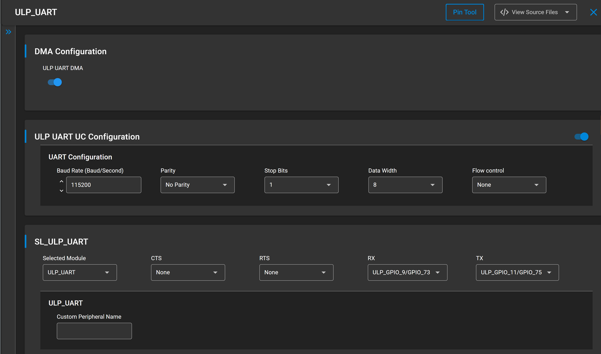

# SL ULP UART

## Table of Contents

- [Purpose/Scope](#purposescope)
- [Overview](#overview)
- [About Example Code](#about-example-code)
- [Prerequisites/Setup Requirements](#prerequisitessetup-requirements)
  - [Hardware Requirements](#hardware-requirements)
  - [Software Requirements](#software-requirements)
  - [Setup Diagram](#setup-diagram)
- [Getting Started](#getting-started)
- [Application Build Environment](#application-build-environment)
- [Test the Application](#test-the-application)

## Purpose/Scope

- This application demonstrates how to configure ULP UART In asynchronous mode, it will send and receive data.

## Overview

- ULP UART is used in communication through wired medium in Asynchronous fashion. It enables the device to
  communicate using serial protocols
- This application is configured with following configs
  - Tx and Rx enabled
  - Asynchronous mode
  - 8 Bit data transfer
  - Stop bits 1
  - No Parity
  - No Auto Flow control
  - Baud Rates - 115200
- HW flow control is currently not supported for ULP_UART.

## About Example Code

- \ref ulp_uart_example.c this example code demonstrates how to configure the uart to send and receive data in loopback mode
- In this example, first uart get initialized if it's not initialized already with clock and dma configurations if dma is
  enabled using \ref sl_si91x_uart_init.
- After uart initialization, uart power mode is set using \ref sl_si91x_uart_set_power_mode() and ULP UART is configured with default configurations from UC along with uart transmit and receive lines using the \ref sl_si91x_uart_set_configuration().
- Then register's user event callback for send and recevie complete notification are set using
  \ref sl_si91x_usart_register_event_callback().
- After setting the user event callback, the data send and receive can happen through \ref sl_si91x_usart_send_data() and
  \ref sl_si91x_usart_receive_data() respectively.
- Once the receive data event is triggered, both transmit and receive buffer data is compared to confirm if the received data is
  same.

> **Note:** When utilizing the ULP UART instance in high power mode with DMA enabled, it is advisable to allocate buffers in the ULP Memory block.

## Prerequisites/Setup Requirements

### Hardware Requirements

- Windows PC
- Silicon Labs Si917 Evaluation Kit [WPK(BRD4002) + BRD4338A / BRD4342A / BRD4343A ]

### Software Requirements

- Simplicity Studio
- Serial console Setup
  - For Serial Console setup instructions, refer [here](https://docs.silabs.com/wiseconnect/latest/wiseconnect-developers-guide-developing-for-silabs-hosts/#console-input-and-output).

### Setup Diagram


## Getting Started

Refer to the instructions [here](https://docs.silabs.com/wiseconnect/latest/wiseconnect-getting-started/) to:

- Install Studio and WiSeConnect 3 extension
- Connect your device to the computer
- Upgrade your connectivity firmware
- Create a Studio project

For details on the project folder structure, see the [WiSeConnect Examples](https://docs.silabs.com/wiseconnect/latest/wiseconnect-examples/#example-folder-structure) page.

## Application Build Environment

- Enable the ULP_UART mode in UC before running/flashing the code.

   

- Data send and receive from VCOM console is for one iteration only. On VCOM console, set the configuration such that the received data is sent back on the same port.
- To check continuous data transfer modify below macro to ENABLE in ulp_uart_example.h file 

  ```c
  #define USE_SEND    ENABLE
  ```

- Set ULP_UART_RX pin to any other gpio than ULP_GPIO_9 because ULP_GPIO_9 is dedicated for VCOM   
- Do loopback of selected gpio to ULP_GPIO_11 to observe toggles, once data sent and received matches.  
- The output in the logic analyser will show toggling in PS4 state 12 times as well as in PS2 and PS4 also it will toggles for 12 times respectively on the ULP_GPIO_8.

## Pin Configuration 

| GPIO pin           |Description|
| ------------------ | --------- |
| ULP_GPIO_11  [F6]  | TX (VCOM) |
| ULP_GPIO_9   [F7]  | RX (VCOM) |
| ULP_GPIO_8 [P15]  |GPIO_Toggle|

## Test the Application

Refer to the instructions [here](https://docs.silabs.com/wiseconnect/latest/wiseconnect-getting-started/) to:

- Build the SL ULP UART example in Studio.
- Flash, run and debug the application

Follow the steps below for successful execution of the application:

1. When the application runs, ULP_UART sends and receives data in full duplex mode
2. When tx and rx data both are matching ULP_GPIO_8 should be toggled, connect logic analyzer to observe the toggle state. 
3. Here the same pins which are used to send and receive the data are used for data transfer. As a result, we cannot observe prints. Instead, we can use GPIO toggling method as shown below.

- when use send disabled:

   

- when use send enabled:

   
   
**Note:**
>
>- The required files for low power state are moved to RAM rest of the application is executed from flash.
>- In this application we are changing the power state from PS4 to PS2 and vice - versa. 
>- Once the power state changes from PS4 to PS2 and vice - versa, we have to reconfigure the uart configs once again using sl_si91x_usart_set_configuration() api because of frequency change. Please refer ulp_uart_example.c file for more info 

> **Note:**
>
> - Interrupt handlers are implemented in the driver layer, and user callbacks are provided for custom code. If you want to write your own interrupt handler instead of using the default one, make the driver interrupt handler a weak handler. Then, copy the necessary code from the driver handler to your custom interrupt handler.

>- To configure the SoC GPIO as ULP GPIO follow below code snippets, In below code snippet shown demonstrates configuring SOC_GPIO_8 and SOC_GPIO_9 as ulp_gpio_2 and ulp_gpio_3 to use as ulp_uart rx and tx pins respectively  
>- This gpio should configure as ulp_gpio's only when ulp_uart functioning in  PS4 and PS3 state   
**GPIO 8 as ULP_UART_RX:**   
  // Enable PAD selection GPIO HP instance
  // sl_si91x_gpio_enable_pad_selection(gpio_padnum)
  sl_si91x_gpio_enable_pad_selection(3);
  // Set the pin mode  
  // sl_gpio_set_pin_mode(port, pin, mode, output_value)  
  sl_gpio_set_pin_mode(0,8,9,1);  
  // Enable PAD receiver for gpio 8
  // sl_si91x_gpio_enable_pad_receiver(gpio_num); 
  sl_si91x_gpio_enable_pad_receiver(8); 
  // Set the pin mode  
  // sl_gpio_set_pin_mode(port, pin, mode, output_value)
  sl_gpio_set_pin_mode(4,2,0,1); 
  // Sets ulp soc gpio mode
  // sl_si91x_gpio_ulp_soc_mode(ulp_gpio_num,mode) 
  sl_si91x_gpio_ulp_soc_mode(2,3);  
**GPIO 9 as ULP_UART_TX:**  
  // Enable PAD selection GPIO HP instance
  // sl_si91x_gpio_enable_pad_selection(gpio_padnum)
  sl_si91x_gpio_enable_pad_selection(4);  
  // Set the pin mode
  // sl_gpio_set_pin_mode(port, pin, mode, output_value)
  sl_gpio_set_pin_mode(0,9,9,1);  
  // Enable PAD receiver for gpio 9
  // sl_si91x_gpio_enable_pad_receiver(gpio_num);
  sl_si91x_gpio_enable_pad_receiver(9);
  // Set the pin mode  
  // sl_gpio_set_pin_mode(port, pin, mode, output_value)
  sl_gpio_set_pin_mode(4,3,0,1); 
  // Sets ulp soc gpio mode  
  // sl_si91x_gpio_ulp_soc_mode(ulp_gpio_num,mode)
  sl_si91x_gpio_ulp_soc_mode(3,3);  

> **Note:**
Header connection pin references mentioned here are all specific to BRD4338A (B0 2.0v boards). If user runs this application on a different board, it is recommended to refer the board specific schematic for GPIO-Header connection pin mapping.
