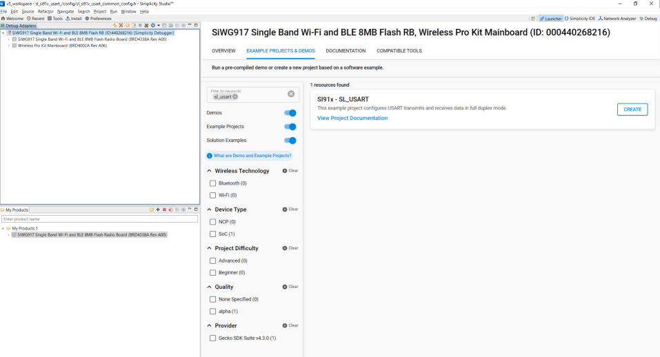

# USART

## Introduction

- Universal Synchronous Asynchronous Receiver-Transmitter (USART)
- This application demonstrates how to configure USART In asyncronous mode, it will send and receive data in loopback mode

## Overview

- USART is used in communication through wired medium in both Synchronous and Asynchronous fashion. It enables the device to
  communicate using serail protocols
- This application is configured with following configs
  - Tx and Rx enabled
  - Asynchronous mode
  - 8 Bit data transfer
  - Stop bits 1
  - No Parity
  - No Auto Flow control
  - Baud Rates - 115200

## About Example Code

- \ref usart_example.c this example code demonstates how to configure the usart to send and receive data in loopback mode
- In this example, first usart get initialized if it's not initialized already with clock and dma configurations if dma is
  enalbed using \ref sl_si91x_usart_init
- After USART initialization ,sets the usart power mode using \ref sl_si91x_usart_set_power_mode() and configures the usart
  with default configurations from UC and usart transmitt and receive lines using \ref sl_si91x_usart_set_configuration()
- Then register's user event callback for send ,recevie and transfer complete notification using
  \ref sl_si91x_usart_register_event_callback()
- After user event callback registered data send and receive can happen through \ref sl_si91x_usart_send_data() and
  \ref sl_si91x_usart_receive_data() respectively
- Once the receive data event triggered ,compares both transmitt and receive buffers to confirm the received data if data is
  same then it prints the Data comparison successful, Loop Back Test Passed on the usart console.

## Running Example code

- To use this application following Hardware, Software and the Project Setup is required.

### Hardware Setup

- Windows PC
- Silicon Labs [WSTK + BRD4338A]

### Software Setup

- Si91x SDK
- Embedded Development Environment
  - For Silicon Labs Si91x, use the latest version of Simplicity Studio (refer **"Download and Install Simplicity Studio"** section in **getting-started-with-siwx917-soc** guide at **release_package/docs/index.html**)
### VCOM Setup
- The Docklight tool's setup instructions are provided below..

## Project Setup

- **Silicon Labs Si91x** refer **"Download SDK"** section in **getting-started-with-siwx917-soc** guide at **release_package/docs/index.html** to work with Si91x and Simplicity Studio

## Loading Application on Simplicity Studio

1. With the product Si917 selected, navigate to the example projects by clicking on Example Projects & Demos
   in simplicity studio and click on to SI91x - SoC USART Example application as shown below.

## Build

1. Compile the application in Simplicity Studio using build icon
   

## Device Programming

- To program the device ,refer **"Burn M4 Binary"** section in **getting-started-with-siwx917-soc** guide at **release_package/docs/index.html** to work with Si91x and Simplicity Studio

## Pin Configuration

| USART PINS     | GPIO    | Connector     | UART-TTL cable |
| -------------- | ------- | ------------- | -------------- |
| USART0_TX_PIN  | GPIO_30 |     P35       | RX pin         |
| USART0_RX_PIN  | GPIO_29 |     P33       | TX Pin         | 

## Executing the Application

1. Connect TX pin(GPIO_30) to RX pin of UART to TTL cable and RX pin(GPIO_29) to TX pin of UART-TTL cable
2. When the application runs,USART sends and receives data in full duplex mode
3. Observe the UART transferred data on console and Send back the same 1024 bytes back

## Expected Results

- Will get "Data comparison successful, Loop Back Test Passed" print on console when this transfer success
- Add data_in buffer to watch window for checking receive data
