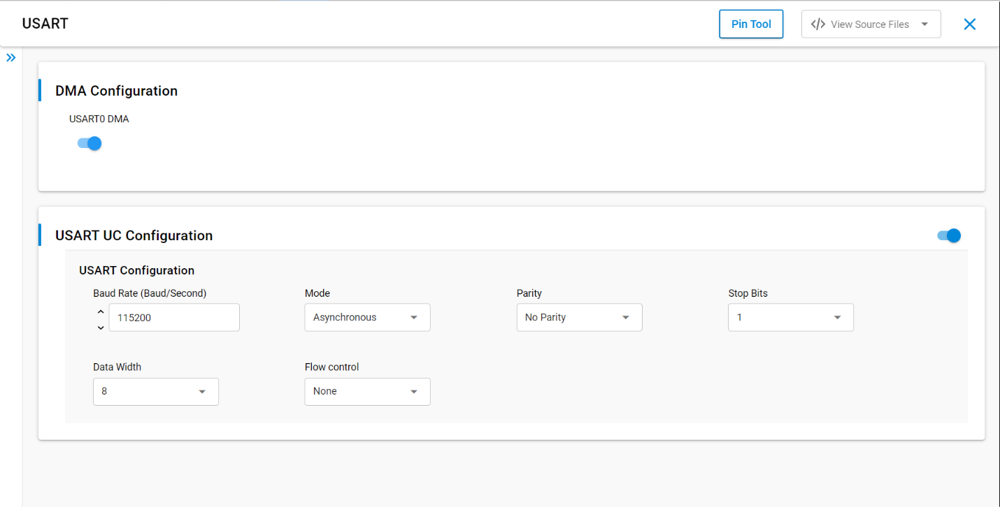
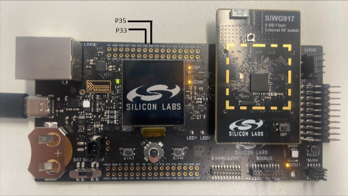
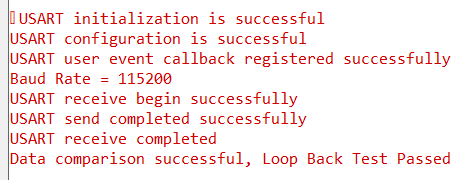

# SL USART ASYNCHRONOUS

## Table of Contents

- [SL USART ASYNCHRONOUS](#sl-usart-asynchronous)
  - [Table of Contents](#table-of-contents)
  - [Purpose/Scope](#purposescope)
  - [Overview](#overview)
  - [About Example Code](#about-example-code)
  - [Prerequisites/Setup Requirements](#prerequisitessetup-requirements)
    - [Hardware Requirements](#hardware-requirements)
    - [Software Requirements](#software-requirements)
    - [Setup Diagram](#setup-diagram)
  - [Getting Started](#getting-started)
  - [Application Build Environment](#application-build-environment)
  - [Pin Configuration](#pin-configuration)
  - [Flow Control Configuration](#flow-control-configuration)
  - [Test the Application](#test-the-application)
  - [Configuring higher clock](#configuring-higher-clock)

## Purpose/Scope

This application demonstrates how to configure Universal Synchronous Asynchronous Receiver-Transmitter (USART) In Asynchronous mode. It will send and receive data from serial console.

## Overview

- USART is used in communication through wired medium in both Synchronous and Asynchronous fashion. It enables the device to communicate using serial protocols.
- This application is configured with following configurations:
  - Tx and Rx enabled
  - Asynchronous mode
  - 8 Bit data transfer
  - Stop bits 1
  - No Parity
  - No Auto Flow control
  - Baud Rates - 115200

## About Example Code

- [`usart_async_example.c`](https://github.com/SiliconLabs/wiseconnect/blob/v4.0.0-content-for-docs/examples/si91x_soc/peripheral/sl_si91x_usart_async/usart_async_example.c) - This example code demonstrates how to configure the USART to send and receive data.
- In this example, first USART gets initialized (if not already) with clock and DMA configurations if DMA is enabled using [`sl_si91x_usart_init`](https://docs.silabs.com/wiseconnect/latest/wiseconnect-api-reference-guide-si91x-peripherals/usart#sl-si91x-usart-init).  
**Note:** If the UART/USART instance is already selected for debug output logs, initialization will return `SL_STATUS_NOT_AVAILABLE`.
- After USART initialization, USART is configured with the default configurations from UC along with the USART transmit and receive lines using [`sl_si91x_usart_set_configuration`](https://docs.silabs.com/wiseconnect/latest/wiseconnect-api-reference-guide-si91x-peripherals/usart#sl-si91x-usart-set-configuration).
- Then the register user event callback for send and receive complete notification is set using [`sl_si91x_usart_multiple_instance_register_event_callback`](https://docs.silabs.com/wiseconnect/latest/wiseconnect-api-reference-guide-si91x-peripherals/usart#sl-si91x-usart-multiple-instance-register-event-callback).
- After setting the user event callback, the data send and receive can happen through [`sl_si91x_usart_async_send_data`](https://docs.silabs.com/wiseconnect/latest/wiseconnect-api-reference-guide-si91x-peripherals/usart#sl_si91x_usart_async_send_data) and [`sl_si91x_usart_async_receive_data`](https://docs.silabs.com/wiseconnect/latest/wiseconnect-api-reference-guide-si91x-peripherals/usart#sl_si91x_usart_async_receive_data) respectively.
- Once the receive data event is triggered, both transmit and receive buffer data is compared to confirm if the received data is the same.

## Prerequisites/Setup Requirements

### Hardware Requirements

- Windows PC
- Silicon Labs Si917 Evaluation Kit [[BRD4002](https://www.silabs.com/development-tools/wireless/wireless-pro-kit-mainboard?tab=overview) + [BRD4338A](https://www.silabs.com/development-tools/wireless/wi-fi/siwx917-rb4338a-wifi-6-bluetooth-le-soc-radio-board?tab=overview) / [BRD4342A](https://www.silabs.com/development-tools/wireless/wi-fi/siwx91x-rb4342a-wifi-6-bluetooth-le-soc-radio-board?tab=overview) / [BRD4343A](https://www.silabs.com/development-tools/wireless/wi-fi/siw917y-rb4343a-wi-fi-6-bluetooth-le-8mb-flash-radio-board-for-module?tab=overview)]
- SiWx917 AC1 Module Explorer Kit [BRD2708A](https://www.silabs.com/development-tools/wireless/wi-fi/siw917y-ek2708a-explorer-kit)

### Software Requirements

- Simplicity Studio
- Serial console setup
  - For Serial Console setup instructions, refer to [link name](https://docs.silabs.com/wiseconnect/latest/wiseconnect-developers-guide-developing-for-silabs-hosts/using-the-simplicity-studio-ide#console-input-and-output).

### Setup Diagram

> 

## Getting Started

Refer to the instructions [here](https://docs.silabs.com/wiseconnect/latest/wiseconnect-getting-started/) to:

- [Install Simplicity Studio](https://docs.silabs.com/wiseconnect/latest/wiseconnect-developers-guide-developing-for-silabs-hosts/using-the-simplicity-studio-ide#install-simplicity-studio)
- [Install WiSeConnect extension](https://docs.silabs.com/wiseconnect/latest/wiseconnect-developers-guide-developing-for-silabs-hosts/using-the-simplicity-studio-ide#install-the-wiseconnect-3-extension)
- [Connect your device to the computer](https://docs.silabs.com/wiseconnect/latest/wiseconnect-developers-guide-developing-for-silabs-hosts/using-the-simplicity-studio-ide#connect-siwx91x-to-computer)
- [Upgrade your connectivity firmware](https://docs.silabs.com/wiseconnect/latest/wiseconnect-developers-guide-developing-for-silabs-hosts/using-the-simplicity-studio-ide#update-siwx91x-connectivity-firmware)
- [Create a Studio project](https://docs.silabs.com/wiseconnect/latest/wiseconnect-developers-guide-developing-for-silabs-hosts/using-the-simplicity-studio-ide#create-a-project)

For details on the project folder structure, see the [WiSeConnect Examples](https://docs.silabs.com/wiseconnect/latest/wiseconnect-examples/#example-folder-structure) page.

## Application Build Environment

**Configuration of USART at UC (Universal Configuration)**

- Configure UC from the slcp component.
- Open the **sl_si91x_usart_async.slcp** project file, select the **Software Component** tab, and search for **USART** in the search bar.
- You can use the configuration wizard to configure different parameters. The following configuration screen illustrates where the user can select as per their requirements.

  > 

## Pin Configuration

  | USART PINS     | GPIO    | Breakout pin  | Explorer kit Breakout pin | UART-TTL cable |
  | -------------- | ------- | ------------- | -------------- | ------------- |
  | USART0_TX_PIN  | GPIO_30 |     P35       |      [RST]     | RX pin         |
  | USART0_RX_PIN  | GPIO_29 |     P33       |      [AN]      | TX Pin         |

 

## Flow Control Configuration

- Set the SL_USART_FLOW_CONTROL_TYPE parameter to SL_USART_FLOW_CONTROL_RTS_CTS to enable USART flow control.
- Make the following two macros in `RTE_Device_917.h`  to '1' to map RTS and CTS pins to WSTK/WPK Main Board EXP header or breakout pins.

  ```C
  #define RTE_USART0_CTS_PORT_ID    1
  #define RTE_USART0_RTS_PORT_ID    1
  ```

  | USART PINS     | GPIO    | Breakout pin  | Explorer kit Breakout pin|
  | -------------- | ------- | ------------- | ------------------------ |
  | USART0_CTS_PIN | GPIO_26 |     P27       |           [MISO]         |
  | USART0_RTS_PIN | GPIO_28 |     P31       |           [CS]           |

> **Note**: For recommended settings, please refer the [recommendations guide](https://docs.silabs.com/wiseconnect/latest/wiseconnect-developers-guide-prog-recommended-settings/).

## Test the Application

1. Connect TX pin (GPIO_30) to RX pin of UART to TTL cable and RX pin (GPIO_29) to TX pin of UART-TTL cable and open UART-TTL's serial console.
2. When the application runs, USART sends and receives data in full-duplex mode.
3. Observe the USART transmission status upon data transmission from USART master to slave and vice-versa on USART pins i.e UART-TTL's serial console .
4. Send back the data received on UART-TTL's serial console to complete loopback operation.
5. After running this application, the following console output can be observed in the vcom's serial console.

    > 
>
> **Note**:
>
>- Add usart_data_in buffer to watch window for checking receive data.

## Configuring higher clock

- To achieve baud rates exceeding 2 million bps, you need to modify the clock source to INTF PLL CLK in the UC. 

> **Note:**
>
> Interrupt handlers are implemented in the driver layer, and user callbacks are provided for custom code. If you want to write your own interrupt handler instead of using the default one, make the driver interrupt handler a weak handler. Then, copy the necessary code from the driver handler to your custom interrupt handler.
> By default, Request to Send (RTS) and Clear to Send (CTS) flow control signals are disabled in the UART driver UC, and their corresponding GPIO pins are not assigned in the Pintool. If you enable RTS/CTS in the Driver UC, you must manually configure and assign the appropriate GPIO pins in the Pintool to ensure proper hardware flow control functionality.
