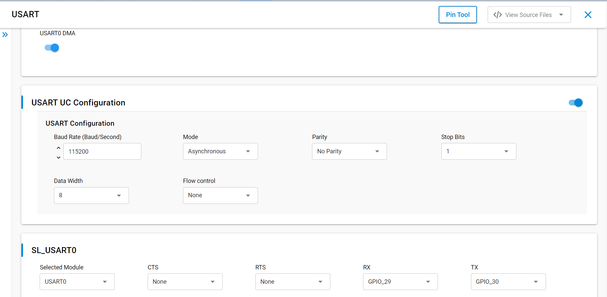

# SL USART ASYNCHRONOUS

## Table of Contents

- [Purpose/Scope](#purposescope)
- [Overview](#overview)
- [About Example Code](#about-example-code)
- [Prerequisites/Setup Requirements](#prerequisitessetup-requirements)
  - [Hardware Requirements](#hardware-requirements)
  - [Software Requirements](#software-requirements)
  - [Setup Diagram](#setup-diagram)
- [Getting Started](#getting-started)
- [Application Build Environment](#application-build-environment)
- [Test the Application](#test-the-application)

## Purpose/Scope

- Universal Synchronous Asynchronous Receiver-Transmitter (USART)
- This application demonstrates how to configure USART In asyncronous mode, it will send and receive data in loopback mode

## Overview

- USART is used in communication through wired medium in both Synchronous and Asynchronous fashion. It enables the device to
  communicate using serail protocols
- This application is configured with following configs
  - Tx and Rx enabled
  - Asynchronous mode
  - 8 Bit data transfer
  - Stop bits 1
  - No Parity
  - No Auto Flow control
  - Baud Rates - 115200

## About Example Code

- \ref usart_example.c this example code demonstates how to configure the USART to send and receive data.
- In this example, first USART get initialized if it's not initialized already with clock and dma configurations if dma is
  enalbed using \ref sl_si91x_usart_init
- After USART initialization, the UART power mode is set using \ref sl_si91x_usart_set_power_mode() and then USART configured with the default configurations from UC along with the USART transmit and receive lines using \ref sl_si91x_usart_set_configuration()
- Then register's user event callback for send and recevie complete notification are set using
  \ref sl_si91x_usart_register_event_callback()
- After setting the user event callback, the data send and receive can happen through \ref sl_si91x_usart_send_data() and
  \ref sl_si91x_usart_receive_data() respectively.
- Once the receive data event is triggered, both transmit and receive buffer data is compared to confirm if the received data is
  same.

## Prerequisites/Setup Requirements

### Hardware Requirements

- Windows PC
- Silicon Labs Si917 Evaluation Kit [WPK(4002A) + BRD4338A]

### Software Requirements

- Simplicity Studio
- Serial console Setup
  - The Serial Console setup instructions are provided below:
Refer [here](https://docs.silabs.com/wiseconnect/latest/wiseconnect-developers-guide-developing-for-silabs-hosts/#console-input-and-output)

### Setup Diagram

> 

## Getting Started

Refer to the instructions [here](https://docs.silabs.com/wiseconnect/latest/wiseconnect-getting-started/) to:

- Install Studio and WiSeConnect 3 extension
- Connect your device to the computer
- Upgrade your connectivity firmware
- Create a Studio project

For details on the project folder structure, see the [WiSeConnect Examples](https://docs.silabs.com/wiseconnect/latest/wiseconnect-examples/#example-folder-structure) page.

## Application Build Environment

- Configuration of USART at UC.
  > 

## Pin Configuration

  | USART PINS     | GPIO    | Connector     | UART-TTL cable |
  | -------------- | ------- | ------------- | -------------- |
  | USART0_TX_PIN  | GPIO_30 |     P35       | RX pin         |
  | USART0_RX_PIN  | GPIO_29 |     P33       | TX Pin         | 


 > 

## Flow Control Configuration

- Set the SL_USART_FLOW_CONTROL_TYPE parameter to SL_USART_FLOW_CONTROL_RTS_CTS to enable UART flow control.
- Make the following two macros in RTE_Device_917.h to '1', to map RTS and CTS pins to WSTK/WPK Main Board EXP header or breakout pins.
  ```C
  #define RTE_USART0_CTS_PORT_ID    1
  #define RTE_USART0_RTS_PORT_ID    1
  ```
  | USART PINS     | GPIO    | Connector(B0) |
  | -------------- | ------- | ------------- |
  | USART0_CTS_PIN | GPIO_26 |     P27       |
  | USART0_RTS_PIN | GPIO_28 |     P31       |

## Test the Application

1. Connect TX pin(GPIO_30) to RX pin of UART to TTL cable and RX pin(GPIO_29) to TX pin of UART-TTL cable.
2. When the application runs,USART sends and receives data in full duplex mode.
3. Observe the UART transferred data on console and Send back the same 1024 bytes back.
4. After running this application below console output can be observed.

    > 
>
> **Note**:
>
>- Add data_in buffer to watch window for checking receive data.

## Configuring SOCPLL clock
For Baudrates higher than 2 Million configure the SOCPLL clock by following the below steps
>- In usart_example.c (path: /$project/usart_example.c) add below lines of code 
```c
#include "rsi_rom_clks.h"

#define SOC_PLL_CLK             120000000 // SOC_PLL clock frequency
#define SOC_PLL_REF_CLK         40000000 // SOC_PLL reference clock frequency
```
>- Configure PLL clocks as shown below
```c
RSI_CLK_SetSocPllFreq(M4CLK, SOC_PLL_CLK, SOC_PLL_REF_CLK); //To configure SOCPLL clock frequency
```
>- Change the clock source to USART_SOCPLLCLK in RTE_Device_917.h (/$project/config/RTE_Device_917.h)
```c
#define RTE_USART0_CLK_SRC //For using USART0
```


> **Note:**
>
> - Interrupt handlers are implemented in the driver layer, and user callbacks are provided for custom code. If you want to write your own interrupt handler instead of using the default one, make the driver interrupt handler a weak handler. Then, copy the necessary code from the driver handler to your custom interrupt handler.
