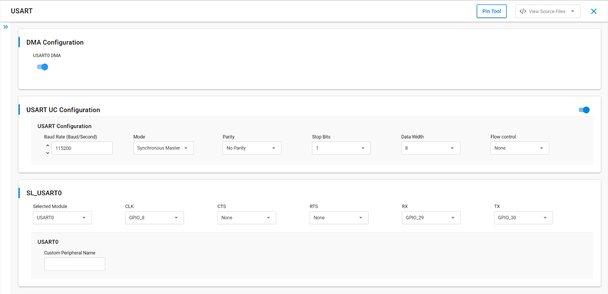
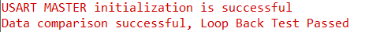

# SL USART MASTER

## Table of Contents

- [SL USART MASTER](#sl-usart-master)
  - [Table of Contents](#table-of-contents)
  - [Purpose/Scope](#purposescope)
  - [Overview](#overview)
  - [About Example Code](#about-example-code)
  - [Prerequisites/Setup Requirements](#prerequisitessetup-requirements)
    - [Hardware Requirements](#hardware-requirements)
    - [Software Requirements](#software-requirements)
    - [Setup Diagram](#setup-diagram)
  - [Getting Started](#getting-started)
  - [Application Build Environment](#application-build-environment)
    - [Configuration of USART at UC (Universal Configuration)](#configuration-of-usart-at-uc-universal-configuration)
    - [Pin Configuration of the WPK\[BRD4002A\] Base Board, and with BRD4338A radio board](#pin-configuration-of-the-wpkbrd4002a-base-board-and-with-brd4338a-radio-board)
    - [Pin Configuration of the WPK\[BRD4002A\] Base Board, and with BRD4343A radio board](#pin-configuration-of-the-wpkbrd4002a-base-board-and-with-brd4343a-radio-board)
    - [Pin Configuration of the AC1 Module Explorer Kit](#pin-configuration-of-the-ac1-module-explorer-kit)
    - [Flow Control Configuration](#flow-control-configuration)
  - [Test the Application](#test-the-application)
  - [Configuring higher clock](#configuring-higher-clock)

## Purpose/Scope

This application demonstrates how to configure Universal Synchronous Asynchronous Receiver-Transmitter (USART) In Synchronous mode as a master. It will send and receive data from synch slave.

## Overview

- USART is used in communication through wired medium in Synchronous fashion. It enables the device to communicate using serial protocols.
- This application is configured with following configs:
  - Tx and Rx enabled
  - 8 Bit data transfer
  - Synchronous Master
  - Stop bits 1
  - No Parity
  - No Auto Flow control
  - Baud Rates - 115200

## About Example Code

- [`usart_sync_example.c`](https://github.com/SiliconLabs/wiseconnect/blob/master/examples/si91x_soc/peripheral/sl_si91x_usart_sync_master/usart_sync_example.c) - This example code demonstrates how to configure the USART to send and receive data.
- In this example, first USART gets initialized if it was not already initialized with the clock and DMA configurations if DMA is enabled using [`sl_si91x_usart_init`](https://docs.silabs.com/wiseconnect/latest/wiseconnect-api-reference-guide-si91x-peripherals/usart#sl-si91x-usart-init).  
**Note:** If the UART/USART instance is already selected for debug output logs, initialization will return `SL_STATUS_NOT_AVAILABLE`.
- After USART initialization, the USART power mode is set using [`sl_si91x_usart_set_power_mode()`](https://docs.silabs.com/wiseconnect/3.5.0/wiseconnect-api-reference-guide-si91x-peripherals/usart#sl-si91x-usart-set-power-mode) and then USART is configured with the default configurations from UC along with the USART transmit and receive lines using [`sl_si91x_usart_set_configuration()`](https://docs.silabs.com/wiseconnect/3.5.0/wiseconnect-api-reference-guide-si91x-peripherals/usart#sl-si91x-usart-set-configuration).
- Then the register user event callback for send and receive complete notification is set using [`sl_si91x_usart_register_event_callback()`](https://docs.silabs.com/wiseconnect/3.5.0/wiseconnect-api-reference-guide-si91x-peripherals/usart#sl-si91x-usart-register-event-callback).
- After setting the user event callback, the data send and receive can happen through [`sl_si91x_usart_transfer_data()`](https://docs.silabs.com/wiseconnect/3.5.0/wiseconnect-api-reference-guide-si91x-peripherals/usart#sl-si91x-usart-transfer-data).
- Once the receive data event is triggered, both transmit and receive buffer data is compared to confirm if the received data is the same.

## Prerequisites/Setup Requirements

### Hardware Requirements

- Windows PC
- Silicon Labs Si917 Evaluation Kit [WPK(4002A) + BRD4338A / BRD4342A / BRD4343A ]- Master
- Silicon Labs Si917 Evaluation Kit [WPK(4002A) + BRD4338A / BRD4342A / BRD4343A ] - Slave
- SiWx917 AC1 Module Explorer Kit (BRD2708A) - Master and Slave

### Software Requirements

- Simplicity Studio
- Serial console Setup
  - For Serial Console setup instructions, see the [Console Input and Output](https://docs.silabs.com/wiseconnect/latest/wiseconnect-developers-guide-developing-for-silabs-hosts/#console-input-and-output) section of the *WiSeConnect Developer's Guide*.

### Setup Diagram


## Getting Started

Refer to the instructions [here](https://docs.silabs.com/wiseconnect/latest/wiseconnect-getting-started/) to:

- [Install Simplicity Studio](https://docs.silabs.com/wiseconnect/latest/wiseconnect-developers-guide-developing-for-silabs-hosts/#install-simplicity-studio)
- [Install WiSeConnect 3 extension](https://docs.silabs.com/wiseconnect/latest/wiseconnect-developers-guide-developing-for-silabs-hosts/#install-the-wi-se-connect-3-extension)
- [Connect your device to the computer](https://docs.silabs.com/wiseconnect/latest/wiseconnect-developers-guide-developing-for-silabs-hosts/#connect-si-wx91x-to-computer)
- [Upgrade your connectivity firmware](https://docs.silabs.com/wiseconnect/latest/wiseconnect-developers-guide-developing-for-silabs-hosts/#update-si-wx91x-connectivity-firmware)
- [Create a Studio project](https://docs.silabs.com/wiseconnect/latest/wiseconnect-developers-guide-developing-for-silabs-hosts/#create-a-project)

For details on the project folder structure, see the [WiSeConnect Examples](https://docs.silabs.com/wiseconnect/latest/wiseconnect-examples/#example-folder-structure) page.

## Application Build Environment

### Configuration of USART at UC (Universal Configuration)

- Configure UC from the slcp component.
- Open the **sl_si91x_usart_sync_master.slcp** project file, select the **Software Component** tab, and search for **USART** in the search bar.
- You can use the configuration wizard to configure different parameters. The following configuration screen illustrates what the user can select as per their requirements.

  > 

- Enable RTE_USART_MODE and RTE_CONTINUOUS_CLOCK_MODE in `RTE_Device_917.h` (path: /$project/config/RTE_Device_917.h) or in `RTE_Device_915.h` (path: /$project/config/RTE_Device_915.h).
- Connect the master and slave as per pin configurations (that is, connect USART master clock pin (GPIO_8) to USART slave clock pin, master TX pin (GPIO_30) to slave RX pin, master RX pin (GPIO_29) to slave TX pin).
- The Application has been configured to run in Synchronous Master mode.

### Pin Configuration of the WPK[BRD4002A] Base Board, and with BRD4338A radio board

  | USART PINS              | GPIO    | Breakout pin  |
  | ----------------------- | ------- | ------------- |
  | USART_MASTER_CLOCK_PIN  | GPIO_8  |     F8        |
  | USART_MASTER_TX_PIN     | GPIO_30 |     P35       |
  | USART_MASTER_RX_PIN     | GPIO_29 |     P33       |  

### Pin Configuration of the WPK[BRD4002A] Base Board, and with BRD4343A radio board

  | USART PINS              | GPIO    | Breakout pin  |
  | ----------------------- | ------- | ------------- |
  | USART_MASTER_CLOCK_PIN  | GPIO_25 |     P25       |
  | USART_MASTER_TX_PIN     | GPIO_30 |     P35       |
  | USART_MASTER_RX_PIN     | GPIO_29 |     P33       |  


### Pin Configuration of the AC1 Module Explorer Kit

  | USART PINS              | GPIO    | Explorer kit Breakout pin  |
  | ----------------------- | ------- | ------------- |
  | USART_MASTER_CLOCK_PIN  | GPIO_25 |     [SCK]     |
  | USART_MASTER_TX_PIN     | GPIO_30 |     [RST]     |
  | USART_MASTER_RX_PIN     | GPIO_29 |     [AN]      |

### Flow Control Configuration

1. Set the SL_USART_FLOW_CONTROL_TYPE parameter to SL_USART_FLOW_CONTROL_RTS_CTS to enable USART flow control.
2. Make sure the following two macros in `RTE_Device_917.h` or `RTE_Device_915.h` are set to '1' to map RTS and CTS pins to WSTK/WPK Main Board EXP header or breakout pins.

    ```c
    #define RTE_USART0_CTS_PORT_ID    1
    #define RTE_USART0_RTS_PORT_ID    1
    ```

    | USART PINS     | GPIO    | Breakout pin  | Explorer kit Breakout pin|
    | -------------- | ------- | ------------- | ------------------------ |
    | USART0_CTS_PIN | GPIO_26 |     P27       |           [MISO]         |
    | USART0_RTS_PIN | GPIO_28 |     P31       |           [CS]           |

> **Note**: For recommended settings, see the [recommendations guide](https://docs.silabs.com/wiseconnect/latest/wiseconnect-developers-guide-prog-recommended-settings/).

## Test the Application

1. Make the connections as discussed in the Application Build Environment.
2. When the application runs, USART sends and receives data in full-duplex mode.
3. Observe the USART transferred data on console and send the same 1024 bytes back.
4. After running this application, the following console output can be observed.

    
>
> **Note**:
>
>- Add data_in buffer to watch window for checking receive data.

## Configuring higher clock

For baud rates higher than 2 million, change the clock source to USART_SOCPLLCLK in `RTE_Device_917.h` (/$project/config/RTE_Device_917.h):

    ```C
    #define RTE_USART0_CLK_SRC   
    ```

> **Note:**
>
> - Interrupt handlers are implemented in the driver layer, and user callbacks are provided for custom code. If you want to write your own interrupt handler instead of using the default one, make the driver interrupt handler a weak handler. Then, copy the necessary code from the driver handler to your custom interrupt handler.
> - By default, Request to Send (RTS) and Clear to Send (CTS) flow control signals are disabled in the UART driver UC, and their corresponding GPIO pins are not assigned in the Pintool. If you enable RTS/CTS in the Driver UC, you must manually configure and assign the appropriate GPIO pins in the Pintool to ensure proper hardware flow control functionality.
