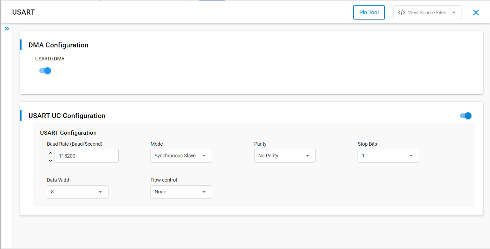
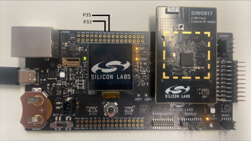
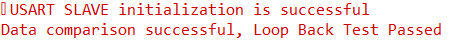

# SL USART SLAVE

## Table of Contents

- [Purpose/Scope](#purposescope)
- [Overview](#overview)
- [About Example Code](#about-example-code)
- [Prerequisites/Setup Requirements](#prerequisitessetup-requirements)
  - [Hardware Requirements](#hardware-requirements)
  - [Software Requirements](#software-requirements)
  - [Setup Diagram](#setup-diagram)
- [Getting Started](#getting-started)
- [Application Build Environment](#application-build-environment)
- [Test the Application](#test-the-application)

## Purpose/Scope

- Universal Synchronous Asynchronous Receiver-Transmitter (USART).
- This application demonstrates how to configure USART in synchronous mode as a slave will send and receive data from USART master.

## Overview

- USART is used in communication through wired medium in Synchronous fashion. It enables the device to communicate using serial protocols
- This application is configured with following configurations
  - Tx and Rx enabled
  - 8 Bit data transfer
  - Synchronous slave 
  - Stop bits 1
  - No Parity
  - No Auto Flow control
  - Baud Rates - 115200

## About Example Code

- \ref usart_example.c this example code demonstrates how to configure the USART to send and receive data.
- In this example, first USART get initialized with clock and dma configurations using \ref sl_si91x_usart_init.
- After USART initialization, the USART power mode is set using \ref sl_si91x_usart_set_power_mode() and then USART configured with the default configurations from UC along with the USART transmit and receive lines using \ref sl_si91x_usart_set_configuration()
- Then register's user event callback for send and receive complete notification are set using
  \ref sl_si91x_usart_register_event_callback()
- After setting the user event callback, the data send and receive can happen through \ref sl_si91x_usart_transfer_data()
- Once the receive data event is triggered, both transmit and receive buffer data is compared to confirm if the received data is
  same. 

## Prerequisites/Setup Requirements

### Hardware Requirements

- Windows PC
- Silicon Labs Si917 Evaluation Kit [WPK(4002A) +  BRD4338A / BRD4342A / BRD4343A ]- Master
- Silicon Labs Si917 Evaluation Kit [WPK(4002A) +  BRD4338A / BRD4342A / BRD4343A ] - Slave

### Software Requirements

- Simplicity Studio
- Serial console Setup
  - The Serial Console setup instructions are provided below:
Refer [here](https://docs.silabs.com/wiseconnect/latest/wiseconnect-developers-guide-developing-for-silabs-hosts/#console-input-and-output).

### Setup Diagram

> 

## Getting Started

Refer to the instructions [here](https://docs.silabs.com/wiseconnect/latest/wiseconnect-getting-started/) to:

- Install Studio and WiSeConnect 3 extension
- Connect your device to the computer
- Upgrade your connectivity firmware
- Create a Studio project

For details on the project folder structure, see the [WiSeConnect Examples](https://docs.silabs.com/wiseconnect/latest/wiseconnect-examples/#example-folder-structure) page.

## Application Build Environment

- Configuration of USART at UC(Universal Configuration).
- Configure UC from the slcp component.
- Open **sl_si91x_usart_sync_slave.slcp** project file select **software component** tab and search for **USART** in search bar.
- Using configuration wizard one can configure different parameters. Below configuration screens where user can select as per requirement.

  > 

- Enable RTE_USART_MODE and RTE_CONTINUOUS_CLOCK_MODE in RTE_Device_917.h(path: /$project/config/RTE_Device_917.h)
- Connect Master and slave as per pin configurations i.e Connect USART master clock pin(GPIO_8) to USART slave clock pin, Master TX pin(GPIO_30) to Slave RX pin, Master RX pin(GPIO_29) to Slave TX pin.

 - Connect Salve and Master as per pin configurations i.e Connect USART slave clock pin (GPIO_8)to USART master clock pin(GPIO_8), Slave RX(GPIO_29) pin to Master TX pin(GPIO_30), Slave TX pin(GPIO_30) to Master RX pin(GPIO_29).


## Pin Configuration

  | USART PINS             | GPIO    | Connector     | 
  | ---------------------- | ------- | ------------- | 
  | USART_SLAVE_CLOCK_PIN  | GPIO_8  |     F8        |
  | USART_SLAVE_TX_PIN     | GPIO_30 |     P35       | 
  | USART_SLAVE_RX_PIN     | GPIO_29 |     P33       |  


 > 

## Flow Control Configuration

- Set the SL_USART_FLOW_CONTROL_TYPE parameter to SL_USART_FLOW_CONTROL_RTS_CTS to enable USART flow control.
- Make the following two macros in RTE_Device_917.h to '1', to map RTS and CTS pins to WSTK/WPK Main Board EXP header or breakout pins.
  ```C
  #define RTE_USART0_CTS_PORT_ID    1
  #define RTE_USART0_RTS_PORT_ID    1
  ```
  | USART PINS     | GPIO    | Connector(B0) |
  | -------------- | ------- | ------------- |
  | USART0_CTS_PIN | GPIO_26 |     P27       |
  | USART0_RTS_PIN | GPIO_28 |     P31       |

## Test the Application

1. Make the connections as discussed in the Application Build Environment.
2. When the application runs, USART sends and receives data in full duplex mode.
3. Observe the USART transmission status upon data transmission from usart master to slave and vice-versa on usart pins.
4. After running this application below console output can be observed.

    > 
>
> **Note**:
>
>- Add data_in buffer to watch window for checking receive data.

## Configuring SOCPLL clock

For Baudrates higher than 2 Million configure the SOCPLL clock by following the below steps
>- In usart_sync_example.c (path: /$project/usart_sync_example.c) **add below lines of code.** 
```c
#include "rsi_rom_clks.h"

#define SOC_PLL_CLK             120000000 // SOC_PLL clock frequency
#define SOC_PLL_REF_CLK         40000000 // SOC_PLL reference clock frequency
```
>- Configure PLL clocks as shown below
```c
RSI_CLK_SetSocPllFreq(M4CLK, SOC_PLL_CLK, SOC_PLL_REF_CLK); //To configure SOCPLL clock frequency
```
>- Change the clock source to USART_SOCPLLCLK in RTE_Device_917.h (/$project/config/RTE_Device_917.h)
```c
#define RTE_USART0_CLK_SRC  // for UART1
```

> **Note:**
>
> - Interrupt handlers are implemented in the driver layer, and user callbacks are provided for custom code. If you want to write your own interrupt handler instead of using the default one, make the driver interrupt handler a weak handler. Then, copy the necessary code from the driver handler to your custom interrupt handler.
