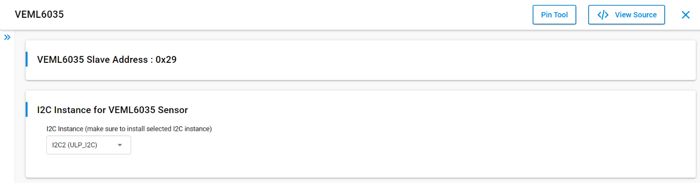
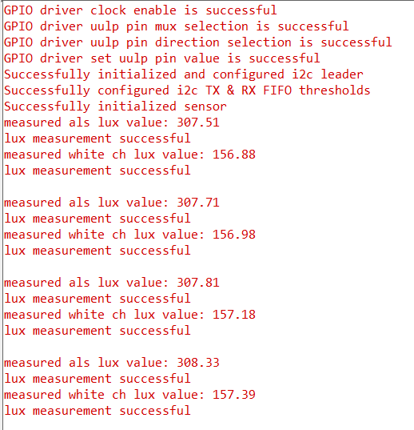

# SL VEML6035

## Table of Contents

- [Purpose/Scope](#purposescope)
- [About Example Code](#about-example-code)
- [Prerequisites/Setup Requirements](#prerequisitessetup-requirements)
  - [Hardware Requirements](#hardware-requirements)
  - [Software Requirements](#software-requirements)
  - [Setup Diagram](#setup-diagram)
- [Getting Started](#getting-started)
- [Application Build Environment](#application-build-environment)
  - [Pin Configuration](#pin-configuration)
- [Pin Configuration](#pin-configuration)
- [Test the Application](#test-the-application)

## Purpose/Scope

 This application demonstrates the VEML6035 Ambient Light Sensor, which measures the Lux via I2C interface for every 2 seconds. The lux is the unit of illuminance, or luminous flux per unit area.

## About Example Code

This example demonstrates the measurement of Lux for every 2 seconds. It also shows how to use different APIs present via the I2C interface.

## Prerequisites/Setup Requirements

### Hardware Requirements

- Windows PC
- Silicon Labs Si917 Evaluation Kit [WPK(BRD4002) + BRD4338A]

### Software Requirements

- Simplicity Studio
- Serial console Setup
  - For Serial Console setup instructions, see the [Console Input and Output](https://docs.silabs.com/wiseconnect/latest/wiseconnect-developers-guide-developing-for-silabs-hosts/#console-input-and-output) section in the *WiSeConnect Developer's Guide*.

### Setup Diagram


## Getting Started

Refer to the instructions [here](https://docs.silabs.com/wiseconnect/latest/wiseconnect-getting-started/) to:

- [Install Simplicity Studio](https://docs.silabs.com/wiseconnect/latest/wiseconnect-developers-guide-developing-for-silabs-hosts/#install-simplicity-studio)
- [Install WiSeConnect 3 extension](https://docs.silabs.com/wiseconnect/latest/wiseconnect-developers-guide-developing-for-silabs-hosts/#install-the-wi-se-connect-3-extension)
- [Connect your device to the computer](https://docs.silabs.com/wiseconnect/latest/wiseconnect-developers-guide-developing-for-silabs-hosts/#connect-si-wx91x-to-computer)
- [Upgrade your connectivity firmware](https://docs.silabs.com/wiseconnect/latest/wiseconnect-developers-guide-developing-for-silabs-hosts/#update-si-wx91x-connectivity-firmware)
- [Create a Studio project](https://docs.silabs.com/wiseconnect/latest/wiseconnect-developers-guide-developing-for-silabs-hosts/#create-a-project)

## Application Build Environment

- Configure the following macros in `veml6035_example.c` file. .Update or  modify the following macros, if required.

  - `DELAY_PERIODIC_MS1` : Select the delay for data display. By default, the delay is kept as 2 seconds.

    ```C
    #define DELAY_PERIODIC_MS1 2000    // sleeptimer1 periodic timeout in ms
    ```

  - `I2C instance`: Select I2C instance for communication through UC from the VEML6035 slcp component. By default I2C2 is selected.

    

### Pin Configuration

- Tested on SWG917 Dev kit board.
- The sensor is internally connected.

## Test the Application

See the instructions [Creating a Project](https://docs.silabs.com/wiseconnect/latest/wiseconnect-developers-guide-developing-for-silabs-hosts/#create-a-project) section on the **Developing with Boards in SoC Mode** guide to:

1. Compile and run the application.
2. When the application runs, it measures **ALS channel lux** and **white channel lux** every 2 seconds.
3. After successful program execution, the output to the serial console should look similar to the following image:

   

> **Note:**
>
> - Interrupt handlers are implemented in the driver layer, and user callbacks are provided for custom code. If you want to write your own interrupt handler instead of using the default one, make the driver interrupt handler a weak handler. Then, copy the necessary code from the driver handler to your custom interrupt handler.
