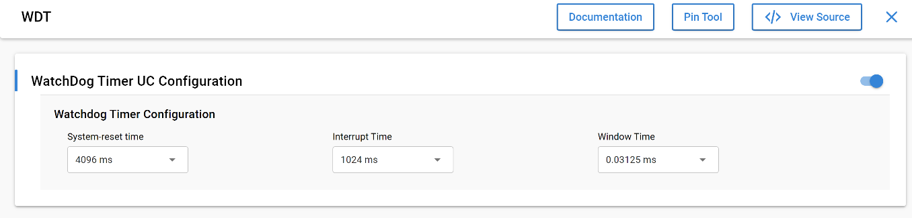
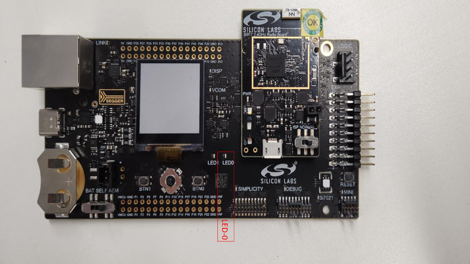
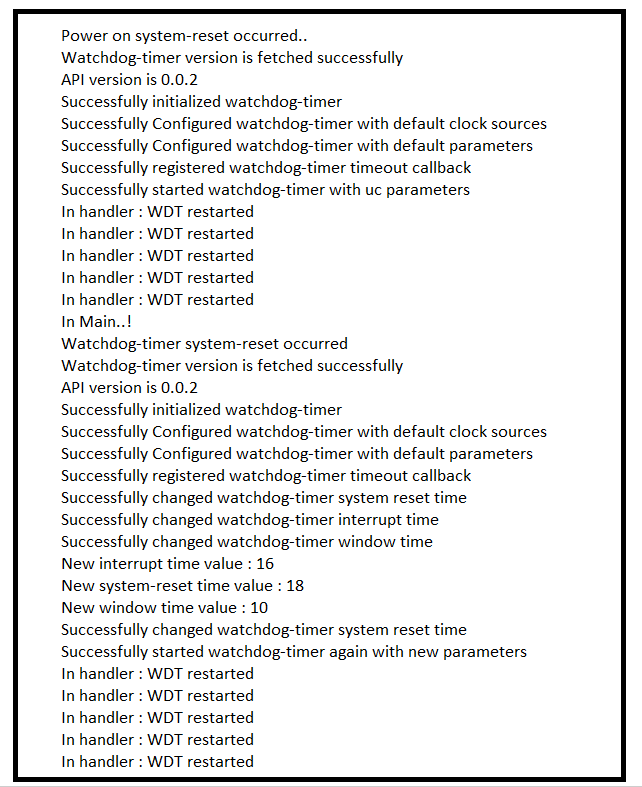

# SL WATCHDOG TIMER

## Table of Contents

- [SL WATCHDOG TIMER](#sl-watchdog-timer)
  - [Table of Contents](#table-of-contents)
  - [Purpose/Scope](#purposescope)
  - [Overview](#overview)
  - [About Example Code](#about-example-code)
  - [Prerequisites/Setup Requirements](#prerequisitessetup-requirements)
    - [Hardware Requirements](#hardware-requirements)
    - [Software Requirements](#software-requirements)
    - [Setup Diagram](#setup-diagram)
  - [Getting Started](#getting-started)
  - [Application Build Environment](#application-build-environment)
    - [Macros for Timer Configurations](#macros-for-timer-configurations)
  - [Test the Application](#test-the-application)
  - [Expected Results](#expected-results)

## Purpose/Scope

This example demonstrates the triggering of Watch Dog Time (WDT) warnings and LED toggling in the WDT interrupt handler continuously for 6 times. The system restarts (kicks) the WDT on every interrupt. On the sixth interrupt, the system does not restart the WDT, and the WDT resets the application.

Then, the WDT is started again with new parameters and the LED is toggled again for 6 times. Finally, the timer is stopped and de-initialized.

## Overview

- The Watch Dog timer is used to generate interrupts on timeout and initiate a system reset in case of system failure, which can be caused by an external event like an ESD pulse or due to a software failure. Its interrupt can also be utilized as a wake-up source for the processor from SLEEP/STANDBY to ACTIVE states.
- The Watchdog Timer generates interrupts and can be restarted (kicked) by the system upon every interrupt. There are two modes defined for the Watchdog Timer:  
  - Open Mode, during which Watchdog timer restarts are allowed from the CPU.
  - Closed Mode, during which Watchdog timer restarts are not allowed from the CPU.
- The processor needs to restart the timer upon a timeout interrupt if the timer is not intended to reach the system-reset threshold. The timer will be in Closed Mode, as defined above, until the interrupt timer is reached. Once the interrupt timer is reached, it will be in Open Mode until the reset is generated. Also, upon interrupt generation, the timer restarts for the Reset Duration.
- It has an independent window watchdog timer.
- Interrupts are generated before the system reset is applied, which can be used as a wakeup source.
- It generates a system reset upon Lockup indication from the Processor.
- Configurable interrupt (timeout), system reset, and window period.
- Able to operate when the CPU is in SLEEP state.
- Individually controllable power domain for low-power applications.

## About Example Code

- \ref watchdog_timer_example.c - This example file demonstrates how to use the Watchdog timer (WDT) to trigger WDT warnings and reset the system after a few warnings. With a WDT timeout interrupt occurring every 1 second, the WDT is restarted (kicked) by the application, and the onboard LED0 toggles. After toggling the LED 6 times, the application does not restart the WDT, then the timer loads the system-reset time (set to 4 seconds). Once that time is over, the WDT resets the system. Afterward, the WDT is started again with new parameters, and LED0 is toggled 6 times. Finally, the WDT is stopped, the callback is unregistered, and the timer is de-initialized.
- In this example, the application first toggles LED0 once and checks whether it is a power-on reset or a WDT system reset through the \ref sl_si91x_watchdog_get_timer_system_reset_status API.  
- If it is a power-on reset, then the WDT is initialized by enabling peripheral power, enabling WDT to run during CPU sleep mode, and unmasking its interrupt through the \ref sl_si91x_watchdog_init_timer API.  
- Then, the timer is configured with default configuration values from UC through the \ref sl_si91x_watchdog_set_configuration APIs, respectively.  
- Next, the timer timeout callback is registered, and its interrupt is enabled using the \ref sl_si91x_watchdog_register_timeout_callback API.  
- The WDT is then started using the \ref sl_si91x_watchdog_start_timer API. The application toggles onboard LED0 and restarts (kicks) the WDT on every interrupt (every 1 second) through the \ref sl_si91x_watchdog_restart_timer.  
- Upon the 6th WDT interrupt, the application does not restart the WDT. So when the timer count reaches the system-reset time (4 seconds), it resets the application.  
- After that, the application starts again, toggles LED0 once, checks WDT system reset status, and upon finding it true, debugs out "Watchdog-timer system-reset occurred".  
- Then, the timer is initialized again, the callback is registered, and it is started with new parameters, configured using the following APIs:  
- \ref sl_si91x_watchdog_set_system_reset_time to change the WDT system-reset time to 8 seconds. For possible values, refer to the \ref time_delays_t enum.
  - \ref sl_si91x_watchdog_set_interrupt_time to change the WDT interrupt time to 2 seconds.
  - \ref sl_si91x_watchdog_set_window_time to change the WDT window time to 32 milliseconds.
- To read the above time values, the following APIs are used:  
  - \ref sl_si91x_watchdog_get_system_reset_time to read the system-reset time.
  - \ref sl_si91x_watchdog_get_interrupt_time to read the interrupt time.
  - \ref sl_si91x_watchdog_get_window_time to read the window time.
- Then, the application toggles onboard LED0 6 times and restarts (kicks) the WDT on every interrupt (every 2 seconds) through the \ref sl_si91x_watchdog_restart_timer.
- Upon the 6th WDT interrupt, the application does not restart the WDT and immediately stops the WDT through the \ref sl_si91x_watchdog_stop_timer API.  
- Then, the callback is unregistered, and the timer is de-initialized through the \ref sl_si91x_watchdog_deinit_timer API.

## Prerequisites/Setup Requirements

### Hardware Requirements

- Windows PC
- Silicon Labs Si917 Evaluation Kit [WPK(BRD4002) + BRD4338A / BRD4342A / BRD4343A ]
- SiWx917 AC1 Module Explorer Kit (BRD2708A)

### Software Requirements

- Simplicity Studio
- Serial console setup
  - For serial console setup instructions, see the [Console Input and Output](https://docs.silabs.com/wiseconnect/latest/wiseconnect-developers-guide-developing-for-silabs-hosts/#console-input-and-output) section in the *WiSeConnect Developer's Guide*.

### Setup Diagram

## Getting Started

Refer to the instructions [here](https://docs.silabs.com/wiseconnect/latest/wiseconnect-getting-started/) to:

- [Install Simplicity Studio](https://docs.silabs.com/wiseconnect/latest/wiseconnect-developers-guide-developing-for-silabs-hosts/#install-simplicity-studio)
- [Install WiSeConnect 3 extension](https://docs.silabs.com/wiseconnect/latest/wiseconnect-developers-guide-developing-for-silabs-hosts/#install-the-wi-se-connect-3-extension)
- [Connect your device to the computer](https://docs.silabs.com/wiseconnect/latest/wiseconnect-developers-guide-developing-for-silabs-hosts/#connect-si-wx91x-to-computer)
- [Upgrade your connectivity firmware](https://docs.silabs.com/wiseconnect/latest/wiseconnect-developers-guide-developing-for-silabs-hosts/#update-si-wx91x-connectivity-firmware)
- [Create a Studio project](https://docs.silabs.com/wiseconnect/latest/wiseconnect-developers-guide-developing-for-silabs-hosts/#create-a-project)

For details on the project folder structure, see the [WiSeConnect Examples](https://docs.silabs.com/wiseconnect/latest/wiseconnect-examples/#example-folder-structure) page.

## Application Build Environment

1. Open the **sl_si91x_watchdog_timer.slcp** project file, select the **Software component** tab, and search for **WDT** in the search bar.
2. Click on **SL_WDT** and configure the WDT as per configuration parameters given in the wizard.

- If project built without selecting configurations, it will take default values from UC.

  

- Configure timer using the following macros, defined in \ref sl_si91x_watchdog_timer_config.h file and update/modify following macros, if required.

> **Note:**
>
> - Since WDT is using LF-FSM clock source, the default WDT application is configured to XTAL clock (32.768 khz), but if clock source of LF-FSM clock is changed to RC (32 khz), then duration set in UC will have some drift, calculate as per, Time duration = (2^WWD_timer)/clock frequency.

### Macros for Timer Configurations

- \ref SL_WDT_SYSTEM_RESET_TIME is used for setting the system reset time. For possible values, refer to \ref time_delays_t.
- \ref SL_WDT_INTERRUPT_TIME (timeout time) is used for setting the timeout time. For possible values, refer to \ref time_delays_t.
- \ref SL_WDT_WINDOW_TIME is used for setting the window time. For possible values, refer to \ref time_delays_t.
- After configuring the above macros, their values are passed to the \ref watchdog_timer_config_t structure type variable \ref sl_watchdog_timer_config_handle, which is used to configure the timer through the API \ref sl_si91x_watchdog_set_configuration.

## Test the Application

1. Compile and run the application.
2. The watchdog LED0 will be toggled, every 1 secs with WDT warning.
3. At 6th toggle, timer will reset the application after 4 seconds.
4. Then WDT starts with new parameters and toggles the LED0 again every 2 seconds.
5. After 6 toggles, stop toggling LED as the timer is stopped and de-initialized. Toggling of the LED can be seen in the image below.

    

## Expected Results

- After successful program execution, the prints in serial console looks as shown below.

  

> **Note:**
>
> - Interrupt handlers are implemented in the driver layer, and user callbacks are provided for custom code. If you want to write your own interrupt handler instead of using the default one, make the driver interrupt handler a weak handler. Then, copy the necessary code from the driver handler to your custom interrupt handler.
