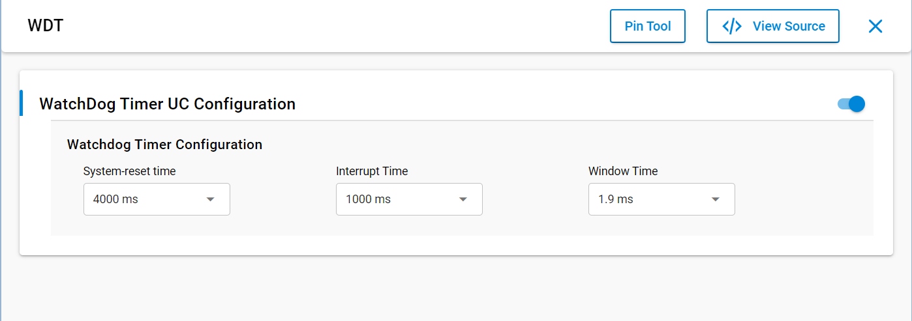

# SL WATCHDOG TIMER

## Table of Contents

- [Purpose/Scope](#purposescope)
- [Overview](#overview)
- [About Example Code](#about-example-code)
- [Prerequisites/Setup Requirements](#prerequisitessetup-requirements)
  - [Hardware Requirements](#hardware-requirements)
  - [Software Requirements](#software-requirements)
  - [Setup Diagram](#setup-diagram)
- [Getting Started](#getting-started)
- [Application Build Environment](#application-build-environment)
- [Test the Application](#test-the-application)
- [Expected Results](#expected-results)

## Purpose/Scope

- This examples demonstrates triggering of WDT warnings & LED toggling, in WDT interrupt handler continuously for 6 times. System restarts (kicks) WDT on every interrupt, on sixth interrupt system does not restart WDT then WDT resets the application.
- Then WDT is started again with new parameters, toggled LED again for 6 times, after that timer is stopped & de-initialized.

## Overview

- WatchDog-timer is used generate interrupt on timeout and a system-reset in case of system failure which can be caused by an external event like ESD pulse or due to a software failure. Also its interrupt can be used as a wake-up source for processor from SLEEP/STANDBY to ACTIVE states.
- WatchDog Timer will generate interrupts and can restarts(kicked) by system every interrupt.There are two modes defined for the WatchDog Timer.
  - Open Mode: This is a mode during which WatchDog-timer restart is allowed from CPU.
  - Closed Mode: This is a mode during which WatchDog-timer restart is not allowed from CPU.
- The Processor needs to restart the Timer upon on timeout interrupt, if the timer is not intended to hit the system-reset threshold. The timer will be in closed mode as defined above till the interrupt timer is reached. Once the interrupt timer is reached, it will be in open mode till the reset is generated.Also upon interrupt generation, the timer restarts for the Reset Duration.
- It has independent window watchdog timer.
- Interrupt is generated before the system reset is applied which can be used as a wakeup source.
- Generates system-reset upon Lockup indication from Processor.
- Configurable low and high frequency FSM clock.
- Configurable interrupt (timeout) ,system-reset and window period.
- Able to operate when CPU is in SLEEP state
- Individually controllable power domain for low-power applications.

## About Example Code

- \ref watchdog_timer_example.c this example file demonstrates how to use Watchdog-timer(WDT) to trigger WDT warnings and reset system after few warnings .
  With every WDT timeout interrupt at every 1 seconds, WDT restarted (kicked) by application & onboard LED0 toggles. After 6 time toggles application does not restart WDT then timer loads system-reset time (kept 4 seconds), once that time is over WDT resets system. After that again WDT started with new parameters 
  and toggles LED0 6 times and then WDT is stopped, callback unregistered and de-initialized.
- In this example, first application toggles LED0 once and checks whether its a power-on reset or WDT system reset through \ref sl_si91x_watchdog_get_timer_system_reset_status API.
- If its a power-on reset then initializes WDT by enabling peripheral power, enabling WDT to run during CPU sleep mode & unmasking its interrupt through \ref sl_si91x_watchdog_init_timer API.
- Then clock and timer are configured with default configuration values from UC through \ref sl_si91x_watchdog_configure_clock and \ref sl_si91x_watchdog_set_configuration APIs respectively.
- Then Registered timer timeout callback and enabling its interrupt using \ref sl_si91x_watchdog_register_timeout_callback API.
- Then WDT is started using \ref sl_si91x_watchdog_start_timer API.
- Then application toggles onboard LED0 & restarts (kicks) WDT, on every interrupt(every 1 seconds) through \ref sl_si91x_watchdog_restart_timer
- At 6th WDT interrupt application not restarts WDT, so when timer count reaches system-reset time (4 seconds) it resets application.
- After that application starts again, toggles LED0 once and checks WDT system reset status and on finding it true debugout "Watchdog-timer system-reset occurred"
- Then timer is again initialized, registers callback and started with new parameters, configured using following APIs:
  \ref sl_si91x_watchdog_set_system_reset_time to change WDT system-reset time to 8 seconds, for possible values refer \ref time_delays_t enum.
  \ref sl_si91x_watchdog_set_interrupt_time to change WDT interrupt time to 2 seconds, for possible values refer \ref time_delays_t enum.
  \ref sl_si91x_watchdog_set_window_time to change WDT window time to 32 milli seconds, for possible values refer \ref time_delays_t enum.
- To read above time values following APIs are used:
  \ref sl_si91x_watchdog_get_system_reset_time to read system-reset time.
  \ref sl_si91x_watchdog_get_interrupt_time to read interrupt time.
  \ref sl_si91x_watchdog_get_window_time to read window time.
- Then application again toggles onboard LED0 6 times & restarts (kicks) WDT, on every interrupt(every 2 seconds) through \ref sl_si91x_watchdog_restart_timer
- At sixth WDT interrupt application not restarts WDT and immediately application stops WDT through \ref sl_si91x_watchdog_stop_timer API
- Then un-registers callback and de-initializes timer through \ref sl_si91x_watchdog_deinit_timer API.

## Prerequisites/Setup Requirements

### Hardware Requirements

- Windows PC
- Silicon Labs Si917 Evaluation Kit [WPK(BRD4002) + BRD4338A]

### Software Requirements

- Simplicity Studio
- Serial console Setup
  - The Serial Console setup instructions are provided below:
Refer [here](https://docs.silabs.com/wiseconnect/latest/wiseconnect-getting-started/getting-started-with-soc-mode#perform-console-output-and-input-for-brd4338-a).

### Setup Diagram

## Getting Started

Refer to the instructions [here](https://docs.silabs.com/wiseconnect/latest/wiseconnect-getting-started/) to:

- Install Studio and WiSeConnect 3 extension
- Connect your device to the computer
- Upgrade your connectivity firmware
- Create a Studio project

For details on the project folder structure, see the [WiSeConnect Examples](https://docs.silabs.com/wiseconnect/latest/wiseconnect-examples/#example-folder-structure) page.

## Application Build Environment

- Open **sl_si91x_watchdog_timer.slcp** project file select **software component**tab and search for **WDT** in search bar.
- Click on **SL_WDT** and configure the WDT as per configuration parameters given in wizard.
- If project built without selecting configurations, it will take default values from UC.

  

- Configure Clock and timer using following macros, defined in \ref sl_si91x_watchdog_timer_config.h file and update/modify following macros if required:

### Macros for Clock Configurations

- \ref SL_LOW_FREQ_FSM_CLK_SRC, for configuring low frequency FSM clock refer \ref low_freq_fsm_clock_t
- \ref SL_ULP_TIMER_CLK_ISL_BG_PMU_CLOCK_SRC, for configuring BG-PMU clock refer \ref bg_pmu_clock_t
- \ref SL_ULP_TIMER_DIRECTION, true to enable waiting for switching timer clk & false to skip waiting for switching timer clk.
- After configuring above macros, their values are passed to \ref watchdog_timer_clock_config_t structure type variable \ref sl_watchdog_timer_clk_config_handle which is used to configure clock through API-\ref sl_si91x_watchdog_configure_clock.

### Macros for Timer Configurations

- \ref SL_WDT_SYSTEM_RESET_TIME , for possible values refer \ref time_delays_t
- \ref SL_WDT_INTERRUPT_TIME (timeout time), for possible values refer \ref time_delays_t
- \ref SL_WDT_WINDOW_TIME , for possible values refer \ref time_delays_t
- After configuring above macros, their values are passed to \ref watchdog_timer_config_t structure type variable \ref sl_watchdog_timer_config_handle which is used to configure timer through API-\ref sl_si91x_watchdog_set_configuration.

## Test the Application

1. Compile and run the application.
2. The watchdog LED0 will be toggled, every 1 secs with WDT warning.
3. At 6th toggle, timer will reset the application after 4 seconds.
4. Then WDT started with new parameters and again toggles LED0 every 2 seconds.
5. After 6 toggles, stop toggling LED as timer is stopped and de-initialized. Toggling of LED can be seen in below image.

    

## Expected Results

- After successful program execution the prints in serial console looks as shown below.

  