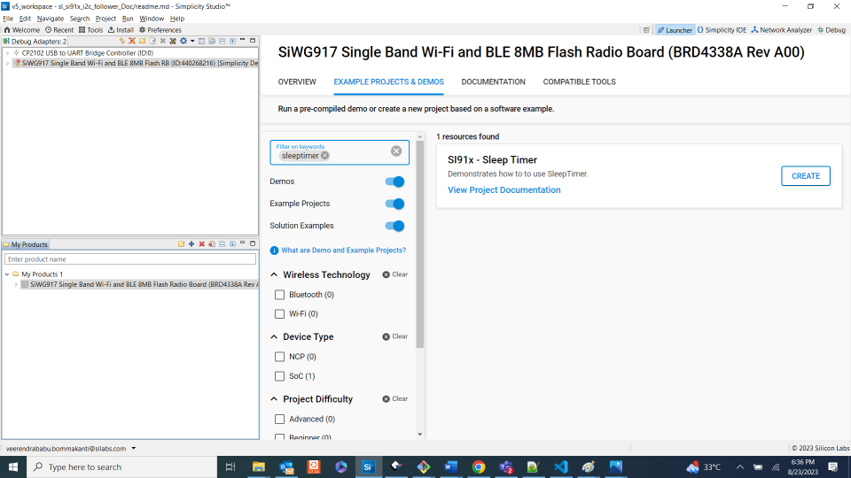

# SLEEPTIMER

## Introduction

- This application contains an example code to demonstrate one shot and periodic SLEEPTIMER with LED toggle functionality

## Setting Up

- To use this application following Hardware, Software and the Project Setup is required

### Hardware Requirements

- Windows PC
- Silicon Labs [Si917 Evaluation Kit WPK + BRD4338A]


### Software Requirements

- Si91x SDK
- Embedded Development Environment
  - For Silicon Labs Si91x, use the latest version of Simplicity Studio (refer **"Download and Install Simplicity Studio"** section in **getting-started-with-siwx917-soc** guide at **release_package/docs/index.html**)

### VCOM Setup
- The Docklight tool's setup instructions are provided below..


## Project Setup

- **Silicon Labs Si91x** refer **"Download SDK"** section in **getting-started-with-siwx917-soc** guide at **release_package/docs/index.html** to work with Si91x and Simplicity Studio

## Configuration and Steps for Execution

- Do not change any UC configuration. Si91x only uses SYSRTC peripheral for sleeptimer and all the other peripherals/features listed in UC are supported for Si91x.
- Configure the following parameter in sleeptimer.c file, update/modify following macro if required

```C
#define TOOGLE_DELAY_MS1_ONESHOT //  configured for 5000 ms
#define TOOGLE_DELAY_MS1_PERIODIC // configured for 400 ms
```

## Loading Application on Simplicity Studio

- With the product Si917 selected, navigate to the example projects by clicking on Example Projects & Demos
  in simplicity studio and click on to sleeptimer Example application as shown below



## Build

- Compile the application in Simplicity Studio using build icon


## Device Programming

- To program the device ,refer **"Burn M4 Binary"** section in **getting-started-with-siwx917-soc** guide at **release_package/docs/index.html** to work with Si91x and Simplicity Studio

## Executing the Application

- Sets the board state of LED1 to on and off after 5 sec and then configured for periodic blink rate of 400 ms

## Expected Results

- LED1 should blink on WSTK base board and prints should come on console, refer to 
